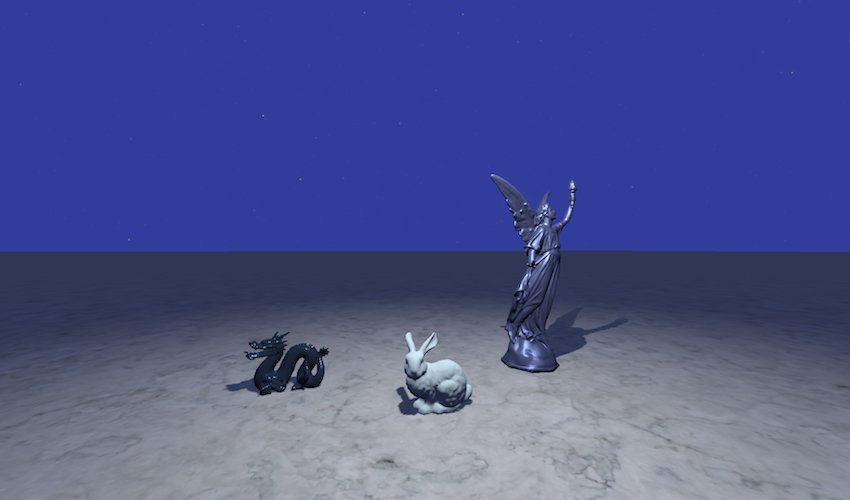
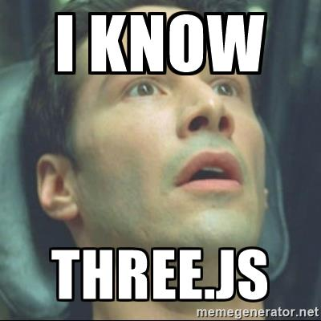

*In this post I will show you how to create a scene using three.js with support for Physically Based Rendering.*

---

**NB.: The scene described in this post is no longer available in production (due to a revamp of the entire website).
You can find it in the [old repository of this website](https://github.com/chicio/old.chicio.github.io) or you can 
check the [codesandbox](https://codesandbox.io/s/threejs-tutorial-vanillajs-tj1ty?file=/index.html) created by 
[Arthur Denner](https://github.com/arthurdenner).**

I love three.js. I think it's one of the most beautiful javascript and computer graphics library out there. Don't you
know what three.js is? Let's see the description from
the [official github repo](https://github.com/mrdoob/three.js/ "official threejs github repo"):

> JavaScript 3D library. The aim of the project is to create an easy to use, lightweight, 3D library. The library provides canvas, svg, CSS3D and WebGL renderers.

Simple and clear (I love this kind of definition :relieved:). Three.js is a library built on top of WebGL aiming to
simplify the computer graphics development for the web. It has a lot of different features, including the support
for [Physically Based Rendering](https://en.wikipedia.org/wiki/Physically_based_rendering "Physically Based Rendering").
Let's see the potential of this library. In this post I will show you how to create a simple physically base scene. At
the end of this post you will have a scene like the one in the following image:



The mesh We will use are a simplified version of the ones available from
the [Stanford scan repository](https://graphics.stanford.edu/data/3Dscanrep/
"Stanford scan repository") in PLY format.  
Let's start from the setup. We can use a simple html page, similar to the one described in the three.js doc (shown
below). We will put our assets (mesh, textures etc.) in the folder `/assets/models`.

```html
<!DOCTYPE html>
<html>
<head>
  <meta charset="utf-8">
  <title>My first three.js app</title>
  <style>
    body {
      margin: 0;
    }

    canvas {
      width: 100%;
      height: 100%
    }
  </style>
</head>
<body>
<script src="js/three.js"></script>
<script>
  // Our Javascript will go here.
</script>
</body>
</html>
```

The first thing we will need to create is a `Scene`. We will also need to create a `Camera`, a `TextureLoader` for
texture loading, a `PLYLoader` to load our PLY meshes and a `WebGLRenderer`. Finally we will need an instance
of `OrbitControls`, a three.js extension that we use to orbit around the scene.

```javascript
var scene = new THREE.Scene();
var camera = createCamera();
var textureLoader = new THREE.TextureLoader();
var plyLoader = new THREE.PLYLoader();
var renderer = createRenderer();
var controls = createOrbitsControls(camera, renderer);
```

For the camera, we create a `PerspectiveCamera`. As the name says, it uses
the [perspective projection](https://en.wikipedia.org/wiki/3D_projection#Perspective_projection "perspective projection")
to simulate the human eye views (this is one of the two main camera type used in computer graphics along
with [orthogonal projection](https://en.wikipedia.org/wiki/3D_projection#Orthographic_projection "orthogonal projection")
. We place the camera in front of the scene, and we set the
vertical [field of view FOV](https://en.wikipedia.org/wiki/Field_of_view_in_video_games "field of view FOV") of the
viewing frustum to 75 degrees, the aspect ratio using the current width and height of the window,
the [near and far plane of the viewing frustum](https://en.wikipedia.org/wiki/Viewing_frustum "near and far plane of the viewing frustum")
respectively to 0.1 and 1000 (to avoid the discard of mesh added to the scene).

```javascript
function createCamera() {

  var camera = new THREE.PerspectiveCamera(75, window.innerWidth / window.innerHeight, 0.1, 1000);
  camera.position.z = 8;
  camera.position.y = 0;
  camera.position.x = 0;

  return camera;
}
```

We create a renderer with the alpha property set to true, in case we want to integrate in another HTML page and we want
the background to be visible until the scene is loaded. We set
the [gamma correction](https://en.wikipedia.org/wiki/Gamma_correction "gamma correction") for input and output colors by
settings the properties `gammaInput` and `gammaOutput` to true. We also enable shadow mapping by
setting `shadowMap.enabled` to true, setting it to use
the [percentage closer filtering](https://fabiensanglard.net/shadowmappingPCF/ "percentage closer filtering")
with [bilinear filtering](https://en.wikipedia.org/wiki/Bilinear_filtering "bilinear filtering"). Finally we set the
size of the renderer to the same size of the window where we will display the scene.

```javascript
function createRenderer() {

  var renderer = new THREE.WebGLRenderer({ alpha: true });
  renderer.physicallyCorrectLights = true;
  renderer.gammaInput = true;
  renderer.gammaOutput = true;
  renderer.shadowMap.enabled = true;
  renderer.shadowMap.bias = 0.0001;
  renderer.shadowMap.type = THREE.PCFSoftShadowMap;
  renderer.setSize($(window).width(), $(window).height());

  return renderer;
}
```

Next we setup the `OrbitControls` instance to manage an automatic rotation around the scene. You can customize this
function to let the user manage the movement with keyboard or touch control (on mobile :iphone:).

```javascript
function createOrbitsControls(camera, renderer) {

  var controls = new THREE.OrbitControls(camera, renderer.domElement);
  controls.enableZoom = false;
  controls.autoRotate = true;
  controls.enablePan = false;
  controls.keyPanSpeed = 7.0;
  controls.enableKeys = false;
  controls.target = new THREE.Vector3(0, 0, 0);
  controls.mouseButtons = {};
  controls.dispose();

  return controls;
}
```

Now we can add the renderer to the DOM (we attach it to the body) of the page. We can now start to customize the scene
by setting the background color to indaco (0x303F9F) (remember: the recommended way to set color in three.js is by HEX
value). We can then add the main light and the hemisphere light.

```javascript
//Add rendering dom element to page.
document.body.appendChild(renderer.domElement);

//Setup scene.
scene.background = new THREE.Color(0x303F9F);
scene.add(createLight());
scene.add(createHemisphereLight());
```

We create the main light as a point light using the `PointLight` class. In the constructor we set its color to white,
its intensity to 1 (default), 20 for the distance from the light where the intensity is 0, and finally the decay to 2 (
this is the amount the light dims along the distance of the light, and [must be set to 2 for physically base light](
https://threejs.org/docs/index.html#api/lights/PointLight "PointLight doc")).  
We then set its power as the same of a 100 Watt
bulb ([1700 Lumen](http://www.power-sure.com/lumens.htm "Lumen cheatsheet")) light and we place it above the scene, to
create some sort of street light effect (light beam from above). We also active the ability to cast generate shadow by
setting `castShadow` to true, we force the shadow map size to 512x512 pixel (to increase performance, as the default is

1024) and we give a little blur on the shadow by setting the `radius` property to 1.5. We also create a geometry and a
      material for the light:

* the geometry is a sphere with radius 0
* the material is a complete emissive physically based material

In fact, the `MeshStandardMaterial` is the three.js implementation of a physically based material (so it's real:
three.js rocks with physically based rendering :open_mouth:).

```javascript
function createLight() {

  var lightGeometry = new THREE.SphereGeometry(0);

  var lightMaterial = new THREE.MeshStandardMaterial({
    emissive: 0xffffee,
    emissiveIntensity: 1,
    color: 0x000000
  });

  var light = new THREE.PointLight(0xffffff, 1, 20, 2);
  light.power = 1700;
  light.castShadow = true;
  light.shadow.mapSize.width = 512;
  light.shadow.mapSize.heigth = 512;
  light.shadow.radius = 1.5;

  light.add(new THREE.Mesh(lightGeometry, lightMaterial));
  light.position.set(0, 5, 3);

  return light;
}
```

For the hemisphere light, we create it using the `HemisphereLight` class. We set the sky color to dark blue (0x303F9F),
the ground color to black (0x000000) and its intensity to 1.

```javascript
function createHemisphereLight() {

  return new THREE.HemisphereLight(0x303F9F, 0x000000, 1);
}
```

Now we can start to add the stars, the PLY mesh models and the floor mesh model. Each mesh model is added to the scene
at the end of its load method.

```javascript
//Load models.
loadStars(textureLoader, function(stars) {

  scene.add(stars);
});

loadPlyModelUsingPhysicalMaterial(
  plyLoader,
  'assets/models/lucy.ply',
  {
    color: 0x3F51B5,
    roughness: 0.5,
    metalness: 0.7,
    clearCoat: 0.5,
    clearCoatRoughness: 0.5,
    reflectivity: 0.7
  },
  new THREE.Vector3(3, -3, 0),
  new THREE.Vector3(0, -Math.PI / 3.0, 0),
  function(mesh) {

    scene.add(mesh);
  }
);

loadPlyModelUsingPhysicalMaterial(
  plyLoader,
  'assets/models/dragon.ply',
  {
    color: 0x448AFF,
    roughness: 0.1,
    metalness: 0.9,
    clearCoat: 0.0,
    clearCoatRoughness: 0.2,
    reflectivity: 1
  },
  new THREE.Vector3(-3, -3, 0),
  new THREE.Vector3(0, -Math.PI, 0),
  function(mesh) {

    scene.add(mesh);
  }
);

loadPlyModelUsingPhysicalMaterial(
  plyLoader,
  'assets/models/bunny.ply',
  {
    color: 0xCCFFFF,
    roughness: 0.9,
    metalness: 0.1,
    clearCoat: 0.0,
    clearCoatRoughness: 0.5,
    reflectivity: 0.1
  },
  new THREE.Vector3(0, -3, 1.5),
  new THREE.Vector3(0, -Math.PI, 0),
  function(mesh) {

    scene.add(mesh);
  }
);

loadFloor(textureLoader, function(mesh) {

  scene.add(mesh);
});
```

For the stars, we use the `textureLoader` to load a circle png texture. When the texture load is completed, we create a
lot of `Geometry` objects with random position. We also create the material using the texture obtained from the loader (
and we set on it a transparent background). Now we can create some `Points` objects using the specific three.js class.

```javascript
function loadStars(textureLoader, completeLoad) {

  textureLoader.load("assets/models/textures/circle.png", function(texture) {

    var starsGeometry = new THREE.Geometry();

    for (var i = 0; i < 10000; i++) {

      var star = new THREE.Vector3();
      star.x = 2000 * Math.random() - 1000;
      star.y = 2000 * Math.random();
      star.z = 2000 * Math.random() - 1000;

      starsGeometry.vertices.push(star)
    }

    var starsMaterial = new THREE.PointsMaterial({
      color: 0x888888,
      map: texture,
      transparent: true,
    });

    var stars = new THREE.Points(starsGeometry, starsMaterial);

    completeLoad(stars);
  });
}
```

For the PLY models, we use the PLY loader to obtain the corresponding geometry. Then we create a `MeshPhysicalMaterial`
using the parameters received. We also set the position and rotation of the mesh and we force the update of the local
transform using the `updateMatrix()` method. We set `castShadow` to true, as we need that this meshes are considered in
shadow mapping. We finally set also `matrixAutoUpdate` to false, as we don't need to recalculate the position of the
mesh on each frame (our meshes are static).

```javascript
function loadPlyModelUsingPhysicalMaterial(plyLoader, path, parameters, position, rotation, completeLoad) {

  plyLoader.load(path, function(geometry) {

    var material = new THREE.MeshPhysicalMaterial(parameters);
    var mesh = new THREE.Mesh(geometry, material);
    mesh.position.set(position.x, position.y, position.z);
    mesh.rotation.set(rotation.x, rotation.y, rotation.z);
    mesh.castShadow = true;
    mesh.matrixAutoUpdate = false;
    mesh.updateMatrix();

    completeLoad(mesh);
  });
}
```

For the floor, we use again the `textureLoader` to load a texture of a marble surface. We then set the `wrapS`
and `wrapT`  property to `RepeatWrapping`, to have the texture repeated on the entire surface. We then create
a `MeshStandardMaterial`, that is the base material for `MeshPhysicalMaterial`, and so it is also a physically based
material. We finally set also here the position, rotation and `matrixAutoUpdate` to false.

```javascript
function loadFloor(textureLoader, completionFunction) {

  textureLoader.load("assets/models/textures/marble.jpg", function(texture) {

    texture.wrapS = THREE.RepeatWrapping;
    texture.wrapT = THREE.RepeatWrapping;
    texture.repeat.set(100, 100);

    var floorMat = new THREE.MeshStandardMaterial({
      roughness: 0.7,
      metalness: 0.1,
      map: texture
    });

    var floorGeometry = new THREE.PlaneGeometry(1000, 1000);
    var floorMesh = new THREE.Mesh(floorGeometry, floorMat);
    floorMesh.receiveShadow = true;
    floorMesh.rotation.x = -Math.PI / 2.0;
    floorMesh.position.y = -3;
    floorMesh.matrixAutoUpdate = false;
    floorMesh.updateMatrix();

    completionFunction(floorMesh);
  });
}
```

We are ready to render our scene. We just need to create
the [rendering loop](https://gameprogrammingpatterns.com/game-loop.html "rendering loop") with the following code:

```javascript
var render = function() {

  requestAnimationFrame(render);
  controls.update();
  renderer.render(scene, camera);
};
```

You can find the entire scene code is [this github gist](https://gist.github.com/chicio/af13397f22c21a05b6ac007c83f84403).  
Yeah!!! You made it!! You create a 3D computer graphics web application using three.js :blush:!! And it is also a scene
that supports advanced feature, in particular physically based rendering :open_mouth:!!



You know three.js now. You're ready to conquer the web 3D world now :smirk:. Ah!! I was forgetting: you can find a live
demo of the scene we created on the [homepage of my website](/ "Fabrizio Duroni").
