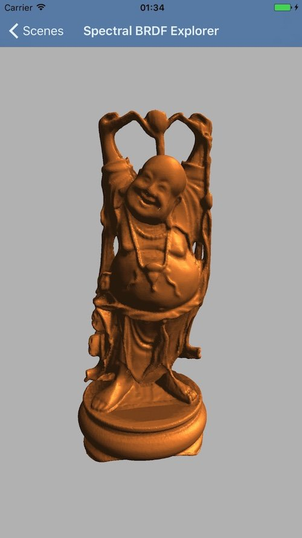

*In this post I will talk about phong reflection model: one of the oldest and most popular lighting model in computer
graphics.*

---

We live in the era of Physically Based Rendering (PBR). Everyone in the computer graphics field know it is the future. I
will talk a lot about it in some future post. But now, for this first post about computer graphics theory, I would like
to talk about one of the most popular lighting model used in computer graphics: the Phong reflection post.  
Why? Because even if PBR is winning the war (I know you're scared about PBR theoretical foundation :fearful: :
stuck_out_tongue:), the Phong reflection model is still used in a lot of application, and it is also a good starting
point for everyone who want to start a journey in the computer graphics field. In this post I will show you what it is
in detail and we will see an implementation in OpenGL ES GLSL shading language. All the vectors reported in this article
will be [normalized](https://en.wikipedia.org/wiki/Unit_vector "unit vector"). First of all we need to do a
classification of the lighting models available in computer graphics. The light at any give point on a surface in a
scene is influenced by:

* Direct illumination: light directly arriving on the surface
* Indirect illumination: light arriving on the surface after having bounced off other surfaces

As a consequence of this fact lighting methods can be:

* Local models: only the direct illumination is considered
* Global models: both direct and indirect illuminations are considered

The Phong reflection model is an empirical (so based on observations) local illumination model. Let's see how we is it
composed. In real world light is modeled by its spectrum, and each surface by its reflectance spectrum. In computer
graphics often an approximation based on RGB triplets is used:

* Light color is a RGB triplet
* The reflectance spectrum is a triple of percentage

So each component of the following equations will be described by a triplet of number (RGB or percentage).  
The light that you see on a surface could be decomposed into four main components. Let's see them in detail and how they
are composed together to calculate the illumination of a surface point: Phong model.

#### **Emissive component**

This is the light component emitted by the surface material. Is a purely additive component. As you can image, few
surface material in nature are emissive (e.g.: light  :laughing:). So the emissive illumination $I_{\text{emissive}}$ of
a surface point is obtained by multiplying the emissive constant of a surface $k_{\text{e}}$ by the light emissive
intensity $I_{\text{LE}}$ (expressed as we said before as a RGB triplet, and this will be valid for all light intensity
define in the following formulas of this post). The emissive light intensity could be the intensity of the scene light (
or an average if you have multiple scene lights): practically speaking you can use the scene light RGB color. The
emissive constant $k_{\text{e}}$ is a surface property that express its emissive reflectance.

$$
I_{\text{emissive}}=k_{\text{e}}I_{\text{LE}}
$$

#### **Ambient component**

This is light component used to model empirically the contribution of indirect illumination of bouncing lights in the
scene on a surface. It depends entirely on the surface material (no geometry influences). So the ambient illumination
$I_{\text{ambient}}$ of a surface point is obtained by multiplying the ambient constant of a surface $k_{\text{a}}$ with
the light ambient intensity $I_{\text{LA}}$. The ambient constant $k_{\text{a}}$ is a constant related exclusively to
the surface material that express empirically its response to indirect illumination. As for the emissive component, the
ambient light intensity could be the intensity of the scene light (or an average if you have multiple scene lights).

$$
I_{\text{ambient}}=k_{\text{a}}I_{\text{LA}}
$$

#### **Diffusive component**

This light component represents the amount of reflected light given an incident light. Lambertian surfaces are
considered: the incident light is equally reflected (with a given amount) in all directions. The amount of reflected
light depends on the incident angle of the light with respect to the surface’s normal. The diffuse illumination $I_
{\text{diffuse}}$ of a surface point is obtained by multiplying the diffuse surface constant $k_{\text{d}}$ with the
light diffuse intensity $I_{\text{LD}}$ and with the attenuation factor due to incident light given by the cosine of the
angle between the light direction and the surface normal $\cos\theta$. This last value is the dot product between the
surface normal ${\hat {N}}$ and the light direction ${\hat {L}}$. So the final formula for the diffuse component is:

$$
I_{\text{diffuse}}=k_{\text{d}}I_{\text{LD}}({\hat {L}}\cdot{\hat {N}})
$$

#### **Specular component**

This light component represents the amount of reflected light in a specific direction (mirror alike reflection). Light
is reflected in a different way depending on the incident light direction. Shiny materials are the one with a high
specular component. The perceived specular light depends on the position of the observer with respect to the surface. In
particular, the specular illumination is influenced by $\cos\alpha$, that is the cosine of the angle between the
direction from the surface point towards the view ${\hat {V}}$ and the direction that a perfectly reflected ray of light
would take from this point on the surface ${\hat {R}}$. The size of the specular highlights is regulated by a shininess
constant $n$, based on the surface material properties. Given all this information the specular component formula
obtained by multiplying the specular surface constant $k_{\text{s}}$ with the light specular intensity $I_{\text{LS}}$
and with dot product of the reflection direction ${\hat {R}}$ and the the direction from the surface point towards the
view ${\hat {V}}$ squared to the shininess constant $n$:

$$
I_{\text{specular}}=k_{\text{s}}I_{\text{LS}}({\hat {R}}\cdot {\hat {V}})^{n}
$$

The above observation are valid also in case we have multiple lights. The only difference is that the diffuse and
specular component are calculated for each light and their sum is the final diffuse and specular component. Now we are
ready to write the complete Phong reflection lighting equation:

$$
I_{tot}=I_{emissive}+I_{ambient}+\sum_{p\;\in \;{lights}} (I_{diffuse, p} + I_{specular, p})
$$

Just a final note: we distinguished different type of light intensity based on the component. In fact most of the time
this model is implemented using a single general light intensity triplet for all the component for each light. How can
you implement it in a OpenGL ES shader? The following code sample is a simple implementation of this model using RGB
colors. It is a fragment shader that could be used to implement per fragment lighting. This basically means that all
lighting calculation is done in the fragment shader on each fragment (maybe this is material for a new post :
stuck_out_tongue_closed_eyes:). It was written using OpenGL ES 3.0 and GLSL 3.0. It uses a single light for all the
component calculation.
You can find the entire code in this [github gist](https://gist.github.com/chicio/d983fff6ff304bd55bebd6ff05a2f9dd).  
The following image is an example of the happy buddha Stanford mesh rendered using
my [Spectral BRDF explorer](https://github.com/chicio/Spectral-BRDF-Explorer "Spectral BRDF explorer") iOS renderer. The
lighting is (obviously) calculated using the Phong reflection model. The surface simulated is bronze (you can find 
some constants we discussed
before [here](http://devernay.free.fr/cours/opengl/materials.html "phong lighting constants")). Nice :smirk:!!!!

