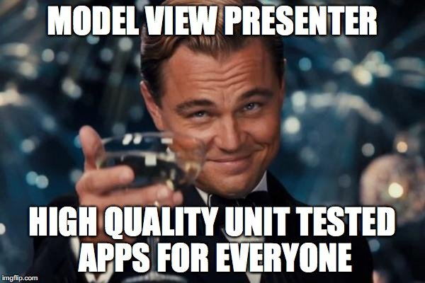

*In this post I will talk about the model view presenter architectural pattern and how it can improve you unit test and
your TDD workflow when developing an iOS application.*

---

Unit test in iOS application is in some way "hard". The architectural pattern implemented by default on iOS is
the [Model View Controller](https://en.wikipedia.org/wiki/Model–view–controller "Model View Controller"). This
architecture provides you a clear separation between the UI and the business logic. The problem is that most of the time
you have to fight with "Massive View Controllers" that act as glue between the model and a lot of UI/view code and that,
for this reason, are not so easy to test. This basically means that most of the time
the [presentation logic](https://en.wikipedia.org/wiki/Presentation_logic "presentation logic"), how the business model
is displayed to the user in the User Interface, is tested in the wrong way, or maybe worst it is not tested.  
This is were the [Model View Presenter](https://en.wikipedia.org/wiki/Model–view–presenter "Model view presenter") could
save us. In this architectural pattern all the *presentation logic is moved from the view controller to a new component,
the presenter*. This means that it will manage *model objects* to retrieve the data and then prepare it to be displayed
by the *view, that will be our View Controller*. This one becomes a passive interface that has the only responsibility
to show data returned by the presenter in the specific platform User Interface component. In this way the presenter is a
component without any platform specific dependency, that works only on the view and other model objects, injected at
construction time. In this way all dependencies could be mocked and you can unit test basically everything!! :relaxed:  
Now it's time to see the Model View Presenter in action!! :grin: We will create a simple app that shows a list on
products in a `UITableView`. On the tap of a cell the product detail is shown. An error will be displayed if an error
occurs when the products are retrieved or when it doesn't contain all the data needed to show its detail. We will
develop this app
using [Test Driven Development](https://en.wikipedia.org/wiki/Test-driven_development "Test Driven Development")
technique, and I will show the unit tests created for each class implemented. These unit tests will also be written
using the ["Given-then-when"](https://en.wikipedia.org/wiki/Given-When-Then "Given-then-when") structure, typically used
in [Behaviour Driven Development](https://en.wikipedia.org/wiki/Behavior-driven_development "Behaviour Driven Development")
. Even if not related to this article, I like this way of writing unit tests because they are more expressive, so I will
use it in all my code. Below you can find a mockup of what we want to achieve.


Let's start by creating a `Product` struct that we will use to describe our products. Each product will be composed of a
name, a description and an image (identified by its name):

```swift
public struct Product {
    let name: String
    let description: String
    let image: String

    public init(name: String, description: String, image: String) {
        self.name = name
        self.description = description
        self.image = image
    }
}
```

The products objects will be retrieved using
a [Repository](https://martinfowler.com/eaaCatalog/repository.html "Repository"). First of all we need to define
a `Repository` protocol. Generally speaking, we will try to define a protocol for all our classes so that we can work
using abstraction (and not concrete implementation) to obtain the highest decoupling between our classes. Last but not
least (and maybe the most important thing) by using protocols we will be able to produce some mocks/spies of our
components in our unit tests.

```swift
public protocol Repository {
    func get(finish: @escaping ([Product]?) -> Void)
}
```

In our case the repository will not retrieve the data from a real datasource or using a service. All data will be
retrieved from a local array inside the repository. This is the final implementation of our repository:

```swift
public class ProductsRepository: Repository {

    public func get(finish: @escaping ([Product]?) -> Void) {
        DispatchQueue.main.asyncAfter(deadline: .now() + .milliseconds(3000)) {
            let products = [
                Product(name: "Car", description: "A beautiful car", image: "car"),
                Product(name: "Book", description: "", image: "book")
            ]
            finish(products)
        }
    }
}
```

Even if out of our scope, below you can find the unit tests for our `ProductsRepository`. They are interesting because
you can find an example of unit test with expectation (another thing to be discussed sooner or later :
stuck_out_tongue_winking_eye:).

```swift
class ProductsRepositoryTests: XCTestCase {
    private var productsRepository: ProductsRepository!

    func testProductsRetrieved() {
        givenAProductsRepository()
        whenTheRepositoryTryToRetrieveProducts { [unowned self] products, repositoryExpectation in
            self.thenTheProductsListIsRetrieved(products: products,
                                                expectation: repositoryExpectation)
        }
        thenTheRepositoryFinishedToTryToRetrieve()
    }

    private func givenAProductsRepository() {
        productsRepository = ProductsRepository()
    }

    func whenTheRepositoryTryToRetrieveProducts(finish: @escaping ([Product]?, XCTestExpectation) -> Void) {
        let repositoryExpectation = expectation(description: "RepositoryExpectation")
        productsRepository.get { products in
            finish(products, repositoryExpectation)
        }
    }

    private func thenTheProductsListIsRetrieved(products: [Product]?, expectation: XCTestExpectation) {
        XCTAssertNotNil(products)
        XCTAssertTrue(products!.count > 0)
        expectation.fulfill()
    }

    private func thenTheRepositoryFinishedToTryToRetrieve() {
        waitForExpectations(timeout: 10) { error in
            if let error = error {
                XCTFail("Repository finish() not called: \(error)")
            }
        }
    }
}
```

Now it's time to develop our `ProductsPresenter` presenter. It will need a view to which it will delegate the real user
interface operation and the Repository to retrieve the products data. It will be responsible to manage:

* **the start of the view in the** `onStart()` method. In this method we will have to update the view to show a loading
  status (that will be a `UIActivityIndicator` in the view implementation), then try to retrieve the products from the
  repository and show them on the view if everything goes fine. If something goes wrong show on the view an error
  message. In any case, it also need to hide the loading status after the retrieve operation has been completed.
* **the show detail action in the** `onSelected(product: Product)` method. In this method we will have to check if all
  the product data is correct, that in our case means that the product must have a valid product. If it is valid, show
  its detail in the view, else an error message.

We start by defining the protocol `ProductView`, that contains all the valid operation of the view that our presenter
will use:

```swift
public protocol ProductsView: class {
    func showLoadingStatus()
    func hideLoadingStatus()
    func show(title aTitle: String)
    func show(products: [Product])
    func showErrorWith(message: String)
    func showDetailFor(product: Product)
}
```

Now we are ready to proceed with the `ProductsPresenter` implementation:

```swift
public class ProductsPresenter {
    private unowned let productsView: ProductsView
    private let productsRepository: Repository

    public init(productsView: ProductsView, productsRepository: Repository) {
        self.productsView = productsView
        self.productsRepository = productsRepository
    }

    public func onStart() {
        productsView.show(title: "Products")
        productsView.showLoadingStatus()
        productsRepository.get { [unowned self] retrievedProducts in
            self.tryToShow(retrievedProducts: retrievedProducts)
            self.productsView.hideLoadingStatus()
        }
    }

    private func tryToShow(retrievedProducts: [Product]?) {
        if let products = retrievedProducts {
            productsView.show(products: products)
        } else {
            productsView.showErrorWith(message: "No products available")
        }
    }

    public func onSelected(product: Product) {
        if product.description != "" {
            productsView.showDetailFor(product: product)
        } else {
            productsView.showErrorWith(message: "Product without description")
        }
    }
}
```

Develop a class like this one in TDD it's easy, given the fact that we can mock every dependencies it has and we can
test in detail all the presentation flow. The unit test of our presenter are shown below. *You can note that a lot of
handcraft made mock objects are used but not reported here (you will find them in the complete project on Github
reported at the end of this article)*.

```swift
class ProductsPresenterTests: XCTestCase {
    private var productsRepositoryWithProducts: ProductsRepositoryWithProductsSpy!
    private var productsRepositoryWithoutProducts: ProductsRepositoryWithoutProductsSpy!
    private var productsView: ProductsViewSpy!
    private var productPresenter: ProductsPresenter!

    func testOnStartWithProducts() {
        givenAProductsRepositoryWithProducts()
        givenAProductsView()
        givenAProductsPresenterWith(repository: productsRepositoryWithProducts)
        whenTheProductsPresenterStarts()
        thenTheTitleIsDisplayed()
        thenTheProductViewShowsLoadingStatus()
        thenTryToRetrieveProduct()
        thenTheProductViewHidesLoadingStatus()
        thenTheProductsViewShowsTheProducts()
    }

    func testOnStartWithoutProducts() {
        givenAProductsRepositoryWithoutProducts()
        givenAProductsView()
        givenAProductsPresenterWith(repository: productsRepositoryWithoutProducts)
        whenTheProductsPresenterStarts()
        thenTheTitleIsDisplayed()
        thenTheProductViewShowsLoadingStatus()
        thenTryToRetrieveProductFromEmptyRepository()
        thenTheProductViewHidesLoadingStatus()
        thenTheProductsViewShowsAnErrorMessage()
    }

    func testOnProductWithDescriptionSelected() {
        givenAProductsRepositoryWithProducts()
        givenAProductsView()
        givenAProductsPresenterWith(repository: productsRepositoryWithProducts)
        whenAProductWithDescriptionIsSelected()
        thenTheProductDetailIsShown()
    }

    func testOnProductWithoutDescriptionSelected() {
        givenAProductsRepositoryWithProducts()
        givenAProductsView()
        givenAProductsPresenterWith(repository: productsRepositoryWithProducts)
        whenAProductWithoutDescriptionIsSelected()
        thenTheProductsViewShowsAnErrorMessage()
    }

    private func givenAProductsRepositoryWithProducts() {
        productsRepositoryWithProducts = ProductsRepositoryWithProductsSpy()
    }

    private func givenAProductsRepositoryWithoutProducts() {
        productsRepositoryWithoutProducts = ProductsRepositoryWithoutProductsSpy()
    }

    private func givenAProductsView() {
        productsView = ProductsViewSpy()
    }

    private func givenAProductsPresenterWith(repository: Repository) {
        productPresenter = ProductsPresenter(productsView: productsView, productsRepository: repository)
    }

    private func whenTheProductsPresenterStarts() {
        productPresenter.onStart()
    }

    func whenAProductWithDescriptionIsSelected() {
        productPresenter.onSelected(product: Product(name: "Car",
                                                     description: "A beautiful car",
                                                     image: "car"))
    }

    func whenAProductWithoutDescriptionIsSelected() {
        productPresenter.onSelected(product: Product(name: "Car",
                                                     description: "",
                                                     image: "car"))
    }

    private func thenTheTitleIsDisplayed() {
        XCTAssertTrue(productsView.showTitleHasBeenCalled)
    }

    private func thenTryToRetrieveProduct() {
        XCTAssertTrue(productsRepositoryWithProducts.getHasBeenCalled)
    }

    private func thenTheProductViewShowsLoadingStatus() {
        XCTAssertTrue(productsView.showLoadingStatusHasBeenCalled)
    }

    private func thenTheProductViewHidesLoadingStatus() {
        XCTAssertTrue(productsView.hideLoadingStatusHasBeenCalled)
    }

    private func thenTheProductsViewShowsTheProducts() {
        XCTAssertTrue(productsView.showProductsHasBeenCalled)
    }

    private func thenTryToRetrieveProductFromEmptyRepository() {
        XCTAssertTrue(productsRepositoryWithoutProducts.getHasBeenCalled)
    }

    private func thenTheProductsViewShowsAnErrorMessage() {
        XCTAssertTrue(productsView.showsErrorMessageHasBeenCalled)
    }

    private func thenTheProductDetailIsShown() {
        XCTAssertTrue(productsView.showDetailForProductHasBeenCalled)
    }
}
```

It easy to see that the unit tests for our presenter describe the entire presentation flow. This basically means that
our unit tests are the documentation of our presentation logic. Cool!!!! :sunglasses:
Now the next big question is: who is going to implement our `ProductsView` protocol? As we said in the introduction, our
view controllers become the View in the Model View Presenter architecture. They act as passive platform specific user
interface components updater. This means that our protocol will be implemented by `ProductsViewController`. It have the
responsibility to launch the `ProductsPresenter` action at the right time and implement all the real passive User
Interface update operation. In particular we will have our `onStart()` presenter method call in the `viewDidLoad` and
the `onSelected(product: Product)` when a product cell is tapped, that means a product has been selected. The final
implementation will be:

```swift
class ProductsViewController: UIViewController, UITableViewDataSource, UITableViewDelegate, ProductsView {
    @IBOutlet weak var productsTableView: UITableView!
    @IBOutlet weak var productsLoadingView: UIView!
    @IBOutlet weak var productsActivityIndicator: UIActivityIndicatorView!
    private var productsList: [Product]!
    private var productSelected: Product!
    private var productsRepository: ProductsRepository!
    private var productsPresenter: ProductsPresenter!

    override func viewDidLoad() {
        super.viewDidLoad()
        initializeDependencies()
        productsPresenter.onStart()
    }

    private func initializeDependencies() {
        productsList = []
        productsRepository = ProductsRepository()
        productsPresenter = ProductsPresenter(productsView: self, productsRepository: productsRepository)
    }

    //MARK: ProductsView

    public func show(title aTitle: String) {
        title = aTitle
    }

    public func showLoadingStatus() {
        productsActivityIndicator.startAnimating()
        productsLoadingView.isHidden = false
    }

    public func hideLoadingStatus() {
        productsActivityIndicator.stopAnimating()
        productsLoadingView.isHidden = true
    }

    public func show(products: [Product]) {
        productsList = products
        productsTableView.reloadData()
    }

    public func showErrorWith(message: String) {
        let alert = UIAlertController(title: "Error", message: message, preferredStyle: .alert)
        alert.addAction(UIAlertAction(title: "Ok", style: .default, handler: { [unowned self] action in
            self.dismiss(animated: true, completion: nil)
        }))
        present(alert, animated: true, completion: nil)
    }

    public func showDetailFor(product: Product) {
        productSelected = product
        performSegue(withIdentifier: "ShowProductDetail", sender: nil)
    }

    //MARK: Segue

    override func prepare(for segue: UIStoryboardSegue, sender: Any?) {
        if let productDetailViewController = segue.destination as? ProductDetailViewController {
            productDetailViewController.product = productSelected
        }
    }

    //MARK: UITableView Datasource

    func tableView(_ tableView: UITableView, numberOfRowsInSection section: Int) -> Int {
        return productsList.count
    }

    func tableView(_ tableView: UITableView, cellForRowAt indexPath: IndexPath) -> UITableViewCell {
        let cell = tableView.dequeueReusableCell(withIdentifier: "ProductCell", for: indexPath)
        cell.textLabel?.text = productsList[indexPath.row].name
        return cell
    }

    //MARK: UITableView Delegate

    public func tableView(_ tableView: UITableView, didSelectRowAt indexPath: IndexPath) {
        productsPresenter.onSelected(product: productsList[indexPath.row])
    }
}
```

You don't need unit tests for the controller: the presenter unit tests assure that our presentation logic is the one
expected. The view controller is only updating iOS specific User Interface components (something we hope Apple tested
for us :smirk:). In the same way we developed this components, we can go on and implement our product detail by defining
first of all a `ProductDetailView`:

```swift
public protocol ProductDetailView: class {
    func show(title aTitle: String)
    func show(product: Product)
    func showErrorWith(message: String)
}
```

Then our `ProductDetailPresenter` presenter, that will be responsible to check that a valid product to show has been
received:

```swift
public class ProductDetailPresenter {
    private unowned let productDetailView: ProductDetailView
    private let product: Product?

    public init(productDetailView: ProductDetailView, product: Product?) {
        self.productDetailView = productDetailView
        self.product = product
    }

    public func onStart() {
        productDetailView.show(title: "Product")
        if let product = product {
            productDetailView.show(product: product)
        } else {
            productDetailView.showErrorWith(message: "Product not valid")
        }
    }
}
```

Its unit tests will be:

```swift
class ProductDetailPresenterTests: XCTestCase {
    private var productDetailPresenter: ProductDetailPresenter!
    private var productDetailView: ProductDetailViewSpy!

    func testShowDetailOfAProduct() {
        givenAProductDetailView()
        givenAProductDetailPresenterWith(product: Product(name: "aProduct",
                                                          description: "aDescription",
                                                          image: "image"))
        whenThePresenterStarts()
        thenTheTitleIsDisplayed()
        thenTheProductDetailIsShown()
    }

    func testShowDetailOfAnInvalidProduct() {
        givenAProductDetailView()
        givenAProductDetailPresenterWith(product: nil)
        whenThePresenterStarts()
        thenTheTitleIsDisplayed()
        thenAnErrorMessageIsDisplayed()
    }

    private func givenAProductDetailView() {
        productDetailView = ProductDetailViewSpy()
    }

    private func givenAProductDetailPresenterWith(product: Product?) {
        productDetailPresenter = ProductDetailPresenter(productDetailView: productDetailView, product: product)
    }

    private func whenThePresenterStarts() {
        productDetailPresenter.onStart()
    }

    private func thenTheTitleIsDisplayed() {
        XCTAssertTrue(productDetailView.showTitleHasBeenCalled)
    }

    private func thenTheProductDetailIsShown() {
        XCTAssertTrue(productDetailView.showProductHasBeenCalled)
    }

    private func thenAnErrorMessageIsDisplayed() {
        XCTAssertTrue(productDetailView.showErrorHasBeenCalled)
    }
}

....

class ProductDetailViewSpy: ProductDetailView {
    private(set) var showTitleHasBeenCalled: Bool = false
    private(set) var showProductHasBeenCalled: Bool = false
    private(set) var showErrorHasBeenCalled: Bool = false

    func show(title aTitle: String) {
        showTitleHasBeenCalled = true
    }

    func show(product: Product) {
        showProductHasBeenCalled = true
    }

    func showErrorWith(message: String) {
        showErrorHasBeenCalled = true
    }
}
```

Finally our `ProductDetailViewController` that is the view controller for this app section:

```swift
class ProductDetailViewController: UIViewController, ProductDetailView {
    @IBOutlet weak var nameLabel: UILabel!
    @IBOutlet weak var descriptionLabel: UILabel!
    @IBOutlet weak var imageView: UIImageView!
    var product: Product!
    private var productDetailPresenter: ProductDetailPresenter!

    override func viewDidLoad() {
        super.viewDidLoad()
        initializeDependencies()
        productDetailPresenter.onStart()
    }

    private func initializeDependencies() {
        productDetailPresenter = ProductDetailPresenter(productDetailView: self, product: product)
    }

    //MARK: ProductDetailView

    public func show(title aTitle: String) {
        title = aTitle
    }

    public func show(product: Product) {
        nameLabel.text = product.name
        descriptionLabel.text = product.description
        imageView.image = UIImage(named: product.image)
    }

    public func showErrorWith(message: String) {
        let alert = UIAlertController(title: "Error", message: message, preferredStyle: .alert)
        alert.addAction(UIAlertAction(title: "Ok", style: .default, handler: { [unowned self] action in
            self.dismiss(animated: true, completion: nil)
        }))
        present(alert, animated: true, completion: nil)
    }
}
```

Yeah you made it!! You're at the end of this never ending post :satisfied:!!  
Now you can start to create your high quality unit tested apps :relieved:. One final note about the implementation
above: **the `productsView` property of the `ProductsPresenter` and `productDetailView` of the `ProductDetailPresenter`
must be `unowned` or `weak` to avoid a retain cycle between the presenters and the controllers.**



Time to try it yourself in one of your project. If you wanna review the complete project code you can
check [this Github repository](https://github.com/chicio/Model-View-Presenter "Model View Presenter iOS github repository")
.
