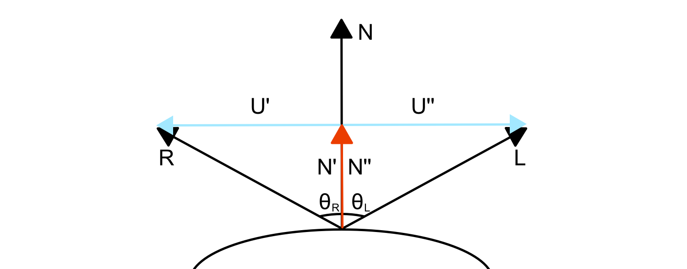

*In this post I will talk about reflection vector used in some lighting models, for example the Phong reflection model.
I will show you how this vector is calculated.*

---

In a [previous post](/2017/07/26/phong-lighting-model/ "phong model post") I talked about the Phong lighting model.
I described all the different components contained inside it and how they try to describe and simulate different kind of
light components. In particular you will remember that there's a specular component that try to simulated the light
reflected in a specific direction: the reflection direction. In the shader implementation this direction has been
calculated using a GLSL method `reflect`:

```glsl
vec3 reflectionDirection = reflect(-lightDirection, normalInterp);
```

Easy, isn't it? But the most curios of you may asking: "How the f*$k this method calculate this reflection direction?" :stuck_out_tongue_closed_eyes:  
We will suppose as in the previous post about the phong model that all vectors are normalized. Let's start from the
beginning. The formula to calculate the reflection direction is:

$$
R = 2({\hat{N}}\cdot{\hat{L}}){\hat{N}} - {\hat{L}}
$$

How is this formula obtained? Let's start from a picture that represents our reflection vector and the other vectors
used in the calculation.



Before we start with the demonstration we also need to know what is the law of reflection:

> The incident light ray L, the reflected ray R, and the normal N to the surface of the mirror all lie in the same plane. The angle of reflection $\Theta_R$ is equal to the angle of incidence of light $\Theta_L$. Both angles are measured with respect to the normal to the mirror. The reflected ray and the incident ray are on the opposite sides of the normal.

Now we are ready for our demonstration :sunglasses:.  
From the law of reflection reported above we know that:

$$
\Theta_R=\Theta_L
$$

This equation could be rewritten as the dot product of the reflection direction with the normal equals the dot product
of the incident light direction and the normal (remember that
the [dot product of two vector is equal to the cosine of the angle between them](https://en.wikipedia.org/wiki/Dot_product "dot product of two vector is equal to the cosine of the angle between them"))
. So we have:

$$
{\hat {R}} \cdot {\hat {N}} = {\hat {L}} \cdot {\hat {N}}
$$

From the image above it's also evident for symmetry that:

$$
{\hat {U}^{\prime}} = -{\hat {U}^{\prime \prime}}
$$

As you can see again from the image above, this two vectors could be easily calculated. In fact the first one is the
difference between the reflection vector and
the [projection](https://en.wikipedia.org/wiki/Vector_projection "vector projection") of it on the normal. The second
one is the difference between the light incident vector and the projection of it on the normal. So for the reflection
side we could write:

$$
{\hat {U}^{\prime}} = {\hat {R}} - {\hat {N}^{\prime}} = {\hat {R}} - ({\hat {R}} \cdot {\hat {N}}){\hat {N}}
$$

For the light side we could write:

$$
{\hat {U}^{\prime \prime}} = {\hat {L}} - {\hat {N}^{\prime \prime}} = {\hat {L}} - ({\hat {L}} \cdot {\hat {N}}){\hat {N}}
$$

As a consequence we obtain the following equation:

$$
{\hat {R}} - ({\hat {R}} \cdot {\hat {N}}){\hat {N}} = -({\hat {L}} - ({\hat {L}} \cdot {\hat {N}}){\hat {N}})
$$

Now we can see again from the image above that the vector projections ${\hat {N}^{\prime}}$ and ${\hat {N}^{\prime
\prime}}$ are equals, that means we could change the previous equation by substituting the first one with the second
one. So we obtain the following equation:

$$
{\hat {R}} - ({\hat {L}} \cdot {\hat {N}}){\hat {N}} = -({\hat {L}} - ({\hat {L}} \cdot {\hat {N}}){\hat {N}})
$$

Now we have all we need to calculate our R vector:

$$
{\hat {R}} - ({\hat {L}} \cdot {\hat {N}}){\hat {N}} = -({\hat {L}} - ({\hat {L}} \cdot {\hat {N}}){\hat {N}})
$$

$$
{\hat {R}} = ({\hat {L}} \cdot {\hat {N}}){\hat {N}} - ({\hat {L}} - ({\hat {L}} \cdot {\hat {N}}){\hat {N}})
$$

$$
{\hat {R}} = ({\hat {L}} \cdot {\hat {N}}){\hat {N}} - {\hat {L}} + ({\hat {L}} \cdot {\hat {N}}){\hat {N}}
$$

$$
R = 2({\hat{N}}\cdot{\hat{L}}){\hat{N}} - {\hat{L}}
$$

That's it!! We get our formula. Now you're ready to understand in
detail [the "magic" of the Phong lighting model](/2017/07/26/phong-lighting-model/) :relaxed:.
