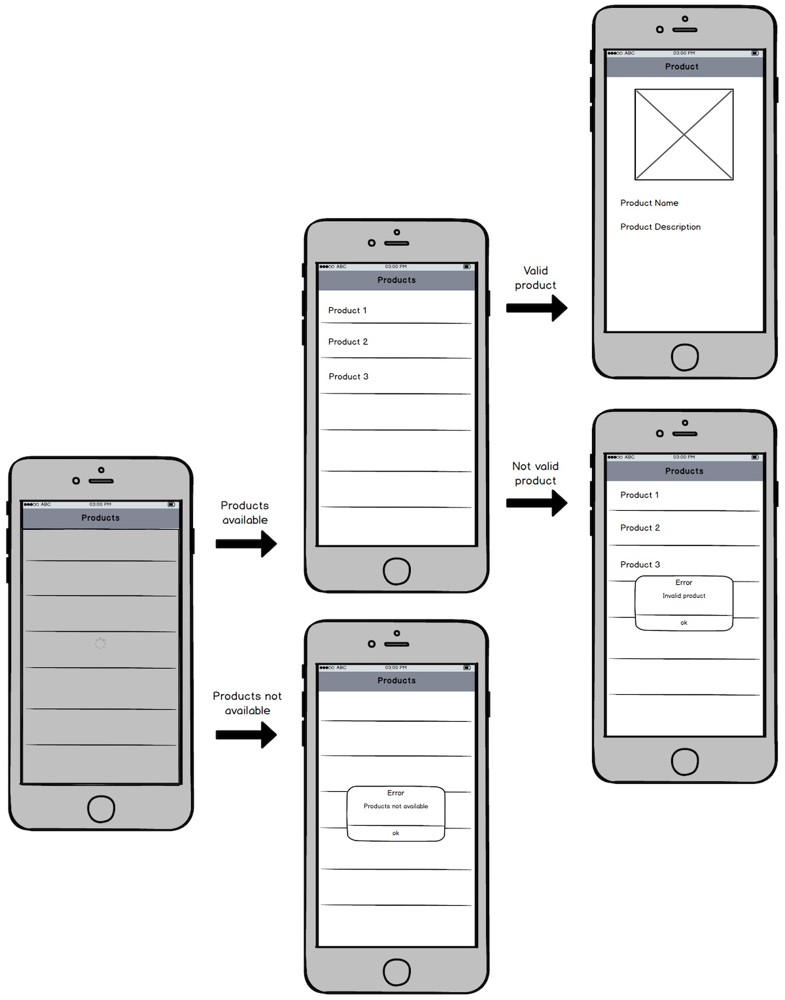

*In this post I will talk about the model view presenter architectural pattern and how it can improve you unit test and
your TDD workflow when developing an Android application.*

---

In
a [previous post](/2017/08/11/model-view-presenter-architecture-ios-swift-unit-test/ "model view presenter ios post")
I talked about the [Model View Presenter](https://en.wikipedia.org/wiki/Model–view–presenter "Model view presenter")
architectural pattern and how it could help you to develop apps fully tested. But what about Android? Can we reach the
same level of testability using this pattern and improve our TDD workflow? Let's find it out :smirk:!!  
In this post we will try to develop the same application we developed on iOS in
the [previous post](/2017/08/11/model-view-presenter-architecture-ios-swift-unit-test/ "model view presenter ios post"):
a simple product catalog that shows a list of products. When you tap on one of them, its details is shown. Below you can
find the same mockup we used for the iOS version.



Let's start by creating a `Product` class. We need also to create a `ProductsRepository` class: in our case it will be a
fake one that return to listener a list of products after 3 seconds. We do this to simulate a web service call. This is
our implementation for the `Product` class:

```java
public class Product {
    private String name;
    private String description;
    private String image;

    public Product(String name, String description, String image) {
        this.name = name;
        this.description = description;
        this.image = image;
    }

    public String getName() {
        return name;
    }

    public String getDescription() {
        return description;
    }

    public String getImage() {
        return image;
    }
}
```

And below there is the implementation of our `ProductsRepository`.

```java
public class ProductsRepository implements Repository {
    private ProductsRepositoryListener productsRepositoryListener;

    @Override
    public void setListener(ProductsRepositoryListener productsRepositoryListener) {
        this.productsRepositoryListener = productsRepositoryListener;
    }

    public void get() {
        new Timer().schedule(new TimerTask() {
            @Override
            public void run() {
                Product[] products = {
                    new Product("Car", "A beautiful car", "car"),
                    new Product("Book", "", "book")
                };
                productsRepositoryListener.onRetrieved(products);
            }
        }, 3000);
    }
}
```

As we said before, and as you can see above the repository return to a `ProductsRepositoryListener` the list of
products. So the interface definition for that listener is:

```java
public interface ProductsRepositoryListener {
    void onRetrieved(Product[] products);
}
```

Now we can start to create our presenter. First of all we will define a `ProductsView` that will be responsible to
implement the real platform dependent UI code. Our presenter will be responsible for:

* **the start of the view in the**  `onStart()` method. In this method it will update the view title, show a loading
  status and more important it will start the retrieve of the product list and become its listener.
* **listening to the repository callback when the products are retrieve**. So our presenter will implement
  the `ProductsRepositoryListener` interface and pass to the view the updated product list.
* **the show detail action in the** `onSelected(Product product)` method. In this case it will need to check that we
  have a valid product and eventually show its detail (or an error message).

First let's see our `ProductsView` interface:

```java
public interface ProductsView {
    void showLoadingStatus();
    void hideLoadingStatus();
    void show(String title);
    void show(Product[] products);
    void showErrorWith(String message);
    void showDetailFor(Product product);
}
```

Our `ProductsPresenter` implementation will be the following:

```java
public class ProductsPresenter implements ProductsRepositoryListener {
    private ProductsView productsView;
    private Repository productsRepository;

    public ProductsPresenter(ProductsView productsView, Repository productsRepository) {
        this.productsView = productsView;
        this.productsRepository = productsRepository;
    }

    public void onStart() {
        productsView.show("Products");
        productsView.showLoadingStatus();
        productsRepository.setListener(this);
        productsRepository.get();
    }

    @Override
    public void onRetrieved(Product[] products) {
        tryToShowTheProducts(products);
        productsView.hideLoadingStatus();
    }

    private void tryToShowTheProducts(Product[] products) {
        if (isValidProduct(products)) {
            productsView.show(products);
        } else {
            productsView.showErrorWith("No products available");
        }
    }

    private boolean isValidProduct(Product[] products) {
        return products != null;
    }

    public void onSelected(Product product) {
        if (hasValidDescription(product)) {
            productsView.showDetailFor(product);
        } else {
            productsView.showErrorWith("Product without description");
        }
    }

    private boolean hasValidDescription(Product product) {
        return !product.getDescription().equals("");
    }
}
```

And this are our presenter tests:

```java
public class ProductsPresenterTest {
    private ProductsView productsView;
    private Repository productsRepository;
    private ProductsPresenter productsPresenter;
    private final Product[] products  = new Product[]{new Product("aName", "aDescription", "anImage")};
    private final Product product  = new Product("aName", "aDescription", "anImage");

    @Test
    public void onStart() throws Exception {
        givenAProductsRepository();
        givenAProductsView();
        givenAProductsPresenter();
        whenTheProductsPresenterStarts();
        thenTheTitleIsDisplayed();
        thenTheProductViewShowsLoadingStatus();
        thenTheProductsPresenterBecomeListenerOfTheRepository();
        thenTryToRetrieveProduct();
    }

    @Test
    public void onProductsRetrieved() throws Exception {
        givenAProductsRepository();
        givenAProductsView();
        givenAProductsPresenter();
        whenTheProductsHaveBeenRetrieved();
        thenTheProductsViewShowsTheProducts();
        thenTheProductsViewHidesLoadingStatus();
    }

    @Test
    public void onNoProductsRetrieved() throws Exception {
        givenAProductsRepository();
        givenAProductsView();
        givenAProductsPresenter();
        whenTheProductsHaveNotBeenRetrieved();
        thenTheProductsViewShowsAnErrorMessage();
        thenTheProductsViewHidesLoadingStatus();
    }

    @Test
    public void onProductSelectedWithDescription() throws Exception {
        givenAProductsRepository();
        givenAProductsView();
        givenAProductsPresenter();
        whenAProductIsSelected();
        thenTheViewShowsTheProductDetail();
    }

    private void givenAProductsPresenter() {
        productsPresenter = new ProductsPresenter(productsView, productsRepository);
    }

    private void givenAProductsRepository() {
        productsRepository = mock(Repository.class);
    }

    private void givenAProductsView() {
        productsView = mock(ProductsView.class);
    }

    private void whenTheProductsPresenterStarts() {
        productsPresenter.onStart();
    }

    private void whenTheProductsHaveBeenRetrieved() {
        productsPresenter.onRetrieved(products);
    }

    private void whenTheProductsHaveNotBeenRetrieved() {
        productsPresenter.onRetrieved(null);
    }

    private void whenAProductIsSelected() {
        productsPresenter.onSelected(product);
    }

    private void thenTheTitleIsDisplayed() {
        verify(productsView).show(anyString());
    }

    private void thenTryToRetrieveProduct() {
        verify(productsRepository).get();
    }

    private void thenTheProductsPresenterBecomeListenerOfTheRepository() {
        verify(productsRepository).setListener(productsPresenter);
    }

    private void thenTheProductViewShowsLoadingStatus() {
        verify(productsView).showLoadingStatus();
    }

    private void thenTheProductsViewHidesLoadingStatus() {
        verify(productsView).hideLoadingStatus();
    }

    private void thenTheProductsViewShowsTheProducts() {
        verify(productsView).show(products);
    }

    private void thenTheProductsViewShowsAnErrorMessage() {
        verify(productsView).showErrorWith(anyString());
    }

    private void thenTheViewShowsTheProductDetail() {
        verify(productsView).showDetailFor(product);
    }
}
```

It's easy to see that with our presenter we are able to test, also on Android, each UI operation without have to deal
with platform dependent code in our unit test. As you can see our unit test are written, as on iOS, following the
typical [Behaviour Driven Development](https://en.wikipedia.org/wiki/Behavior-driven_development "Behaviour Driven Development")
given-than-when approach. Now the same question we had in the iOS version of the app will start floating around in your
head: who is our view? Fragments!!! On Android we will use fragments as our View for all the UI operation :sunglasses:.
So let's see our `ProductsFragment` implementation:

```java
public class ProductsFragment extends Fragment implements ProductsView {
    private RecyclerView productsRecyclerView;
    private ProductsPresenter productsPresenter;
    private LinearLayoutManager productsLinearLayoutManager;
    private ProgressBar productsProgressBar;
    private ProductsNavigator productsNavigator;

    public static ProductsFragment newInstance(ProductsNavigator productsNavigator) {
        ProductsFragment productsFragment = new ProductsFragment();
        productsFragment.productsNavigator = productsNavigator;
        return productsFragment;
    }

    @Override
    public View onCreateView(LayoutInflater inflater, ViewGroup container,
                             Bundle savedInstanceState) {
        return inflater.inflate(R.layout.fragment_products, container, false);
    }

    @Override
    public void onViewCreated(View view, @Nullable Bundle savedInstanceState) {
        super.onViewCreated(view, savedInstanceState);
        bindViews();
        initializeDependencies();
    }

    @Override
    public void onResume() {
        super.onResume();
        productsPresenter.onStart();
    }

    private void initializeDependencies() {
        ProductsRepository productsRepository = new ProductsRepository();
        productsPresenter = new ProductsPresenter(this, productsRepository);
    }

    private void setupProductRecyclerViewUsing(final Product[] products) {
        getActivity().runOnUiThread(new Runnable() {
            @Override
            public void run() {
                setupLayoutManager();
                setupStyle();
                setupAdapterUsing(products);
            }
        });
    }

    private void setupAdapterUsing(Product[] products) {
        ProductsAdapter productsAdapter = new ProductsAdapter(products, productsPresenter);
        productsRecyclerView.setAdapter(productsAdapter);
    }

    private void setupLayoutManager() {
        productsLinearLayoutManager = new LinearLayoutManager(getActivity());
        productsRecyclerView.setLayoutManager(productsLinearLayoutManager);
    }

    private void setupStyle() {
        productsRecyclerView.setHasFixedSize(true);
        DividerItemDecoration dividerItemDecoration = new DividerItemDecoration(
                productsRecyclerView.getContext(),
                productsLinearLayoutManager.getOrientation());
        productsRecyclerView.addItemDecoration(dividerItemDecoration);
    }

    private void bindViews() {
        productsProgressBar = (ProgressBar) getView().findViewById(R.id.products_progress_bar);
        productsRecyclerView = (RecyclerView) getView().findViewById(R.id.products_recycler_view);
    }

    @Override
    public void showLoadingStatus() {
        productsProgressBar.setVisibility(View.VISIBLE);
    }

    @Override
    public void hideLoadingStatus() {
        getActivity().runOnUiThread(new Runnable() {
            @Override
            public void run() {
                productsProgressBar.setVisibility(View.GONE);
            }
        });
    }

    @Override
    public void show(String title) {
        getActivity().setTitle(title);
    }

    @Override
    public void show(Product[] products) {
        setupProductRecyclerViewUsing(products);
    }

    @Override
    public void showErrorWith(final String message) {
        getActivity().runOnUiThread(new Runnable() {
            @Override
            public void run() {
                showErrorAlertWith(message);
            }
        });
    }

    private void showErrorAlertWith(String message) {
        AlertDialog.Builder builder = new AlertDialog.Builder(getActivity());
        builder.setMessage(message)
                .setTitle(R.string.dialog_error_title)
                .setPositiveButton(R.string.dialog_error_ok_button, new DialogInterface.OnClickListener() {
                    public void onClick(DialogInterface dialog, int id) {
                        dialog.dismiss();
                    }
                });
        AlertDialog errorAlert = builder.create();
        errorAlert.show();
    }

    @Override
    public void showDetailFor(Product product) {
        productsNavigator.goToDetailOf(product);
    }
}
```

As you can see it implements all the UI operation we defined in our view as the `UIViewController` do on iOS. But if you
look well we have a little difference between the two platform. In the Android platform the tap on a product is managed
in the adapter, so the presenter is passed to this component to manage the product selection. Let's see the
implementation of our `ProductsPresenter`:

```java
class ProductsAdapter extends RecyclerView.Adapter<ProductsAdapter.ViewHolder> {
    private Product[] products;
    private ProductsPresenter productsPresenter;

    ProductsAdapter(Product[] products, ProductsPresenter productsPresenter) {
        this.products = products;
        this.productsPresenter = productsPresenter;
    }

    @Override
    public ViewHolder onCreateViewHolder(ViewGroup parent, int viewType) {
        View rowProductView = LayoutInflater.from(parent.getContext()).inflate(R.layout.row_product, parent, false);
        return new ViewHolder(rowProductView, productsPresenter);
    }

    @Override
    public void onBindViewHolder(ViewHolder holder, int position) {
        holder.textView.setText(products[position].getName());
        holder.product = products[position];
    }

    @Override
    public int getItemCount() {
        return products.length;
    }

    static class ViewHolder extends RecyclerView.ViewHolder implements View.OnClickListener {
        private ProductsPresenter productsPresenter;
        TextView textView;
        Product product;

        ViewHolder(View itemView, ProductsPresenter productsPresenter) {
            super(itemView);
            textView = (TextView) itemView.findViewById(R.id.product_name_text_view);
            textView.setOnClickListener(this);
            this.productsPresenter = productsPresenter;
        }

        @Override
        public void onClick(View v) {
            productsPresenter.onSelected(product);
        }
    }
}
```

There's also another little difference between the Android and the iOS version. If you look carefully in
the `showDetailFor(Product product)` method, that is called after the product selected is checked in the presenter,
there is another component responsible to manage the navigation between the screen of our app. In particular, the screen
of our app will be `Fragment` objects and there will be an `Activity`, the `ProductsActivity`, that will implement
the `ProductsNavigator` interface and will be responsible to manage the correct navigation between fragments in the app.
Let's see in order the `ProductsNavigator` interface:

```java
public interface ProductsNavigator {
    void goToDetailOf(Product product);
}
```

And the `ProductsActivity` implementation:

```java
public class ProductsActivity extends AppCompatActivity implements ProductsNavigator {

    @Override
    protected void onCreate(Bundle savedInstanceState) {
        super.onCreate(savedInstanceState);
        setContentView(R.layout.activity_products);
        Toolbar toolbar = (Toolbar) findViewById(R.id.toolbar);
        setSupportActionBar(toolbar);
        showFragment(ProductsFragment.newInstance(this));
    }

    private void showFragment(Fragment fragment) {
        FragmentTransaction fragmentTransaction = getFragmentManager().beginTransaction();
        fragmentTransaction.setCustomAnimations(
                R.animator.enter,
                R.animator.exit,
                R.animator.pop_enter,
                R.animator.pop_exit
        );
        fragmentTransaction.replace(R.id.products_activity_content, fragment);
        fragmentTransaction.addToBackStack("ProductsStack");
        fragmentTransaction.commit();
    }

    @Override
    public void goToDetailOf(Product product) {
        showFragment(ProductDetailFragment.newInstance(product));
    }

    @Override
    public boolean onOptionsItemSelected(MenuItem item) {
        switch (item.getItemId()) {
            case android.R.id.home:
                onBackPressed();
                break;
        }
        return false;
    }

    @Override
    public void onBackPressed() {
        if (getFragmentManager().getBackStackEntryCount() > 1) {
            getFragmentManager().popBackStack();
        } else {
            finish();
        }
    }
}
```

Ok, now we are ready to implement our product detail. First of all we define the new `ProductDetailView`:

```java
public interface ProductDetailView {
    void show(String title);
    void show(Product product);
    void showErrorWith(String message);
}
```

And then our presenter:

```java
public class ProductDetailPresenter {
    private ProductDetailView productDetailView;
    private Product product;

    public ProductDetailPresenter(ProductDetailView productDetailView, Product product) {
        this.productDetailView = productDetailView;
        this.product = product;
    }

    public void onStart() {
        productDetailView.show("Product");
        if (isValidProduct()) {
            productDetailView.show(product);
        } else {
            productDetailView.showErrorWith("Product not valid");
        }
    }

    private boolean isValidProduct() {
        return product != null;
    }
}
```

And its unit tests:

```java
public class ProductDetailPresenterTest {
    private ProductDetailPresenter productDetailPresenter;
    private ProductDetailView productDetailView;
    private Product product;

    @Test
    public void onStartWithValidProduct() throws Exception {
        givenAValidProduct();
        givenAProductDetailView();
        givenAProductDetailPresenter();
        whenThePresenterStarts();
        thenTheTitleIsShown();
        thenTheProductDetailIsShown();
    }

    @Test
    public void onStartWithInvalidProduct() throws Exception {
        givenAnInvalidProduct();
        givenAProductDetailView();
        givenAProductDetailPresenter();
        whenThePresenterStarts();
        thenTheTitleIsShown();
        thenAnErrorMessageIsDisplayed();
    }

    private void givenAValidProduct() {
        product = new Product("aName", "aDescription", "anImage");
    }

    private void givenAnInvalidProduct() {
        product = null;
    }

    private void givenAProductDetailView() {
        productDetailView = mock(ProductDetailView.class);
    }

    private void givenAProductDetailPresenter() {
        productDetailPresenter = new ProductDetailPresenter(productDetailView, product);
    }

    private void whenThePresenterStarts() {
        productDetailPresenter.onStart();
    }

    private void thenTheProductDetailIsShown() {
        verify(productDetailView).show(product);
    }

    private void thenTheTitleIsShown() {
        verify(productDetailView).show(anyString());
    }

    private void thenAnErrorMessageIsDisplayed() {
        verify(productDetailView).showErrorWith(anyString());
    }
}
```

And finally our `ProductDetailFragment`:

```java
public class ProductDetailFragment extends Fragment implements ProductDetailView {
    private Product product;
    private ImageView productImageView;
    private TextView productNameTextView;
    private TextView productDescriptionTextView;
    private ProductDetailPresenter productDetailPresenter;

    public static ProductDetailFragment newInstance(Product product) {
        ProductDetailFragment productDetailFragment = new ProductDetailFragment();
        productDetailFragment.product = product;
        return productDetailFragment;
    }

    @Override
    public View onCreateView(LayoutInflater inflater, ViewGroup container,
                             Bundle savedInstanceState) {
        return inflater.inflate(R.layout.fragment_product_detail, container, false);
    }

    @Override
    public void onViewCreated(View view, @Nullable Bundle savedInstanceState) {
        super.onViewCreated(view, savedInstanceState);
        bindViews();
        initializeDependencies();
    }

    @Override
    public void onResume() {
        super.onResume();
        productDetailPresenter.onStart();
    }

    private void bindViews() {
        productImageView = (ImageView) getActivity().findViewById(R.id.product_image_detail_image_view);
        productNameTextView = (TextView) getActivity().findViewById(R.id.product_name_detail_text_view);
        productDescriptionTextView = (TextView) getActivity().findViewById(R.id.product_description_detail_text_view);
    }

    private void initializeDependencies() {
        productDetailPresenter = new ProductDetailPresenter(this, product);
    }

    @Override
    public void show(String title) {
        getActivity().setTitle(title);
    }

    @Override
    public void show(Product product) {
        productImageView.setImageDrawable(getActivity().getDrawable(getActivity().getResources().getIdentifier(
                product.getImage(),
                "drawable",
                getActivity().getPackageName()
        )));
        productNameTextView.setText(product.getName());
        productDescriptionTextView.setText(product.getDescription());
    }

    @Override
    public void showErrorWith(String message) {
        AlertDialog.Builder builder = new AlertDialog.Builder(getActivity());
        builder.setMessage(message)
                .setTitle(R.string.dialog_error_title)
                .setPositiveButton(R.string.dialog_error_ok_button, new DialogInterface.OnClickListener() {
                    public void onClick(DialogInterface dialog, int id) {
                        dialog.dismiss();
                    }
                });
        AlertDialog errorAlert = builder.create();
        errorAlert.show();
    }
}
```

That's it!!!!! You've made it!!! Now you master the Model View Presenter architectural pattern on Android and you're
ready to rock with unit test on all the main mobile platform on the market (somebody said Windows Phone!?!?!?!?!? :
stuck_out_tongue_closed_eyes:).


