*In this post I will show you how to install realm as a dependency in a React Native project with custom folders
structure without using react-native link command*.

---

What is React Native? It is one of the most successful and loved mobile development framework. It let you build *real
native mobile* application using Javascript. It has been developed by Facebook. Let's see the definition from the
official website:

> Build native mobile apps using JavaScript and React. React Native lets you build mobile apps using only JavaScript. It uses the same design as React, letting you compose a rich mobile UI from declarative components. With React Native, you don't build a “mobile web app”, an “HTML5 app”, or a “hybrid app”. You build a real mobile app that's indistinguishable from an app built using Objective-C or Java. React Native uses the same fundamental UI building blocks as regular iOS and Android apps. You just put those building blocks together using JavaScript and React.

Cool :sunglasses:!!!! Isn't it? Write an app using Javascript with the same performance of native code. You can also
reuse your native component and bridge them to the javascript side.  
Most of the time the React Native framework will help you also to manage dependencies inside you project. But sometimes,
especially if your project doesn't follow the standard React Native directories structure you can have some problem when
you try to link you external library.  
While I was working on
an [existing native app integrated with React Native](https://reactnative.dev/docs/integration-with-existing-apps/ 'existing native app integrated with React Native')
that has a custom directories structure for the react-native and native code, I found some problem to
add [Realm](https://realm.io 'https://realm.io'), the famous open source dbms, as a dependency to the project.  
In this post I will show you an example of how you can add Realm to your app that has a custom React Native
installation. Let's start :cold_sweat:!!
To describe the installation process I will use a sample app I created for this post called `ReactNativeRealmManualLink`
. You can find it with realm installed
in [this github repo](https://github.com/chicio/React-Native-Realm-Manual-Link 'React Native realm manual link').  
Suppose you have a project like the one I shared above, in which React Native is contained in a subfolder of the iOS
project, instead of the other way around in a standard React Native installation.

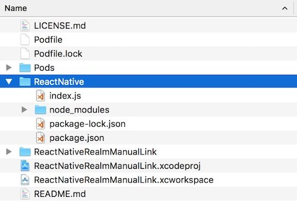

First, to add realm as a dependency we need to install it through npm with following command.

```shell
npm install --save realm
```

Then we try to link the library to the native code with the standard React Native command.

```shell
react-native link realm
```

But here something strange happens: as you can see from the screenshot below the command fails to link the library. So
we need to find another way to install the library.

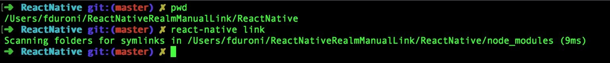

Usually, if the previous command fails, you have to do
the [manual linking](https://reactnative.dev/docs/linking-libraries-ios/ "manual linking"). To do it we navigate inside
the `node_modules` folder, contained in the React Native folder of our project, to found the realm folder. Inside it you
will find an Xcode project named `RealmReact`, that you have to drag into our project. After that we have to add a
reference to the static library `libRealmReact` and compile the project.

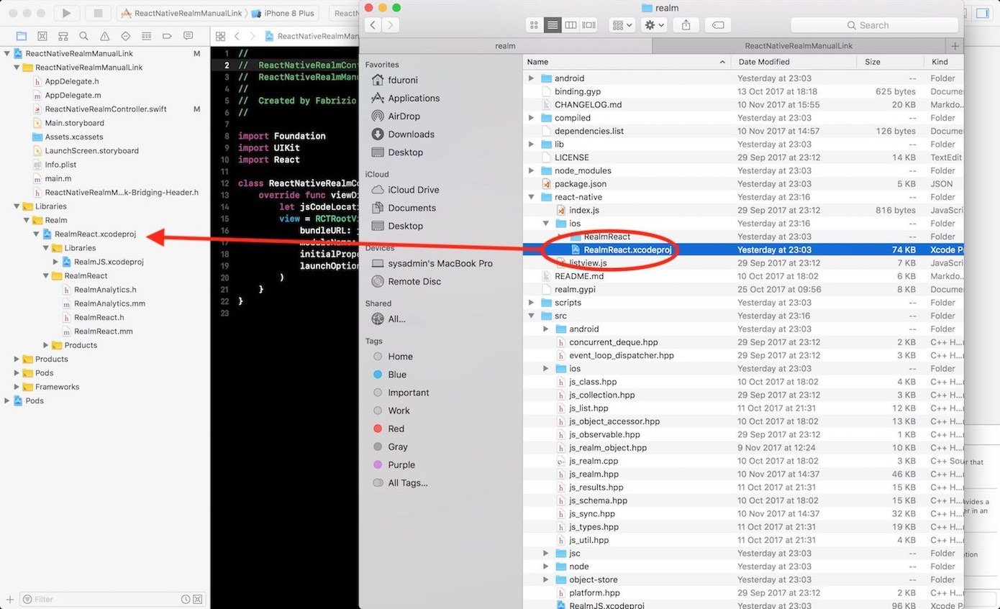
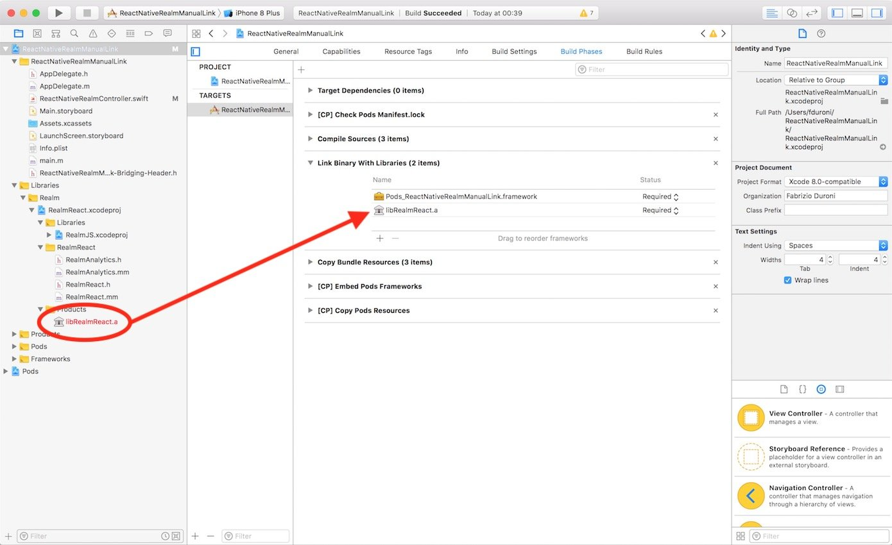

Now you would expect that everything works fine but...


What's happening? The `RealmReact` project is expecting the React Native headers in a relative position with respect to
its original position. Argh :rage:!! We need to find another way...

What can we do? We can start by observing that the `RealmReact` project is just a "container project" for:

* `RealmJS` project, that generates two static libraries `libRealmJS.a` and `libGCDWebServers.a`
* an Objective-C++ class `RealmReact`
* an Objective-C++ file `RealmAnalytics`

So we can try to modify our main project by:

* adding the `RealmJS` project and the Objective-C++ files/classes as references
* linking the static libraries `libRealmJS.a` and `libGCDWebServers.a` to our main project and see if everything works

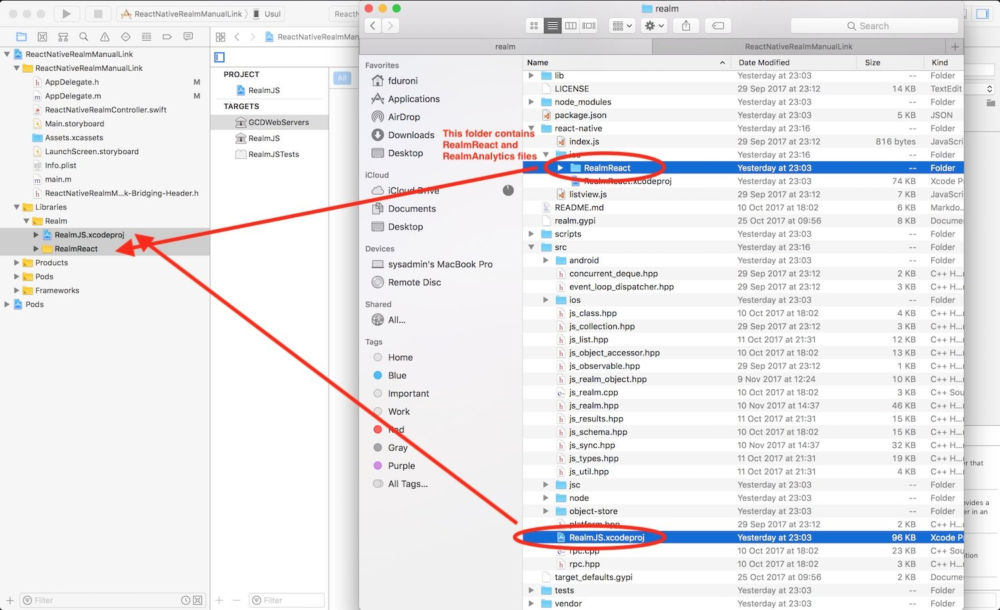

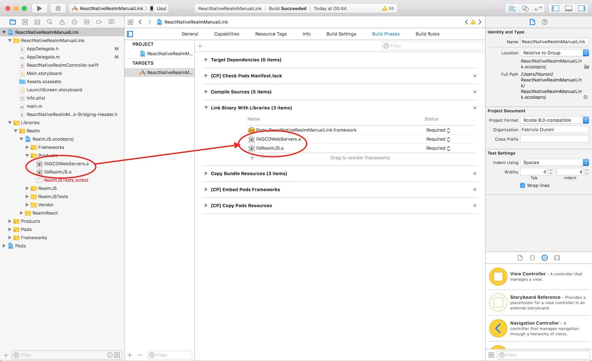

Now we need to add to the `Header search path` option of our main project the paths that were set in the `RealmReact`
project. In this way the `RealmJS` project will be able to find some headers it needs. You can find the complete list of
the folder that we need to add in the screenshot below.

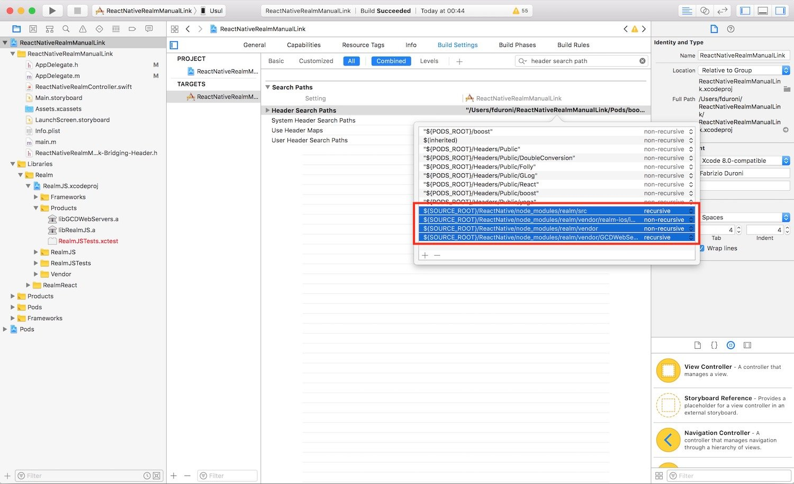

Now if we try to compile our app we expect that everything works fine but...ERROR :warning::fire:!!! The build fails :
boom:!!!

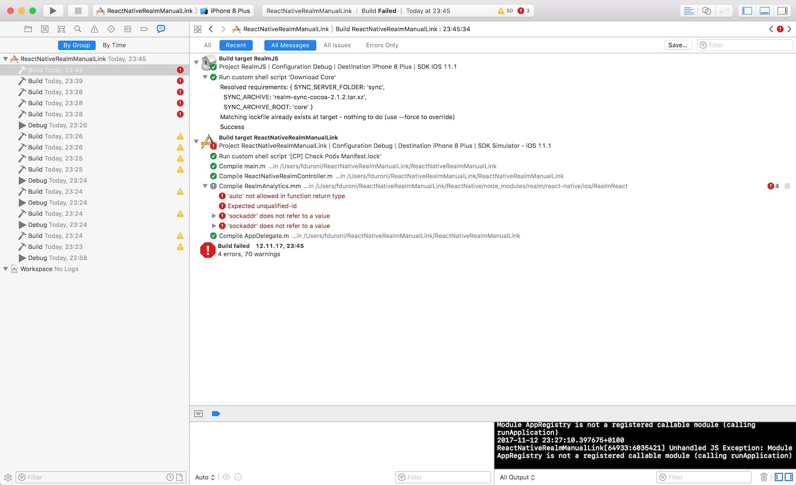

It seems like that in order to be able to compile the C++ source code contained in `RealmJS` we need to set a recent C++
version in our project setting that supports some new features like auto return type on static function. We can set it
to C++ 14 and set the Standard Library to the LLVM one with C++ 11 support.

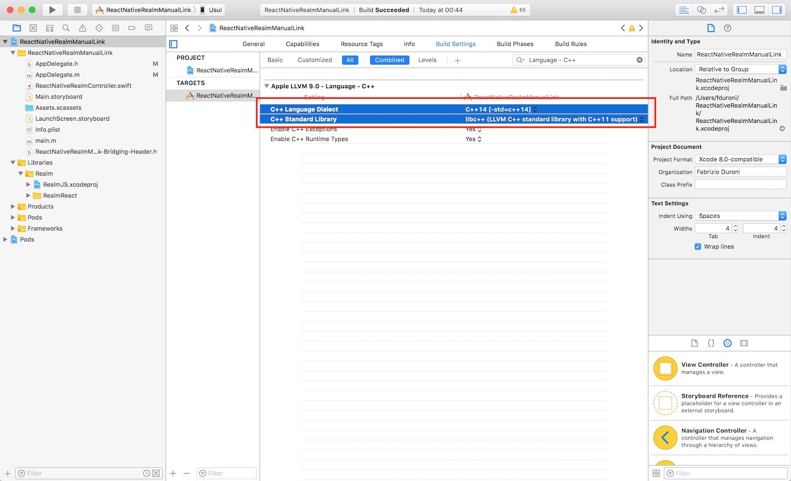

One final step is to remove the flag `-all_load` from the `Other linker flag` option of the main project (if you have
it). In this way we avoid to load all Objective-C symbols and have the "duplicated symbols" error.

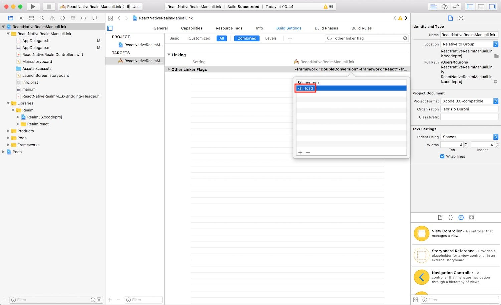

We are now ready to build our app and see if everything works. To do this we create a sample native view controller that
has a `RCTRootView`.

```swift
class ReactNativeRealmController: UIViewController {
    override func viewDidLoad() {
        let jsCodeLocation = URL(string: "http://localhost:8081/index.bundle?platform=ios")
        view = RCTRootView(
            bundleURL: jsCodeLocation,
            moduleName: "ReactNativeRealmScreen",
            initialProperties: nil,
            launchOptions: nil
        )
    }
}
```

and a sample react component with some realm write/read operations.

```jsx
const Realm = require('realm');

class ReactNativeRealmScreen extends React.Component {
  constructor(props) {
    super(props);
    this.state = {
      realm: null
    };
  }

  componentWillMount() {
    Realm.open({
      schema: [{ name: 'Band', properties: { name: 'string', singer: 'string' } }]
    }).then(realm => {
      realm.write(() => {
        realm.create('Band', { name: 'HIM', singer: 'Ville Valo' });
      });
      this.setState({ realm });
    });
  }

  render() {
    const message = this.state.realm
      ? 'The singer of HIM band is: ' + this.state.realm.objects('Band').filtered('name = "HIM"')[0].singer
      : 'Loading...';

    return (
      <View style={styles.container}>
        <Text>
          {message}
        </Text>
      </View>
    );
  }
}

const styles = StyleSheet.create({
  container: {
    flex: 1,
    justifyContent: 'center',
    alignItems: 'center',
    backgroundColor: '#FFFFFF',
  }
});

AppRegistry.registerComponent('ReactNativeRealmScreen', () => ReactNativeRealmScreen, false);
```

We are now ready to build our app and, as expected, everything works fine.

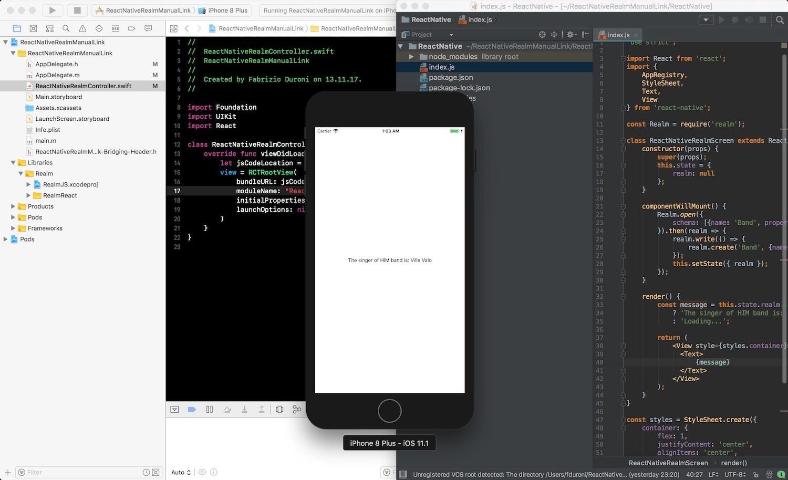

That's it!! As I told you before you can find the complete example
in [this github repo](https://github.com/chicio/React-Native-Realm-Manual-Link 'React Native realm manual link'). We are
now ready to create our React Native component with realm :bowtie:.  
