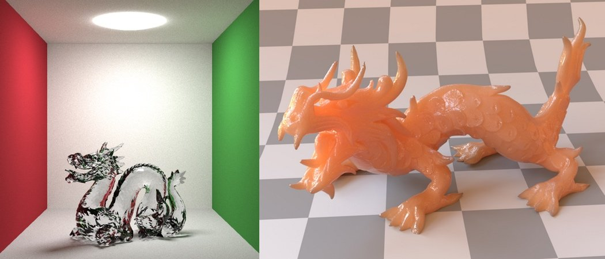

*In this post I will give you an informal introduction (and my personal understanding) about Physically based
rendering.*

---

Physically Based Rendering (PBR) is one of the latest, and most exciting trend in computer graphics. PBR is "everywhere"
in computer graphics. But wait, what is it PBR :fearful:? PBR uses physically correct lighting and shading models to
treat light as it behaves in the real world. As a consequence of the fact that what could be seen in a computer graphics
application is decided by how light is represented, with PBR it is possible to reach a new level of realism. Wait,
what do we mean with "physically correct"?  
Before giving an answer and try to give a detail definition of PBR we need to understand well some important concepts.

#### **What is light?**

Light is a form of electromagnetic radiation. Specifically, it is a small subset of the entire electromagnetic radiation
spectrum with wavelength between 400 nm and 700 nm. The set of studies and techniques that try to describe and measure
how the electromagnetic radiation of light is propagated, reflected and transmitted is called radiometry. What are the
fundamental quantities described by radiometry? The first one is the called **flux**, it describes the amount of radiant
energy emitted, reflected or transmitted from a surface per unit time. The radiant energy is the energy of an
electromagnetic radiation. The unit measure of flux is joules per seconds $\frac{J}{s}$, and it is usually reported with
the Greek letter $\phi$.  
Other two important quantities of radiometry are **irradiance** and **radiant exitance**. The first one described flux
arriving at a surface per unit area. The second one describe flux leaving a surface per unit area (Pharr et al.,
2010 [1]). Formally irradiance is described with the following equation:

$$
E = \frac{d\phi}{dA}
$$

where the differential flux $d\phi$ is computed over the differential area $dA$. It is measured as units of watt per
square meter.  
Before proceeding to the last radiometry quantity definition, it is useful to give the definition of **solid angle**. A
solid angle is an extension of a 2D angle in 3D on a unit sphere. It is the total area projected by an object on a unit
sphere centered at a point $p$. It is measured in steradians. The entire unit sphere corresponds to a solid angle of
$4\pi$ (the surface area of the unit sphere). A solid angle is usually indicated as $\Omega$, but it is possible also to
represent it with $\omega$, that is the set of all direction vectors anchored at $p$ that point toward the area on the
unit sphere and the object (Pharr et al., 2010 [1]). Now it is possible to give the definition of **radiance**, that is
flux density per unit solid angle per unit area:

$$
L=\frac{d\phi}{d\omega \ dA^{\perp}}
$$

In this case $dA^{\perp}$ is the projected area $dA$ on a surface perpendicular to $\omega$. So radiance describe the
limit of measurement of incident light at the surface as a cone of incident directions of interest ${d\omega}$ becomes
very small, and as the local area of interest on the surface $dA$ also becomes very small (Pharr et al., 2010 [1]). It
is useful to make a distinction between radiance arriving at a point, usually called incident radiance and indicated
with $L_{i}(p,\omega)$, and radiance leaving a point called exitant radiance and indicated with $L_{o}(p,\omega)$. This
distinction will be used in the equations described below. It is important also to note another useful property, that
connect the two types of radiance:

$$
L_{i}(p,\omega) \neq L_{o}(p,\omega)
$$

#### **The rendering equation**

The rendering equation was introduced by James Kajiya in 1986 [2]. Sometimes it is also called the LTE, Light Transport
Equation. It is the equation that describes the equilibrium distribution of radiance in a scene (Pharr et al., 2010 [3])
. It gives the total reflected radiance at a point as a sum of emitted and reflected light from a surface. This is the
formula of the rendering equation:

$$
L_{o}(p,\omega) = L_{e}(p,\omega) + \int_{\Omega}f_{r}(p,\omega_{i},\omega_{0})L_{i}(p,\omega)\cos\theta_{i}d\omega_
{i}
$$

In this formula the meaning of each symbol are:

* $p$ is a point on a surface in the scene
* $\omega_{o}$ is the outgoing light direction
* $\omega_{i}$ is the incident light direction
* $L_{o}(p,\omega)$ is the exitant radiance at a point $p$
* $L_{e}(p,\omega)$ is the emitted radiance at a point $p$
* $\Omega$ is the unit hemisphere centered around the normal at point $p$
* $\int_{\Omega}...d\omega_{i}$ is the integral over the unit hemisphere
* $f_{r}(p,\omega_{i},\omega_{0})$ is the Bidirectional Reflectance Distribution Function and we will talk about it in a
  few moments
* $L_{i}(p,\omega)$ is the incident radiance arriving at a point $p$
* $\cos\theta_{i}$ is given by the dot product between 𝜔: and the normal at point $p$, and is the attenuation factor of
  the irradiance due to incident angle

#### **BRDF**

One of the main component of the rendering equation previously described is the Bidirectional Reflectance Distribution
Function (BRDF). This function describes how light is reflected from a surface. It represents a constant of
proportionality between the differential exitant radiance and the differential irradiance at a point $p$ (Pharr et al.,
2010 [1]). The parameter of this function are: the incident light direction, the outgoing light direction and a point on
the surface. The formula for this function in terms of radiometric quantities is the following:

$$
f_{r}(p,\omega_{i},\omega_{o}) = \frac{dL_{o}(p,\omega_{o})}{dE(p,\omega_{I})}
$$

The BRDF has two important properties:

* it is a symmetric function, so for all pair of directions $f_{r}(p,\omega_{i},\omega_{o}) = f_{r}(p,\omega_
  {o},\omega_{i})$
* it satisfies the **energy conservation principle**: *the light reflected is less than or equal to the incident light*.

A lot of models has been developed to describe the BRDF of different surfaces. In particular, in the last years the **microfacet** 
models have gained attention. In these kind of models the surface is represented as composed by infinitely
small microfacets that model in a more realistic way the vast majority of surfaces in the real world. Each one of these
microfacets has is geometric definition (in particular its normal).  
Some specific material surfaces, for example glass, reflect and transmit light at the same time. So a fraction of light
goes through the material. For this reason, there’s another function, the Bidirectional Transmittance Distribution
Function, BTDF, defined in the same way as the BRDF, but with the directions $\omega_{i}$ and $\omega_{o}$ placed in the
opposite hemisphere around $p$ (Pharr et al., 2010 [1]). It is usually indicated as $f_{t}(p,\omega_{i},\omega_{o})$.
The **[Fresnel equations](https://en.wikipedia.org/wiki/Fresnel_equations "Fresnel equations")** tries to define the
behaviour of light between different surfaces. They also help us to get the balance between different kind of
reflections changes based on the angle at which you view the surface.

#### **Physically Based Rendering**

So let's go back to our original question: What is PBR? PBR is a model that enclose a set of techniques that try to
simulate how the light behaves in the real world. Taking an extraction from the Wikipedia definition:

> PBR is often characterized by an approximation of a real, radiometric bidirectional reflectance distribution function (BRDF) to govern the essential reflections of light, the use of reflection constants such as specular intensity, gloss, and metallicity derived from measurements of real-world sources, accurate modeling of global illumination in which light bounces and/or is emitted from objects other than the primary light sources, conservation of energy which balances the intensity of specular highlights with dark areas of an object, Fresnel conditions that reflect light at the sides of objects perpendicular to the viewer, and accurate modeling of roughness resulting from microsurfaces.

You can see from the definition that PBR is a model that uses all the concepts we saw previously in this article to try
to get the most accurate results in terms of realism in a computer graphics applications. PBR engines and asset
pipelines let the artist define materials in terms of more realistic components, instead of tweaking ad-hoc parameters
based on the type of the surface. Usually in these kind of engine/assets pipeline the main parameter used to specify a
surface features are:

* albedo/diffuse: this component controls the base color/reflectivity of the surface
* metallic: this component specifies the is the surface is metallic or not
* roughness: this component specifies how rough a surface is on a per texel basis
* normal: this component is a classical normal map of the surface

What results can you achieve suing PBR? These are two example images: the first one is taken from my physically based
spectral path tracing
engine [Spectral Clara Lux Tracer](https://github.com/chicio/Spectral-Clara-Lux-Tracer "Spectral Clara Lux Tracer") and
the second one is taken from PBRT, the physically based engine described in the
book ["Physically based rendering: from theory to implementation" by M. Pharr, W. Jakob, G. Humphreys](https://www.pbrt.org "Physically based rendering: from theory to implementation by M. Pharr, W. Jakob, G. Humphreys")
.

How cool are these images???? :sunglasses:
We are at the end of the introduction. I hope now it is at least clear what is PBR :relaxed:!! See you for other stuff
about computer graphics and PBR :blush:.

*[1] M. Pharr and G. Humphreys, “Color and radiometry,” in Physically based rendering: from theory to implementation,
2nd Edition ed., Burlington, Massachusetts: Morgan Kaufmann, 2010, ch. 5, pp. 261-297.  
[2] J. T. Kajiya, “The Rendering Equation,” in SIGGRAPH '86, Dallas, 1986, pp. 143-150.  
[3] M. Pharr and G. Humphreys, “Light transport I: surface reflection,” in Physically based rendering: from theory to
implementation, 2nd ed., Burlington, Morgan Kaufmann, 2010, ch. 15, pp. 760-770.*
