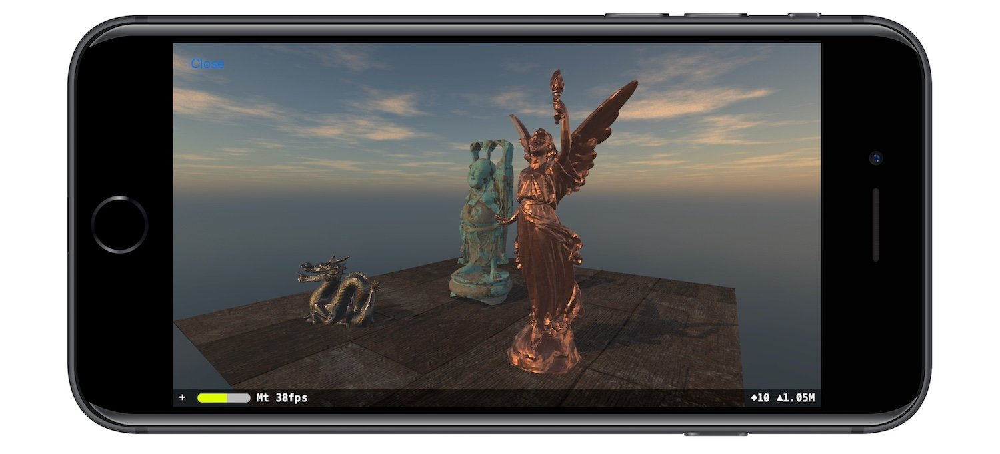

*In this post I will guide you in the creation of a scene using SceneKit and its physically based rendering features.*

---

SceneKit is one of the framework inside the iOS SDK that I love the most. What is SceneKit? Let's see the definition
from the developer apple website:

> SceneKit combines a high-performance rendering engine with a descriptive API for import, manipulation, and rendering of 3D assets. Unlike lower-level APIs such as Metal and OpenGL that require you to implement in precise detail the rendering algorithms that display a scene, SceneKit requires only descriptions of your scene’s contents and the actions or animations you want it to perform.

As you can see from the definition there's a lot of stuff inside it. Basically by using SceneKit you will be able to
create games and other 3D applications without the need to know any computer graphics algorithms, physics simulations
stuff and so on. You basically describe a Scene in terms of objects and features and Apple will do everything for you :
sunglasses:.  
One of the most interesting thing about SceneKit on the computer graphics side has been introduced in 2016: physically
based rendering (PBR).  
We've already seen what PBR is
in [a previous post](/2017/12/07/physically-base-rendering-introduction/ "physically based rendering introduction post")
, so you already know its theoretical foundation stuff (or go to check it out in case you missed it :wink:). So that
means that SceneKit could render physically based scene using its own entirely new physically based rendering engine. Is
it worth it? Sure!! :blush:  So, let's try it!
In this post we will create a scene from scratch that uses the main PBR features you can find inside SceneKit. At the
end of this post you will be able to render the scene contained in the image below. So it's time to start coding!!



The general approach used in the construction of the scene will be the following: for each main scene category component
we will create a class that encapsulate the creation of the corresponding `SCNNode`, the base SceneKit unit element, and
its setup to obtain the feature we want.  
The first class we are going to create is the `Light` class that encapsulate the base features we need to set up the
light: position, rotation and generic color. Light in SceneKit are represented using the `SCNLight` class.

```swift
class Light {
    let node: SCNNode

    init(lightNode: SCNNode) {
        node = lightNode
    }

    init(lightFeatures: LightFeatures) {
        node = SCNNode()
        createLight()
        set(lightFeatures: lightFeatures)
    }

    func createLight() {
        node.light = SCNLight()
    }

    private func set(lightFeatures: LightFeatures) {
        node.light?.color = lightFeatures.color
        node.position = lightFeatures.position
        node.eulerAngles = lightFeatures.orientation;
    }
}
```

The basic features of the light must be passed at construction time using a `LightFeatures` objects.

```swift
class LightFeatures {
    let position: SCNVector3
    let orientation: SCNVector3
    let color: UIColor

    init(position: SCNVector3, orientation: SCNVector3, color: UIColor) {
        self.position = position
        self.orientation = orientation
        self.color = color
    }
}
```

We are now ready to create our `PhysicallyBasedLight` as an child of `Light` class. Our physically based light will be
of type `.directional`, and we will customize its `intensity` and `temperature`. The intensity is the flux of the
light (again, go to
check [my first post about physically based rendering](/2017/12/07/physically-base-rendering-introduction/ 
"physically based introduction post")
if you don't know what it is :stuck_out_tongue:), and the second one is the color temperature expressed in Kelvin (
remember: 6500 K corresponds to pure white sunlight). We activate other interesting features: by setting `castsShadow`
to `true` we activate the rendering of shadow using shadow mapping technique, and by setting `orthographicScale` to `10`
we extend a little bit the visible area of the scene from the light, so we are improving the construction of the shadow
map.

```swift
class PhysicallyBasedLight: Light {

    init(lightFeatures: LightFeatures, physicallyBasedLightFeatures: PhysicallyBasedLightFeatures) {
        super.init(lightFeatures: lightFeatures)
        set(physicallyBasedLightFeatures: physicallyBasedLightFeatures)
        activateShadow()
    }

    private func set(physicallyBasedLightFeatures: PhysicallyBasedLightFeatures) {
        node.light?.type = .directional
        node.light?.intensity = physicallyBasedLightFeatures.lumen
        node.light?.temperature = physicallyBasedLightFeatures.temperature
    }

    private func activateShadow() {
        node.light?.castsShadow = true
        node.light?.orthographicScale = 10
    }
}
```

As for the basic light, we create also for the physically based features a class that will store the configuration and
that must be injected at construction time (as you can see from the previous class init), that we will
call `PhysicallyBasedLightFeatures`.

```swift
class PhysicallyBasedLightFeatures {
    let lumen: CGFloat
    let temperature: CGFloat

    init(lumen: CGFloat, temperature: CGFloat) {
        self.lumen = lumen
        self.temperature = temperature
    }
}
```

For physically based rendering we need also another kind of lighting setup to achieve the best result. We need to set up
the `SCNScene`, the object that contains all the `SCNNode` elements of a scene, the `lightingEnviroment`
and `background` properties. These ones let SceneKit approximate more accurately the indirect lighting calculation. To
set this features we create a new class, `PhysicallyBasedLightingEnviroment`, that will receive the scene to setup. On
this class will set a cubemap on the `lightingEnviroment.contents` property and its intensity on
the `lightingEnviroment.intensity` property. To match the result of this lighting setup, it will set
the `background.contents` with the same cubemap used for the `lightingEnviroment.contents` property.

```swift
class PhysicallyBasedLightingEnviroment {
    let cubeMap: [String]
    let intensity: CGFloat

    init(cubeMap: [String], intensity: CGFloat) {
        self.cubeMap = cubeMap
        self.intensity = intensity
    }

    func setLightingEnviromentFor(scene: SCNScene) {
        scene.lightingEnvironment.contents = cubeMap
        scene.lightingEnvironment.intensity = intensity
        scene.background.contents = cubeMap
    }
}
```

Next step: the camera. We create a `Camera` class, that will contain a reference, again, to a `SCNNode` on which
an `SCNCamera` has been defined. For the camera we need to set first of all some geometric properties like the position,
rotation and the pivot point that we will use as reference for the animation of the camera. Last but not least we set
the flag `wantHDR` to apply [High Dynamic Range](https://en.wikipedia.org/wiki/High_dynamic_range "High Dynamic Range")
post processing to adjust the general brightness of the scene with respect to the display.

```swift
class Camera {
    let node: SCNNode

    init(cameraNode: SCNNode, wantsHDR: Bool = false) {
        node = cameraNode
        setAdvancedFeatures(wantsHDR: wantsHDR)
    }

    init(position: SCNVector3, rotation: SCNVector4, wantsHDR: Bool = false, pivot: SCNMatrix4? = nil) {
        node = SCNNode()
        createCameraOnNode()
        setAdvancedFeatures(wantsHDR: wantsHDR)
        set(position: position, rotation: rotation, pivot: pivot)
    }

    private func createCameraOnNode() {
        node.camera = SCNCamera()
    }

    private func setAdvancedFeatures(wantsHDR: Bool) {
        node.camera?.automaticallyAdjustsZRange = true
        node.camera?.wantsHDR = wantsHDR
    }

    private func set(position aPosition: SCNVector3, rotation aRotation: SCNVector4, pivot aPivot: SCNMatrix4?) {
        node.position = aPosition
        node.rotation = aRotation
        node.pivot = aPivot ?? node.pivot
    }
}
```

Now it's time to think about the objects we want to display in the scene. For that reason we create a `Object` class
that will represent each kind of object we want to show in the scene. Obviously as for the previous classes, also
the `Object` class will expose a `node` property of type `SCNNode` that represents our object in the scene. We define
this class with multiple initializer that let as create object instances using various configurations: init as an empty
object, init using a `SCNGeometry` instance, using a mesh loaded as a `MDLObject` using
the [Model I\O](https://developer.apple.com/documentation/modelio "Model I\O") Apple framework. This framework let us
import/export 3D models in a wide range of common available formats.

```swift
class Object {
    let node: SCNNode

    init(position: SCNVector3, rotation: SCNVector4) {
        node = SCNNode()
        node.castsShadow = true
        set(position: position, rotation: rotation)
    }

    init(geometry: SCNGeometry, position: SCNVector3, rotation: SCNVector4) {
        node = SCNNode(geometry: geometry)
        node.castsShadow = true
        set(position: position, rotation: rotation)
    }

    init(mesh: MDLObject, position: SCNVector3, rotation: SCNVector4) {
        node = SCNNode(mdlObject: mesh)
        node.castsShadow = true
        set(position: position, rotation: rotation)
    }

    private func set(position: SCNVector3, rotation: SCNVector4) {
        node.position = position
        node.rotation = rotation
    }
}
```

Now we are ready to define a `PhysicallyBasedObject` class that will inherit all the capabilities of the `Object` class
and will set all the features needed to make the object rendered using physically based rendering. Even if all the
initializer are available to this subclass, we will require a mesh as `MDLObject` at construction time, because we will
display some particular mesh objects (we will discuss about them later). At construction time we will require also the
position and rotation and the `PhysicallyBasedMaterial` material. By assigning it to the `firstMaterial` property of
the `geometry` of our node, our object will be rendered as a physically based object using the SceneKit physically based
rendering engine. NB: the mesh that we will use doesn't contain any material so by assigning the `firstMaterial`
property the mesh will use it for the entire surface.

```swift
class PhysicallyBasedObject: Object {

    init(mesh: MDLObject, material: PhysicallyBasedMaterial, position: SCNVector3, rotation: SCNVector4) {
        super.init(mesh: mesh, position: position, rotation: rotation)
        node.geometry?.firstMaterial = material.material
    }
}
```

So, the next question is: how do we define the `PhysicallyBasedMaterial` class? We create `PhysicallyBasedMaterial` with
a single property `material` of type `SCNMaterial`. On this material property we set:

* the `lightingModel` to `.physicallyBased`, to mark it for SceneKit as a physically based material
* `diffuse.contents` property with an appropriate diffuse value.
* `roughness.contents` property with an appropriate roughness value.
* `metalness.contents` property with an appropriate metalness value.
* `normal.contents` property with an appropriate normal value.
* `ambientOcclusion.contents` property with an appropriate ambient occlusion value

As you can see, we have all the properties we discussed in
my [introduction to physically based rendering post](/2017/12/07/physically-base-rendering-introduction/ "physically 
based introduction post")
. We have also other properties that help us improve the realism, especially with indirect lighting for what concern
the [ambient occlusion](https://en.wikipedia.org/wiki/Ambient_occlusion "ambient occlusion") (this property/technique is
not related to PBR but helps to improve the final rendering). Which kind of values accept this properties? As stated in
the Apple documentation you can assign to the `contents` property:

* a color (`NSColor`/`UIColor`/`CGColor`)
* a number (`NSNumber`)
* an image (`NSImage`/`UIImage`/`CGImage`)
* a string
* a `CALayer`
* a texture (`SKTexture`/`MDLTexture`/`MTLTexture`/`GLKTextureInfo`)
* a `SKScene`
* an array of six image that represents a cube map (as we did for the `lightingEnviroment.contents property`).

```swift
class PhysicallyBasedMaterial {
    let material: SCNMaterial

    init(diffuse: Any, roughness: Any, metalness: Any, normal: Any, ambientOcclusion: Any? = nil) {
        material = SCNMaterial()
        material.lightingModel = .physicallyBased
        material.diffuse.contents = diffuse
        material.roughness.contents = roughness
        material.metalness.contents = metalness
        material.normal.contents = normal
        material.ambientOcclusion.contents = ambientOcclusion
    }
}
```

Now it's time to construct our scene :relieved:!! We start by creating a new class `PhysicallyBasedScene`, subclass
of `SCNScene`. In this way we can customize the default initializer with the step needed to add all the element of our
scene, and also because in this way we have direct access to all the properties of `SCNScene`. We define a
protocol, `Scene`, that we will use to manage some gesture and animate the scene. So in the initializer we will call
three methods: `createCamera()` in which we will create the camera, `createLight()` in which we will create the
lights, `createObjects()` in which we will create the objects. NB: we need to define also the initializer with coder
because we are subclassing a class that adopt the `NSSecureCoding` that is an extension of the `NSCoding` protocol that
has this required initializer.

```swift
@objc class PhysicallyBasedScene: SCNScene, Scene {
    var camera: Camera!

    override init() {
        super.init()
        createCamera()
        createLight()
        createObjects()
    }

    required init?(coder aDecoder: NSCoder) {
        fatalError("init(coder:) has not been implemented")
    }

    ...
    ...
}
```

So we start by creating our camera. We place it in front of the scene with the pivot moved a little bit and HDR post
processing activated.

```swift
private func createCamera() {
    camera = Camera(
        position: SCNVector3Make(0, 2, 0),
        rotation: SCNVector4Make(1, 0, 0, GLKMathDegreesToRadians(-5)),
        wantsHDR: true,
        pivot: SCNMatrix4MakeTranslation(0, 0, -8)
    )
    rootNode.addChildNode(camera.node)
}
```

Then we create our lights. We create a physically based light with power of 100 lumen and a color temperature of 4000K.
In this way we can match the warm orange color of the cubemap used for the lighting environment that we set in the
scene.

```swift
private func createLight() {
    rootNode.addChildNode(createPhysicallyBasedLight().node)
    createPhysicallyLightingEnviroment()
}

private func createPhysicallyBasedLight() -> PhysicallyBasedLight {
    let lightFeatures = LightFeatures(
        position: SCNVector3Make(-2, 5, 4),
        orientation: SCNVector3Make(GLKMathDegreesToRadians(-45), GLKMathDegreesToRadians(-25), 0),
        color: UIColor.white
    )
    let physicallyBasedLightFeatures = PhysicallyBasedLightFeatures(lumen: 100, temperature: 4000)
    let physicallyBasedLight = PhysicallyBasedLight(
        lightFeatures: lightFeatures,
        physicallyBasedLightFeatures: physicallyBasedLightFeatures
    )
    return physicallyBasedLight
}

private func createPhysicallyLightingEnviroment() {
    let enviroment = PhysicallyBasedLightingEnviroment(
        cubeMap: ["rightPBR.png", "leftPBR.png", "upPBR.png", "downPBR.png", "backPBR.png", "frontPBR.png"],
        intensity: 1.0
    )
    enviroment.setLightingEnviromentFor(scene: self)
}
```

Finally we can place our 4 objects: one basic plane mesh and 3 mesh taken from
the [Stanford scan repository](https://graphics.stanford.edu/data/3Dscanrep/ "Stanford scan repository"). These mesh
are: the dragon, the happy buddha and Lucy. All this meshes will be rendered using the `PhysicallyBasedObject`. We take
the textures used to model the various material from [freepbr](https://freepbr.com "freepbr") website.

```swift
private func createObjects() {
    addFloor()
    addDragon()
    addBuddha()
    addLucy()
}

private func addFloor() {
    let floor = PhysicallyBasedObject(
        mesh: MeshLoader.loadMeshWith(name: "Floor", ofType: "obj"),
        material: PhysicallyBasedMaterial(
            diffuse: "floor-diffuse.png",
            roughness: NSNumber(value: 0.8),
            metalness: "floor-metalness.png",
            normal: "floor-normal.png",
            ambientOcclusion: "floor-ambient-occlusion.png"
        ),
        position: SCNVector3Make(0, 0, 0),
        rotation: SCNVector4Make(0, 0, 0, 0)
    )
    rootNode.addChildNode(floor.node)
}

private func addDragon() {
    let dragon = PhysicallyBasedObject(
        mesh: MeshLoader.loadMeshWith(name: "Dragon", ofType: "obj"),
        material: PhysicallyBasedMaterial(
            diffuse: "rustediron-diffuse.png",
            roughness: NSNumber(value: 0.3),
            metalness: "rustediron-metalness.png",
            normal: "rustediron-normal.png"
        ),
        position: SCNVector3Make(-2, 0, 3),
        rotation: SCNVector4Make(0, 1, 0, GLKMathDegreesToRadians(20))
    )
    rootNode.addChildNode(dragon.node)
}

private func addBuddha() {
    let buddha = PhysicallyBasedObject(
        mesh: MeshLoader.loadMeshWith(name: "HappyBuddha", ofType: "obj"),
        material: PhysicallyBasedMaterial(
            diffuse: "cement-diffuse.png",
            roughness: NSNumber(value: 0.8),
            metalness: "cement-metalness.png",
            normal: "cement-normal.png",
            ambientOcclusion: "cement-ambient-occlusion.png"
        ),
        position: SCNVector3Make(-0.5, 0, 0),
        rotation: SCNVector4Make(0, 0, 0, 0)
    )
    rootNode.addChildNode(buddha.node)
}

private func addLucy() {
    let lucy = PhysicallyBasedObject(
        mesh: MeshLoader.loadMeshWith(name: "Lucy", ofType: "obj"),
        material: PhysicallyBasedMaterial(
            diffuse: "copper-diffuse.png",
            roughness: NSNumber(value: 0.0),
            metalness: "copper-metalness.png",
            normal: "copper-normal.png"
        ),
        position: SCNVector3Make(2, 0, 2),
        rotation: SCNVector4Make(0, 0, 0, 0)
    )
    rootNode.addChildNode(lucy.node)
}
```

The meshes are stored as [wavefront obj file](https://en.wikipedia.org/wiki/Wavefront_.obj_file "wavefront obj file") (
the easiest file format of all time :relieved:). As you can see from the previous code, we use a class
called `MeshLoader`. How does it work? It uses
the [Model I/O](https://developer.apple.com/documentation/modelio "Model I/O") Apple framework to load the obj file as
a `MDLAsset` and then we extract the first `MDLObject`.

```swift
class MeshLoader {

    static func loadMeshWith(name: String, ofType type: String) -> MDLObject {
        let path = Bundle.main.path(forResource: name, ofType: type)!
        let asset = MDLAsset(url: URL(fileURLWithPath: path))
        return asset[0]!
    }
}
```

We are almost ready to render our scene. The last thing to do is to implement the methods of the `Scene` protocol to add
some movement to the scene. This method will be called by a one tap gesture attached to the main view that will render
our scene (we will see it in a few moments). Inside it we use the method `runAction` to rotate the camera around its
pivot, that we moved previously to have a rotation axis to move the camera around the scene.

```swift
func actionForOnefingerGesture(withLocation location: CGPoint, andHitResult hitResult: [Any]!) {
    self.camera.node.runAction(SCNAction.rotate(by: CGFloat(GLKMathDegreesToRadians(360)),
                                                around: SCNVector3Make(0, 1, 0),
                                                duration: 30))
}
```

We are ready to render our scene. Assign an instance of our `PhysicallyBasedScene` to a `SCNView` and see the beautiful
results of our work. Below you can find a video of the scene we created.

`youtube: https://www.youtube.com/watch?v=yDMdAtv-3Bg`

That's it!! You've made it!! Now you can show to your friends your physically based scene and be proud of it :
sunglasses:. You can find this example with other scenes
in [this github repository](https://github.com/chicio/Exploring-SceneKit "Exploring-SceneKit repo").
