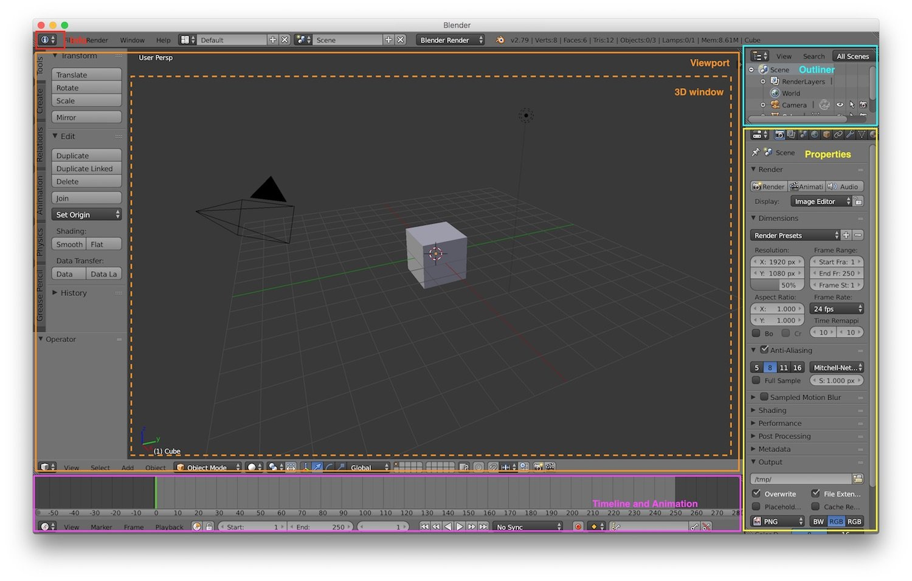
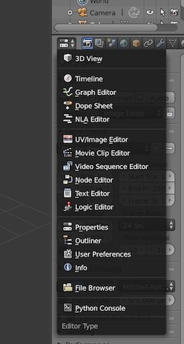
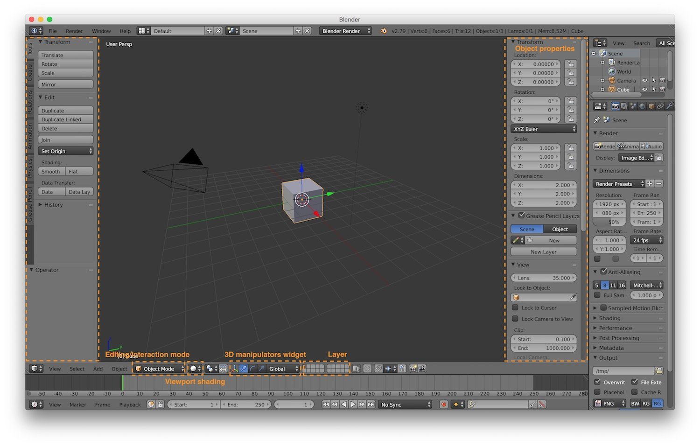

*In this new series of post I will talk about learning to use Blender, the famous 3D computer graphics software. A
series of tutorial for beginners/newbies (like me).*

---

If you like computer graphics, at some point during your studies you will want to learn to use a 3D content creation
software. That's why I started to study Blender, the most beautiful and famous open source 3D software available for
free in the market. In this series of posts I will guide you through its features with some tutorials and references
list. At the time of this writing the available version of Bender used for this tutorials is the 2.79. All the tutorials
are written using Blender on a MacBook Pro. Let's start from the user interface.

The default layout is composed of individual panels, and inside each one of them we can find an editor. The main editors
are:

* **info editor**, in the top left part of the screen. It contains the main menu of Blender. It contains also a layout
  switcher, to quickly change the layout of Blender based on our needs (animation, modeling...) and a renderer switcher,
  to select the renderer engine.
* **outliner editor**, it contains a list of all the objects in the scene.
* **properties editor**, it contains the properties of an object. It is context specific, so its content will change
  accordingly to the selected object. It contains also a lot of context specific tabs with specific properties for
  different context.
* **timeline and animation editor**, used to create and modify animation
* **viewport**, that contains the 3D window in which our scene is shown and where we can add, remove or modify objects.

We can switch a panel from one editor to another by clicking on the icon that shows the current editor selected: a list
with all the available editors will be shown and we can choose one of them.

On the left side of the viewport we can find a series of tabs that contain some operations, tools and actions we can
apply to the 3D window content. This tabs will change based on the fact that we selected or not an object and also based
on which type of object we selected. We can also show the object properties sub-panel by clicking the plus (+) button on
the right. That sub-panel gives us some information about the object we selected in the 3D window.  
At the bottom of the 3D window we can find the 3D manipulator widget, that allows us to scale, rotate and translate
object with the mouse drag.  
Then we have the layer switcher, that will let us create layered scene (we will talk about layers in a future post).  
We have also the viewport shading button, that let use choose the desired type of visualization we want for our scene:

* **bounding box**
* **wireframe**
* **solid**, that shows also colors of the objects
* **texture mode**, that shows also textures of the objects
* **materials**, that let us adds the materials to our objects
* **rendered**

Finally we have the editing interaction mode selector, that allow us to switch between editing mode:

* **object mode**, that allow us to deal with individual objects
* **edit mode**, that allow us to change the objects

The menus on the left of the editing mode selector will change accordingly to the mode selected.

To navigate in the 3D space, usually Blender require a 3 button mouse (we will see below how to emulate a 3 buttons
mouse). Anyway, as we're on a MacBook pro we can do the following basic operation with the "alternative" default
mapping:

* **orbit around** in the scene by *dragging with two fingers*
* **zoom in/out** in the scene with *pinch and zoom*
* **pan** in the scene with *shift + drag with two fingers*

There are also some other basic useful 3D navigation commands:

* align view to cursor and show all objects with *shift + "c"* (or alternatively in object mode *View -> Align View ->
  Center Cursor*)
* align view to one side with the options *Left, Right, Top, Bottom, Front, Back* contained in the *View menu*
* change between orthographic and perspective view with the menu option *View -> View Persp/Ortho*

You can change the user preferences by going to *File -> User Preferences*. Here you can modify settings for:

* **Interface**, so what Blender should show in the interface
* **Editing**, so how we edit objects
* **Input**, how mouse and keyboard are configured
* **Add-ons**, where you can manage plugins
* **Themes**, to change the color of the interface
* **File**, to configure standard paths
* **System**, for system specific settings

To be noted is the option "Emulate 3 Button mouse" in the input settings. This option let Blender emulates a 3 button
mouse using the Alt button. Int this way you can use this setting to use Blender with standard keys for mouse.  
That's enough first post. See you in the second tutorial about selecting and translating objects.
