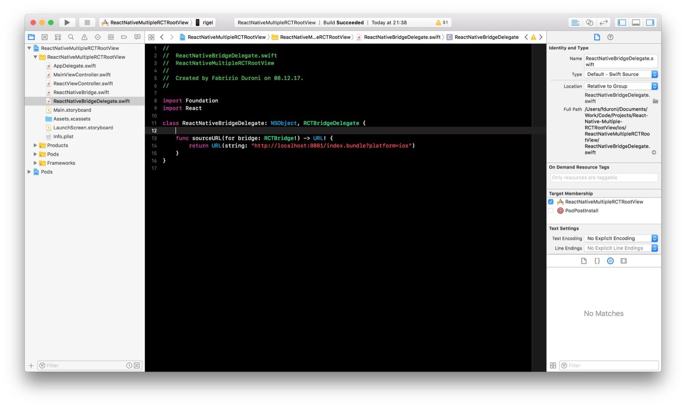
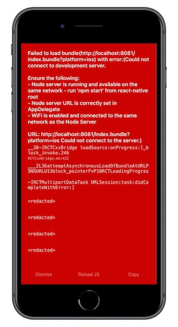
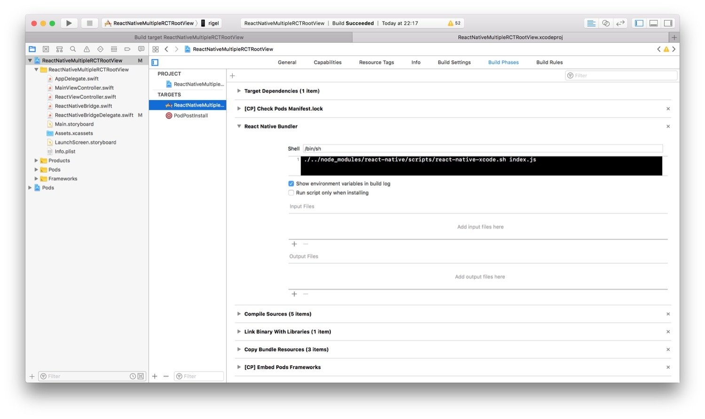
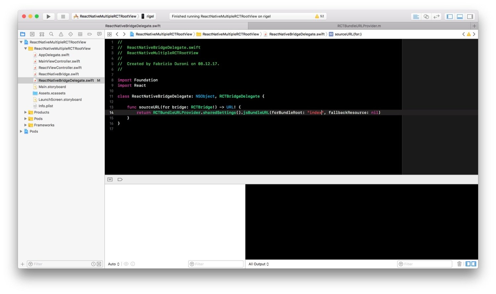
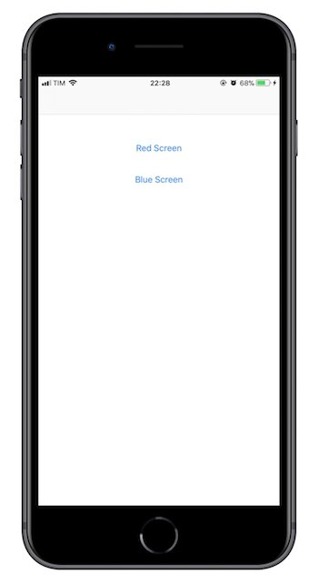
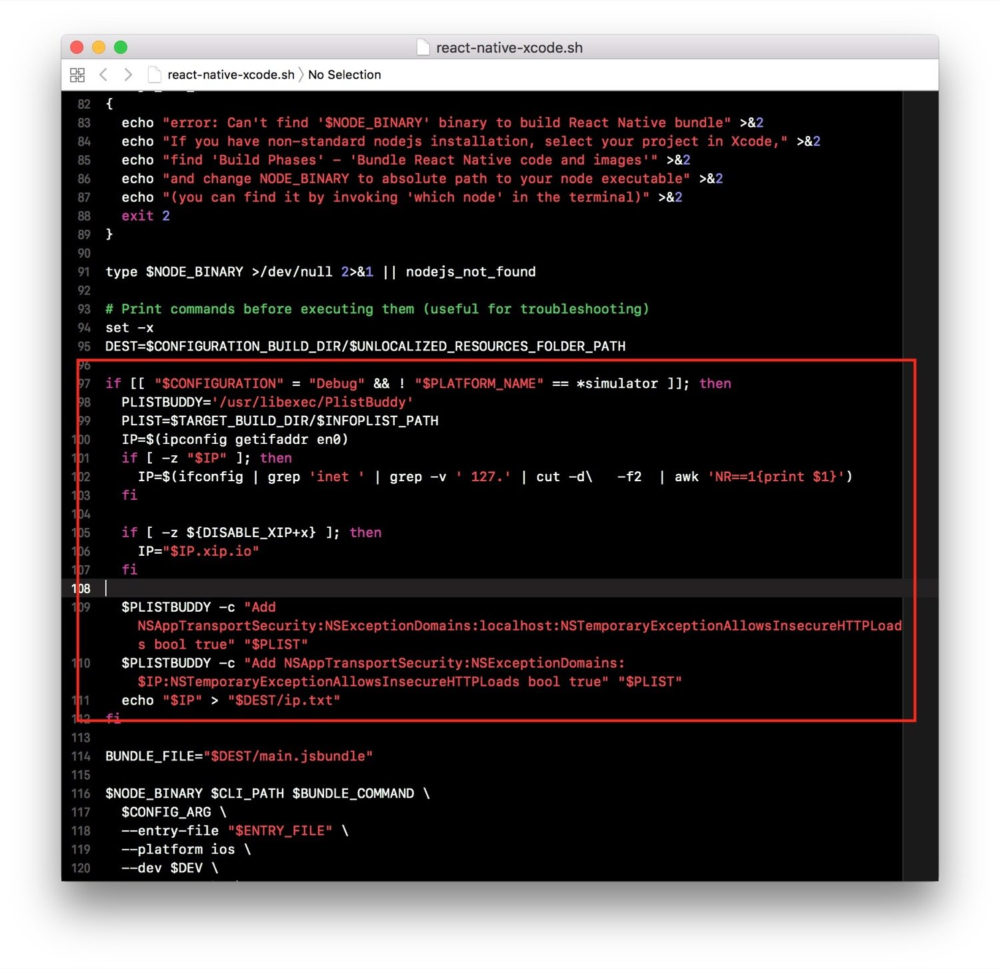
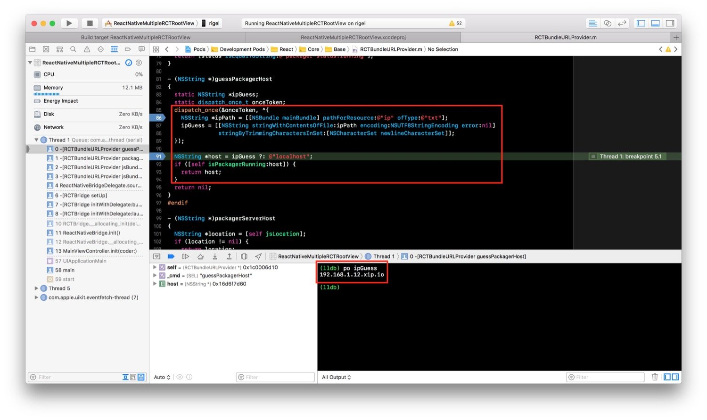
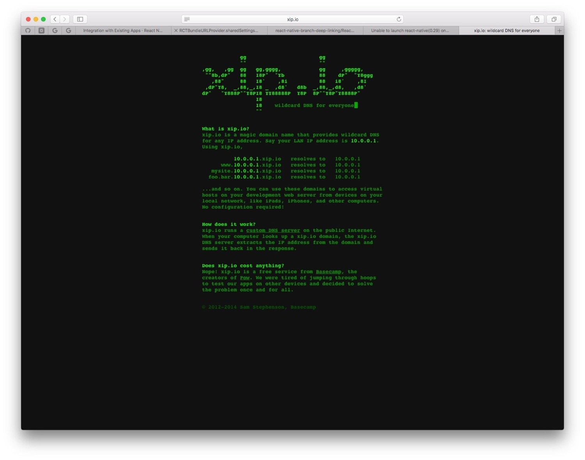

*Do you know how to debug your react native app on a iOS device?*

---

In the last few days I was working in pair programming with my
colleague [Mariano Patafio](https://www.linkedin.com/in/mariano-patafio-4a8b7426/ "Mariano Patafio") on some new
features for a React Native app. [Mariano](https://www.linkedin.com/in/mariano-patafio-4a8b7426/ "Mariano Patafio") is a
senior iOS and Android developer and a true ":apple: Apple fag :apple:" :laughing: (like me :
stuck_out_tongue_closed_eyes:). At some point during our pair session we wanted to test the app on a real iOS device.
The app we were working on was an existing iOS app in which we added some React Native views. If you follow the
instructions contained in the React Native doc about integrating it in an existing app, you will discover that with that
setup you will not be able to run your app on a real device from Xcode. It will work just in the simulator.  
In this post I will show you what we discovered: it is possible with the right setup to build, run and debug your React
Native app from Xcode. To do this I will use the React Native example app I used in
this [previous post I wrote about how to create multiple RCTRootView inside you existing app integrated with React Native](/2017/12/08/react-native-multiple-instance-rctrootview/ "react native multiple rctrootview")
. The app is very simple: it contains a main screen with 2 buttons that let the user open two different React Native
views. You can find this example with the implementation described below
in [this github repo](https://github.com/chicio/React-Native-Multiple-RCTRootView "React native multiple RCTRootView")
.  
Let's assume we start with the old implementation of the app described above, where we implemented a  
`ReactNativeBridgeDelegate` that returns the url of the index.bundle that contains our React Native code JS compiled.
This url was pointing to a localhost environment.

```swift
class ReactNativeBridge {
    let bridge: RCTBridge

    init() {
        bridge = RCTBridge(delegate: ReactNativeBridgeDelegate(), launchOptions: nil)
    }
}

class ReactNativeBridgeDelegate: NSObject, RCTBridgeDelegate {

    func sourceURL(for bridge: RCTBridge!) -> URL! {
        return URL(string: "http://localhost:8081/index.bundle?platform=ios")
    }
}
```



If we try to build this app on an iPhone, and we open one of the React Native screen we will receive the following
error (obviously based on the fact that we are trying to access localhost from the iPhone, and our React Native node
server is running on the MacBook Pro where we are building the app).



How can we build on a real device? First of all we need to add a new build phase to our project that let us run
the `React Native Xcode Bundler` before the real build. The `React Native Xcode Bundler` is a shell script with
name `react-native-xcode.sh` that you can find inside your react native npm package
under `<you app root folder.>/node_modules/react-native/scripts/`. This script must take as input our React Native
index.js.



Now we can change our `ReactNativeBridgeDelegate` implementation. Instead of returning an hard coded url, we use
the `RCTBundleURLProvider.sharedSettings().jsBundleURL(forBundleRoot: "index", fallbackResource: nil)` method. We need
to pass `"index"` as bundle root parameter (the name of the main js file).



Now we can try to build an run again the app on a real device. As you can see now everything works as expected.



What's happening under the hood? Which kind of "magic" are we using here :smirk:? If we start to debug from the call
to `RCTBundleURLProvider.sharedSettings().jsBundleURL(forBundleRoot: "index", fallbackResource: nil)` and we go inside
the React Native source code at some point we will see a call to a method named `guessPackagerHost`. In this method
there's a piece of code that tries to open and read the content of a file named `ip.txt` (this file is supposed to be in
the main bundle of the app). The string returned by this method is used as hostname in the url used by React Native to
call the packager we are running on our mac.  
Who did create this `ip.txt` file? Previously we added the execution of the `React Native Bundler` script as build
phase. If we look at the source code of this script you will find the following piece of code:



What?!?!?!?!?!? :satisfied: This piece of code basically creates a file named `ip.txt` that contains the IP address of
your computer, extracted using an `ifconfig` command, concatenated with the domain `xip.io`. So the file will contain a
string like the following one: `<your computer IP address>.xip.io`. This is the string returned by
the `guessPackagerHost` method. In the screenshot below you can find the source code of this method and the string that
it returns.



What is the `xip.io` string added after the IP address? [xip.io](http://xip.io/ "xip.io") is a public free DNS server
created at [basecamp](https://basecamp.com "basecamp"). Below you can find a quote from the homepage of the service:

> What is xip.io?
> xip.io is a magic domain name that provides wildcard DNS
> for any IP address. Say your LAN IP address is 10.0.0.1.
> Using xip.io,
>
>10.0.0.1.xip.io   resolves to   10.0.0.1
> www.10.0.0.1.xip.io   resolves to   10.0.0.1
> mysite.10.0.0.1.xip.io   resolves to   10.0.0.1
> foo.bar.10.0.0.1.xip.io   resolves to   10.0.0.1
>
>...and so on. You can use these domains to access virtual
> hosts on your development web server from devices on your
> local network, like iPads, iPhones, and other computers.
> No configuration required!
>
>How does it work? xip.io runs a custom DNS server on the public Internet. When your computer looks up a xip.io domain, the xip.io DNS server extracts the IP address from the domain and sends it back in the response.



This basically means that xip.io is a domain name we can use to access our local packager environment on our mac from
our iPhone and iPad, based on the fact that the devices are all on the same network. That's all, and as you can see
everything works "like magic" :relaxed:.  
