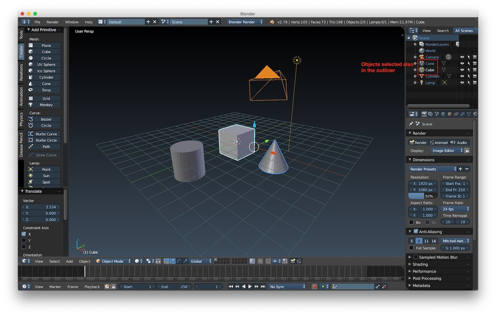
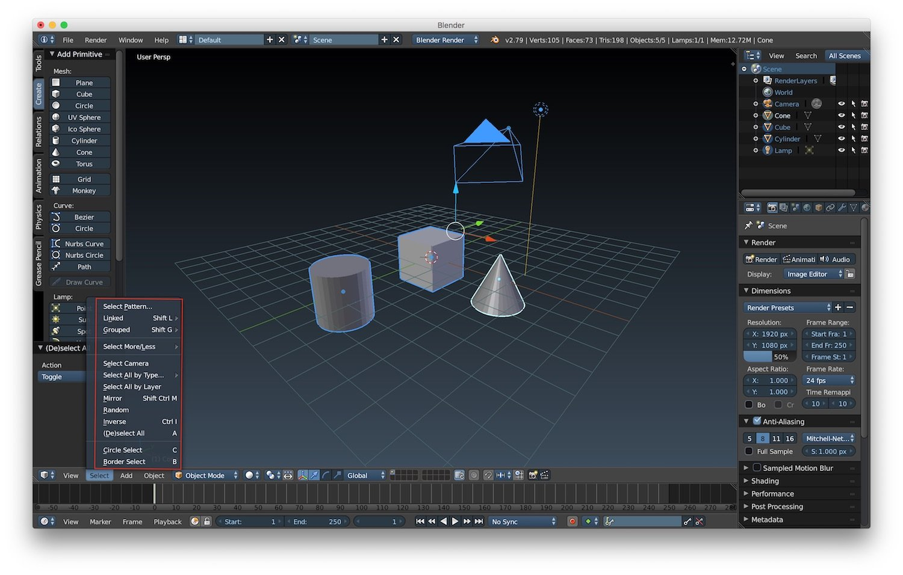
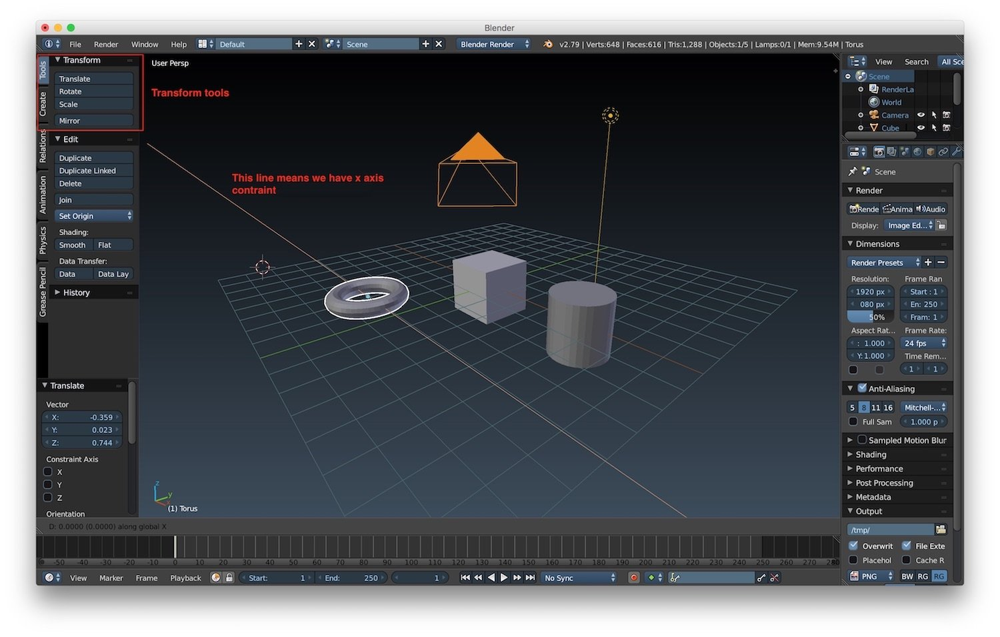
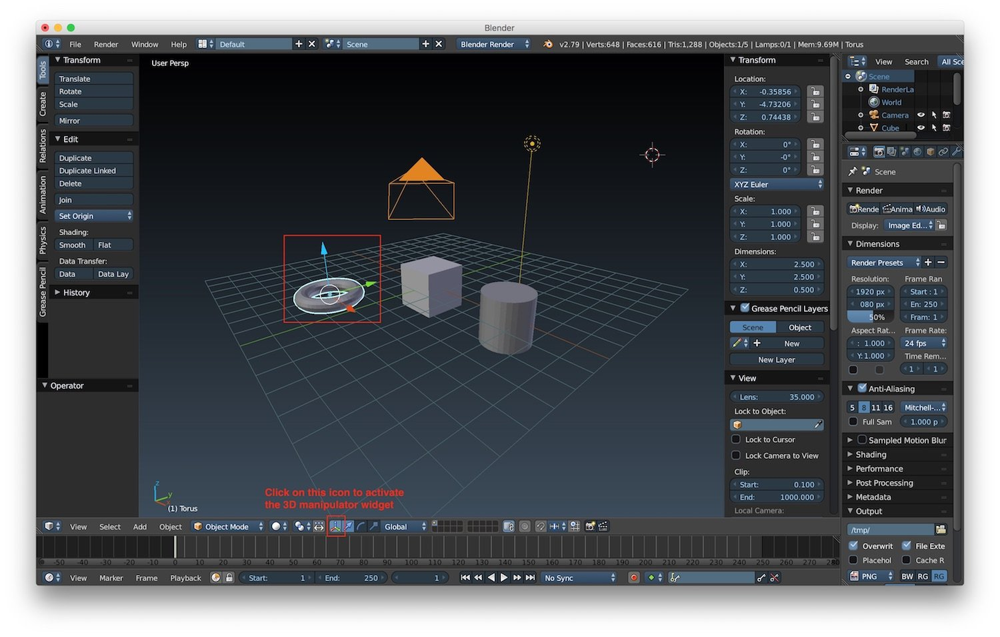
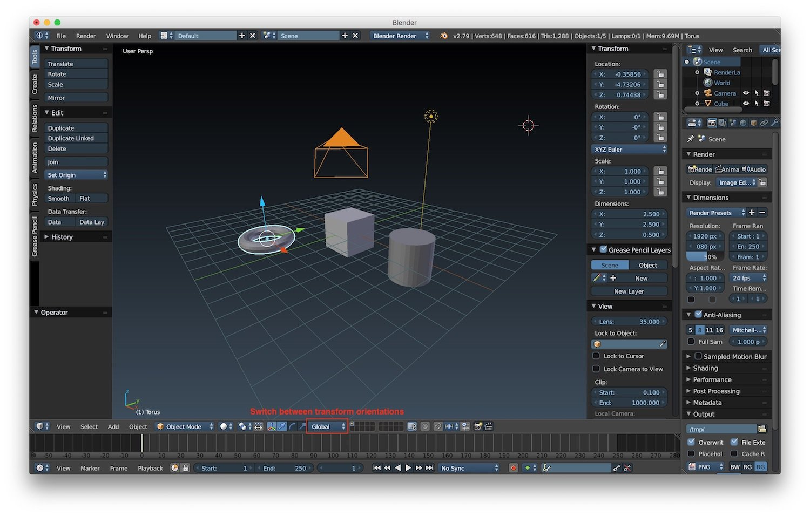
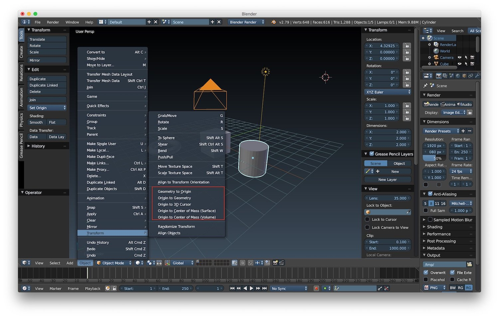
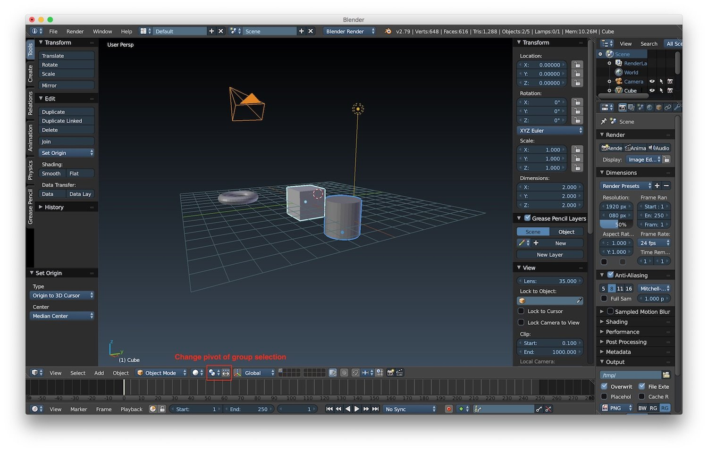

*Second post of the "Blender tutorial" series. This time we will learn how to select and move objects.*

---

In
the [first post of the "Blender tutorial" series](/2018/01/31/blender-tutorial-1-user-interface/ "Blender tutorial:user interface")
we learned how the user interface is composed and the most important commands to navigate inside a scene. This time we
will be focus on selecting and moving objects inside the 3D view.  
We can **select an object** by using the *right button of your mouse*. If you're on the MacBook like me, the right mouse
is emulated in some ways (my personal preferences is to use two fingers to emulate a right click). To *select multiple
objects* we can hold the *shift button and select with a right click the objects* we want. The objects that we will
select will be marked in the outliner editor, with a little circle, and in the 3D view with a little border. The color
of the border will change based on the theme you selected. In the screenshot below we can see that I selected 2 of the 3
objects in the scene. If we have multiple objects selected, the last one will have a different border. In my case the
cube is the last object selected.

To deselect an object we can just right click on it again. We can also **select all the objects** in a scene, including
cameras and lights, by pressing the *"a" key*.  
There's also a select menu that gives us more control over the selections we can do. In particular, we have the **Circle
select**, that lets us select objects based on a circle pattern of selection, and the **Border select**, that lets us
select objects based on a squared pattern of selection. There are also other option to select random objects or invert
the current selection.

To **translate objects**, we can use the transform tools. We can find them under *Tools -> Transform*. As a consequence
of the fact that we are trying to translate an object in 3D space using the mouse pointer that works in 2D space, it is
difficult to understand in which direction we are doing our translation. We can **constraint the move** to just one axis
by pressing:

* *"x" key* for the x axis
* *"y" key* for the y axis
* *"z" key* for the z axis

There's also the possibility to move an object with discrete values by using its location properties panel under the
properties editor or using the object properties panel in the 3D window. Finally we can move objects using also the 3D
manipulator widget in the 3D window. We can activate it by pressing on its icon. After that when you select and object
you will see three axes. Drag one of them to translate the object in that direction.

We can rotate and scaling an object using the same tools we used for the translation:

* the transformation tools
* the 3D manipulator widget

One important thing to consider when we are working with transformation is the transform orientation. This option
defines the orientation of the transform operation. This is very important because it influences the final result of the
transform operation. You can change the transform orientation in the 3D manipulator widget.

The 3D manipulator widget will place the start of the **transform based on the origin of an objects**. We can **change
it** by selecting one of the option under Object -> Transform in object mode:

* *Geometry to origin*
* *Origin to geometry*
* *Origin to 3D cursor*
* *Origin to Center of mass (surface)*
* *Origin to center of mass (volume)*

When we want to transform a group of objects at once we have a number of options to change the pivot point of the
selection. We can choose it by selecting one of the option available from the list near the 3D transform manipulator
widget.

That's all for selection and transform of objects. In the next post we will start to explore the art of modeling in
Blender.
