*In this post I will talk about code review: what it is and why it matters.*

---

In some of my previous posts (for example [in this one](/2017/09/11/clean-code-meaningful-names/ "clean code meaningful names")), I talked about my
new experience at [lastminute.com group](https://lmgroup.lastminute.com/ "lastminute.com group") and how much we care
about code quality. In fact I already talked about the fact that we
do [pair programming during our daily job](/2018/01/16/ide-refactoring-android-studio-xcode-appcode-webstorm-jetbrains/ "pair programming")
. But pair programming is not the only techniques we use to be sure that our software matches high code quality
standard :sunglasses:. One of the most important procedure I use during my daily job with my colleagues is code review.
What is it? Let's see a standard definition from [wikipedia](https://en.wikipedia.org/wiki/Code_review "code review"):

> A code review is a process where two or more developers visually inspect a set of program code, typically, several times. The code can be a method, a class, or an entire program. The main code-review objectives are:
>
>* Best Practice: a more efficient, less error-prone, or more elegant way to accomplish a given task.
>* Error Detection: discovering logical or transitional errors.
>* Vulnerability Exposure: identifying and averting common vulnerabilities like Cross-Site Scripting, Injection, Buffer Overflow, Excessive Disclosure, etc.
>* Malware Discovery ~ This often-overlooked and very special code-review objective looks for segments of code that appear extraneous, questionable, or flat-out weird. The intent is to discover back doors, Trojans, and time bombs.
>
>In today’s world malevolent code is a very real threat and should not be overlooked, especially by Government agencies.

The definition is simple and clear. Basically you go through the code of another guy (or from a couple if they are doing
pair programming) to find errors, bugs, code style/best practice not compliant to the team set of rules.  
Three weeks ago I attended a coding dojo with my
colleagues [Angelo Sciarra](https://www.linkedin.com/in/angelosciarra/ "Angelo Sciarra"). Angelo is a senior full-stack
software engineer with many years of experience. You may wonder now what is also a coding dojo. So again, here we are
with another [definition](http://codingdojo.org/WhatIsCodingDojo/ "coding dojo") :bowtie::

> A Coding Dojo is a meeting where a bunch of coders get together to work on a programming challenge. They have fun and they engage in order to improve their skills.

During the dojo that I attended with Angelo we tried to resolve
the [Minesweeper problem](http://codingdojo.org/kata/Minesweeper/ "Minesweeper"). Basically we had to write an automatic
Minesweeper resolver (do you remember the Windows game? :heart_eyes:). At the end of the dojo we didn't complete the
task, so I decided to try to solve it in another way. I developed a complete command line version of a Minesweeper
resolver and let Angelo do the code review of my implementation. In this way I can show you the power of code review :
neckbeard: (and last but not least how much meticulous is Angelo during his code review :cold_sweat::sweat_smile::
cupid:).  
You can find the final version of the minesweeper after the code review
in [this github repository](https://github.com/chicio/Katas/tree/master/minesweeper/java-minesweeper).  
To facilitate you in the navigation of the two different implementations I created
two [class diagram](https://en.wikipedia.org/wiki/Class_diagram "class diagram"): one that describe my implementation
before the code review, and the second one that shows the final result after Angelo's code review. The following one
describes my implementation of the minesweeper.

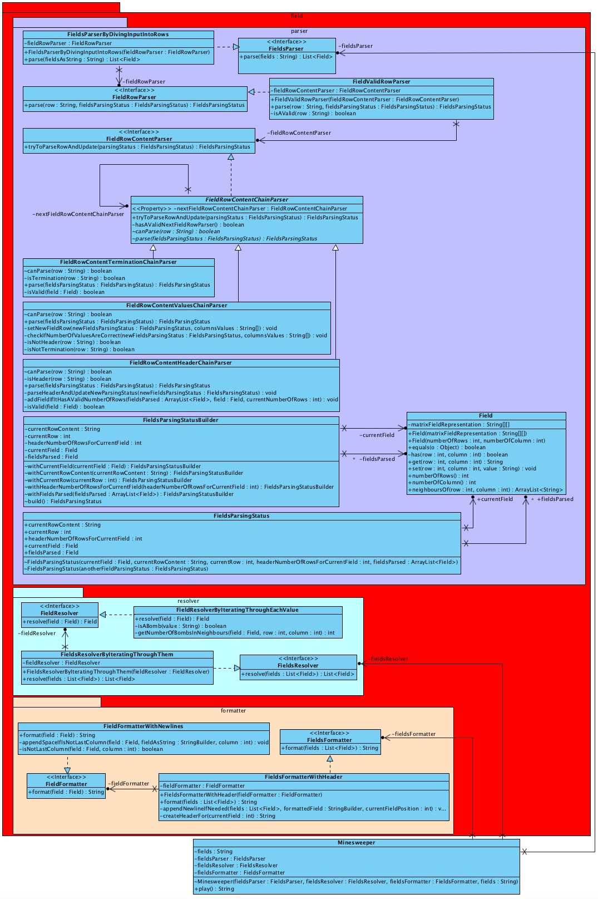

This one describes Angelo's implementation.

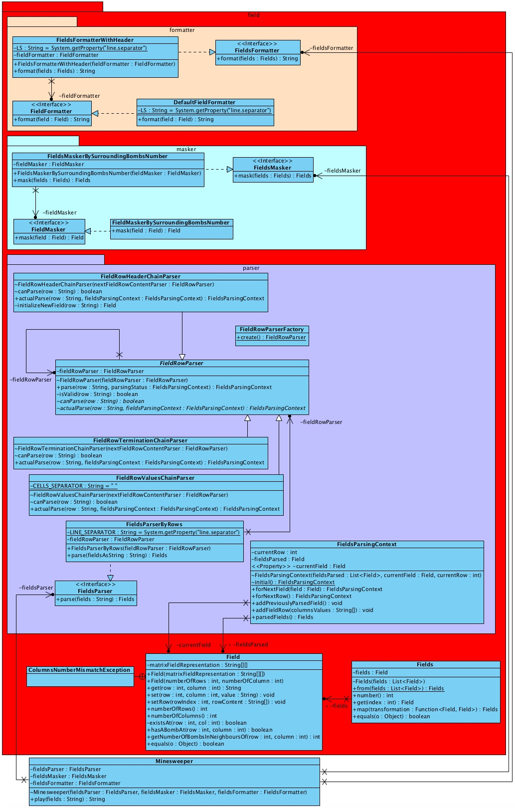

So let's start to see which kind of observation I received from Angelo, that basically include most of the observation
you could receive during a code review. The first observation I received from Angelo is about the java JDK version I
used for my project. I did the setup of the project using JDK 1.5 instead of JDK 1.8 (as you may know, this is a more
recent version). In general it is common to receive suggestion about technology specific problems/setup/changes,
especially if your code reviewer is more experienced than you on that type of technology.

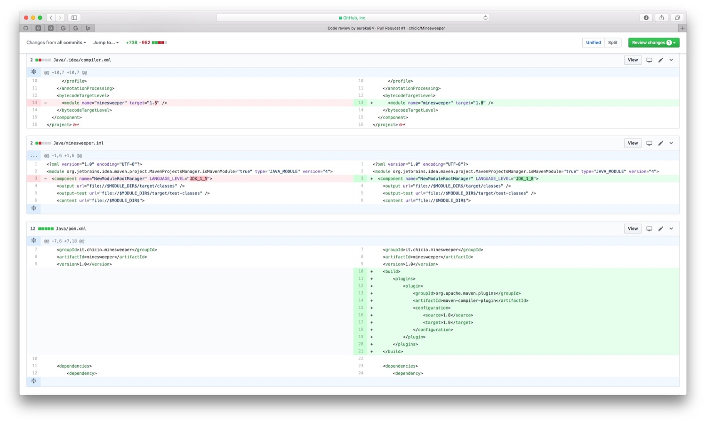

In fact Angelo gave me another technology advice during his review. He suggested to change some pieces of code with
others that leverage the power of functional programming. This is really interesting because it is easy imagine how much
knowledge you can absorb from the experience of your code reviewer.

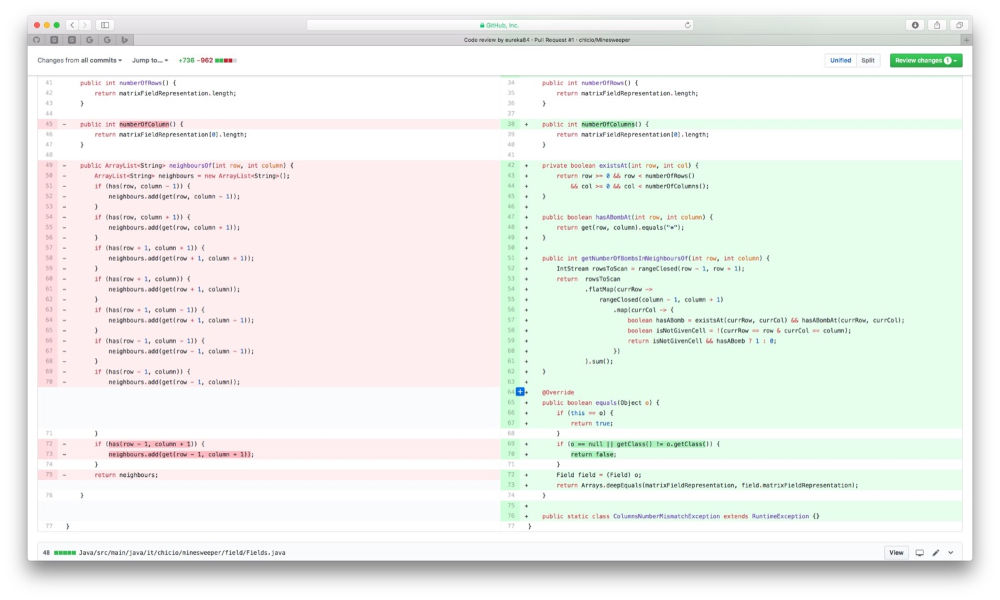

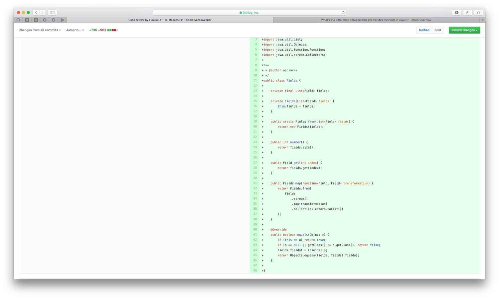

Another important aspect that is one of the main subject of the code review is software design. In fact Angelo
discovered a series of improvement and refactoring opportunities in my code:

* the `Minesweeper` class doesn't need to receive the fields input at construction time but directly in the `play()`
  method. In this way the `Minesweeper` class becomes a stateless object, and the same instance could be used to
  resolve/unmask multiple fields input.

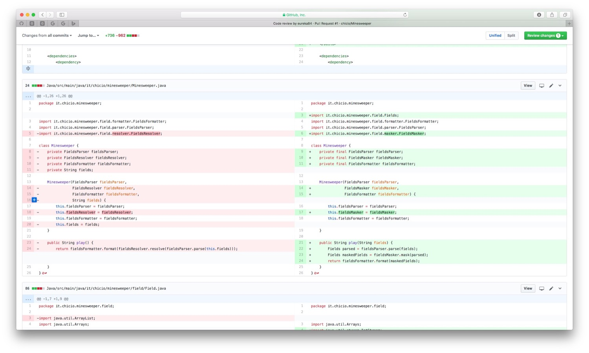

* The objects that are the building block of
  a [chain of responsibility](https://en.wikipedia.org/wiki/Chain-of-responsibility_pattern "chain of responsability")
  named `FieldRowParser` could become lighter and some of their responsibility could be assigned to some new
  collaborators. Also the object that contains the parsing status could become more lighter.

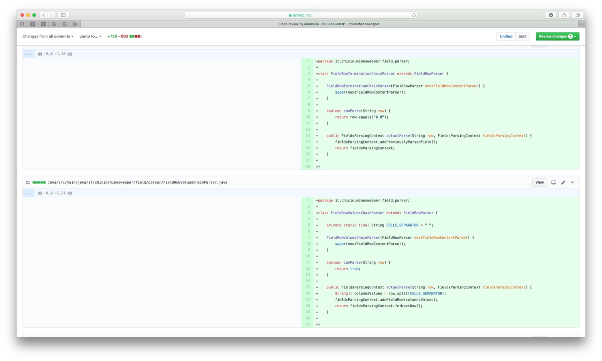

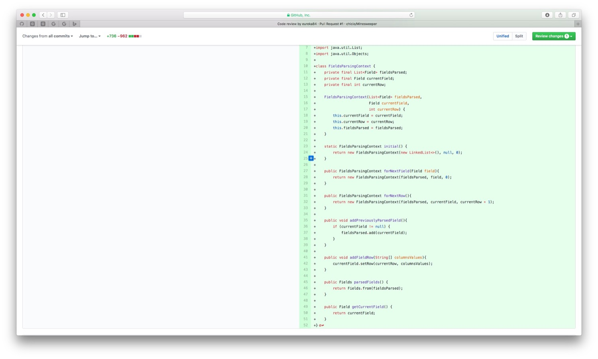

As you can see from these kind of comments the code review could really improve the general architectural design of your
application :heart_eyes::relieved:. Code convention are another important thing to check during code review. For example
Angelo told me to move all the constants at the beginning of some of the classes. Usually tools like Github or Gitlab
let you discuss your code review by adding comments directly to the code.

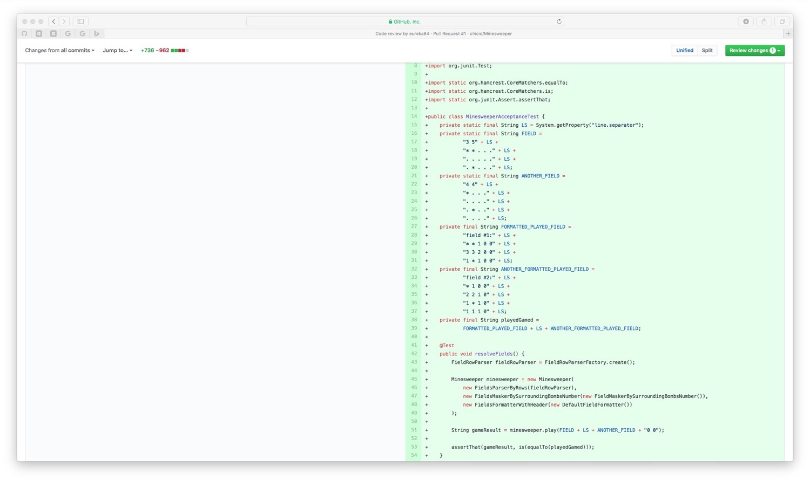

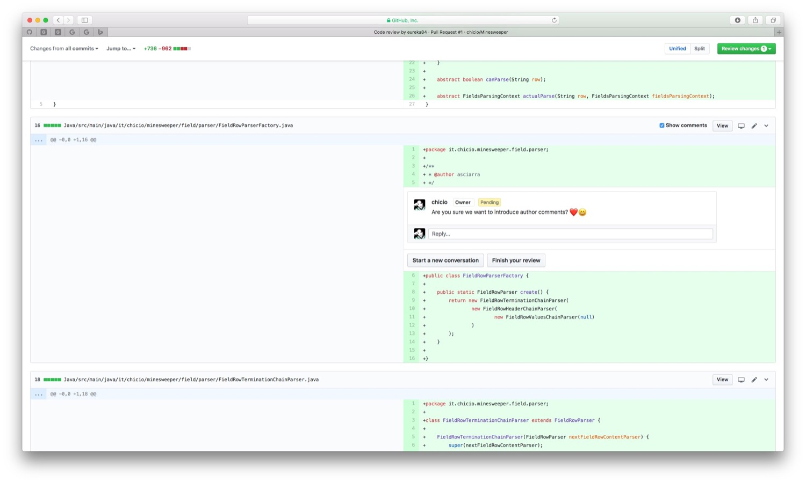

Last but not least, if you are a real fan of clean code, you know
that [meaningful names are important](/2017/09/11/clean-code-meaningful-names/ "clean code meaningful names"). So
you can suggest some more meaningful name for a class, variable or method.

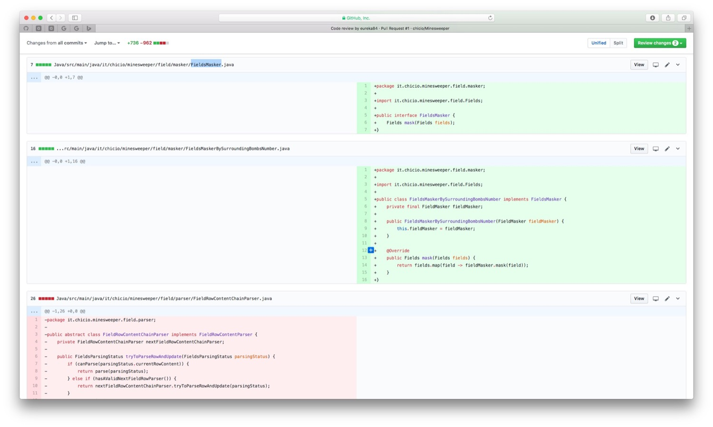

That's all for code review. I hope you understood how much important it is to do it and how much your codebase can
improve if you use code review as a validation tool and as a tool to find new refactoring opportunities (anyway, I hope
Angelo will never be your reviewer :laughing::sparkling_heart:).
