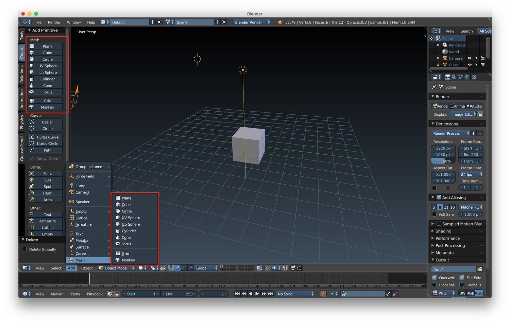
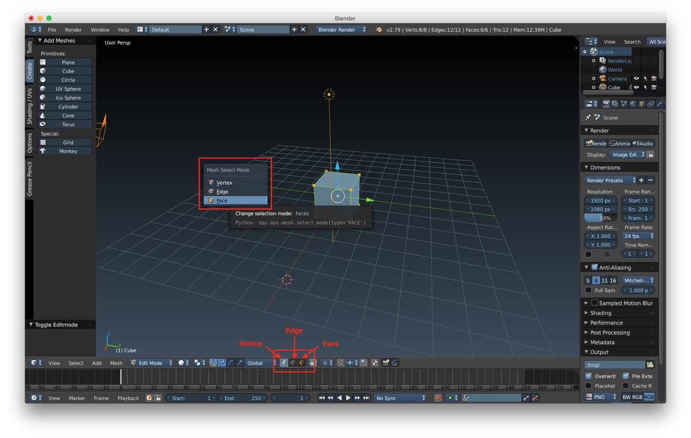
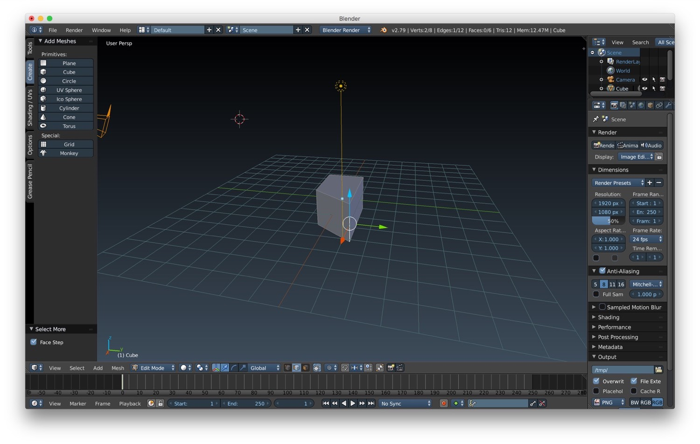
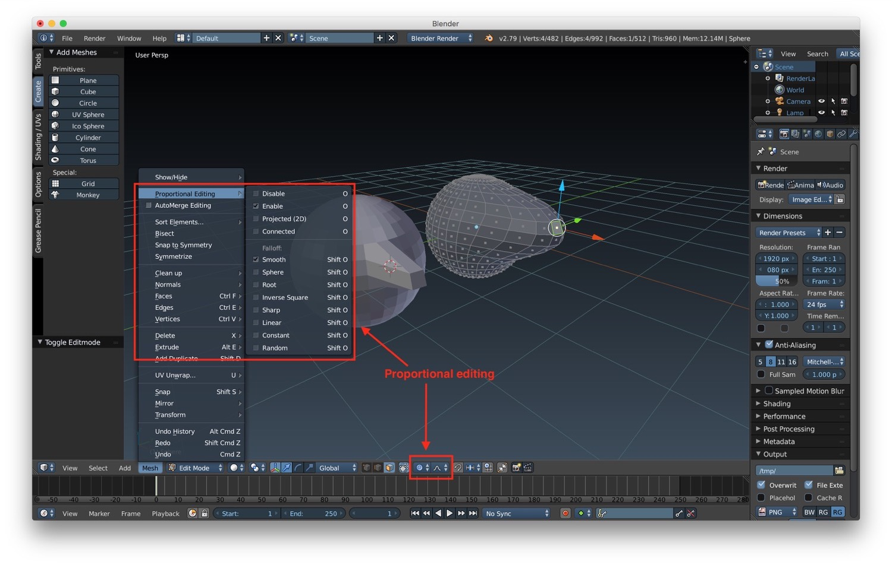
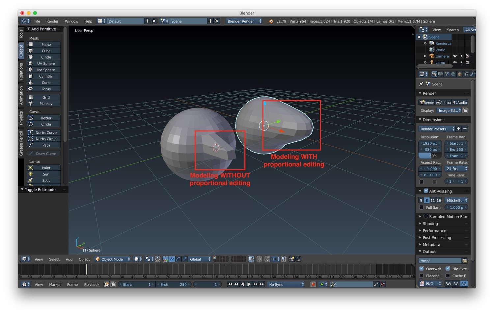

*In this new post of the Blender tutorial series I will talk about the fundamental of modeling in Blender.*

---

In the [previous post of the "Blender tutorial" series](/2018/02/17/blender-tutorial-2-selecting-transforming-objects/ "Blender tutorial: selecting and transforming objects")
we talked about how we can select and transforms objects. In this new post thing will start to get more interesting: we
will start to talk about modeling. First of all let's see which kind of primitives mesh we can create with blender.  
We can start by opening a new file and **removing** the default cube mesh by selecting it and pressing the *"x" key*.
Now we are ready to **add new primitive meshes**. We can do it in two ways:

* from the *Tools -> Create* menu in the 3D window
* from the *Add -> Mesh menu* at the bottom of the 3D window, when we are in object or edit mode

Blender support a series of basic primitives, from which we can start modeling more complex meshes:

* *plane*
* *cube*
* *circle*
* *UV sphere*
* *ico sphere*
* *cylinder*
* *cone*
* *torus*

When we choose a primitive mesh to be created, it will be placed where the 3D cursor is pointing at the moment of
creation. After the creation of the mesh, a new panel at the bottom left of the 3D window will be shown. In this panel
we can customize the properties of the mesh.

As we said before, we can start from a primitive mesh and model a more complex one. So the first thing we need to learn
is how we can **select vertices, edges and faces**. How can we do that? First, we need to choose *edit mode*, by
selecting the mesh and by choosing it from the editing/interaction mode menu component in the 3D window (or alternately
by pressing the *"tab" key*). After that, we can choose the selection mode between vertices, edge or faces in the bottom
bar of the 3D window or by pressing *"ctrl + tab" keys*.

After selecting the edges, vertices or faces that we want to modify, 3D axis will be shown near your selection. They are
similar to the ones shown for transformations. By *dragging one of these axes* the selected vertices, edges or faces
will move accordingly to the direction of the dragging.  
We can improve the selection of edges by pressing *"ctrl + alt + right click" keys* while we are in edge selection mode:
in this way we will be able to **select edges loops**, a series of connected closed edges series. We can also improve
the selection by using the more/less option to select entire levels of edges/vertices/faces.

By selecting individual edges, vertices and faces you can start modeling you meshes. Anyway, sometimes you will need to
be able to do a more soft modeling than the one we already described above in this article (for example while working on
organic objects. This is why it is possible to use the *proportional editing*. When we use this kind of modeling, the
modification on a vertices/edge/face will influence the other element around with a proportional falloff. You can
activate the proportional editing using the menu *Mesh -> Proportional Editing* in *edit mode* or using the dedicated
button in the bottom bar of the 3D window.

Below you can find an example of two meshes modified with and without the proportional editing enable. It's easy to see
the difference.

In the next post we will continue to talk about the fundamental of modeling.
