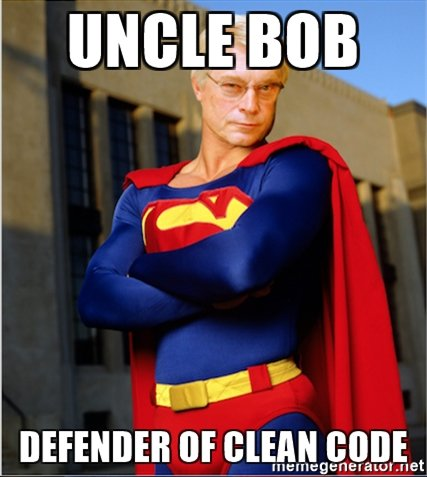

In this post I will talk about clean code: data structures, objects vs procedural and the law of demeter.

---

In this [previous post](/2017/09/11/clean-code-meaningful-names/ "clean code meaningful names") I described what
Clean Code is and what does it mean to use meaningful names in your code. This time I will talk about *Data structures
and objects*. But wait, do we really know the definition of them? Let's see
what [Uncle Bob](https://en.wikipedia.org/wiki/Robert_Cecil_Martin "Robert Cecil Martin") says about them in its *Clean
Code* book:

> Objects hide their data behind abstractions and expose functions that operate on that data. Data structures expose their data and have no meaningful functions.

It's easy to see that they are opposites. A lot of programmers are convinced of the fact that in software development
everything should be an object. If you think about the nature of objects you will see that *there are times where you
just want simple plain data structures that you can manipulate in a procedural way*. This is a consequence of the fact
that adding new functions to an object may require much more work, because maybe you need to modify all the objects of
the same type to add a new function. This give us the following definitions, stated
by [Uncle Bob](https://en.wikipedia.org/wiki/Robert_Cecil_Martin
"Robert Cecil Martin") in its *Clean Code* book:

> Procedural code (code using data structures) makes it easy to add new functions without changing the existing data structures. Object oriented code, on the other hand, makes it easy to add new classes without changing existing functions.  
Procedural code makes it hard to add new data structures because all the functions must change. Object oriented code makes it hard to add new functions because all the classes must change.

This set of rules must guide us when we have to choose between objects vs procedural implementation:

* do you expect to add more and more functions to your code, and keep unmodified the data structures you use? Ok, let's
  go with procedural code :relaxed:.
* do you expect to add new types without adding new functions to your code? Well, use objects :bowtie:.

Related to the object oriented programming, Uncle Bob talks about the **law of demeter** that says a
**module should not know about innards of the objects it manipulates**. The focus of this law is to improve the
decoupling of objects. More precisely its definition is:

> A method *f* of a class *C* should only call the methods of these:
>
> * *C*
> * an object created by *f*
> * an object passed as argument to *f*
> * an object held in a instance variable of *C*

This bring us to talk about what is called *train wreck*: concatenation of function/properties calls. The difference
between objects and data structures gives us a clear understand of when a train wreck is really dangerous:

* **if in a method you're working with data structures, law of demeter is not applied to them because is natural for a
  data structure to expose their internal structure.**
* **if in a method you're working with objects, then you should consider concatenation of method calls as violation of
  the law of demeter**

The next time you will write a piece of code try to consider these concepts and how they can improve your code.

