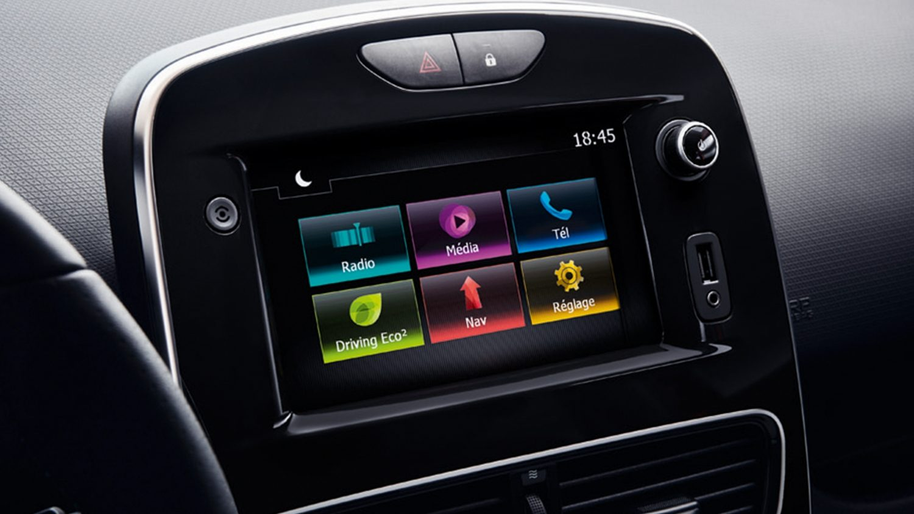
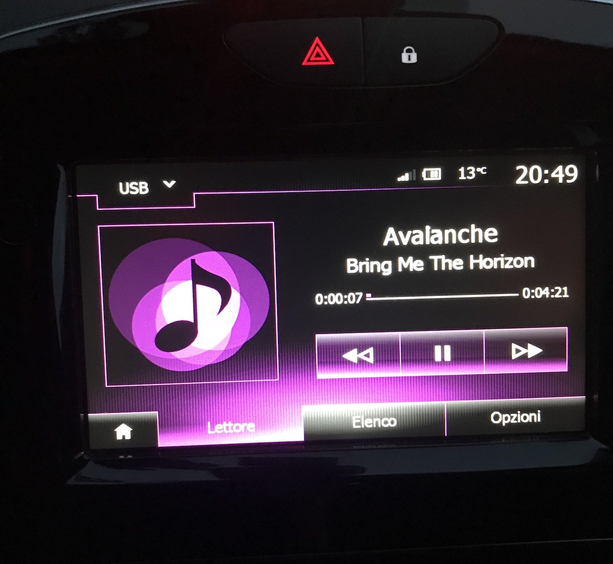
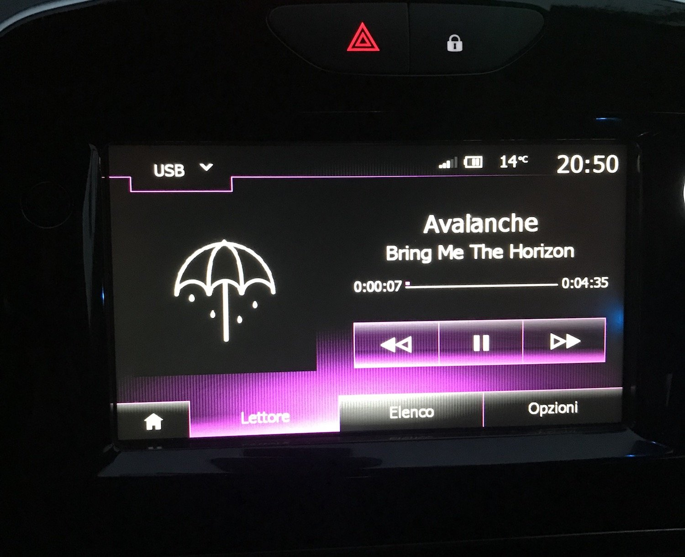
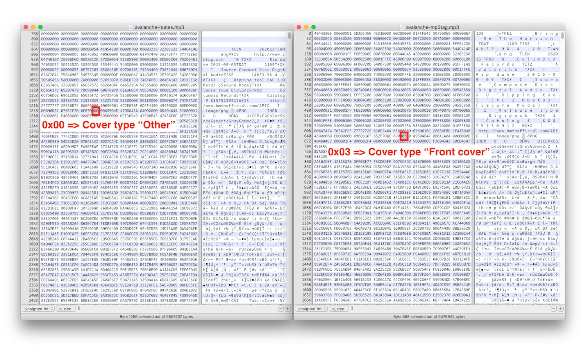
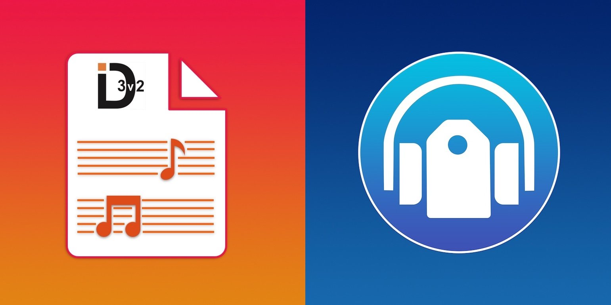

*The first of a short series of post in which I describe my two latest project: ID3TagEditor and Mp3ID3Tagger. In this
post I will talk about why I started to develop them.*

---

Recently I bought a new car. After a lot of searches I finally decided to buy the Renault Clio 2017 1.5 dci. I love this
car. It has been a big step forward on my previous car. One of its most interesting feature is its media entertainment
system:
the [Media Nav Evolution system](https://www.renault.co.uk/renault-easy-connect/media-nav-evolution.html#fonctionnalites "Media Nav Evolution")
. This system has a 7'' touchscreen with map integration and a basic smartphone integration with Siri voice recognition
and phone call support.

One of the thing that caught my attention was the possibility to start to listen to my mp3 collection while I'm
driving (on my previous car I had a standard cd player). So I prepared an usb key with some of my mp3 and I started to
listen to them. I suddenly made a great discovery: some of my songs were displayed on the touchscreen with information
about the album and they were displaying the cover of the album!!!!! :heart_eyes:. I though: "Whoah this is very cool!!
I need to start to fill my mp3 with all this information. I want to see the cover of the album for each mp3 I
have!!!!!!!". This is exactly the moment where my journey into the development of ID3TagEditor and Mp3ID3Tagger started,
but I was not yet aware of it :grin:. So I sat in front of my MacBook, I opened iTunes and I started to tag my mp3
files. I saved them on a usb key and I went to my car to test them. The result was the following:

What the hell is going on??!!?! :angry: The title and the album where displayed but the cover was not show on the
screen. So I got back to my desk and I started to download some native macOS app that let the user edit what I
discovered was called *ID3 tag*. None of them worked as expected. Then I found an app called Mp3Tag. This is Windows
application that runs also on macOS using Wine. So I downloaded it and tried to tag some mp3. I put them on a usb key
and then...

Mp3Tag was working as expected :relieved:. But then I started to ask myself: "What is doing Mp3Tag that the other native
macOS application are not doing?". The only way to discover the reason behind this mystery was to compare an mp3 tagged
with Mp3Tag with an mp3 tagged with one of the other applications. So I opened with my favourite hex
editor [HexFiend](https://ridiculousfish.com/hexfiend/ "an hex editor") an mp3 tagged with iTunes and another one tagged
with Mp3Tag and I compared them...

Yep, a single byte could make a big difference :open_mouth:. The fact is that
the [ID3 standard](http://id3.org/d3v2.3.0 "ID3 standard") accept multiple types of attached picture for an mp3: front
cover, back cover, icon, artist photo etc. The type of picture is represented as a byte just after the MIME type in the
attached picture frame of the ID3 standard. The problem is that iTunes and other "mp3 tagger" native macOS applications
don't let the user modify the type of the attached picture. All this application set the byte to `0x00` that in the ID3
standard corresponds to the *"Other"* cover type. But the Media Nav Evolution system of my Renault Clio is able to read
only attached picture frames inserted in the tag with a specific type, for example `0x03` *"Cover (Front)"*, that is the
default type inserted by Mp3Tag. The attached picture frames that have the `0x00` *"Other"* type are discarded :
unamused:. My next question was: "How is it possible that there's not a **native macOS** app? There are only cross
platform/web solution. I want an app that a real Apple fag would be happy to use...":apple::stuck_out_tongue:. Honestly,
I didn't find it. So I started to think: "I could develop this app, using some modern framework/programming paradigm I
studied in the last months...In this way I have a chance to create my first macOS app and add some other interesting
projects to my [Github profile](https://github.com/chicio/ "chicio github"). Here we are after two months of work with
the public release of:

* `ID3TagEditor`, a pure Swift framework (only Apple `Foundation` framework dependencies) to read/modify ID3 tag of your
  mp3 files with support for the entire Apple ecosystem (macOS, iOS, watchOS) and Linux :heart_eyes:
* `Mp3ID3Tagger`, a native macOS app written in Swift using the reactive programming paradigm and in particular its Rx (
  Reactive Extensions) variant with the frameworks RxSwift and RxCocoa (Rx????!?!?!? WHAT?!?!?!? :cold_sweat:).

If you are still interested in knowing the details about the development of this two projects, you can follow the links
below:

* [ID3TagEditor: a Swift framework to read and write ID3 tag of your mp3 files for macOS, iOS, tvOS and watchOS](/2018/05/08/id3tageditor-swift-read-write-id3-tag-mp3/ "id3 tag swift")
* [Mp3ID3Tagger: a native macOS app to edit the ID3 tag of your mp3 files written using RxSwift and RxCocoa](/2018/05/09/mp3id3tagger-macos-tag-mp3-id3-rxswift-rxcocoa/ "mp3 tag macos rxswift rxcocoa")

I hope you will see how much love and passion I put into this projects and I also hope you will find all the technical
details inside them interesting :sparkling_heart:.
