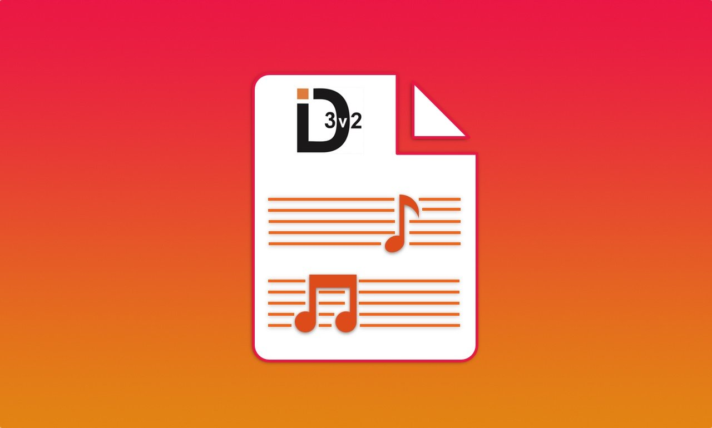
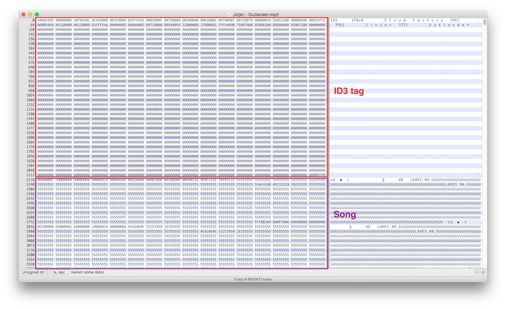
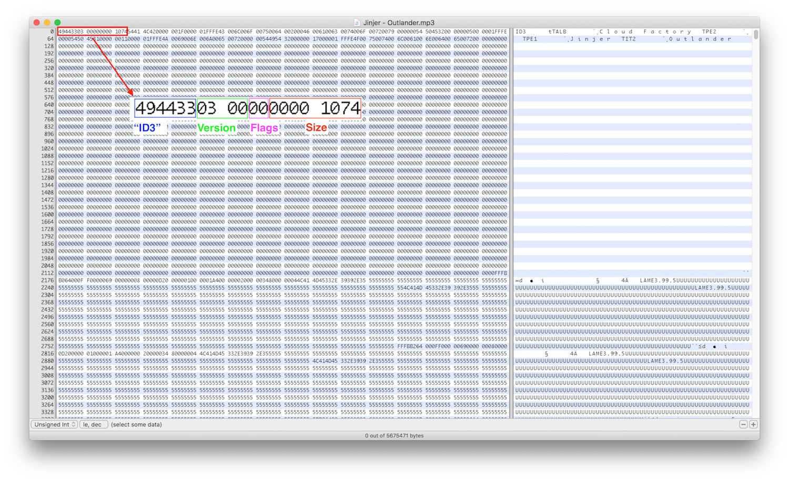
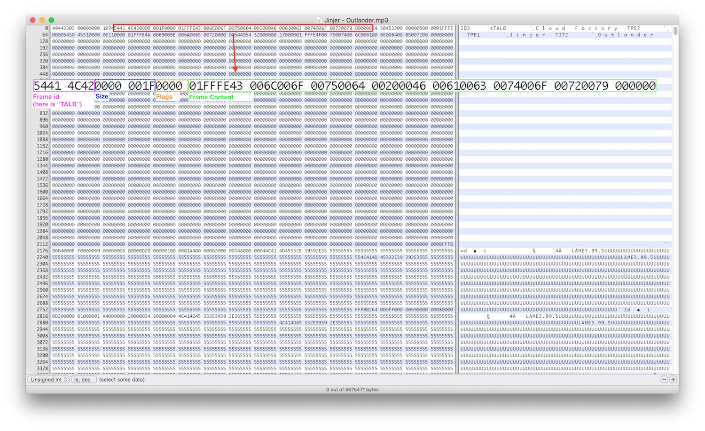

*The second of a short series of posts in which I describe my two latest projects: ID3TagEditor and Mp3ID3Tagger. In
this post I will describe how I created ID3TagEditor.*

---

In [this previous post](/2018/05/07/born-id3tageditor-mp3id3tagger/ "born id3tageditor mp3id3tagger") I described
the reason why I
developed [ID3TagEditor](https://github.com/chicio/ID3TagEditor "id3 tag editor swift ios macOS tvOS watchOS linux"), a
swift library to edit ID3 tag of mp3 files with support for macOS, iOS, watchOS and tvOS. In this post I will described
how I developed it. Below you can find the library logo.



But before going deeper in the details of ID3TagEditor it useful to know how the ID3 tag standard works (you can find
the full reference on the [official site](http://id3.org/ "id3 standard")). The definition reported on it for the ID3
standard is:

> An ID3 tag is a data container within an MP3 audio file stored in a prescribed format

This definition means that an ID3 tag is basically a chunk of information stored at the beginning of an mp3 file. The
standard defines the format that any developer can use to read and write this information. Let's see an example of an
ID3 tag using a hex editor.



A tag is composed of a header and a series of frames. The tag header has a size of 10 bytes contains the following
information (for both v2 and v3):

* ID3 tag file identifier, 3 bytes, usually represented as "ID3"
* tag version, 2 bytes, a couple of number that represent the major version and the revision version (e.g. `0x03 0x00`)
* flags, 1 bytes, contains three configurations flags represented as `%abc00000` (bit to 1)
* size, 4 bytes. Quoting the ID3 standard the size is:

> the size of the complete tag after unsychronisation, including padding, excluding the header but not excluding the extended header. The ID3v2 tag size is encoded with four bytes where the most significant bit (bit 7) is set to zero in every byte, making a total of 28 bits. The zeroed bits are ignored, so a 257 bytes long tag is represented as $00 00 02 01. .... Only 28 bits(representing up to 256MB) are used in the size description...



A frame is composed of an header and a custom content. The frame header contains the following information, that change
in size between versions:

* frame id, 3 bytes in version 2 and 4 bytes in version 3
* size, 3 bytes in version 2 and 4 bytes in version 3 that the describe the total size of the frame excluding the header
* option flags, 2 bytes available only in version 3

So the frame header size is 10 bytes in version 3 and 6 bytes in version 2. After the header there is the custom
specific frame flags/options and the frame content. Below you can find an example of a frame in a version 3 tag.



Last but not least at the end of the ID3 tag there are also 2 KB of offset (you can see it in the previous images, that
series of endless `0x00` at the end of the tag :relieved:). How does ID3TagEditor read and write all this information?
The main api of the framework are two simple methods:

```swift
/**
 Read the ID3 tag contained in the mp3 file.

 - parameter path: path of the mp3 file to be parsed.

 - throws: Could throw `InvalidFileFormat` if an mp3 file doesn't exists at the specified path.

 - returns: an ID3 tag or nil, if a tag doesn't exists in the file.
 */
public func read(from path: String) throws -> ID3Tag?

/**
 Writes the mp3 to a new file or overwrite it with the new ID3 tag.

 - parameter tag: the ID3 tag that written in the mp3 file.
 - parameter path: path of the mp3 file where we will write the tag.
 - parameter newPath: path where the file with the new tag will be written. **If nil, the mp3 file will be overwritten**.
 If nothing is passed, the file will be overwritten at its current location.

 - throws: Could throw `TagTooBig` (tag size > 256 MB) or `InvalidTagData` (no data set to be written in the
 ID3 tag).
 */
public func write(tag: ID3Tag, to path: String, andSaveTo newPath: String? = nil) throws

```

So the ID3TagEditor framework has two main parts: one for read/parse an mp3 file and one for write an ID3 tag to the mp3
file.  
Let's start from the read/parsing part. The main entry point of the library is the class `ID3TagParser` that is
instantiated from a `ID3TagParserFactory`. Its main function is the called `parse`. As the name suggest it parses the
various frames. Before that there are three operation:

* the version of the tag is extracted by a collaborator called `ID3TagVersionParser`
* a check if a tag is available in the mp3 file loaded. This check is done by a collaborator named `ID3TagPresence`
* the size of the tag is extracted by a collaborator called `ID3TagSizeParser`

```swift
....

func parse(mp3: Data) -> ID3Tag? {
    let version = tagVersionParser.parse(mp3: mp3 as Data)
    if (tagPresence.isTagPresentIn(mp3: mp3 as Data, version: version)) {
        let id3Tag = ID3Tag(version: version, size: 0)
        parseTagSizeFor(mp3: mp3 as NSData, andSaveInId3Tag: id3Tag)
        parseFramesFor(mp3: mp3 as NSData, id3Tag: id3Tag)
        return id3Tag
    }
    return nil
}

....
```

The parsing of each frame is done in the function `parseFramesFor`.

```swift
....
private func parseFramesFor(mp3: NSData, id3Tag: ID3Tag) {
    var currentFramePosition = id3TagConfiguration.headerSize();
    while currentFramePosition < id3Tag.properties.size {
        let frame = getFrameFrom(mp3: mp3, position: currentFramePosition, version: id3Tag.properties.version)
        frameContentParser.parse(frame: frame, id3Tag: id3Tag)
        currentFramePosition += frame.count;
    }
}

private func getFrameFrom(mp3: NSData, position: Int, version: ID3Version) -> Data {
    let frameSize = frameSizeParser.parse(mp3: mp3, framePosition: position, version: version)
    let frame = mp3.subdata(with: NSMakeRange(position, frameSize))
    return frame
}
....
```

How does the parsing for each frame work? How does ID3TagEditor recognize the correct frame and execute the correct
parsing based on the frame type? The answer is inside the `ID3FrameContentParser` class, used inside
the `parseFramesFor(mp3: NSData, id3Tag: ID3Tag)` function. This class uses the [**Command Pattern**](https://en.wikipedia.org/wiki/Command_pattern) to launch the correct parsing operations for the current frame
type. The list of frame parsing operations is stored inside inside a dictionary where the key is the `FrameType` enum.
This enum generically identify the frame type, and is mapped to the correct ID3 frame identifier for each version in
the `ID3FrameConfiguration` function `frameTypeFor(identifier: frameIdentifier, version: version)`. As you can see below
the extraction of the frame identifier is done in the `getFrameTypeFrom(frame: Data, version: ID3Version) -> FrameType`.

```swift
class ID3FrameContentParser: FrameContentParser {
    private let frameContentParsingOperations: [FrameType : FrameContentParsingOperation]
    private var id3FrameConfiguration: ID3FrameConfiguration

    init(frameContentParsingOperations: [FrameType : FrameContentParsingOperation],
         id3FrameConfiguration: ID3FrameConfiguration) {
        self.frameContentParsingOperations = frameContentParsingOperations
        self.id3FrameConfiguration = id3FrameConfiguration
    }

    func parse(frame: Data, id3Tag: ID3Tag) {
        let frameType = getFrameTypeFrom(frame: frame, version: id3Tag.properties.version)
        if (isAValid(frameType: frameType)) {
            frameContentParsingOperations[frameType]?.parse(frame: frame, id3Tag: id3Tag)
        }
    }

    private func getFrameTypeFrom(frame: Data, version: ID3Version) -> FrameType {
        let frameIdentifierSize = id3FrameConfiguration.identifierSizeFor(version: version)
        let frameIdentifierData = [UInt8](frame.subdata(in: Range(0...frameIdentifierSize - 1)))
        let frameIdentifier = toString(frameIdentifier: frameIdentifierData)
        let frameType = id3FrameConfiguration.frameTypeFor(identifier: frameIdentifier, version: version)
        return frameType
    }

    private func isAValid(frameType: FrameType) -> Bool {
        return frameType != .Invalid
    }

    private func toString(frameIdentifier: [UInt8]) -> String {
        return frameIdentifier.reduce("") { (convertedString, byte) -> String in
            return convertedString + String(Character(UnicodeScalar(byte)))
        }
    }
}
```

If we want to go deeper we can have a look at the `ID3FrameContentParsingOperationFactory`. This class initialize the
classes used as command to parse the various type of frames. I will talk about their implementation details in other
posts (because this classes contain a lot of cool swift stuff that I can use to write a lot of other posts :smirk:).

```swift
class ID3FrameContentParsingOperationFactory {
    static func make() -> [FrameType : FrameContentParsingOperation] {
        let paddingRemover = PaddingRemoverUsingTrimming()
        let id3FrameConfiguration = ID3FrameConfiguration()
        return [
            .Artist: ID3FrameStringContentParsingOperation(
                    paddingRemover: paddingRemover,
                    id3FrameConfiguration: id3FrameConfiguration
            ) { (id3Tag: ID3Tag, frameContentWithoutPadding: String) in
                id3Tag.artist = frameContentWithoutPadding
            },
            .AlbumArtist: ID3FrameStringContentParsingOperation(
                    paddingRemover: paddingRemover,
                    id3FrameConfiguration: id3FrameConfiguration
            ) { (id3Tag: ID3Tag, frameContentWithoutPadding: String) in
                id3Tag.albumArtist = frameContentWithoutPadding
            },
            .Album: ID3FrameStringContentParsingOperation(
                    paddingRemover: paddingRemover,
                    id3FrameConfiguration: id3FrameConfiguration
            ) { (id3Tag: ID3Tag, frameContentWithoutPadding: String) in
                id3Tag.album = frameContentWithoutPadding
            },
            .Title: ID3FrameStringContentParsingOperation(
                    paddingRemover: paddingRemover,
                    id3FrameConfiguration: id3FrameConfiguration
            ) { (id3Tag: ID3Tag, frameContentWithoutPadding: String) in
                id3Tag.title = frameContentWithoutPadding
            },
            .AttachedPicture: AttachedPictureFrameContentParsingOperation(
                    id3FrameConfiguration: id3FrameConfiguration,
                    pictureTypeAdapter: ID3PictureTypeAdapter(
                            id3FrameConfiguration: ID3FrameConfiguration(),
                            id3AttachedPictureFrameConfiguration: ID3AttachedPictureFrameConfiguration()
                    )
            ),
            .Year: ID3FrameStringContentParsingOperation(
                    paddingRemover: paddingRemover,
                    id3FrameConfiguration: id3FrameConfiguration
            ) { (id3Tag: ID3Tag, frameContentWithoutPadding: String) in
                id3Tag.year = frameContentWithoutPadding
            },
            .Genre: ID3FrameStringContentParsingOperation(
                    paddingRemover: paddingRemover,
                    id3FrameConfiguration: id3FrameConfiguration
            ) { (id3Tag: ID3Tag, frameContentWithoutPadding: String) in
                id3Tag.genre = ID3GenreStringAdapter().adapt(genre: frameContentWithoutPadding)
            },
            .TrackPosition : ID3FrameStringContentParsingOperation(
                    paddingRemover: paddingRemover,
                    id3FrameConfiguration: id3FrameConfiguration
            ) { (id3Tag: ID3Tag, frameContentWithoutPadding: String) in
                id3Tag.trackPosition = ID3TrackPositionStringAdapter().adapt(trackPosition: frameContentWithoutPadding)
            }
        ]
    }
}
```

Let's see instead how ID3TagEditor write a new tag to an mp3 file. The creation of the tag is done by
the `ID3TagCreator` class used inside the `Mp3WithID3TagBuilder` class, the one that execute the real write on the mp3
file with the new tag on disk. The main function of the `ID3TagCreator` class is `create(id3Tag: ID3Tag) throws -> Data`
. Inside this function the frames are created from the data passed to the framework as an `ID3Tag` class. If all the the
frame validation goes well a new tag header is created and again, if the tag header is valid (the size of the tag is
valid), a new `Data` object is returned to the `Mp3WithID3TagBuilder` class and is written to the mp3 file.

```swift
class ID3TagCreator {
    private let id3FrameCreatorsChain: ID3FrameCreatorsChain
    private let uInt32ToByteArrayAdapter: UInt32ToByteArrayAdapter
    private let id3TagConfiguration: ID3TagConfiguration

    ....

    func create(id3Tag: ID3Tag) throws -> Data {
        var frames = id3FrameCreatorsChain.createFrames(id3Tag: id3Tag, tag: [UInt8]())
        if thereIsNotValidDataIn(frames: frames) {
            throw ID3TagEditorError.InvalidTagData
        }
        frames.append(contentsOf: createFramesEnd())
        let header = createTagHeader(contentSize: frames.count, id3Tag: id3Tag);
        let tag = header + frames
        if (isTooBig(tag: tag)) {
            throw ID3TagEditorError.TagTooBig
        }
        return Data(bytes: tag)
    }

    ....
}
```

How are the frames data created? The answer is inside the `ID3FrameCreatorsChain` and the `ID3FrameCreatorsChainFactory`
classes. The factory class creates a [**Chain of responsibility**](https://en.wikipedia.org/wiki/Chain-of-responsibility_pattern "chain of responsibility"), where each
subclass of the `ID3FrameCreatorsChain` class is a specialization with the responsibility to write a specific frame
type. At the end of the chain an `[Uint8]` array is returned. This is basically an array of bytes, that is then
converted into a `Data` object at the end of the `create(id3Tag: ID3Tag) throws -> Data` of the `ID3TagCreator` class (
where also the tag header is added as we saw before). Below you can find the chain creation contained in
the `ID3FrameCreatorsChainFactory` class (again, we will see the details of the various classes contained in the chain
in other future posts :stuck_out_tongue_winking_eye: This framework contains too much cool swift stuff :flushed:). One
important thing to note: the `ID3AttachedPicturesFramesCreator` class is able to create attached picture frames that
sets the type of the cover to one from the list defined in the ID3 standard. In this way I can use
my [ID3TagEditor framework to tag the mp3 with the correct data that I need to display the mp3 files cover on the media nav system of my clio](/2018/05/07/born-id3tageditor-mp3id3tagger/ "born mo3id3tagger id3tageditor")!!! :
relieved:

```swift
class ID3FrameCreatorsChainFactory {
    static func make() -> ID3FrameCreatorsChain {
        let paddingAdder = PaddingAdderToEndOfContentUsingNullChar()
        let frameConfiguration = ID3FrameConfiguration()
        let uInt32ToByteArrayAdapter = UInt32ToByteArrayAdapterUsingUnsafePointer()
        let frameContentSizeCalculator = ID3FrameContentSizeCalculator(
                uInt32ToByteArrayAdapter: uInt32ToByteArrayAdapter
        )
        let frameFlagsCreator = ID3FrameFlagsCreator()
        let frameFromStringUTF16ContentCreator = ID3FrameFromStringContentCreator(
                frameContentSizeCalculator: frameContentSizeCalculator,
                frameFlagsCreator: frameFlagsCreator,
                stringToBytesAdapter: ID3UTF16StringToByteAdapter(paddingAdder: paddingAdder,
                                                                  frameConfiguration: frameConfiguration)
        )
        let frameFromStringISO88591ContentCreator = ID3FrameFromStringContentCreator(
            frameContentSizeCalculator: frameContentSizeCalculator,
            frameFlagsCreator: frameFlagsCreator,
            stringToBytesAdapter: ID3ISO88591StringToByteAdapter(paddingAdder: paddingAdder,
                                                                 frameConfiguration: frameConfiguration)
        )
        let albumFrameCreator = ID3AlbumFrameCreator(
                frameCreator: frameFromStringUTF16ContentCreator,
                id3FrameConfiguration: frameConfiguration
        )
        let albumArtistCreator = ID3AlbumArtistFrameCreator(
                frameCreator: frameFromStringUTF16ContentCreator,
                id3FrameConfiguration: frameConfiguration
        )
        let artistFrameCreator = ID3ArtistFrameCreator(
                frameCreator: frameFromStringUTF16ContentCreator,
                id3FrameConfiguration: frameConfiguration
        )
        let titleFrameCreator = ID3TitleFrameCreator(
                frameCreator: frameFromStringUTF16ContentCreator,
                id3FrameConfiguration: frameConfiguration
        )
        let attachedPictureFrameCreator = ID3AttachedPicturesFramesCreator(
                attachedPictureFrameCreator: ID3AttachedPictureFrameCreator(
                        id3FrameConfiguration: frameConfiguration,
                        id3AttachedPictureFrameConfiguration: ID3AttachedPictureFrameConfiguration(),
                        frameContentSizeCalculator: frameContentSizeCalculator,
                        frameFlagsCreator: frameFlagsCreator
                )
        )
        let yearFrameCreator = ID3YearFrameCreator(
                frameCreator: frameFromStringISO88591ContentCreator,
                id3FrameConfiguration: frameConfiguration
        )
        let genreFrameCreator = ID3GenreFrameCreator(
                frameCreator: frameFromStringISO88591ContentCreator,
                id3FrameConfiguration: frameConfiguration
        )
        let trackPositionFrameCreator = ID3TrackPositionFrameCreator(
                frameCreator: frameFromStringISO88591ContentCreator,
                id3FrameConfiguration: frameConfiguration
        )
        albumFrameCreator.nextCreator = albumArtistCreator
        albumArtistCreator.nextCreator = artistFrameCreator
        artistFrameCreator.nextCreator = titleFrameCreator
        titleFrameCreator.nextCreator = yearFrameCreator
        yearFrameCreator.nextCreator = genreFrameCreator
        genreFrameCreator.nextCreator = trackPositionFrameCreator
        trackPositionFrameCreator.nextCreator = attachedPictureFrameCreator
        return albumFrameCreator
    }
}
```

That's it!!! This is the general structure of the ID3TagEditor framework. If you want to discover more about this
framework you can have a look at [my github repo](https://github.com/chicio/ID3TagEditor "ID3TagEditor repo") and start
to make some contribution :heart::purple_heart:. Obviously, you must also continue to read my blog and wait for the
other posts about other implementation details I promised above (if you're too lazy to go see by yourself :
kissing_heart::satisfied:).
