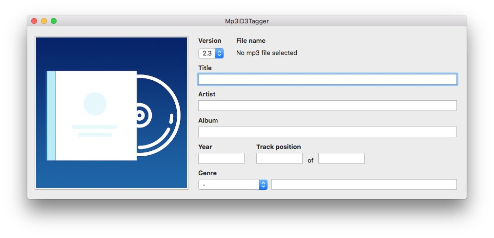

*The third of a short series of post in which I describe my two latest project: ID3TagEditor and Mp3ID3Tagger. In this
post I will talk about Mp3ID3Tagger, a macOS application to edit id3 tag of your mp3 files.*

---

In [this previous post](/2018/05/07/born-id3tageditor-mp3id3tagger/ "born id3tageditor mp3id3tagger") I described
the reason why I develop [Mp3ID3Tagger](https://github.com/chicio/Mp3ID3Tagger "mp3 id3 tag editor macos"), a macOS app
to edit the id3 tag of your mp3 files that leverage on the power
of [ID3TagEditor](/2018/05/08/id3tageditor-swift-read-write-id3-tag-mp3/). Below you can find the app logo.


So how did I develop MP3ID3Tagger? I was about to start the development following the classic approach to develop an app
on every Apple
OS: [Model View Controller](https://en.wikipedia.org/wiki/Model%E2%80%93view%E2%80%93controller "Model View Controller")
and plain Swift. But then I though: "This is the perfect project to test one of the last programming technique I
recently learned: Reactive Programming/Reactive Extensions with RxSwift and RxCocoa!!!!!! In this way I can also try to
use a different architectural pattern:
the [Model View ViewModel (MVVM)](https://en.wikipedia.org/wiki/Model%E2%80%93view%E2%80%93viewmodel "Model View ViewModel")" :
sunglasses:.What kind of architectural pattern is the MVVM? What are Reactive Programming, Reactive Extensions, RxSwift
and RxCocoa???  
Let's start from the first one. The MVVM is an architectural pattern invented by the Microsoft software engineers Ken
Cooper and Ted Peters. As for other architecture
patterns [I described in the past](/2017/08/11/model-view-presenter-architecture-ios-swift-unit-test/ "Model View Presenter")
, the MVVM is useful to clearly separate the UI development from the business logic. The main components of the MVVM
are:

* the *Model*, that usually represents the business logic of the application.
* the *View*, as in the other architectural pattern, the view is the structure, layout, and appearance of what a user
  sees on the screen.
* the *View model*, that usually represents an abstraction of the view exposing public properties and commands.
* the *Binder* interprets bindings defined in the View, observes the View Model for changes in state and updates the
  View and finally observes the View for changes in state and updates the View Model.

From the definition above we see that the MVVM needs something to bind the view to the view model in a platform
independent way. This is why we need [RxSwift](https://github.com/ReactiveX/RxSwift "RxSWift")
, [RxCocoa](https://github.com/ReactiveX/RxSwift/tree/master/RxCocoa "RxCocoa")
and [Reactive Extensions (usually called ReactiveX)](http://reactivex.io/ "Rx"). What are they? Let's see some quote for
the definitions:

> Reactive Extensions (also known as ReactiveX or Rx) is a set of tools allowing imperative programming languages to operate on sequences of data regardless of whether the data is synchronous or asynchronous. It provides a set of sequence operators that operate on each item in the sequence...ReactiveX is API for asynchronous programming with observable streams...RxSwift is the Swift version of ReactiveX (Rx)...RxCocoa is a framework that helps make Cocoa APIs used in iOS and OS X easier to use with reactive techniques...

The main components of RxSwift are:

* `Observables`, that are something which emit notifications of change, and `Observers`, that are something which
  subscribe to an Observable, in order to be notified when it has changed
* `Subjects`, that are entity that act both as an `Observable` and as an `Observer`
* `Operator`, that are basically functions that work on `Observable` and return `Observable`

So RxSwift and RxCocoa let us create an abstraction from the platform specific UI implementation and let us implement
our ViewModel by working in an event-driven way: the ViewModel only works with streams of data that comes
from `Observable` and `Subjects` of RxSwift. RxCocoa gives us an abstraction over Cocoa and Cocoa Touch specific
components and let us work with generic observable UI component. This basically means that:

* RxSwift and RxCocoa are our Binder of the MVVM
* the Various View and View Controllers are the View of the MVVM
* the ID3TagEditor will be the Model of the MVVM
* the ViewModel will connect the View and the ID3TagEditor Model in a platform UI independent way

With this architecture we can also think about using the same Model and ViewModel on different platform. So if in the
future I will develop an iOS version of Mp3ID3Tagger, I will only have to develop the View part. So let's start to see
how I implemented Mp3ID3Tagger, the app subject of this post. Let's start from the UI to see how MP3ID3Tagger does look
like. The app has only one screen where the user can input its the data he/she want to insert into the tag. There is a
button on the left to select the cover and all the textual/numeric values on the left. The values that could be set from
a list are implemented as `NSPopUpButton` components.



The first building block is the `ViewModel` base class. This class is useful to centralize the setup of a `disposeBag`.
The `DisposeBag` it’s an RxSwift component that keeps a reference to all the `Disposable` you add to it.
The `Observable` are `Disposable`, so you can add them to it to have an ARC-like behaviour: when the `DisposeBag` will
be released all the `Disposable`  instances it keeps will be released as well. So by having the `ViewModel` base class
all the ViewModel will have a `disposeBag` by default where they will add their disposables. As we have seen before the
app just one screen, so there's just one `ViewModel` subclass to represent that screen, the `Mp3ID3TaggerViewModel`
class. This class has 4 properties:

* `id3TagReader`, of type `ID3TagReader`. This class has the responsibility to read a tag from an mp3 file when
  an `openAction` occurs. So `ID3TagReader` will be a subscriber of the `openAction` observable.
* `id3TagWriter`, of type `ID3TagWriter`. This class has the responsibility to save a new tag to the mp3 file currently
  opened (the last `openAction` value) when a `saveAction` occurs. So `ID3TagWriter` will be a subscriber of
  the `saveAction` observable.
* `form`, of type `Form`. This class has the responsibility to fill the fields of the form on the UI with values of the
  ID3tag read by the `id3TagReader` when an mp3 file has been opened. It has also the responsibility to collect the data
  contained in the form so that the `id3TagWriter` can write them when a `saveAction` occurs.
* `saveResult`, of type `PublishSubject<Bool>`. This subject publishes the result of a save action made by
  the `id3TagWriter`.

```swift
class Mp3ID3TaggerViewModel: ViewModel {
    let id3TagReader: ID3TagReader
    let id3TagWriter: ID3TagWriter
    let form: Form
    let saveResult: PublishSubject<Bool>

    init(openAction: Observable<String>, saveAction: Observable<Void>) {
        self.id3TagReader = ID3TagReader(id3TagEditor: ID3TagEditor(), openAction: openAction)
        self.id3TagWriter = ID3TagWriter(id3TagEditor: ID3TagEditor(), saveAction: saveAction)
        self.form = Form()
        self.saveResult = PublishSubject<Bool>()
        super.init()

        id3TagReader.read { [unowned self] id3Tag in
            self.form.fillFields(using: id3Tag)
        }

        id3TagWriter.write(input: Observable.combineLatest(form.readFields(), openAction)) { result in
            self.saveResult.onNext(result)
        }
    }
}
```

Now we can see the details of all these collaborators of our view model. Let's start from the `ID3TagReader`. This class
keeps a reference to an instance of the `ID3TagEditor`. Its main function is `read(_ finish: @escaping (ID3Tag?) -> ()`.
In this function there is the subscribe to the `openAction` observable received at construction time (passed by
the `Mp3ID3TaggerViewModel`). Each new value received from the `openAction` is a path to a new mp3 file. This path is
passed to the `ID3TagEditor` instance that read of the ID3 tag of the song. If everything goes well, the tag is returned
to the caller by using the `finish` closure. If you remember the `Mp3ID3TaggerViewModel` class, in this `finish` closure
the `form` class is called that execute the fill of the fields (we will see below how it does this operation).

```swift
class ID3TagReader {
    private let id3TagEditor: ID3TagEditor
    private let openAction: Observable<String>
    private let disposeBag: DisposeBag

    init(id3TagEditor: ID3TagEditor, openAction: Observable<String>) {
        self.id3TagEditor = id3TagEditor
        self.openAction = openAction
        self.disposeBag = DisposeBag()
    }

    func read(_ finish: @escaping (ID3Tag?) -> ()) {
        openAction.subscribe(onNext: { [unowned self] path in
            do {
                let id3Tag = try self.id3TagEditor.read(from: path)
                finish(id3Tag)
            } catch {
                finish(nil)
            }
        }).disposed(by: disposeBag)
    }
}
```

Then we have the `ID3TagWriter` class. Like the `ID3TagReader`, this class keeps a reference to an instance of
the `ID3TagEditor`. Its main function is `write(input: Observable<(ID3Tag, String)>, _ finish: @escaping (Bool) -> ())`.
This function takes two parameters:

* `input` of type `Observable<(ID3Tag, String)>`. This is an observable on a tuple composed by the path of an mp3 file
  and an ID3 tag
* `finish` of type `(Bool) -> ()`

Inside this function there's the subscription to the `saveAction` observable received at construction time from
the `Mp3ID3TaggerViewModel` class. This observable is combined with the `input` observable received as parameter and
described above and a new subscription to the result of the combination is created: each time we receive a path to an
mp3 file, an ID3 tag and a save action is triggered the `ID3TagEditor` instance is used to write the ID3 tag to the mp3
file. The called of the `write` function of the `ID3TagWriter` is notified of the result of the operation by calling
the `finish` operation.

```swift
class ID3TagWriter {
    private let id3TagEditor: ID3TagEditor
    private let saveAction: Observable<Void>
    private let disposeBag: DisposeBag

    init(id3TagEditor: ID3TagEditor, saveAction: Observable<Void>) {
        self.id3TagEditor = id3TagEditor
        self.saveAction = saveAction
        self.disposeBag = DisposeBag()
    }

    func write(input: Observable<(ID3Tag, String)>, _ finish: @escaping (Bool) -> ()) {
        saveAction
            .withLatestFrom(input)
            .subscribe(onNext: { [unowned self] event in
                do {
                    try self.id3TagEditor.write(tag: event.0, to: event.1)
                    finish(true)
                } catch {
                    finish(false)
                }
            })
            .disposed(by: disposeBag)
    }
}
```

Now let's see the `Form` class and its collaborators. This class has 5 collaborators. Each collaborator represents a
subset of the form fields. This fields are represented as `Variable` subject of the specific type of the fields. In this
way we are able to publish new values (by using the `value` property) to this observable and at the same time observe
their values. In fact in this class there are two functions:

* `readFields()`, that creates an observable from the fields observables by combining them using the Rx
  operator `combineLatest`
* `fillFields(using id3Tag: ID3Tag?)`, that sets the value of the fields observables with the received id3 tag (read by
  the ID3TagReader when an mp3 file has been opened)

Below you can find the `Form` class with all the implementations also for its collaborators. In this way it's easy to
note what I stated above: the set of all the `Variable` fields of this classes matches the set of the UI components that
we saw in the screenshot of the app that you saw above. One last important thing to note: the
class `AttachedPictureField` forces the type of the attached picture to be saved to `FrontCover`
. [In this way the ID3TagEditor will write the ID3 tag with the correct data to display the album cover on my renault clio](/2018/05/07/born-id3tageditor-mp3id3tagger/ "mp3id3tagger id3tageditor")!!! :
relieved:

```swift
class Form {
    let basicSongFields: BasicSongFields
    let versionField: VersionField
    let trackPositionInSetFields: TrackPositionInSetFields
    let genreFields: GenreFields
    let attachedPictureField: AttachedPictureField

    init() {
        self.basicSongFields = BasicSongFields()
        self.versionField = VersionField()
        self.trackPositionInSetFields = TrackPositionInSetFields()
        self.genreFields = GenreFields()
        self.attachedPictureField = AttachedPictureField()
    }

    func readFields() -> Observable<ID3Tag> {
        return Observable.combineLatest(
            versionField.validVersion,
            basicSongFields.observe(),
            trackPositionInSetFields.trackPositionInSet,
            genreFields.genre,
            attachedPictureField.observeAttachPictureCreation()
        ) { (version, basicFields, trackPositionInSet, genre, image) -> ID3Tag in
            return ID3Tag(
                version: version,
                artist: basicFields.artist,
                albumArtist: basicFields.albumArtist,
                album: basicFields.album,
                title: basicFields.title,
                year: basicFields.year,
                genre: genre,
                attachedPictures: image,
                trackPosition: trackPositionInSet
            )
        }
    }

    func fillFields(using id3Tag: ID3Tag?) {
        fillBasicFieldsUsing(id3Tag: id3Tag)
        fillVersionFieldUsing(id3Tag: id3Tag)
        fillTrackPositionFieldsUsing(id3Tag: id3Tag)
        fillGenreFieldsUsing(id3Tag: id3Tag)
        fillAttachedPictureUsing(id3Tag: id3Tag)
    }

    private func fillBasicFieldsUsing(id3Tag: ID3Tag?) {
        basicSongFields.title.value = id3Tag?.title
        basicSongFields.artist.value = id3Tag?.artist
        basicSongFields.album.value = id3Tag?.album
        basicSongFields.albumArtist.value = id3Tag?.albumArtist
        basicSongFields.year.value = id3Tag?.year
    }

    private func fillVersionFieldUsing(id3Tag: ID3Tag?) {
        if let version = id3Tag?.properties.version.rawValue {
            versionField.version.value = Int(version)
        }
    }

    private func fillTrackPositionFieldsUsing(id3Tag: ID3Tag?) {
        if let trackPosition = id3Tag?.trackPosition {
            trackPositionInSetFields.trackPosition.value = String(trackPosition.position)
            fillTotalTracksFieldUsing(id3Tag: id3Tag)
        }
    }

    private func fillTotalTracksFieldUsing(id3Tag: ID3Tag?) {
        if let totalTracks = id3Tag?.trackPosition?.totalTracks {
            trackPositionInSetFields.totalTracks.value = String(totalTracks)
        }
    }

    private func fillGenreFieldsUsing(id3Tag: ID3Tag?) {
        if let genre = id3Tag?.genre {
            genreFields.genreIdentifier.value = genre.identifier?.rawValue
            genreFields.genreDescription.value = genre.description
        }
    }

    private func fillAttachedPictureUsing(id3Tag: ID3Tag?) {
        if let validAttachedPictures = id3Tag?.attachedPictures, validAttachedPictures.count > 0 {
            attachedPictureField.attachedPicture.value = ImageWithType(data: validAttachedPictures[0].art,
                                                                       format: validAttachedPictures[0].format)
        }
    }
}

....

typealias BasicSongFieldsValues = (title: String?, artist: String?, album: String?, albumArtist: String?, year: String?)

class BasicSongFields {
    let title: Variable<String?>
    let artist: Variable<String?>
    let album: Variable<String?>
    let albumArtist: Variable<String?>
    let year: Variable<String?>

    init() {
        self.title = Variable<String?>(nil)
        self.artist = Variable<String?>(nil)
        self.album = Variable<String?>(nil)
        self.albumArtist = Variable<String?>(nil)
        self.year = Variable<String?>(nil)
    }

    func observe() -> Observable<BasicSongFieldsValues> {
        return Observable.combineLatest(
            title.asObservable(),
            artist.asObservable(),
            album.asObservable(),
            albumArtist.asObservable(),
            year.asObservable()
        ) { title, artist, album, albumArtist, year in
            return BasicSongFieldsValues(title: title,
                                         artist: artist,
                                         album: album,
                                         albumArtist: albumArtist,
                                         year: year)
        }
    }
}

....

class VersionField {
    let version: Variable<Int?>
    let validVersion: Observable<ID3Version>

    init() {
        self.version = Variable<Int?>(3)
        self.validVersion = version.asObservable().map { (versionSelected) -> ID3Version in
            return ID3Version(rawValue: UInt8(versionSelected ?? 0)) ?? .version3
        }
    }
}

....

class TrackPositionInSetFields {
    let trackPosition: Variable<String?>
    let totalTracks: Variable<String?>
    let trackPositionInSet: Observable<TrackPositionInSet?>

    init() {
        self.trackPosition = Variable<String?>(nil)
        self.totalTracks = Variable<String?>(nil)
        self.trackPositionInSet = Observable.combineLatest(
            trackPosition.asObservable(),
            totalTracks.asObservable()
        ) { (trackPosition, totalTracks) -> TrackPositionInSet? in
            if let validTrackPositionAsString = trackPosition,
                let validTrackPosition = Int(validTrackPositionAsString) {
                return TrackPositionInSet(position: validTrackPosition,
                                          totalTracks: TrackPositionInSetFields.convertToNumber(totalTracks: totalTracks))
            }
            return nil
        }
    }

    private static func convertToNumber(totalTracks: String?) -> Int? {
        if let validTotalTracks = totalTracks {
            return Int(validTotalTracks)
        }
        return nil
    }
}

....

class GenreFields {
    let genreIdentifier: Variable<Int?>
    let genreDescription: Variable<String?>
    let genre: Observable<Genre?>

    init() {
        self.genreIdentifier = Variable<Int?>(nil)
        self.genreDescription = Variable<String?>(nil)
        self.genre = Observable.combineLatest(
            genreIdentifier.asObservable(),
            genreDescription.asObservable()
        ) { (genreIdentifier, genreDescription) -> Genre? in
            if let validGenre = genreIdentifier,
                let validId3Genre = ID3Genre(rawValue: validGenre) {
                return Genre(genre: validId3Genre, description: genreDescription)
            }
            return nil
        }
    }
}

....

class AttachedPictureField {
    let attachedPicture: Variable<ImageWithType?>

    init() {
        self.attachedPicture = Variable<ImageWithType?>(nil)
    }

    func observeAttachPictureCreation() -> Observable<[AttachedPicture]?> {
        return attachedPicture
            .asObservable()
            .map({ imageWithType in
                if let validImageWithType = imageWithType {
                    return [AttachedPicture(art: validImageWithType.data,
                                            type: .FrontCover,
                                            format: validImageWithType.format)]
                } else {
                    return nil
                }
            })
    }
}

```

Now it's time to see the view controller of the app that basically corresponds to the View of the MVVM. Its name
is `Mp3ID3TaggerViewController`. This controller will implement a protocol I defined: the `BindableView` protocol. This
protocol represents the View part in the MVVM architecture. This protocol must be implemented only by subclasses of
the `NSViewController`. The protocol contains a property and a function. The `viewModel` forces the class (the View) to
have a property that represents its ViewModel. The function `bindViewModel` is where the View and the View model are
bound together. The `bindViewModel` must be called inside one the lifecycle methods of the `NSViewController`.

```swift
protocol BindableView where Self: NSViewController {
    associatedtype ViewModelType
    var viewModel: ViewModelType! { get set }
    func bindViewModel()
}
```

If we look at the implementation of the `bindViewModel` method, we can see where something "magical" is happening :
crystal_ball:: an instance of `Mp3ID3TaggerViewModel` class is created and the UI components that represents the various
field of the form are bounded to the view model fields by using the custom operator `<->`. So this operator let us
define the what is called **two way binding** or **bidirectional binding** using RxSwift:

* each `Variable` field of the view model is bounded to a field on the UI. This basically means that each value we set a
  in the `value` property of a `Variable` field will be displayed on the UI Cocoa specific field.

* each value inserted in the UI Cocoa specific field will be set in the corresponding `Variable` field on the view
  model.

In this way the View Model is completely decoupled from the View part (in this case the `NSViewController`). This means
that we can reuse the same ViewModel to create other versions of Mp3ID3Tagger for other platforms. This is absolutely
fantastic! :heart_eyes::relaxed:. Last but not least in the controller we have also some other functions:

* `open(_ sender: Any?)` and `save(_ sender: Any?)` that manage the open an mp3 file and save of the same file
* `bindSaveAction()` that observe the result of a save action
* `openImage(imageUrl: URL)` and `bindAttachedPictureField()` that manage the bind and the subscription to an open
  action of an image to be used as front cover for the id3 tag.

```swift
infix operator <-> : DefaultPrecedence

func <-> <T>(property: ControlProperty<T>, variable: Variable<T>) -> Disposable {
    let bindToUIDisposable = variable.asObservable()
        .bind(to: property)
    let bindToVariable = property
        .subscribe(onNext: { n in
            variable.value = n
        }, onCompleted:  {
            bindToUIDisposable.dispose()
        })

    return CompositeDisposable(bindToUIDisposable, bindToVariable)
}

....

class Mp3ID3TaggerViewController: NSViewController, BindableView {
    private let disposeBag: DisposeBag = DisposeBag()
    private let openAction: PublishSubject<String> = PublishSubject<String>()
    private let saveAction: PublishSubject<Void> = PublishSubject<Void>()
    private let stringToID3ImageExtensionAdapter = StringToID3ImageExtensionAdapter()
    var viewModel: Mp3ID3TaggerViewModel!
    @IBOutlet weak var versionPopUpbutton: NSPopUpButton!
    @IBOutlet weak var fileNameLabel: NSTextField!
    @IBOutlet weak var titleTextField: NSTextField!
    @IBOutlet weak var artistTextField: NSTextField!
    @IBOutlet weak var albumTextField: NSTextField!
    @IBOutlet weak var albumArtistField: NSTextField!
    @IBOutlet weak var yearTextField: NSTextField!
    @IBOutlet weak var trackPositionTextField: NSTextField!
    @IBOutlet weak var totalTracksTextField: NSTextField!
    @IBOutlet weak var genrePopUpMenu: NSPopUpButton!
    @IBOutlet weak var genreDescriptionTextField: NSTextField!
    @IBOutlet weak var imageSelectionButton: NSButton!

    override func viewDidLoad() {
        super.viewDidLoad()
        self.bindViewModel()
    }

    func bindViewModel() {
        viewModel = Mp3ID3TaggerViewModel(openAction: openAction.asObservable(), saveAction: saveAction.asObservable())
        (titleTextField.rx.text <-> viewModel.form.basicSongFields.title).disposed(by: disposeBag)
        (artistTextField.rx.text <-> viewModel.form.basicSongFields.artist).disposed(by: disposeBag)
        (albumTextField.rx.text <-> viewModel.form.basicSongFields.album).disposed(by: disposeBag)
        (albumArtistField.rx.text <-> viewModel.form.basicSongFields.albumArtist).disposed(by: disposeBag)
        (yearTextField.rx.text <-> viewModel.form.basicSongFields.year).disposed(by: disposeBag)
        (versionPopUpbutton.rx.selectedItemTag <-> viewModel.form.versionField.version).disposed(by: disposeBag)
        (trackPositionTextField.rx.text <-> viewModel.form.trackPositionInSetFields.trackPosition).disposed(by: disposeBag)
        (totalTracksTextField.rx.text <-> viewModel.form.trackPositionInSetFields.totalTracks).disposed(by: disposeBag)
        (genrePopUpMenu.rx.selectedItemTag <-> viewModel.form.genreFields.genreIdentifier).disposed(by: disposeBag)
        (genreDescriptionTextField.rx.text <-> viewModel.form.genreFields.genreDescription).disposed(by: disposeBag)
        self.bindAttachedPictureField()
        self.bindSaveAction()
    }

    private func bindAttachedPictureField() {
        viewModel
            .form
            .attachedPictureField
            .attachedPicture
            .asObservable()
            .filter({ $0 != nil })
            .subscribe(onNext: { self.imageSelectionButton.image = NSImage(data: $0!.data) })
            .disposed(by: disposeBag)
        imageSelectionButton.rx.tap.subscribe(onNext: { tap in
            NSOpenPanel.display(in: self.view.window!,
                                fileTypes: ["png", "jpg", "jpeg"],
                                title: "Select an Image file",
                                onOkResponse: self.openImage)
        }).disposed(by: disposeBag)
    }

    private func bindSaveAction() {
        viewModel.saveResult
            .asObservable()
            .subscribe(onNext: { (result) in
                let alert = NSAlert()
                alert.addButton(withTitle: "Ok")
                alert.messageText = result ? "Mp3 saved correctly!" : "Error during save!"
                alert.beginSheetModal(for: self.view.window!, completionHandler: nil)
            })
            .disposed(by: disposeBag)
    }

    private func openImage(imageUrl: URL) {
        if let image = try? Data(contentsOf: imageUrl) {
            let type = self.stringToID3ImageExtensionAdapter.adapt(format: imageUrl.pathExtension)
            self.viewModel.form.attachedPictureField.attachedPicture.value = ImageWithType(data: image, format: type)
            self.imageSelectionButton.image = NSImage(data: image)
        }
    }

    @IBAction func open(_ sender: Any?) {
        NSOpenPanel.display(in: self.view.window!,
                            fileTypes: ["mp3"],
                            title: "Select an MP3 file",
                            onOkResponse: {
                                self.openAction.onNext($0.path)
                                self.fileNameLabel.stringValue = $0.lastPathComponent
        })
    }

    @IBAction func save(_ sender: Any?) {
        saveAction.onNext(())
    }
}
```

We're done with Mp3ID3Tagger. I hope you liked my architectural choices and how I developed it by leveraging the power
of RxSwift and RxCocoa :sunglasses::relieved:. Obviously don't forget to see
the [official Mp3ID3Tagger repo](https://github.com/chicio/Mp3ID3Tagger "Mp3ID3Tagger") and obviously
to [download the Mp3ID3Tagger app from this link](https://github.com/chicio/Mp3ID3Tagger/raw/master/Release/Mp3ID3Tagger.dmg "mp3 tag macOS")
and use it!!! :heartpulse::sparkling_heart:
