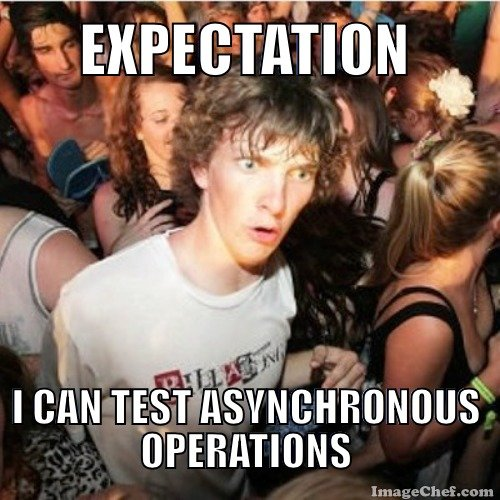

*In this post I will talk about asynchronous testing in Swift.*

---

As we saw in [this post](/2017/06/02/swift-closure-syntax/ "what are closure") and also
in [this other one](/2017/06/14/swift-closure-demystifying-autoclosure-escaping/ "autoclose and escaping"), closures
are one of the most important building block of Swift. They are extensively used inside the iOS SDK.  
But in the previous posts about closures I didn't answer one very important question: how can you do unit test
asynchronous operation and closure? It seems Apple has the answer for us!! Inside the iOS Testing framework we have **
expectations**.



How do they work? To test that asynchronous operations (and closure) behave as expected, you create one or more
expectations within your test, and then fulfill those expectations when the asynchronous operation completes
successfully. Your test method waits until all expectations are fulfilled or a specified timeout expires. The general
code structure for expectation with closure is like the following example:

```swift
let expectation = XCTestExpectation(description: "Expectation description")

yourInstance.method(param: "aParam") {
    <Your assert using XCTAssert...>
    expectation.fulfill()
}

wait(for: [expectation], timeout: <time to wait the fulfillment of the expecation>)
```

Basically to test asynchronous operation/closure you must:

* create an expectation that is an instance of `XCTestExpectation`
* execute your closure, make your assert on the closure return value/parameter and call the method `fulfill`
  of `XCTestExpectation`

So, what about a more complex example? Let's see how powerful expectation are and most importantly how we can test them.
Suppose for example we have a [use case](https://en.wikipedia.org/wiki/Use_case "use case") class
called `PasswordUpdateUseCase` with the following implementation:

```swift
public class PasswordUpdateUseCase {
    private let passwordService: PasswordService
    private let passwordRepository: PasswordRepository

    public init(passwordService: PasswordService, passwordRepository: PasswordRepository) {
        self.passwordService = passwordService
        self.passwordRepository = passwordRepository
    }

    public func update(password: String) {
        passwordService.update(password: password) { success, error in
            if success {
                self.passwordRepository.save(password: password)
            }
        }
    }
}
```

As you can see inside the `update` method we have an instance of `PasswordService` that, as the method name suggest,
execute an update of the user password and return the result of the operation inside a closure. How do we unit test?
Let's see how we can achieve our objective using some handmade mock and expectation. For this post I will **NOT USE**
the  ["Given-then-when"](https://en.wikipedia.org/wiki/Given-When-Then "Given-then-when") structure I used in
a [previous post](/2017/08/11/model-view-presenter-architecture-ios-swift-unit-test/), because I want to keep the
focus on the code structure. First of all, to test our use case we need to mock the `PasswordRepository`. In our test we
want to verify if our `save` method has been called or not. We can achieve this objective by implementing a spy
object, `PasswordDatabaseRepositorySpy`, that exposes a status property `savePasswordHasBeenCalled`.

```swift
class PasswordDatabaseRepositorySpy: PasswordRepository {
    private(set) var savePasswordHasBeenCalled = false

    func save(password: String) {
        savePasswordHasBeenCalled = true
    }
}
```

Now it's time to mock our `PasswordService`. We need to mock it so that it has the following features:

* it exposes a status property that let us know if the method `update` has been called
* it simulates an asynchronous call inside the `update` method
* it can fulfill the expectation of our test in time

A lot of stuff to do. Let's see how we can implement it. We will call it `PasswordNetworkServiceSpy`.

```swift
class PasswordNetworkServiceSpy: PasswordService {
    private(set) var updatePasswordHasBeenCalled = false
    private let expectation: XCTestExpectation
    private let successful: Bool

    init(expectation: XCTestExpectation, successful: Bool) {
        self.expectation = expectation
        self.successful = successful
    }

    func update(password: String, completion: @escaping (Bool, Error) -> ()) {
        DispatchQueue.main.asyncAfter(deadline: .now() + .milliseconds(200)) {
            self.updatePasswordHasBeenCalled = true
            completion(self.successful, NSError(domain: "error", code: -1, userInfo: nil))
            self.expectation.fulfill()
        }
    }
}
```

The interesting thing of our implementation is that our spy will be in charge of fulfill the expectation, because the
closure executed inside the `PasswordUpdateUseCase` is created inside our `PasswordService` spy, and we have to be sure
that after its execution the `expectation.fulfill()` is called.  
Now we are ready to write our unit tests. We will test two cases: update successful and update failure.

```swift
class AsynchronousTestingClosureDependencyTests: XCTestCase {

    func testUseCaseUpdatePasswordSuccessful() {
        let updateExpectation = expectation(description: "updateExpectation")
        let service = PasswordNetworkServiceSpy(expectation: updateExpectation, successful: true)
        let repository = PasswordDatabaseRepositorySpy()
        let passwordUseCase = PasswordUpdateUseCase(passwordService: service,
                                                    passwordRepository: repository)
        passwordUseCase.update(password: "::password::")
        wait(for: [updateExpectation], timeout: 300)
        XCTAssertTrue(service.updatePasswordHasBeenCalled)
        XCTAssertTrue(repository.savePasswordHasBeenCalled)
    }

    func testUseCaseUpdatePasswordFail() {
        let updateExpectation = expectation(description: "updateExpectation")
        let service = PasswordNetworkServiceSpy(expectation: updateExpectation, successful: false)
        let repository = PasswordDatabaseRepositorySpy()
        let passwordUseCase = PasswordUpdateUseCase(passwordService: service,
                                                    passwordRepository: repository)
        passwordUseCase.update(password: "::password::")
        wait(for: [updateExpectation], timeout: 300)
        XCTAssertTrue(service.updatePasswordHasBeenCalled)
        XCTAssertFalse(repository.savePasswordHasBeenCalled)
    }
}
```

As you can see in this test we have an example of an expectation creation/usage. In each test we are calling
the `wait(for: [updateExpectation], timeout: 300)` so that the tests will "wait" until the expectation is fulfilled or
the max timeout is reach (and in the last case the test fails, no matter the other condition). The most strange thing is
related to the order of instruction between the `wait` and the various `XCTAssert`. To make our tests work we need to
wait until the closure inside the `update` method of the use case is completed. Then we can make our assertion and
verify that our conditions are verified to make our test pass (so, in this case, we can verify that our various method
on the various collaborators have/have not been called). We are done with our example. As you can see you can experiment
a little bit with expectations and implement complex patterns to verify your closure. You can find the complete example
discussed
above [here](https://github.com/chicio/Asynchronous-Testing-Closure-Dependency "asynchronous operation swift example").
Expectation: your true friend for asynchronous code testing :heart:.
