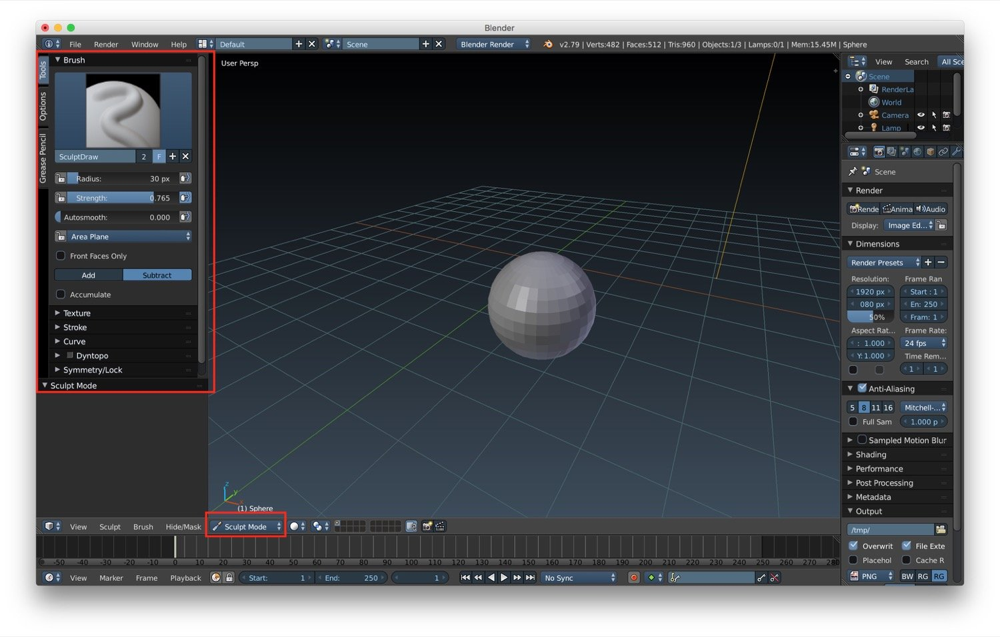
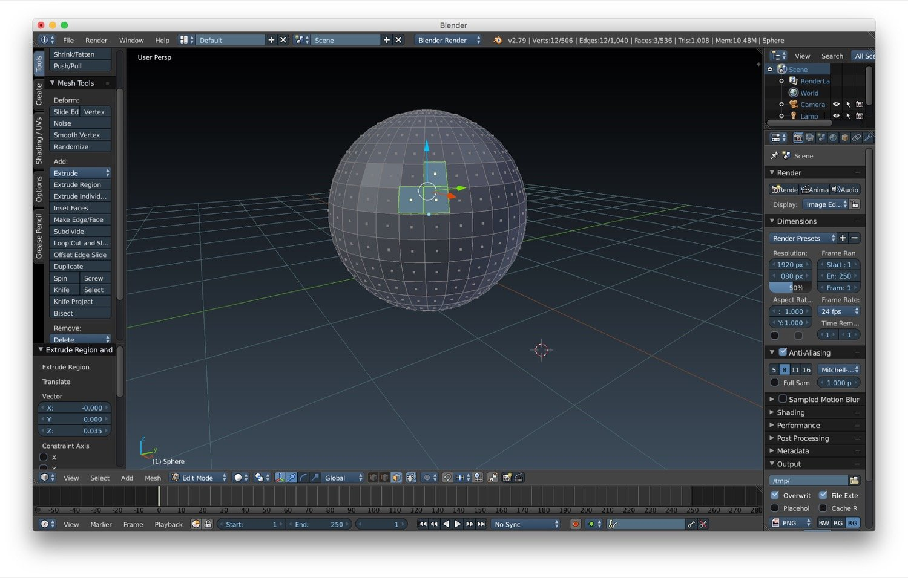
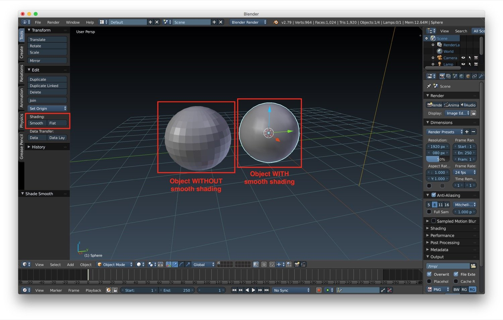
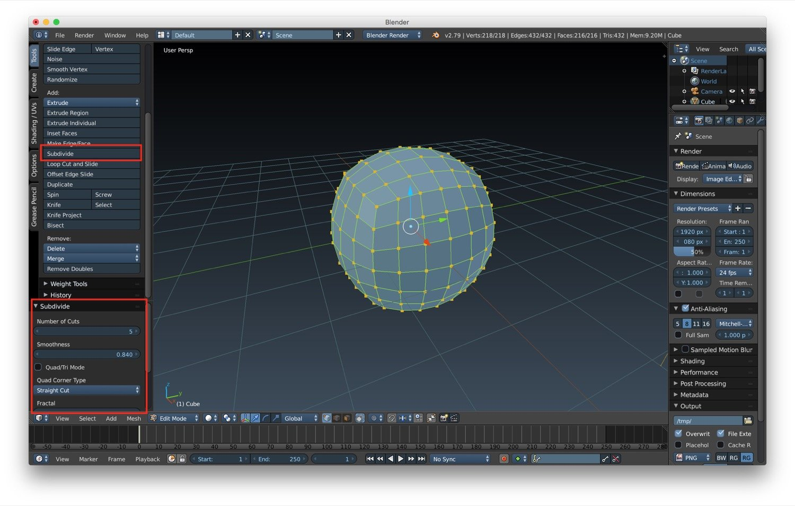

*In this new post of the series Blender tutorial I will continue to talk about the fundamental of modeling in Blender.*

---

In the [previous post of the series "Blender tutorial"](/2018/04/03/blender-tutorial-3-modeling-basics-part-1/) we
introduced the first part of basics of modeling. Let's continue our exploration with other useful tool we can use for
modeling.  
Let's start with **Sculpt mode**. We can enable it in the *editing/interaction mode selector* in the bottom bar of the
3D window. In this mode you can literally sculpt you mesh. It possible to customize the sculpt mode by setting some of
its properties:

* *radius of the sculpt*
* *feather of the sculpt, that changes how the sculpt fall-off*
* *auto smooth*
* *add/subtract to pull in/out vertices while sculpting*

Sculpt mode supports also paint textures and strokes. But more important it supports symmetry: by selecting and axis any
change on one side will be mirrored on the other one.  
Another interesting option is the **edge loop modeling**. Basically this means that if we select a edge loop with *alt +
right click* in edit mode/edge select mode, we can modify the edge loop by using the 3D axis that are shown after the
selection. The next tool available for modeling is the **extrude tool**. With this tool we can modify our geometry and
more details. In particular, we can use it to create branches, legs and other parts that are out of the main body of the
mesh. We can activate the extrude under *Mesh tools -> Extrude Region/Individual*. The extrude region will push out the
elements selected as a single block. The extrude individual will extrude the elements selected individually.

Another useful tool that we can use for modeling is **smooth shading**. We can use these to smooth the surface of
objects where the polygons of the mesh have too much hard edges. We can find the it under *Tools -> Shading* while an
object is selected in Object mode or under *Shading -> Faces/Edges/Vertices* while an object is in Edit mode.

The last tool we can use for some simple modeling is the **subdividing mesh tool**. There are two ways to do
subdivision:

* *subdivision of the mesh itself*
* *subdivision surface*

Now we will look at subdivision of the mesh itself. To do it we need to be in edit mode on the object and select all
with the *a key*. We can find the subdivision option under *Tools -> Subdivide*. If we click on that a series of
subdivision properties will appear, that let us customize the number of cuts, the smoothness and other minor properties.

Remember: each number of cuts increment QUADRUPLICATE the number of polygon in your mesh.  
In the next chapter we will talk about advanced modeling techniques and tools.
