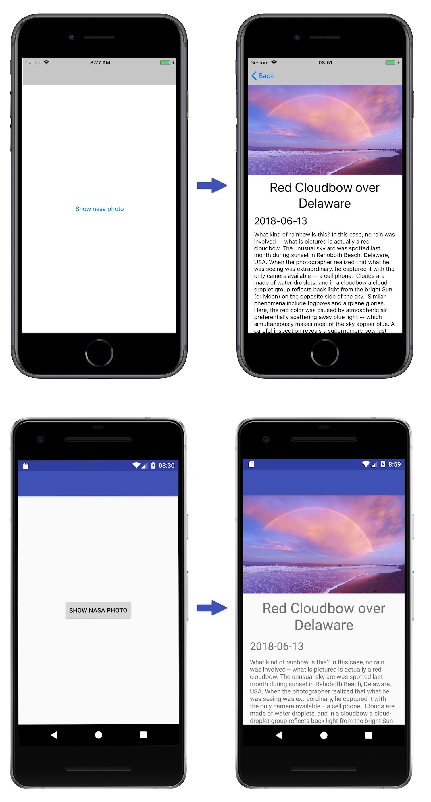
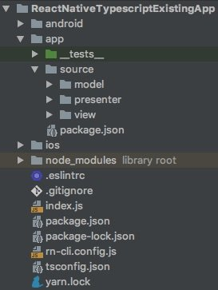

*In this post I will show you how to setup React Native + Typescript in an existing app.*

---

In the last few months at [lastminute.com group](https://lmgroup.lastminute.com/ "lastminute.com group") I worked on the
following project: rebuild the native mobile apps of the main brands [lastminute.com](https://lmgroup.lastminute.com/ "Lastminute travel trips booking"), [Volagratis](https://www.volagratis.com/ "Volagratis travel trips booking viaggi")
and [Rumbo](https://www.rumbo.es/ "Rumbo") with a new interface and new features. Let's compare the old, and the new 
home of the lastminute.com app. The changes are quite impressive :sunglasses:.


For this "app relaunch" project we decided to use React Native (I already talked about this framework in some previous
posts that you can find in the [archive section](/blog/archive "archive")). We didn't rewrite the apps from scratch. We
decided to integrated React Native in the existing code base and:

* use [Native Modules](https://reactnative.dev/docs/native-modules-ios/ "Native Modules") to reuse some native code we
  already had in place for some features (for example the login).
* write the new stuff completely in React Native whenever possible.

We also took another important decision when we started the project: we choose TypeScript instead of Javascript as main
language to write our React Native stuff. What is TypeScript? It is an open-source programming language developed and
maintained by Microsoft. They describe it on its official website with the following definition:

> Typescript is a typed superset of Javascript that compiles to plain Javascript. Any browser. Any host. Any OS. Open source.

What does it means? It means that TypeScript is basically *"Javascript on steroid"*: it provides optional, static type
checking at compile time. Since it is a superset of JavaScript, all JavaScript code is valid TypeScript code. TypeScript
is helpful if you are a developer that comes from other strongly typed language and with you have a strong knowledge of
Object Oriented programming because it let you reuse a lot of the programming technique you already know.  
React Native officially supports Javascript. How can we setup React Native + Typescript? In this post we will see how to
integrate React Native and Typescript in an existing app and we will add a new screen done in React Native where we will
show the photo of the day that we will read from the [Nasa open API](https://api.nasa.gov/ "Nasa open api"). Below you
can find what we will achieve. The first screen is a standard native screen. The second one is a React Native screen.



Let's start to setup our project for React Native and TypesScript. First, React Native integration. For this task we can
just follow
the [React Native documentation regarding the integration with existing app](https://reactnative.dev/docs/integration-with-existing-apps/)
. Then we can start to integrate TypeScript. We will use [yarn](https://yarnpkg.com/lang/en/ "yarn") as dependencies
manager instead of npm (you can use it also to install the dependencies needed to setup React Native in an existing app)
. Yarn is a fast, reliable and secure dependencies manager released by Facebook in October 2016. Our project directories
structure will be the one contained in the screenshots below. The existing native codebase is contained inside the `ios`
and `android` folders.



So let's start by installing TypeScript and the types for React Native. We can do it with the following commands from
the root of our project:

```bash
yarn add --dev typescript
yarn add --dev @types/react @types/react-native
```

After that we need to configure TypeScript in our project. We can start to do that by running the following command:

```bash
yarn tsc --init --pretty --jsx react
```

Now we have a new file in the root of our project: the `tsconfig.json` file. This file is the configuration file for
the `tsc`, the TypeScript compiler. We can customize it for our needs (React). In particular, we need to enable the
option `allowSyntheticDefaultImports` to allow default imports from modules with no default export. We also customized
the `baseUrl` and `paths` options. By settings them in this way and by adding a `package.json` file inside the `app`
folder with `name: "app"`, we can place all our source code in the `app` folder and when we need to import a class we
will set the path starting from the `app` base folder (so basically we are defining the root of our source code in a
nice way for our imports).  
Below you can find the complete `tsconfig.json` file configured for our needs.

```json
{
  "compilerOptions": {
    "target": "es2015",
    "module": "es2015",
    "allowJs": true,
    "checkJs": true,
    "jsx": "react-native",
    "removeComments": true,
    "strict": true,
    "noUnusedLocals": true,
    "noUnusedParameters": true,
    "noImplicitReturns": true,
    "moduleResolution": "node",
    "baseUrl": "app",
    "paths": {
      "app/*": [
        "./*"
      ]
    },
    "allowSyntheticDefaultImports": true
  },
  "typeRoots": [
    "./node_modules/@types"
  ],
  "types": [
    "react",
    "react-native",
    "jasmine",
    "jest"
  ],
  "exclude": [
    "node_modules",
    "app/__tests__",
    "rn-cli.config.js"
  ]
}
```

After that we need to install
the [React Native TypeScript Transformer](https://github.com/ds300/react-native-typescript-transformer "React Native TypeScript Transformer")
. This transformer will allow the React Native cli to automatically transpile our TypeScript code into Javascript on
demand. This is the command to install the transformer:

```bash
yarn add --dev react-native-typescript-transformer
```

After that we need to configure the React Native cli to actually use the transformer by adding the following
configuration to the `rn-cli.config.js` file (create it in the project root directory). This file is the React Native
configuration file.

```javascript
module.exports = {
  getTransformModulePath() {
    return require.resolve('react-native-typescript-transformer');
  },
  getSourceExts() {
    return ['ts', 'tsx'];
  },
};
```

That's all for the main source code setup. Now we can start to set up also the testing infrastructure. We will
use [jest](https://jestjs.io/ "jest"), a testing framework from Facebook,
and [typemoq](https://github.com/florinn/typemoq "typemoq"), a TypeScript specific mocking library. To use Jest with
Typescript we will install [ts-jest](https://github.com/kulshekhar/ts-jest "typescript jest preprocessor"), a TypeScript
preprocessor with source map support for Jest that lets us use Jest to test projects written in TypeScript.

```bash
yarn add --dev ts-jest
yarn add --dev typemoq
```

As you remember from the directory structure I show you above, the `__tests__` folder is not in the usual React Native
project position. It is placed inside the app folder. To be able to put our test in this folder we need to add to it
a `jest.config.js` file and set some custom option for related to the module resolution. Below you can find the entire
file with all the details.

```javascript
module.exports = {
  'preset': 'react-native',
  'moduleFileExtensions': [
    'ts',
    'tsx',
    'js',
  ],
  'rootDir': '../..',
  'transform': {
    '^.+\\.(js)$': '<rootDir>/node_modules/babel-jest',
    '\\.(ts|tsx)$': '<rootDir>/node_modules/ts-jest/preprocessor.js',
  },
  'testMatch': ['**/__tests__/**/*.(ts|tsx|js|jsx)?(x)', '**/?(*.)(spec|test).(ts|tsx|js|jsx)?(x)'],
  'testPathIgnorePatterns': [
    '\\.snap$',
    '<rootDir>/node_modules/',
    'jest.config.js',
  ],
  'moduleDirectories': [
    'node_modules',
    '../',
  ],
};
```

We are now ready to write our app. Basically the screen that shows the nasa photo is the `NasaPhotoViewerScreen`. This
component uses `NasaPhotoInformationComponent` and some React Native standard component to show the information that
comes from the API. The informations are fetched using the `NasaPhotoService`. The `NasaPhotoViewerScreen` and
the `NasaPhotoService` are glued together using
the [Model-View-Presenter](/2017/08/11/model-view-presenter-architecture-ios-swift-unit-test/ "Model View Presenter iOS")
architecture in the `NasaPhotoComponentPresenter`. As you can see from the code below, TypeScript has a syntax that is
similar to other language like Java, C# (and many other :sunglasses:).

```jsx
import { OverlayProps } from "./overlay";

export class NasaPhotoService {
  async retrieve(): Promise<any> {
    return fetch('https://api.nasa.gov/planetary/apod?api_key=1cygunHJsSwDug6zJjF3emev3QAP8yFLppohLuxb')
      .then((response) => response.json())
  }
}

//...

export class NasaPhotoComponentPresenter {
  private nasaPhotoRepository: NasaPhotoRepository
  private nasaPhotoView: NasaPhotoView

  constructor(nasaPhotoView: NasaPhotoView, nasaPhotoRepository: NasaPhotoRepository) {
    this.nasaPhotoRepository = nasaPhotoRepository
    this.nasaPhotoView = nasaPhotoView
  }

  async onStart(): Promise<void> {
    try {
      const nasaPhoto = await this.nasaPhotoRepository.load();
      this.nasaPhotoView.showValid(nasaPhoto);
    } catch (_) {
      this.nasaPhotoView.showAn("Network error")
    }
  }
}

//...

export class NasaPhotoViewerScreen extends React.Component<TransientProps<OverlayProps, "div">, State> implements NasaPhotoView {
  private readonly
  presenter: NasaPhotoComponentPresenter

  constructor(props: TransientProps<OverlayProps, "div">) {
    super(props)
    this.state = {
      photo: NasaPhoto.empty()
    }
    this.presenter = new NasaPhotoComponentPresenter(
      this,
      new NasaPhotoRepository(new NasaPhotoService(), new NasaPhotoAdapter())
    )
  }

  componentWillMount() {
    this.presenter.onStart()
  }

  showAn(error: string): void {
    alert(error)
  }

  showValid(photo: NasaPhoto): void {
    this.setState({ photo })
  }

  render() {
    return (
      <ScrollView style={styles.container}>
        <Image
          style={styles.image}
           source={{ uri: this.state.photo.url }}
        />
        <NasaPhotoInformationComponent
          title={this.state.photo.title}
          date={this.state.photo.date}
          description={this.state.photo.description}
        />
      </ScrollView>
    );
  }
}

interface
Props
{
  name: string
}

interface
State
{
  photo: NasaPhoto
}

const styles = StyleSheet.create({
  container: {
    width: "100%",
    height: "100%"
  },
  image: {
    width: "100%",
    height: 220,
    resizeMode: "cover",
  }
});
```

You can check all the code of the sample described above
in [this github repository](https://github.com/chicio/React-Native-Typescript-Existing-App "React Native Typescript Existing App")
and see all the TypeScript components I created for the app I shown you above. That's it!!! React Native + TypeScript: :
hearts: love at first sight :hearts:.
