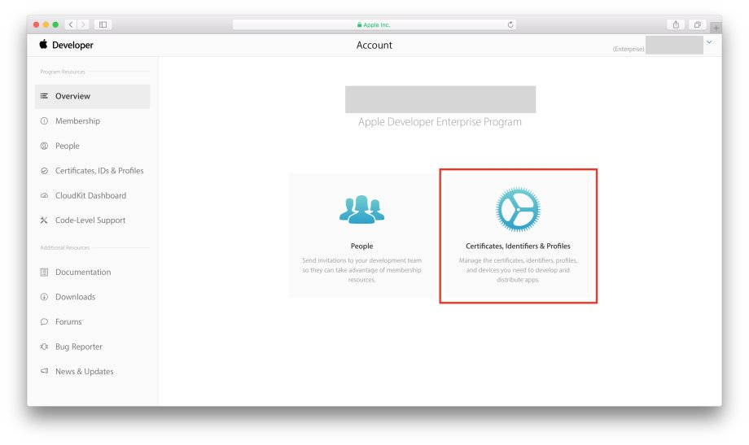
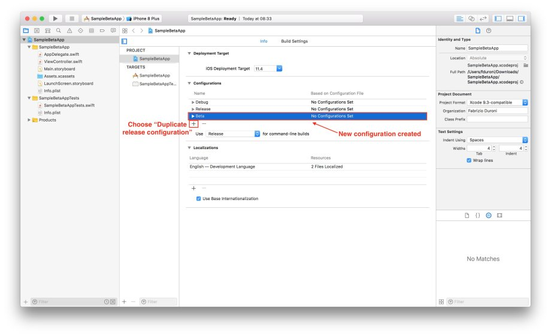
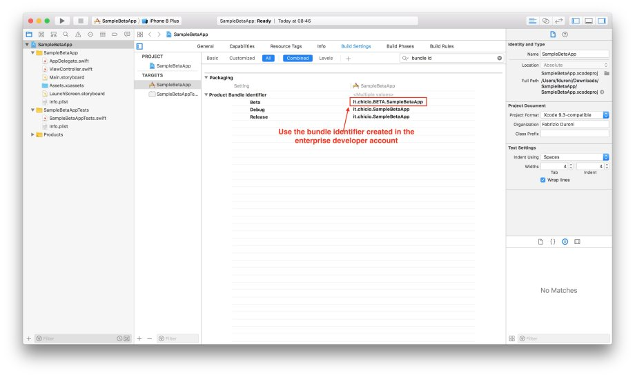
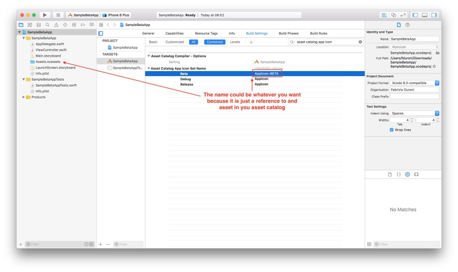
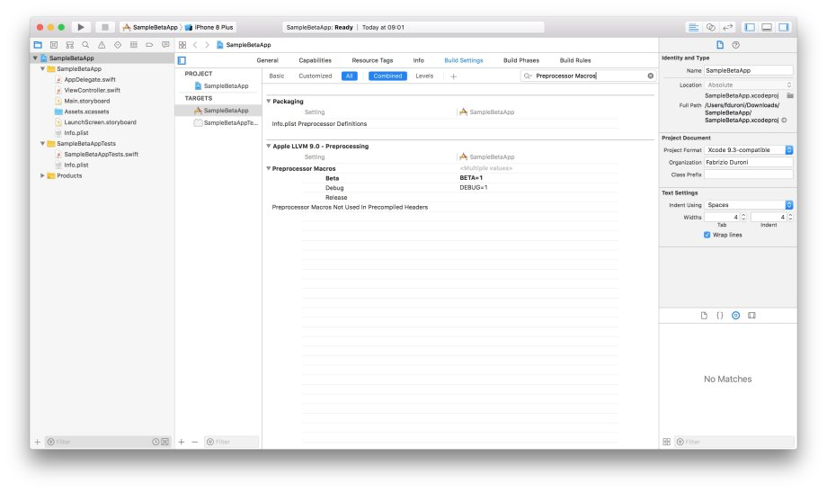
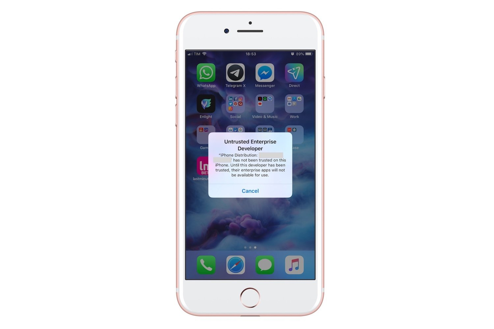

*In this post I will show you how to distribute a beta version of your iOS app using Apple Enterprise Developer
Program.*

---

In a [previous post](/2018/07/04/react-native-typescript-existing-app/ "react native typescript") I talked about
the "app relaunch" project I was involved in the last few months
at [lastminute.com group](https://lmgroup.lastminute.com/ "lastminute.com group"). During one of the last sprint before
the release we started to think about putting in place an internal beta testing program to have more testing data and
eventually discover more bugs before the release on the App Store (we really wanted to eat our food :smile:). We thought
about using the TestFlight environment with external testers. But this solution didn't work for us because:

* we wanted to let everyone in the company be able to install the beta version without the need for any kind of
  registration. The external testers in the TestFlight environment must be registered in the "External Tester" section
  of you app in the App Store Connect (someone said iTunes Connect?!?!?! :stuck_out_tongue_closed_eyes:).
* we wanted to associate the beta with a new bundle id so that we could have a custom monitoring section in
  the [Fabric](https://get.fabric.io/ "Fabric") dashboard.
* we didn't want to go through the "light review" that Apple does each time you want to distribute a new build to your
  external tester. We also wanted to avoid the slow processing timing of TestFlight.

So what do we did? We put in place our custom Beta distribution program
using [Apple Enterprise Developer Program](https://developer.apple.com/programs/enterprise/). By enrolling in this
program you have the ability to distribute you app inside your company without the need of the App Store. You can
basically create your own Company App Store!! :open_mouth:
I worked on the creation of this custom internal Beta distribution program with my
colleague [Giordano Tamburrelli](https://www.linkedin.com/in/giordano-tamburrelli-b532334/ "Giordano Tamburrelli").
Giordano is the Team Leader of the Lynch Team, the agile team where I work at lastminute.com group. He has a Phd in
Computer Science at Politecnico di Milano university and a master degree in Computer Science at the University of
Illinois. He is one of the most skilled person I ever met, both from a technical and managerial point of view (yes you
know, I'm just kissing his ass :kissing_heart::stuck_out_tongue_closed_eyes:). Obviously, he is also one of the biggest
nerd you could ever met :cupid::sparkling_heart:. So how did we decide to proceed? We basically did the following
operation to put in place our beta program:

* Create a new bundle identifier and a new provisioning profile in our enterprise account.
* Create inside our app a new configuration with some customization for the Beta build.
* Add some new scripts to automatize the creation and the upload of new beta ipa
  using [Fastlane](https://fastlane.tools/ "App Release Automation Fastlane"), Jenkins (CI), maven (for the upload) and
  Nexus as our repository manger (we already use all these platforms for the distribution of our release version and to
  store development snapshots of the ipa).
* Put in place a mini website, configured specifically for the distribution of the beta app.

To show you the details and some screenshots of the operation we made I will use a sample project `SampleBetaApp` with
bundle identifier `it.chicio.SampleBetaApp`.  
Let's start from the first step: configuration on the Apple developer account for our new enterprise program. As already
explained before, we decided to create a new bundle identifier for the beta app and obviously a new provisioning
profile. The procedure is basically the same of the standard program for both the bundle identifier and the provisioning
profile. We just need to follow the instruction in the Apple Developer Account site in the section "Certificates,
Identities & Profiles" (and maybe there's a high chance that, if you're reading this post you already release at least
one app on the Apple app store so you already know the stuff to do :smirk:).



After that we created in our iOS project a new Beta configuration by duplicating the release one. In this way we were
able to generate an ipa similar to the release one and were also able to customize some settings of our app.



The Build Setting that we customized are:

* Obviously the bundle identifier. Here we used the one created in the first step (Apple Enterprise developer Account
  configuration). The entry that we modified in the Build settings is named "Product Bundle Identifier".



* The app icon. You can add a new asset in your main assets catalog. The entry that we modified in the Build settings is
  named "Asset Catalog App Icon Set Name".



* We added a new custom preprocessor macro in the "Preprocessor Macros" build setting to be able to detect in our source
  code that we are running a beta version and eventually do some custom stuff. For example we added the build version
  number in the about section only for the beta version. In this way our tester were able to tell us exactly which
  version they were using. This macro is visible only to Objective-C. If you need to do the same thing in Swift you need
  to customize the "Other Swift Flags" field.



Then we created the scripts needed to automatize the build on Jenkins and the upload of our artifacts repository to
Nexus. As I said before we were already using Fastlane to automatize the releases of our app to the store. For the beta
publishing process we decided to create a new lane in our Fastfile where we launch a custom script to do all the
operation needed to publish our beta.

```bash
lane :create_beta_ipa do |options|
  sh './scripts/build_beta.sh'
end
```

As you can see below, in the script `build_beta.sh` we do three things:

* We generate an archive of our app using the `xcodebuild archive` command using the Beta configuration we created
  before. We customized some other options. For example the archive path. At the end of this command we obtain a file
  named `SampleBetaApp.xcarchive` in the folder `<project root>/DerivedData/Beta`.
* Then we exported the ipa by using the `xcodebuild -exportArchive` command. This command needs and `exportOptionsPlist`
  file that contains some exporting options, including the provisioning profile name that must corresponds to the name
  of the provisioning profile we created at the beginning in the Apple Enterprise Developer account. Below the script
  you can find the `exportOptions-SampleBetaApp.plist` sample file for the `SampleBetaApp` project.
* Last but not least, when the ipa is ready we upload it on Nexus using Maven (in the script below you can find some
  placeholder for some of the parameter used :wink:). The command is simple and clear: we are uploading our artifact,
  the ipa, without generating any pom version. One important thing to note: we use always 1 as version, because we
  decided that we don't want to store the beta versions history. We just want to keep the last one we publish.

```bash
#!/usr/bin/env bash

TARGET="SampleBetaApp"
DERIVED_DATA_BETA_PATH="../DerivedData/Beta/"
BETA_TARGET_PATH=$DERIVED_DATA_BETA_PATH$TARGET
XARCHIVE="${BETA_TARGET_PATH}/${TARGET}.xcarchive"
IPA="${BETA_TARGET_PATH}/${TARGET}.ipa"

xcodebuild -workspace ../Container.xcworkspace
            -scheme "$TARGET"
            -sdk iphoneos
            -configuration Beta
            archive -archivePath "$XARCHIVE"

xcodebuild -exportArchive
            -archivePath "$XARCHIVE"
            -exportOptionsPlist "exportOptions-${TARGET}.plist"
            -exportPath "$BETA_TARGET_PATH"

mvn deploy:deploy-file -DgroupId="<group id project identifier>"
                        -DartifactId="$TARGET"
                        -Dversion=1
                        -DgeneratePom=false
                        -DrepositoryId=nexus
                        -Durl="<nexus repository url>"
                        -Dfile="$IPA"
```

```xml
<?xml version="1.0" encoding="UTF-8"?>
<!DOCTYPE plist PUBLIC "-//Apple//DTD PLIST 1.0//EN" "http://www.apple.com/DTDs/PropertyList-1.0.dtd">
<plist version="1.0">
    <dict>
        <key>method</key>
        <string>enterprise</string>
        <key>signingCertificate</key>
        <string>iOS Distribution</string>
        <key>provisioningProfiles</key>
        <dict>
            <key>it.chicio.BETA.SampleBetaApp</key>
            <string>SampleApp Beta Distribution</string>
        </dict>
    </dict>
</plist>
```

At this moment we were ready to create the new Jenkins job to build our beta. We decided to trigger it using Jenkins
webhook triggers. In this way we were able to trigger the build and release of a new beta by just calling an url. This
job basically clone our app repository and then execute the lane `create_beta_ipa` that we defined before in the
Fastlane Fastfile.  
So in the end with all this steps above we obtained an ipa reachable at a public url (on Nexus). We decided to publish
our beta using Github Pages (the same service that runs this website :hearts:). Why? Because we needed a server with
HTTPS already configured. Github pages let us create the beta website really fast. So we created a new account and
published a new html that contains the following code:

```html

<html>
<head>
</head>
<body>
<p>
  <br />
  <br />
  <a href="itms-services://?action=download-manifest&url=<a base url>manifest.plist">
<p>Install the SampleAppBeta app</p>
</a>
</p>
</body>
</html>
```

As you can see above, in this html there's a special link with the protocol `itms-services`. If a user clicks on this
link from Safari browser on a iOS device, the download and the installation of the app will starts. If you look
carefully at the content of the link above, you will notice there's a reference to a url of a **manifest.plist** file.
This is a file generated by Xcode if you export an archive with an enteprise certificate and contains some metadata for
the ipa, including the location/url of the ipa to be downloaded. In our case this url was the Nexus link to the ipa.
This file can be generated the first time and eventually edited if there's any change. This is a sample manifest file
that could be used for our SampleBetaApp.

```xml
<?xml version="1.0" encoding="UTF-8"?>
<!DOCTYPE plist PUBLIC "-//Apple//DTD PLIST 1.0//EN" "http://www.apple.com/DTDs/PropertyList-1.0.dtd">
<plist version="1.0">
    <dict>
        <key>items</key>
        <array>
            <dict>
                <key>assets</key>
                <array>
                    <dict>
                        <key>kind</key>
                        <string>software-package</string>
                        <key>url</key>
                        <string>http://www.example-url-to-where-the-ipa-is.com/SampleBetaApp.ipa</string>
                    </dict>
                    <dict>
                        <key>kind</key>
                        <string>display-image</string>
                        <key>url</key>
                        <string>https://www.example.com/image.57x57.png</string>
                    </dict>
                    <dict>
                        <key>kind</key>
                        <string>full-size-image</string>
                        <key>url</key>
                        <string>https://www.example.com/image.512x512.png</string>
                    </dict>
                </array>
                <key>metadata</key>
                <dict>
                    <key>bundle-identifier</key>
                    <string>it.chicio.SampleBetaApp</string>
                    <key>bundle-version</key>
                    <string>1.0.0</string>
                    <key>kind</key>
                    <string>software</string>
                    <key>title</key>
                    <string>beta-sample.com</string>
                </dict>
            </dict>
        </array>
    </dict>
</plist>
```  

Now we were ready to distribute our beta app, and you know everything is needed to create your own beta program. One
last thing: you will need to explain to the less experienced user that they need to accept the enterprise provisioning
profile from *Settings -> Profiles & Device Management*. If they don't do it they will see the alert contained in the
screenshot below.



That's it!!! Go to your boss and tell her/him you're ready to create you custom iOS beta internal program!!! :
sunglasses::apple:
