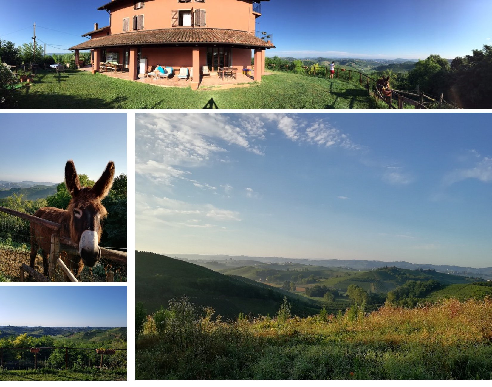
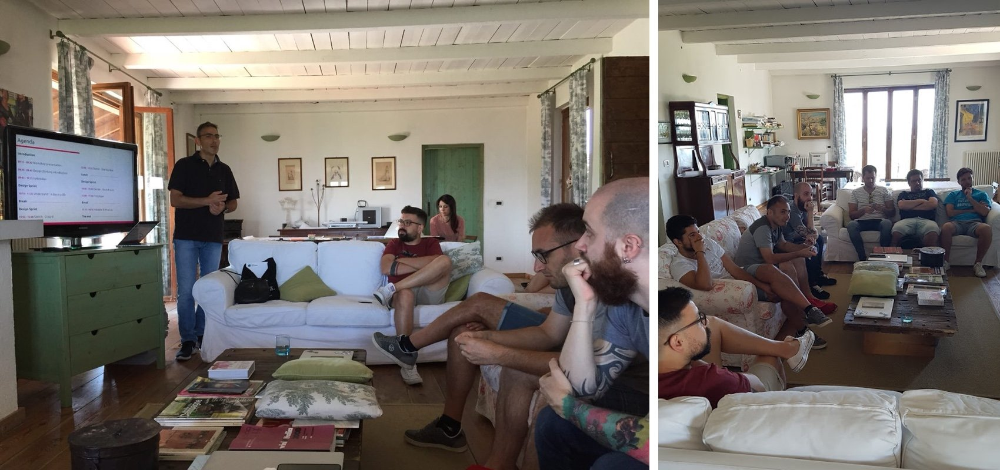
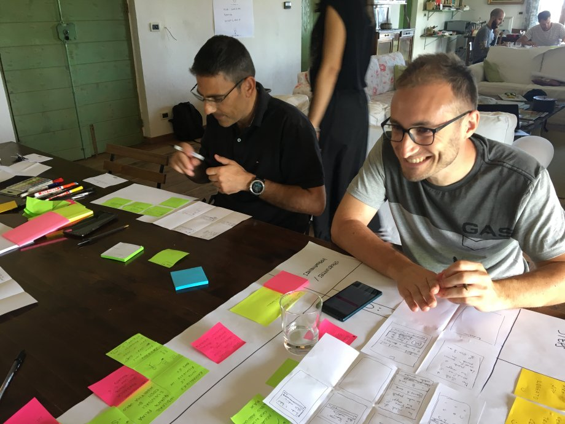
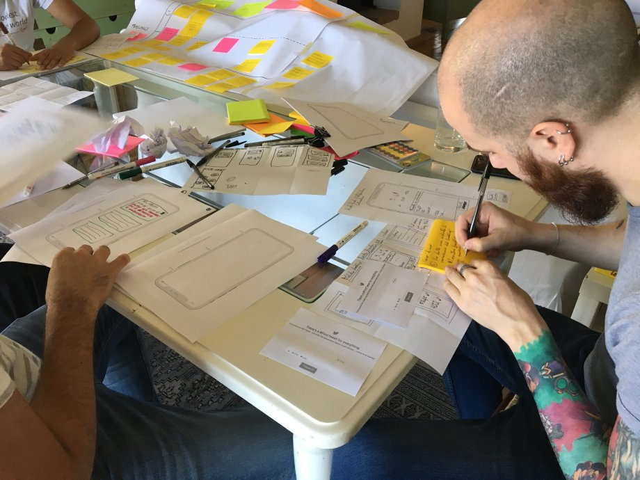
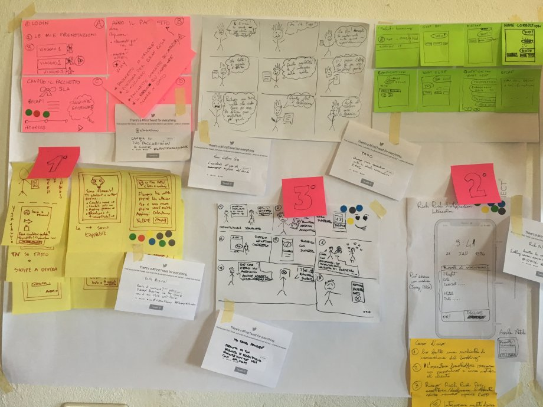
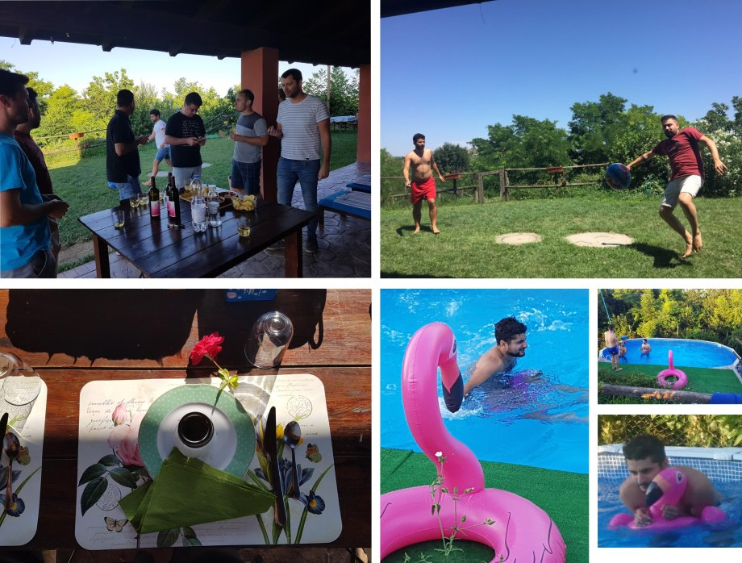

*In this new post I will talk about my experience with design sprint and design thinking during a workshop I attended.*

---

As I already told you in
a [previous post](/2018/07/04/react-native-typescript-existing-app/ "react native typescript"), in the last few
months I worked in the team Lynch at [lastminute.com group](https://lmgroup.lastminute.com/) on a big "app relaunch"
project where we basically rewrote some sections of our main mobile apps using React Native and we did a general restyle
of them with a more modern and engaging design. As a reward for the hard work the team did, our customer area
manager [Elena Bianchini](https://www.linkedin.com/in/elenabianchini/), a manager with many years of experiences in big
companies (e.g. Vodafone), decided to give us a two days retreat with a one day workshop in the location of Castelnuovo
Calcea (Asti) at the bed &
breakfast ["Cascina Il Quercin"](https://www.tripadvisor.it/Hotel_Review-g1186672-d6420387-Reviews-Cascina_Il_Quercin-Castelnuovo_Calcea_Province_of_Asti_Piedmont/)
. Below you can find some photos of this beautiful location (yes, I want you to be envy :grin:)

What was the main topic of the workshop? Well, in this one day workshop our UX team shown us what is the Design Thinking
and the Design Sprint framework and we tried to apply it to came up with a solution for one of the next big projects we
have on the mobile app. Our UX team is composed by:

* [Diletta Assandri](https://www.linkedin.com/in/diletta-assandri-74b75745/ "Diletta Assandri") is a senior UX designer
  with many years of experiences in project all over the world with Accenture Italia. She is truly passionate for her
  work. She is one of the first designer I worked with that listen to what the developers have to say ("NON SI PUÒ
  FARE" (that we could translate as "this can't be done") is one of her biggest nightmares :laughing:).
* [Federica Pisuttu](https://www.linkedin.com/in/federicapisuttu/ "Federica Pisuttu") is the last new entry in the team
  Lynch. She is a Senior UX designer with many years of experience in big companies like Assist Digital and she also
  collaborate with various digital startup.

Let's start from the definition of design thinking and design sprint:

> Design thinking is a method for the practical, creative resolution of problems using the strategies designers use during the process of designing. Design thinking has also been developed as an approach to resolve issues outside of professional design practice, such as in business and social contexts. The design thinking process has various stages including: defining the problem, researching, forming ideas, prototyping and testing. The steps can occur simultaneously and be repeated.
> A design sprint is a five-phase framework that helps answer critical business questions through rapid prototyping and user testing. Sprints let your team reach clearly defined goals and deliverables and gain key learnings, quickly. The process helps spark innovation, encourage user-centered thinking, align your team under a shared vision, and get you to product launch faster.

So design thinking is an approach to design product based on iterations of a series of step that includes: acquire a
deep knowledge of the problem, prototyping and user test your new product ideas. The design sprint is the formalization
of design thinking: it is a time constrained process (usually 5 days) where all the design thinking steps are applied in
sequence. During the workshop we tried to simulate a design sprint. We had just one day, so we compressed all the phases
of a sprint in just a few hours :grin:.

We created two separated teams and then we started our design sprint. Let's see the various phases we went through and
the final result.

### Understand

In the first phase of our design sprint we tried to understand the problem we were approaching. To do this we used an
exercise called "A day in a life". It helped us to think like our users. To apply it:

* Start with the user’s first step or entrance into your product experience.
* Add each step in the journey until the user’s goal has been reached.
* Include descriptions for each step and highlight pain points along the journey.

By the end of this activity we had been able to highlight all the weakest/negative points of the section of the app we
analyzed.

### Crazy 8

The second phase is the crazy 8. Let's see how our UX designers explained us this activity:

> Fold your paper into 8 rectangles. Sketch 1 idea in each rectangle rather than a storyboard. Go for quantity, don’t worry about making these beautiful, these are just for yourself. Try to get beyond your initial idea.

So basically we tried to sketch out some ideas of how we could improve the section we analyzed in previous step by
creating some sketch. As the definition says, in this phase it is better to favor quantity over quality of the sketch.
The more ideas you get, the better it is. So everyone in the two teams started to draw at the speed of light like a 10
years old children :laughing:.

### One big idea

The next phase is called "one big idea". In this phase we had to choose some of the ideas we created during the crazy 8
and try to go deeper in the details. It is basically a selection of ideas: you choose what you think are the best ideas
you created in the crazy 8 phase and you create a new prototype with a little bit more of details. As our UX designers
explained us we had to follow these key points:

* Start outside of the software.
* Focus on emotions.
* Enough fidelity to start building a prototype.

### Decide

In this phase we decided which one were the best ideas created in the previous phases. We decided by doing another
exercise, the "Share & Vote". Basically we had 3 minutes to present our idea. After the presentations each team member
got “budget” of 3 dot stickers: we had to use them to vote what we thought was the best ideas. After voting the best 3
ideas were chosen as the base to create a detail prototype. So the final prototype is a mix of the best ideas created
during the sprint.

### Prototyping

In this phase you need to create some prototype. Which kind of prototype? Let's see again how our UX designer explained
us the features of good prototype:

> Your Sprint is an attempt to identify the solution to a problem. Your prototype is a chance to see how good the ideas from your Decide phase are. To do this you have to make it real enough that you can get a realistic response from a potential user when you’re in the Validate phase.

So in this phase we had to go much deeper in the details of our ideas to get a working prototype that could be used as a
test with some real user. We used some of the famous tools available on the market,
like [balsamiq](https://balsamiq.com/) for example, and for some parts of our prototype we created a real demo.

### Conclusion

That was the end of our workshop (we didn't have enough real user for the validation test). It was very interesting to
be a UX designer just for one day. Honestly, a lot of time I found myself thinking: how can I do a job where I can use
and improve my creativity? Software development requires a lot of creativity, but it is not the same kind of creativity
that is required to be a UX designer :relieved:. I don't think I will ever be a designer but it was a good starting
point to let me try to enter in the mindset of a UX designer (and also life is unpredictable so who knows? :blush:).
Anyway...after the hard work...we had some relaxing moments :relieved:.

To be noted, in the right lower corner you can
see [Alessandro Romano](https://www.linkedin.com/in/alessandroromano92/ "Alessandro Romano") during some swim stunts
with the lastminute.com mascot :laughing:. He is "the clean" a senior frontend developer with many years of experience
that just got graduated from University of Insubria in Varese (student/worker at the same time like I was some years
ago :blush:). So, what do you think about design thinking and design sprint? Let me know in the comments section below :
blush:.
