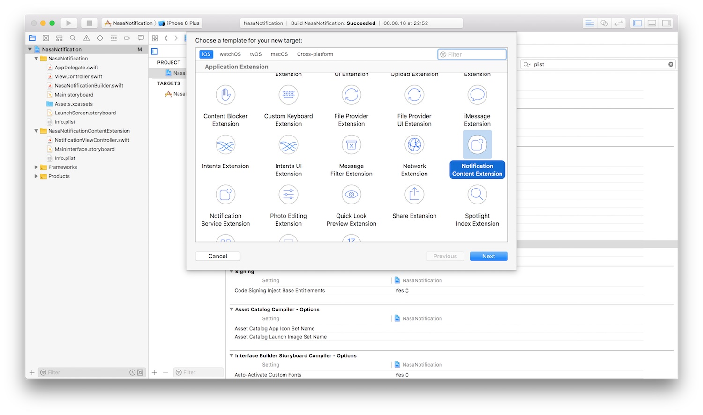
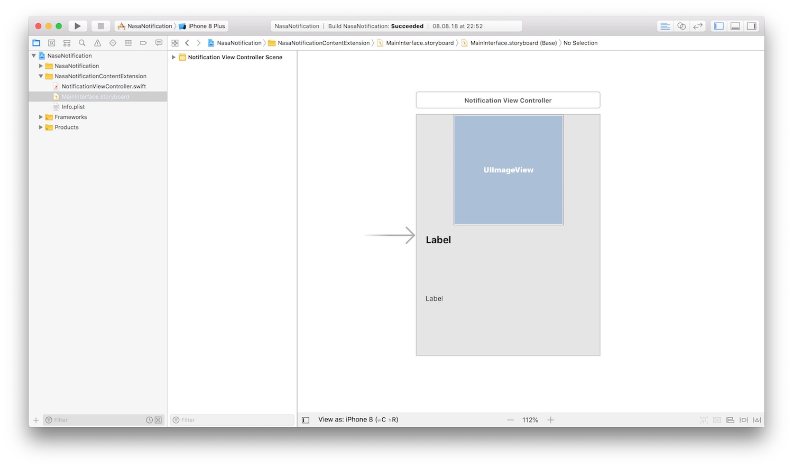

*In this post I will talk about iOS notification customization with Notification Content App Extension.*

---

During a workshop I recently attended I had the opportunity to explore a new interesting app extension type available in
the iOS SDK: Notification Content App Extension. This extension has been added by Apple in iOS 10. By using this
extension it is possible to customize the UI of your push and local notification. In this way you can show more engaging
notification to your users :grin:.  
Let's see an example where we create a notification with custom UI using this extension type. To do that I will use some
assets taken from the [nasa photo journal](https://photojournal.jpl.nasa.gov/ "nasa photo journal"). You can find the
complete example [in this github repository](https://github.com/chicio/Notification-Content-Extension-Example "notification content extension example"). 
Let's start from the beginning: add a Notification Content Extension to your app. To do that just select the + button
in the target section that appears after selecting the xcodeproj file.



The extension that is created contains a `NotificationViewController` that adheres to
the `UNNotificationContentExtension`. The documentation for this protocol says:

> An object that presents a custom interface for a delivered local or remote notification. The UNNotificationContentExtension protocol provides the entry point for a notification content app extension, which displays a custom interface for your app’s notifications. You adopt this protocol in the custom UIViewController subclass that you use to present your interface. You create this type of extension to improve the way your notifications are presented, possibly by adding custom colors and branding, or by incorporating media and other dynamic content into your notification interface.

So if a `UIViewController` inside a Notification Content Extension adhere to the `UNNotificationContentExtension` we are
able to access to the notification content and we can customize its UI. In the extension there's also
a `MainInterface.storyboard` that contains a single controller associated with the `NotificationViewController`
previously mentioned. We can use this storyboard to customize the notification UI using interface builder. So let's
start by defining the interface in the storyboard. Below in the image there's the final result.



Then we can fill the UI with the notification content we receive in
the `func didReceive(_ notification: UNNotification)` of the `NotificationViewController` controller that implements the
protocol shown above. Below you can find its source code.

```swift
import UserNotifications
import UserNotificationsUI

class NotificationViewController: UIViewController, UNNotificationContentExtension {
    @IBOutlet weak var nasaImage: UIImageView!
    @IBOutlet weak var nasaTitle: UILabel!
    @IBOutlet weak var nasaDescription: UILabel!

    func didReceive(_ notification: UNNotification) {
        if let validTitle = notification.request.content.userInfo["title"] as? String,
            let validDescription = notification.request.content.userInfo["description"] as? String,
            let validImageName = notification.request.content.userInfo["imageName"] as? String {
            nasaTitle.text = validTitle
            nasaDescription.text = validDescription
            nasaImage.image = UIImage(named: validImageName)
        }
    }
}
```

Now to test our controller and our new notification UI, we can create a local notification. We will use some data taken
from the nasa photo journal. We will create a `NasaLocalNotificationBuilder` that contains all the notification creation
logic. This is the final result.

```swift
import UserNotifications

class NasaLocalNotificationBuilder {
    private let notificationCenter: UNUserNotificationCenter = UNUserNotificationCenter.current()
    private var notificationActions: [UNNotificationAction] = []
    private var notificationContent = UNMutableNotificationContent()

    func setActions() -> NasaLocalNotificationBuilder {
        notificationActions.append(
            UNNotificationAction(identifier: "view",
                                 title: "View Photo in app",
                                 options: [.foreground, .authenticationRequired])
        )
        notificationActions.append(
            UNNotificationAction(identifier: "skip",
                                 title: "Skip",
                                 options: [])
        )
        return self
    }

    func setCategory() -> NasaLocalNotificationBuilder {
        let notificationCategory = UNNotificationCategory(identifier: "NasaDailyPhoto",
                                                          actions: notificationActions,
                                                          intentIdentifiers: [],
                                                          hiddenPreviewsBodyPlaceholder: "",
                                                          options: .customDismissAction)
        notificationCenter.setNotificationCategories([notificationCategory])
        return self
    }

    func setContent() -> NasaLocalNotificationBuilder {
        notificationContent.title = "Your Nasa Daily Photo"
        notificationContent.body = "Long press to see you daily nasa photo"
        notificationContent.sound = UNNotificationSound.default()
        notificationContent.categoryIdentifier = "NasaDailyPhoto"
        notificationContent.userInfo = [
            "title" : "At the Heart of Orion",
            "description" : """
            Near the center of this sharp cosmic portrait, at the heart of the Orion Nebula, are four hot, massive
            stars known as the Trapezium. Gathered within a region about 1.5 light-years in radius, they dominate the
            core of the dense Orion Nebula Star Cluster. Ultraviolet ionizing radiation from the Trapezium stars,
            mostly from the brightest star Theta-1 Orionis C powers the complex star forming region's entire visible
            glow. About three million years old, the Orion Nebula Cluster was even more compact in its younger years
            and a recent dynamical study indicates that runaway stellar collisions at an earlier age may have formed
            a black hole with more than 100 times the mass of the Sun. The presence of a black hole within the cluster
            could explain the observed high velocities of the Trapezium stars. The Orion Nebula's distance of some
            1,500 light-years would make it the closest known black hole to planet Earth.
            """,
            "imageName" : "orion"
        ]
        return self
    }

    func build() {
        let trigger = UNTimeIntervalNotificationTrigger(timeInterval: 5, repeats: false)
        let request = UNNotificationRequest(identifier: "NasaDailyPhoto",
                                            content: notificationContent,
                                            trigger: trigger)
        notificationCenter.add(request, withCompletionHandler: nil)
    }
}
```  

Then we can call the notification builder in the main controller of the app `ViewController` to generate the
notification.

```swift
class ViewController: UIViewController {
    override func viewDidLoad() {
        super.viewDidLoad()
        NasaLocalNotificationBuilder()
            .setActions()
            .setCategory()
            .setContent()
            .build()
    }
}
```

Now we have to go back in our notification content extension and set some attribute in its `info.plist`. In particular
we have to set:

* `UNNotificationExtensionCategory` to the notification category that we want to customize. In our case we
  use `NasaDailyPhoto`, the value we previously set in the builder
* `UNNotificationExtensionDefaultContentHidden` to hide the standard notification content when the user long press the
  notification.
* if needed it is possible also to set the `UNNotificationExtensionInitialContentSizeRatio` to a value different from 1
  to customize the aspect ratio of our notification.

We're ready to test our implementation. Below you can find a video with the final result of our implementation.

`youtube: https://www.youtube.com/watch?v=7pDTklC4ocY`

That's all for Notification Content App Extension on iOS. Let's start to test them in your app :relaxed:.
