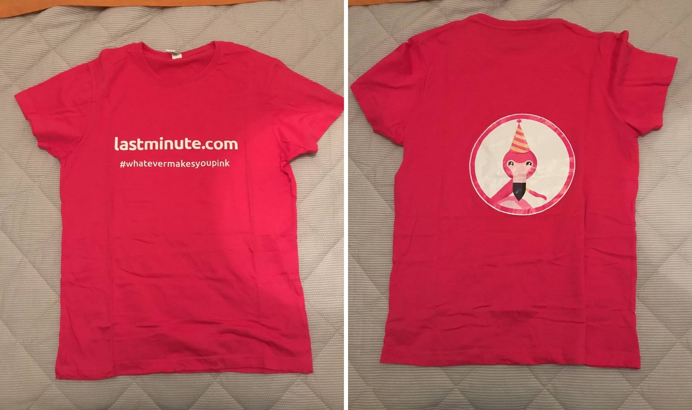
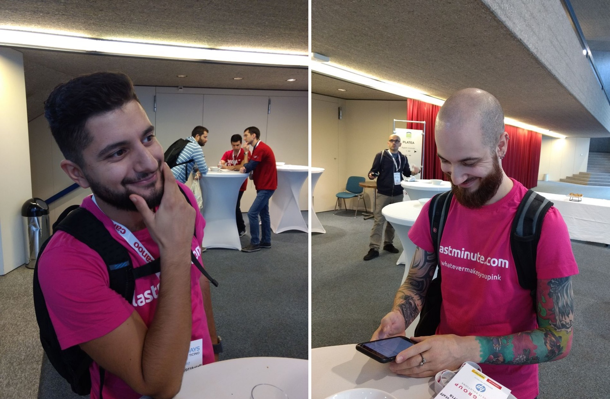
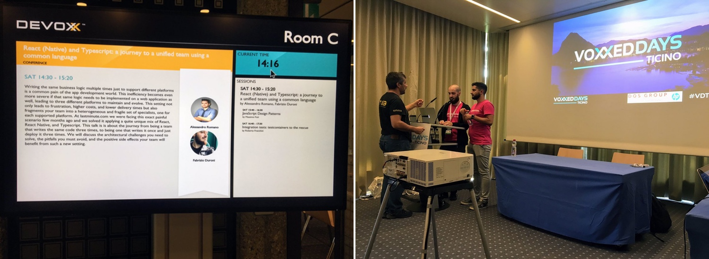
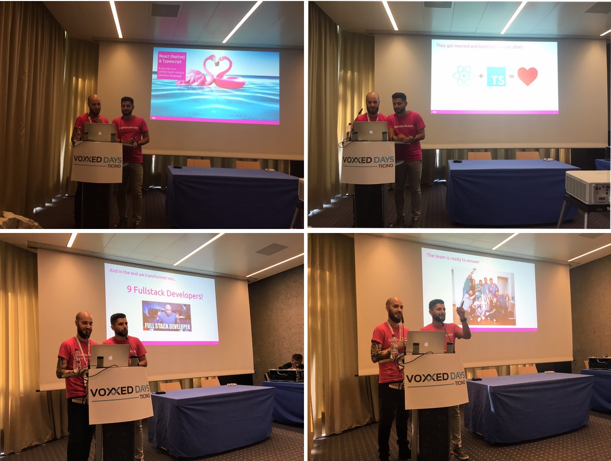
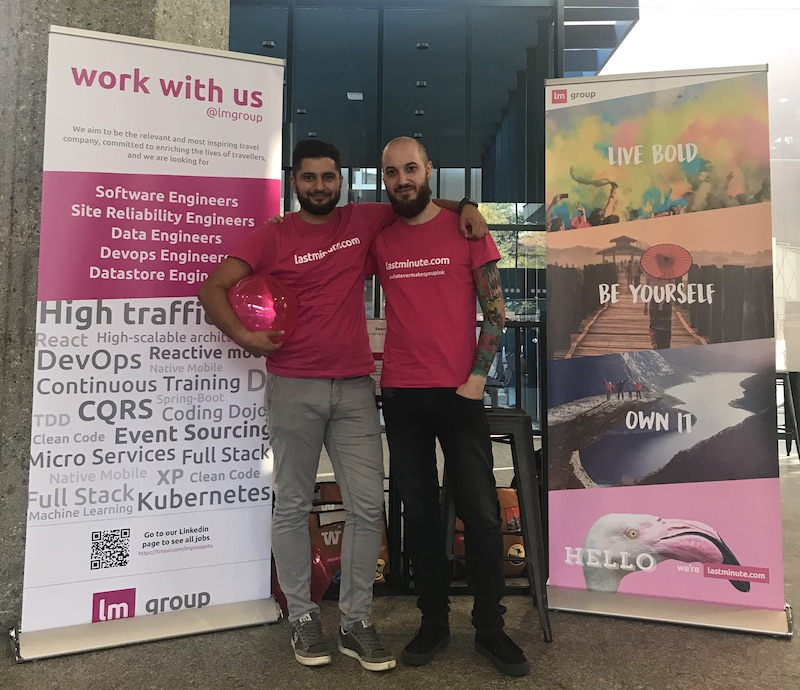

*In this post I will talk about my first experience as a speaker at a conference: a talk about React, React Native and
Typescript with Alessandro Romano.*

---

In the last few months I talked a lot
about [React Native and Typescript](/2018/07/04/react-native-typescript-existing-app/). In the team where I work at
lastminute.com group I acquired a strong knowledge of the Typescript + React + React Native technology stack. There has
been also some few changes in the team: [Emanuele Ianni](https://www.linkedin.com/in/emanueleianni/ "Emanuele Ianni"), (
do you remember I already talked about him [in my previous post?](/2018/03/20/golden-master-test-characterization-test-legacy-code/)),
my technical team leader left the company. He was supposed to do a talk at Voxxed 2018 about our journey as a team into the world of React
+ React Native + Typescript. So I got the opportunity to go in his place to the Voxxed as a co-speaker
of [Alessandro Romano](https://www.linkedin.com/in/alessandroromano92/ "Alessandro Romano"), my other colleague selected
as a speaker for this event. Alessandro, also known as "the Clean", is a senior software developer with many years of
experience that just got graduated from University of Insubria in Varese (do you remember
I [already talked also about him?](/2018/08/02/design-thinking-design-sprint-workshop/)). The title of the talk
was: **React (Native) & Typescript: A journey to a unified team using a common language**. In this post I will talk
about all the process we went into from the first draft preparation until the talk :grin:.

### Slides preparation

Let's start from the slides preparation. I started to work on the presentation with Alessandro two months before the
event. We decided to structure our talk as a story telling. We begin describing how our team was composed and how we
applied agile methodologies: basically, we were divided in three silos, back-end, front-end and mobile doing separated
user stories and ceremonies. Then we embraced a new journey, we challenged ourself to become a feature team having
end-to-end user stories and unified ceremonies. The technology stack we chose was the main facilitator of this process
and eventually transformed us into the mythological creature of the full-stack developer and it was composed of:

* TypeScript as common language
* React for the frontend of the customer area (manage all the products of your booking) of our websites
* React Native for the frontend of the mobile apps of our main brands

After this introduction we created a section for each of the technology above were we described the pros and cons of
each one. Last but not least we presented the Cross Selling feature: a real use case in which we were able to share the
business logic between the two environments using a pure TypeScript library.

### Company dry run, feedback and final present

When the presentation was ready we planned an internal dry run. We usually call this kind of meetings "schiscia time"
because they are planned during lunch time: the participants will enjoy their launch while the speakers show their
stuff. So we planned our "schiscia time" for the 8th October. A lot of colleagues attended the talk and gave some very
useful feedback. The two major observation we received were:

* **less coding**. We created a lot of slides with screenshots taken directly from our IDEs with a lot of code,
  especially in the section of the presentation where we described the new technology stack we "married". They were not
  so easy to read and in some cases they were actually stealing the focus of our attendees. So we decided to remove
  them. The only slides with code that we kept were the ones in the section "Share the code: cross selling feature"
  where we present a real use case of development on our products. On this slides we changed the IDEs screenshots with
  some formatted code using a syntax highlighter (and honestly, after that change the slides looked much more
  beautiful :heart_eyes:).

* **more focus on the journey**. A lot of our colleagues told us that from the presentation they didn't feel what it
  took to transform ourselves from platform specific developer to the mythological creature of the full-stack developer.
  In our presentation there were a lot details about React, React Native and TypeScript but not as much on our workflow
  with the new technology stack. In fact after choosing React + React Native + TypeScript we started to:
    * do pair programming without considering the technology skills
    * do end-to-end user stories, from the backend service to the frontend (mobile app and web)

So we started to review the slides and we basically created a new presentation :smile:. It took us almost a week. After
the review we made 2 simulations of the entire presentation during the week before the event to be more confident. Last
but not least, the Human Resources department gave us a company t-shirt to promote our company brand at the conference.

### The talk

Then the day of the talk arrived after a not so quiet sleep. The Voxxed Days 2018 in Ticino was set to take place on
20th of October. We arrived at the "Palazzo dei Congressi" in Lugano at 8.45 AM. We were excited to queue in the
dedicated speakers area for the first time after so many conferences attended! We checked-in and got our shiny speaker
badge. Then we moved to the lounge section to enjoy breakfast.

Our talk was planned at 2.30 PM, so we had time to attend some other sessions. At 11.50 AM we decided to do a last
presentation simulation to review some details and then we went to lunch. At 2.00 PM we started to feel the strain. The
start of our talk was really close. We entered in the room of our session at 2.15 PM and we did the setup of our laptop
for the presentation.

Then the room started to fill in. As scheduled at 2.30 PM we started our presentation. The presentation went smooth. We
kept the scheduled time per slide we planned in our simulation. The change of speaker between the various part of the
presentation worked perfectly. At the end we answered to some questions and we received applause from the audience.

### Conclusion

That's all for my first experience as a conference speaker. It has been a good experience. After 10 years in the IT
field (had I already been working for 10 years?!??! :cold_sweat:) it was a great pleasure to be on the other side of the
stage.

Special thanks to all the team Lynch that give me the opportunity to be the "replacement" speaker for this conference.
Special thanks also to  [Alessandro Romano](https://www.linkedin.com/in/alessandroromano92/ "Alessandro Romano") "the
clean". He is one of the best co-speaker and coworker you could ever find :heart:. If you want to know more about the
topic of our presentation, below you can find the full session recorded :bowtie:.

`youtube: https://www.youtube.com/watch?v=1x2B7S0XJU4`
