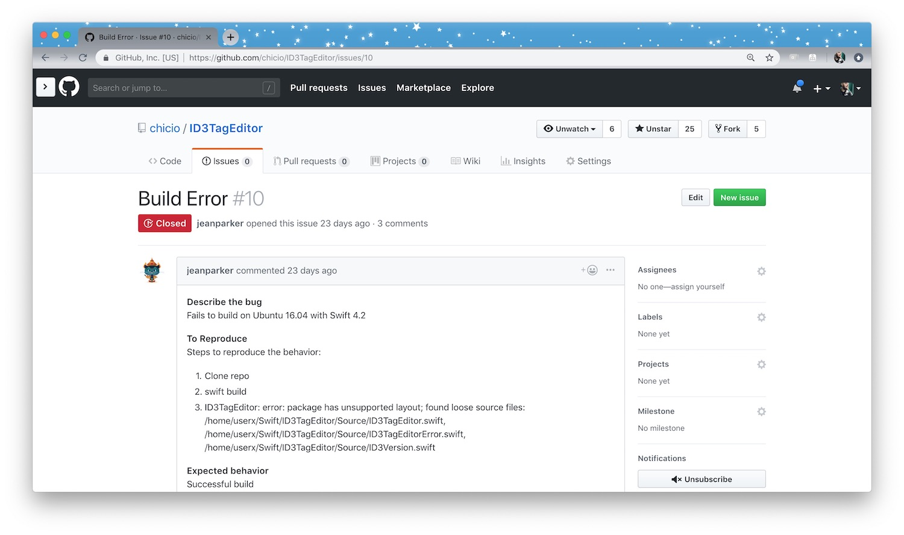
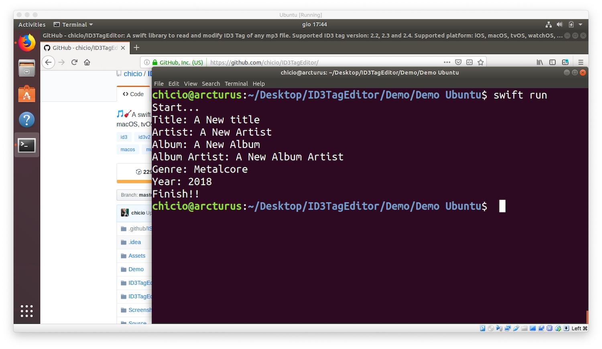
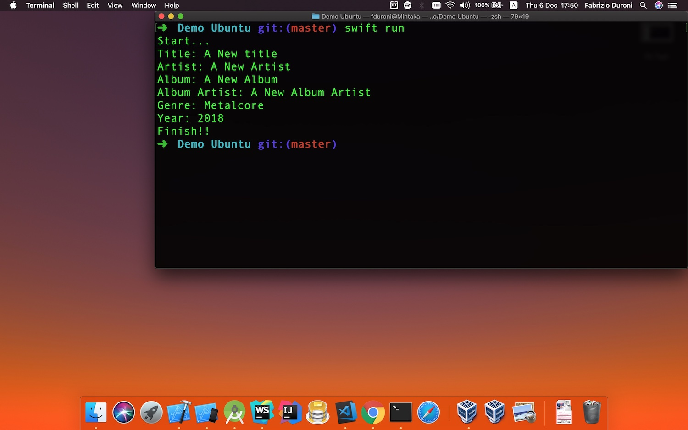

*In this post I will talk about how to create a Swift library compatible with macOS and Linux.*

---

A few times ago I published [ID3TagEditor](https://github.com/chicio/ID3TagEditor), a Swift library to read and modify
the ID3 tag of mp3 files (I described it
in [this previous post](https://www.fabrizioduroni.it/2018/05/08/id3tageditor-swift-read-write-id3-tag-mp3/ "id3 tag editor"))
. This library was compatible with iOS, Apple TV, watchOS and macOS. Then one day a user of my library **opened a new
issue on the library github repo** with title "Build Error" and a description of a **build error on Linux**.



The library had a simple `Package.swift`, but honestly I never tested it with the Swift Package Manager (SPM) on Linux
nor on macOS :sweat_smile: (this was the only feature that I didn't test :sweat_smile:). So I though: "It's time to add
full support for the Swift Package Manager to ID3TagEditor and port it also on Linux!!!!" :sparkling_heart: In this post
I will describe how you can create a Swift library package for the Swift Package Manager compatible with macOS and Linux
for an existing project. Obviously, I will show you the entire process using
my [ID3TagEditor](https://github.com/chicio/ID3TagEditor) as example.  
First of all, if you are starting with a new library project, you will use the following SPM `init` command:

```shell
swift package init --type library
```

This command will create all the files and folders you need to develop your library. But in my case, I was working on an
existing project. This is why I created all the needed files manually and I will describe them in details so you can
understand better the meaning of each one of them.  
The first file needed is the `Package.swift`. This file must be created in the root folder of your project. This file
contains some Swift code that defines the properties of the project using the `PackageDescription` module API. At the
moment of this writing there are 3 API versions of the PackageDescription API:

* [Version 3](https://github.com/apple/swift-package-manager/blob/b73299ef84e1e55c789052d0d1eafec30a95a805/Documentation/PackageDescriptionV3.md)
* [Version 4](https://github.com/apple/swift-package-manager/blob/b73299ef84e1e55c789052d0d1eafec30a95a805/Documentation/PackageDescriptionV4.md)
* [Version 4.2](https://github.com/apple/swift-package-manager/blob/b73299ef84e1e55c789052d0d1eafec30a95a805/Documentation/PackageDescriptionV4_2.md)

For my [ID3TagEditor](https://github.com/chicio/ID3TagEditor) I used
the [Version 4.2](https://github.com/apple/swift-package-manager/blob/b73299ef84e1e55c789052d0d1eafec30a95a805/Documentation/PackageDescriptionV4_2.md)
.

 ```swift
 // swift-tools-version:4.2

 import PackageDescription

 let package = Package(
     name: "ID3TagEditor",
     products: [
         .library(
             name: "ID3TagEditor",
             targets: ["ID3TagEditor"]
         ),
     ],
     dependencies: [],
     targets: [
         .target(
             name: "ID3TagEditor",
             dependencies: [],
             path: "./Source"
         ),
         .testTarget(
             name: "ID3TagEditorTests",
             dependencies: ["ID3TagEditor"],
             path: "./Tests",
             exclude: [
                 "Parsing/Frame/Content/Size/ID3FrameContentSizeParserTest.swift",
                 "Parsing/Frame/Content/Operation/ID3FrameStringContentParsingOperationTest.swift",
                 "Parsing/Frame/Size/ID3FrameSizeParserTest.swift",
                 "Parsing/Tag/Size/ID3TagSizeParserTest.swift",
                 "Parsing/Tag/Version/ID3TagVersionParserTest.swift",
                 "Acceptance/ID3TagEditorTestAcceptanceTest.swift",
                 "Mp3/Mp3FileReaderTest.swift"
             ]
         ),
     ],
     swiftLanguageVersions: [.v4_2]
 )
 ```

Let's see in details the meaning of each option:

* `name`, the name of the package
* `products`, the list of all products in the package. You can have `executable` or `library` products. In my case I
  have `library` product and for that I have to specify:
    * `name`, the name of the product
    * `targets`, the targets which are supposed to be used by other packages, i.e. the public API of a library package
* `dependencies`, a list of `package` dependencies for our package. At the moment ID3TagEditor doesn't have any
  dependencies so I declared an empty array.
* `targets`, the list of targets in the package. In my case I have two target:
    * `ID3TagEditor`, that is the main target of the library and is a classic `.target`. For this target you specify its
      name, its dependencies and the path to the source files. In my case I have everything inside the `Source` folder.
    * `ID3TagEditorTests`, that is the `.testTarget` of the library. For this target I had to specify an
      additional `exclude` option. The tests excluded contains some references to bundle resources, **and at the moment
      of this writing the SPM doesn't support resource bundles**.
* `swiftLanguageVersions`, that contains the set of supported Swift language versions.

Next I had to create a `XCTestManifests.swift` file inside the `Tests` folder. This file contains an extension for
each `XCTestCase` subclass I included in my test target. This extension contains an array `__allTest` that exposes a
list of all my test methods inside my `XCTestCase` subclasses. At the end of this file you can find a `__allTests()`
function that pass all the test methods to the `testCase()` utility function.  `__allTests()` and `testCase` are
available only on Linux platform (and in fact the `__allTests()` function is wrapped in a conditional
check `#if !os(macOS)`). Below you can see a part of the `XCTestManifests.swift` file for the `ID3TagEditor` library.

```swift
import XCTest

extension ID3AlbumArtistFrameCreatorTest {
    static let __allTests = [
        ("testFrameCreationWhenThereIsAnAlbumArtist", testFrameCreationWhenThereIsAnAlbumArtist),
        ("testNoFrameCreationWhenThereIsNoAlbumArtist", testNoFrameCreationWhenThereIsNoAlbumArtist),
    ]
}

extension ID3AlbumFrameCreatorTest {
    static let __allTests = [
        ("testFrameCreationWhenThereIsAnAlbum", testFrameCreationWhenThereIsAnAlbum),
        ("testNoFrameCreationWhenThereIsNoAlbum", testNoFrameCreationWhenThereIsNoAlbum),
    ]
}

extension ID3ArtistFrameCreatorTest {
    static let __allTests = [
        ("testFrameCreationWhenThereIsAnArtist", testFrameCreationWhenThereIsAnArtist),
        ("testNoFrameCreationWhenThereIsNoArtist", testNoFrameCreationWhenThereIsNoArtist),
    ]
}

//other extensions, one for each unit test class...
...

#if !os(macOS)
public func __allTests() -> [XCTestCaseEntry] {
    return [
        testCase(ID3AlbumArtistFrameCreatorTest.__allTests),
        testCase(ID3AlbumFrameCreatorTest.__allTests),
        testCase(ID3ArtistFrameCreatorTest.__allTests),
        ...
    ]
}
#endif
```

Next I created a `LinuxMain.swift` file in the root folder of my ID3TagEditor project. This file loads all the test on
Linux (using the functions and extensions defined in the previous `XCTestManifests.swift` file).

```swift
import XCTest

import ID3TagEditorTests

var tests = [XCTestCaseEntry]()
tests += ID3TagEditorTests.__allTests()

XCTMain(tests)
```

Now I was ready to test `ID3TagEditor` using the SPM on macOS and Linux. To do this I used Ubuntu as distro. The distro
version used at the moment of this writing is the 18.04 LTS.  
First of all, how do I install Swift on linux? I downloaded the Swift release for Linux from
the [Swift download page](https://swift.org/download/ "swift download page"). The version I used is the one you can find
at [this link](https://swift.org/builds/swift-4.2.1-release/ubuntu1804/swift-4.2.1-RELEASE/swift-4.2.1-RELEASE-ubuntu18.04.tar.gz)
. Then I installed the additional packages `clang` and `libicu-dev` with the following shell command.

```shell
sudo apt-get install clang libicu-dev
```

Then I extracted from the archive previously downloaded the Swift release folder and I added to my shell environment
variable `PATH` the path to /usr/bin folder contained inside the this release folder.

```shell
tar xzf swift-<VERSION>-<PLATFORM>.tar.gz

//Add this to your shell profile file
export PATH=/<path to the Swift release folder>/usr/bin:"${PATH}"
```

The setup was done. Now I was able to test  `ID3TagEditor` as a SPM library on Linux. To do this I created a new project
inside the demo folder of the ID3TagEditor project called `Demo Ubuntu`. This is an executable SPM project that
has `ID3TagEditor` as package dependencies. The executable is a command line application that opens a mp3 file, parses
its ID3 tag and print it to the standard output. To test my work I just cloned the `ID3TagEditor` on Linux (and also on
macOS :stuck_out_tongue_winking_eye:) and launched the following commands in the root folder of the `Demo Ubuntu`
project:

```shell
swift build
swift run
```

Below you can see some screenshot taken from both Linux and macOS that shows the final output of the demo `Demo Ubuntu`
after you execute the `swift run` command.





Cool! Now the ID3TagEditor is fully compatible with the SPM and could be used in Swift applications for both macOS and
Linux. You can see the entire codebase of the `ID3TagEditor`
in [this github repository](https://github.com/chicio/ID3TagEditor). Now you can start to port your libraries and
applications on Linux with the Swift Package Manager :sparkles:.
