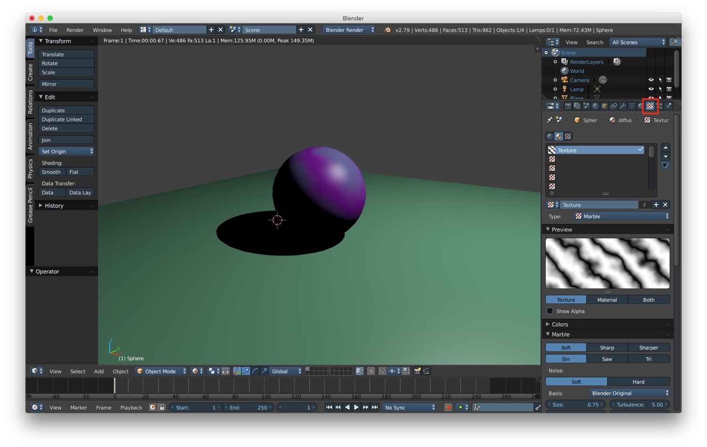
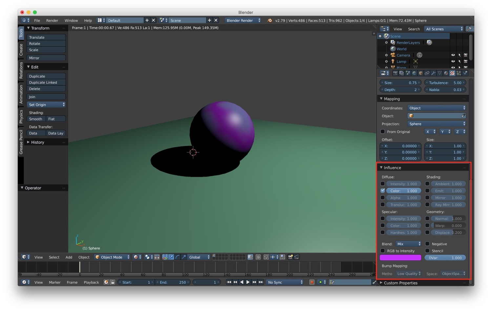
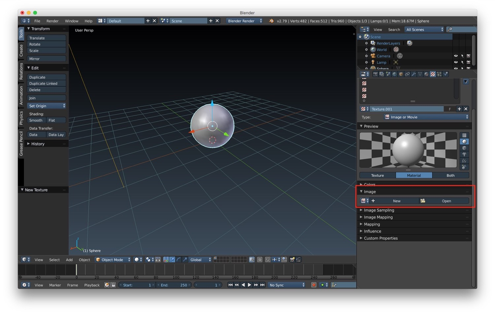
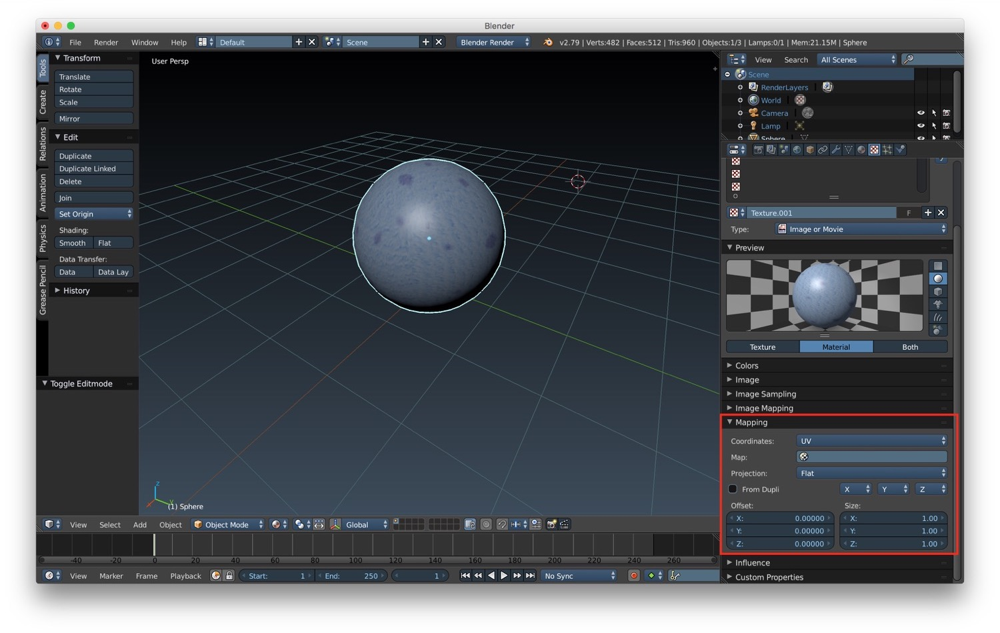
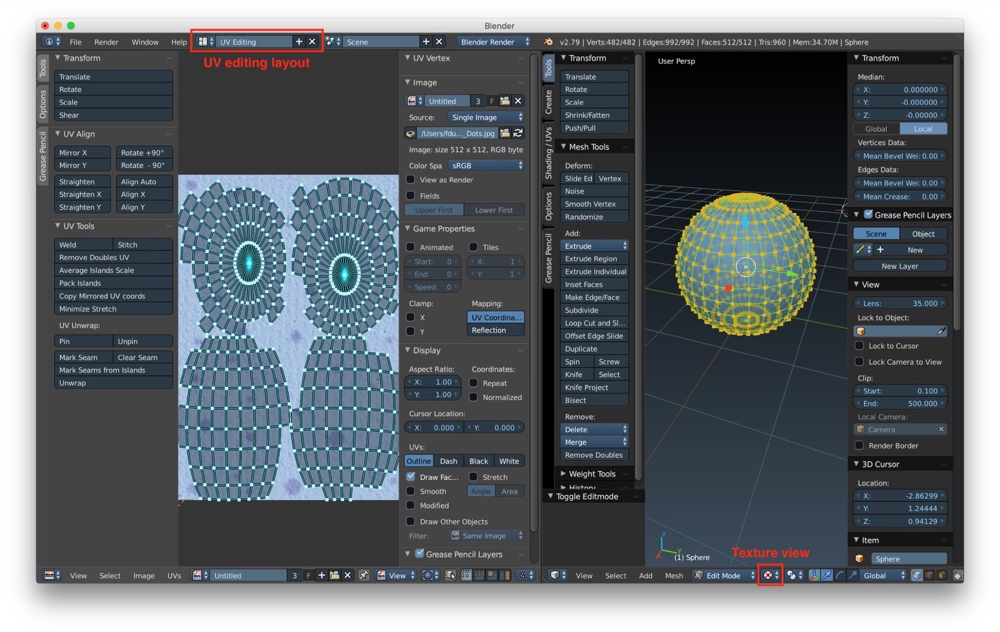
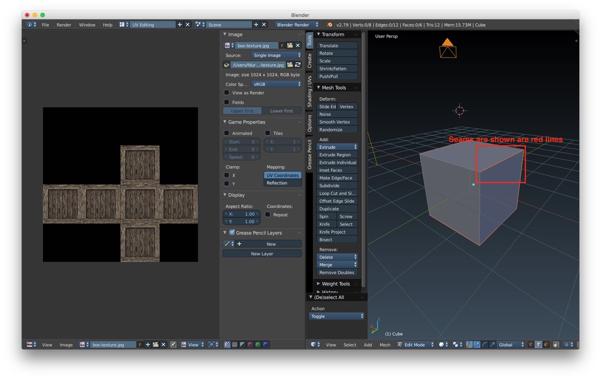
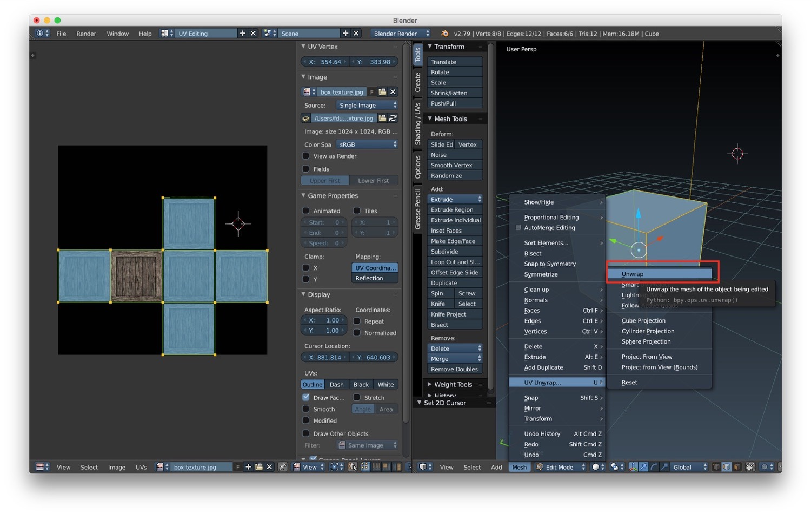
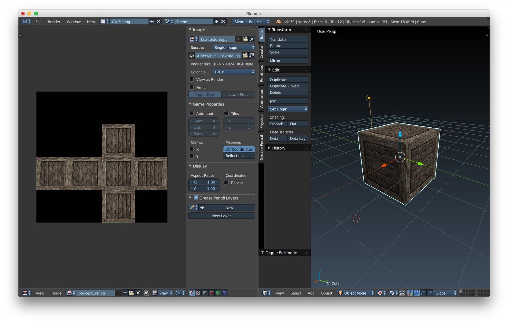
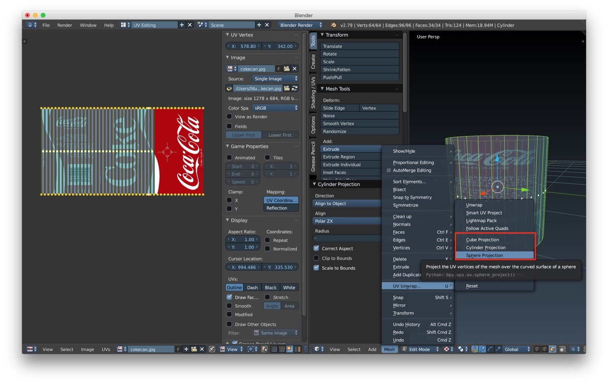

*In this new post of the series Blender tutorial I will talk about textures.*

---

In the [previous post of the series "Blender tutorial"](/2019/03/21/blender-tutorial-7-materials/) we talked about
materials in Blender. In this post we will start to learn how to use textures.  
As you may already know, textures are useful to add realism to a material. We can manage textures from the texture tab
inside the properties panel. From that panel we can create a new texture by clicking on the + button. After creating a
new texture, some options are displayed that let us customize how the texture looks like. The type of texture we select
changes the options displayed: there will be a specific section of properties for the type we choose.

In the various section of the texture panel we have the "influence section". This section is very important because it
let us customize how the texture will affect the final material. This means that we can use textures to change not only
the final color of the material but also the shading components, geometry, specular highlight and so on.

To add the image to be used as texture we have to select the type "Image or movie". After that we can scroll in the
option of the texture to the Image section and we can choose between create a new image or open an existing one.

After that we need to define the mapping of the texture on the surface. We can find this section by scrolling down in
the texture tab. The most important option here is "Coordinates". This option let us define the mapping of texture
coordinates on the image. By default is set to generated, that means that the coordinates are generated by blender for
the defaults primitives. Then there's the UV option, that maps to coordinates baked into the object.

Remember that after an images has been selected as texture, it will not be shown in the 3D window if we choose the
texture visualization unless we load it in the UV editor. To do it choose UV editing layout and load the texture using
the open button.

The UV editor is the main tool to work with texture. By using it we can precisely apply a texture to an object using the
unwrap texture tools. To do this we need first to define seams. Seams (as in sewing) are where the ends of a mesh are
sewn together. Blender uses seams to understand where to unwrap the mesh. We can defines seams by selecting the edges we
want to mark and use the menu Mesh -> Edges -> Mark Seams. We can recognized seams as they are reported as red lines in
the 3D window.

The we can unwrap the mesh by just selecting Mesh -> UV unwrap -> Unwrap. After that we can scale, translate and rotate
the unwrapped mesh to fit into the texture. After that we will finally see the texture on our mesh.

We can also create projection mapping using the UV projection. This basically means projecting a sphere, cylinder or a
cube onto our project to get some rough mapping that we can tweak later. We can find UV projection under Mesh -> UV
Unwrap -> <Sphere/Cylinder/Cube> projection.

In the next post we will talk about other textures technique available in Blender.
