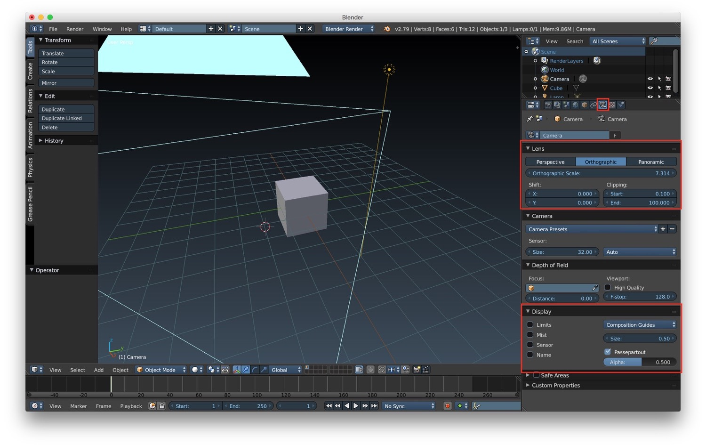
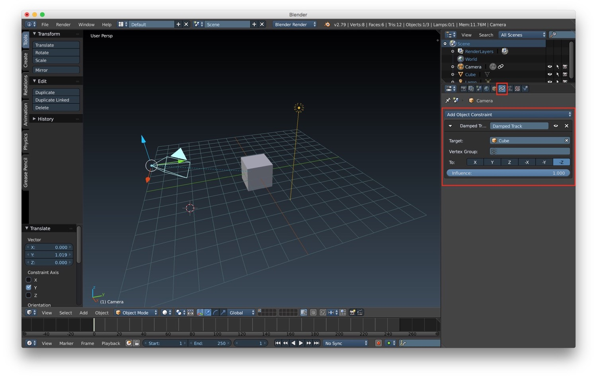
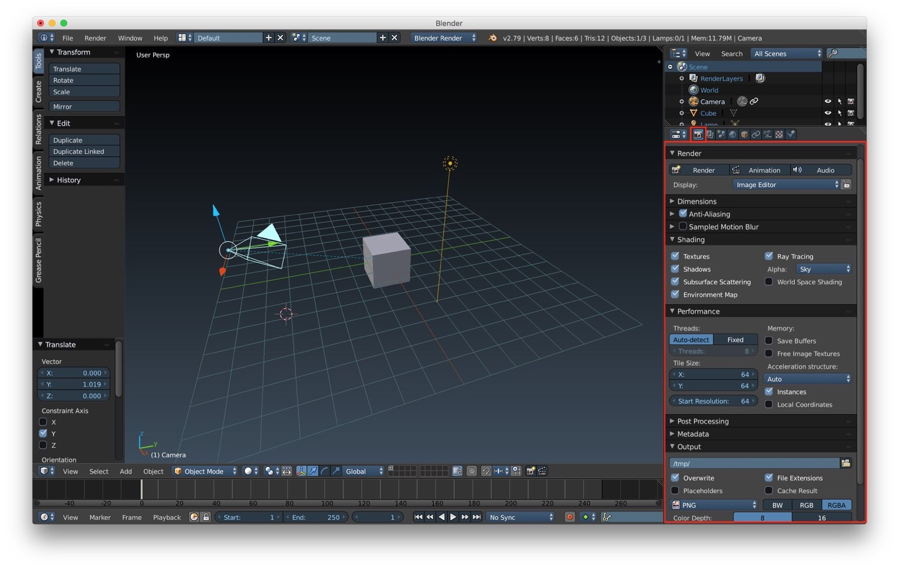
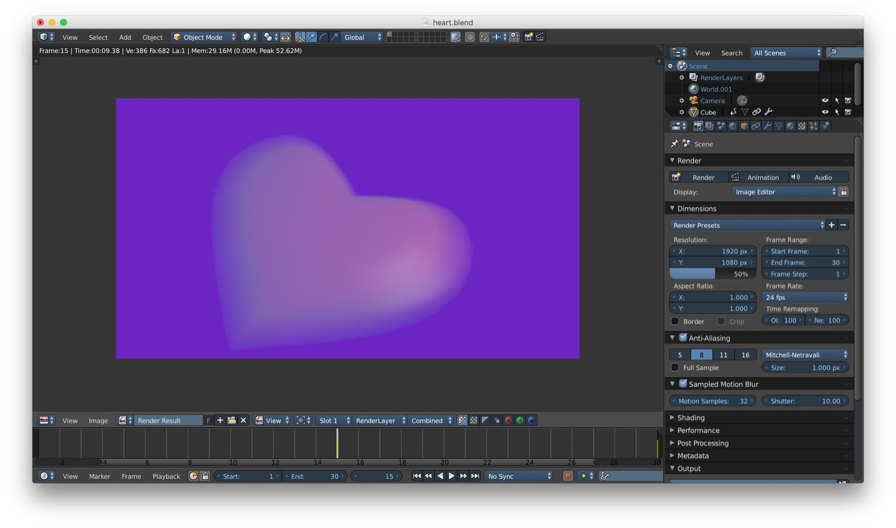
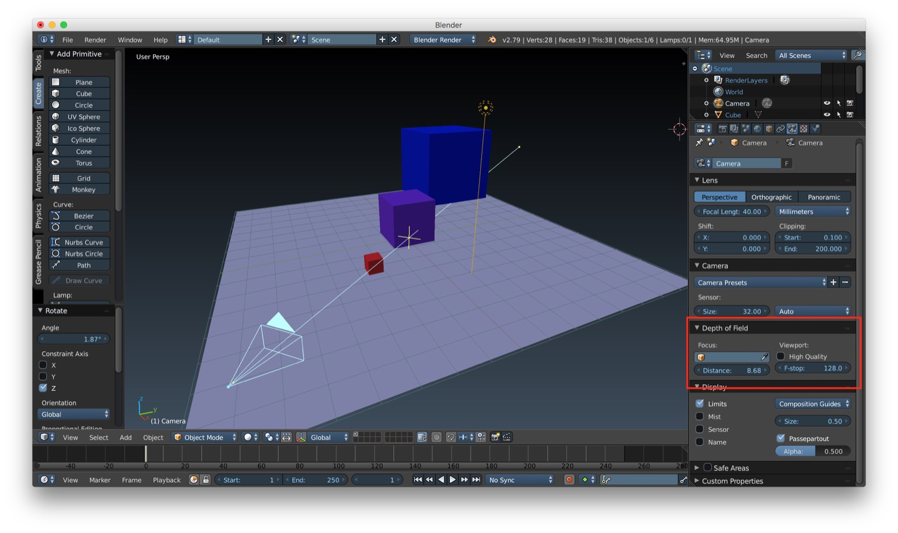
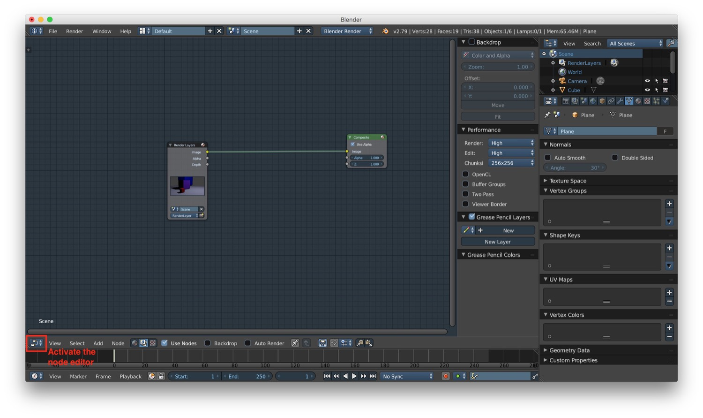
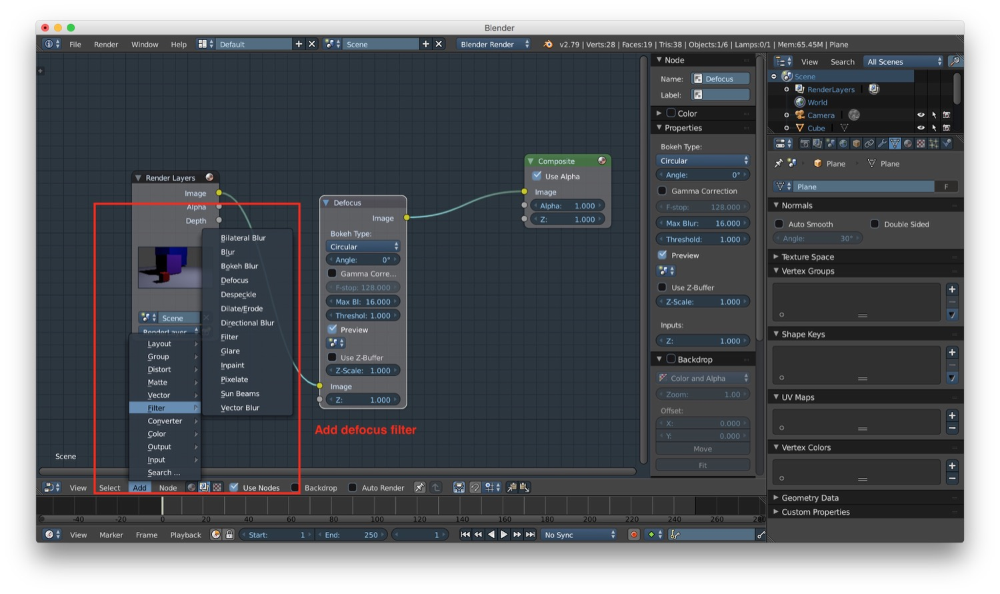
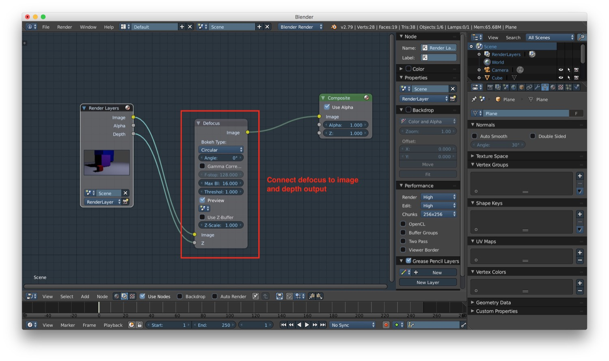
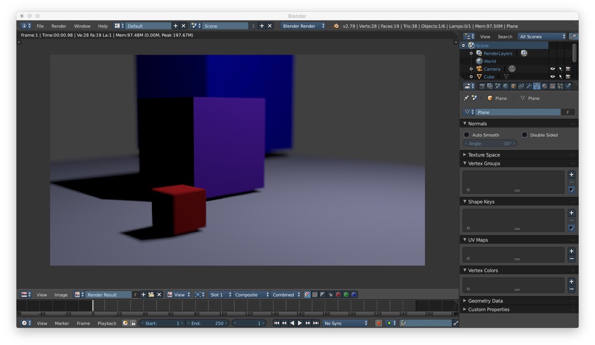

*In this new post of the series Blender tutorial I will talk about camera and rendering.*

---

In the [previous post of the series "Blender tutorial"](/2019/03/25/blender-tutorial-11-light-part-2/) we talked
about light in Blender. In this post we will talk about camera and rendering. Let's start from camera.  
If we select a camera, we can access its properties from the specific camera tab in the properties panel. Here we have a
section called "Display", that let us customize how we see the camera in the viewport (limits, names and so on). Then we
have a "Lens" section, where we can choose the type of the camera:

* orthogonal
* perspective
* panoramic

For the perspective camera we can change:

* the focal length
* the shift, so as the word say we can change the shift of the camera from its center
* the clipping, the start end distance between which the object see by the camera will be rendered.

For the orthographic camera the most important parameter is the orthographic scale, that represent the maximum
dimension (in scene units) of the portion of space captured from the camera.

We can place cameras manually or we can use constraints. We can create a constraint by clicking the specific constraint
tab (the one with the chain as icon) in the properties panel of the camera and add a new constraint. We can use for
example a Damped Track and correlate the movement of our camera to the position of an object we select as the one to be
tracked.

For what concerns rendering, we have the possibility to control it in the properties panel under the render tab (the one
with the camera). For example we can customize where the render will happen. By default the render will show the result
in the image editor, but we can change it by selecting one of the available option in the list. We can change the
dimensions of the render result in terms of width/height but also in terms of FPS. We will see why this parameter is
important in a future post about **animations**. We can also customize the algorithm used for anti aliasing. Very
important, we can also customize the shading option (as we already see in a previous post about shadows), the
performance (for example by adjusting the number of thread that Blender will be allowed to use), and the format of final
output of the rendering.

As we said before in Blender it is possible to render animation. We will go through all the details about animation in a
future post. For now we can see how to achieve cool rendering effects, for example motion blur. The motion blur is an
effect you have when an object is moving in the length of the exposure of the camera. We can achieve this effect by
activating it in the rendering properties and setting the number of motion sample we want. We can also modify the
shutter to change the final result of the motion blur (the default value for samples is 1, and we need to modify it
because with the value of 1 we will have no motion blur).

One last effect we can achieve with the Blender render is depth of field. This effect simulate the fact that only a part
of the scene is in focus, based on the focal distance from the camera. To setup the depth of field in our scene, first
of all we have to activate it by increasing the distance option in the depth of field section of the camera properties.

After that we have to switch to the node editor, add a defocus filter, and connect the render image and depth to the
filter, and again the image to the composite final result.

That's all for camera and rendering. In the next post we will talk about animation.
