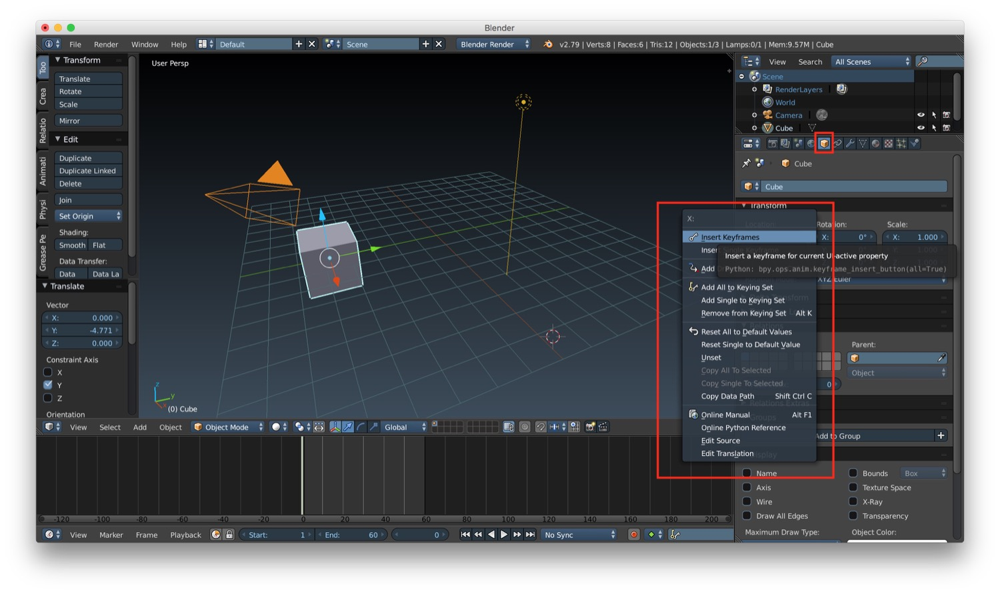
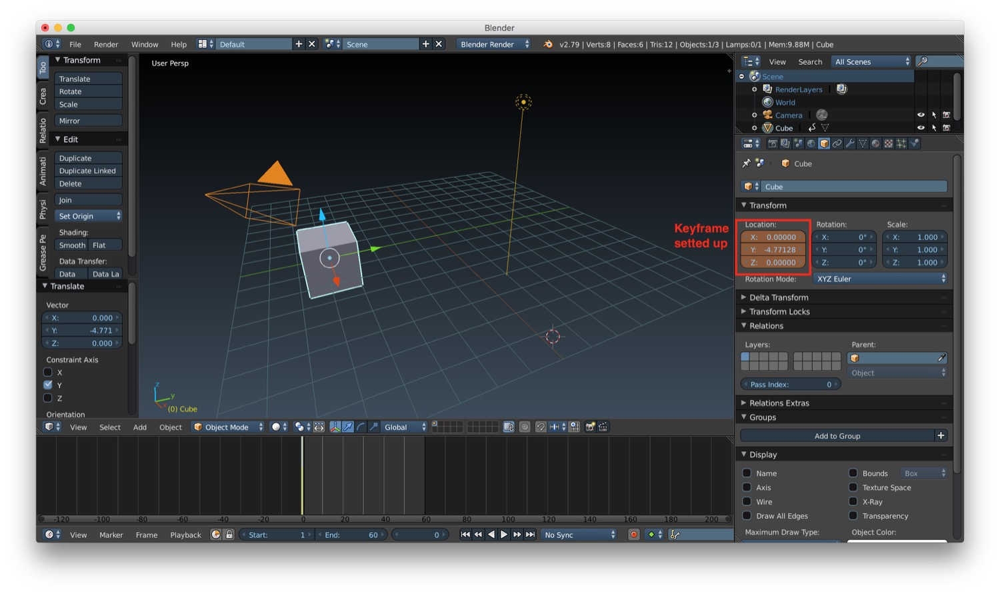
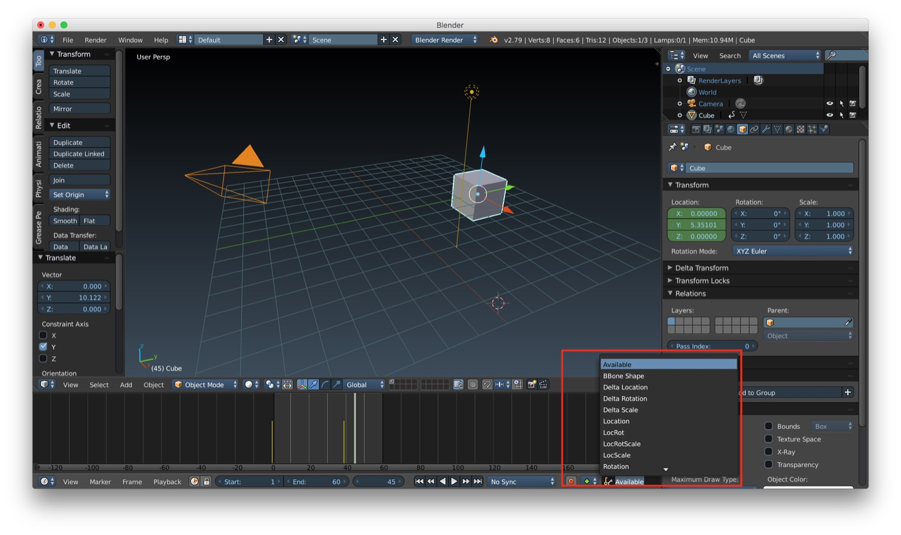
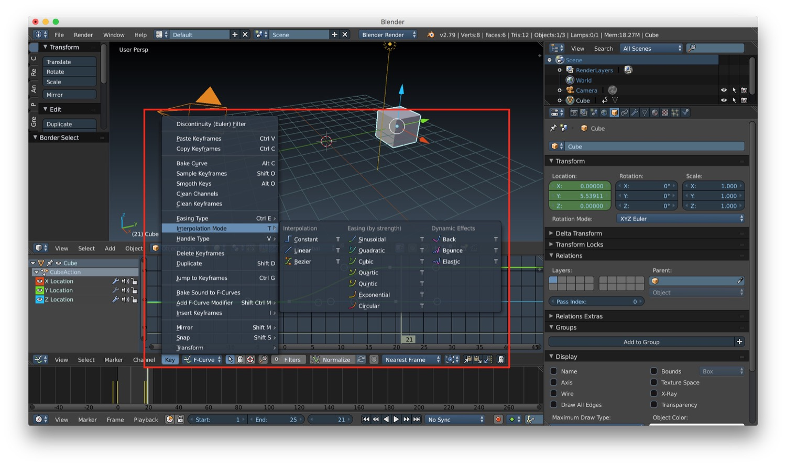
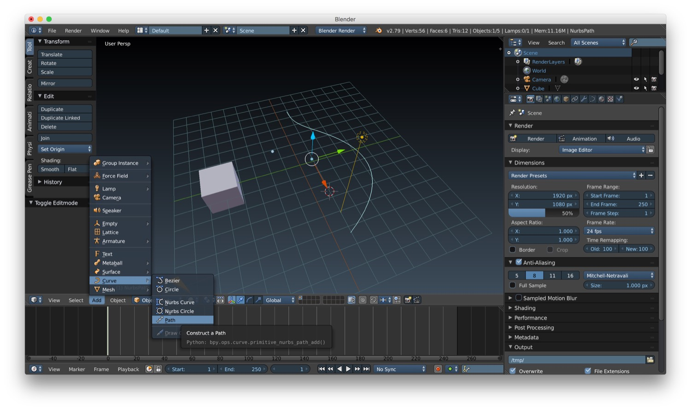
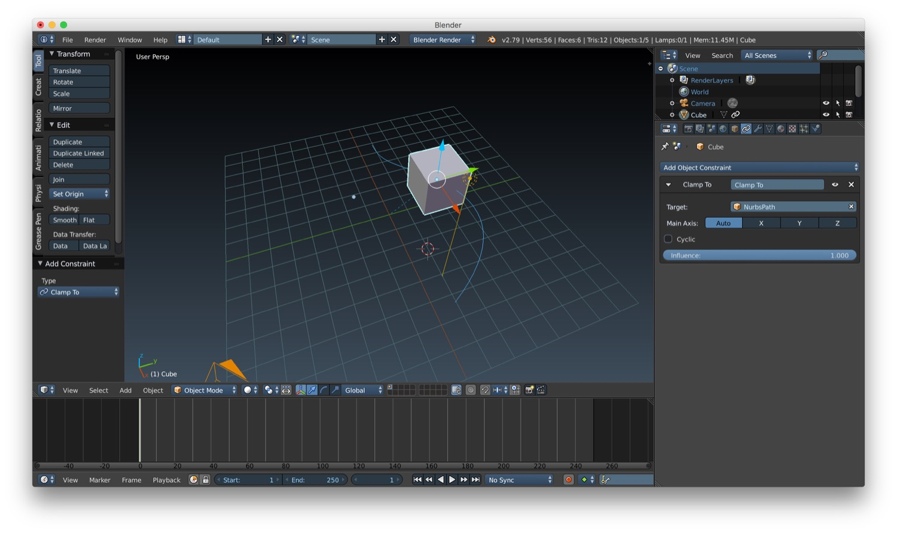

*In this new post of the series Blender tutorial I will talk about animations.*

---

In the [previous post of the series "Blender tutorial"](/2019/03/26/blender-tutorial-12-camera-rendering/) we talked
about camera and rendering options/effects in Blender. In this post we will talk about animation. Let's start from the
timeline. The timeline is usually placed at the bottom of the default layout of Blender. In it you can select a specific
frame by clicking on it in the timeline. We also have some controls to start/stop/fast back and forward the animation.
There is also the possibility to set a start and end frame of the animation.

To create an animation we need first of all to set keyframes. To do this we have to select the frame that we want as
keyframe in the timeline, and the go in the space properties panel, change one of the spatial properties we want to
animate (location, rotation or scale) and right click on them to show a menu where we can select "Insert keyframes".
After that you will see the value of the property we decided to animate to become yellow (orange in my images below
because I have a custom theme).

To make an animation we need at least 2 keyframes. We can set keyframes also by selecting the record button in the
timeline. This button will let us set a keyframe for the property we select from the list just near it. The keyframes
are shown on the timeline as a yellow line.

After settings the second keyframe we finally have our first animation. In the video below you can see the final result.

`youtube: https://www.youtube.com/watch?v=qTLJL-HF9vY`

In our previous first animation we animated the movement of the object. In Blender we are not limited to location or
rotation for animation: we can basically animate any property we want. We can animate color, scale, light camera and so
on. Let's see for example how we can animate the energy property of a light. To do this we basically have to follow the
same approach we used for the previous location animation: we modify the energy property and we set a keyframe for each
value we want (remember that we need at least two keyframe to have an animation). After that our animation is ready and
can be played (remember to switch the 3D window to texture mode if you want to see the animation with execute a complete
render).

`youtube: https://www.youtube.com/watch?v=Ledh539mZKo`

Sometimes we will need to do to a more precise setup of our animation: change the values between keyframes, change the
interpolation method and so on. To do these operation we can use the graph editor. This is a a separate editor that we
can open by selecting graph editor from editor selector in an existing panel inside our Blender layout (or in a new
panel created ad-hoc). In this new editor we can zoom in/out by using ctrl + mouse movement. On the left you will find
all the animation for a specific object selected in the scene. From here we can modify the keyframe curve by selecting
it and moving in the position we prefer. We can also modify the interpolation by selecting our animation curve and
choosing Key -> Interpolation mode from the menu.

`youtube: https://www.youtube.com/watch?v=xq1J5QrJuSU`

The graph editor in not the only animation editor. We can use also the dope sheet. It could be more faster to edit an
animation in it instead of the animation editor. In it we don't have the curve of interpolation of the animation. We
just have a representation of the keyframes and we can edit them by dragging after selection with a right click of the
mouse. Last but not least we have animation path. To create an animation path we have to add a path by using the menu
Add -> Curve -> Path. Then we need to add a constraint to the object we want to animate so that it will follow the path.
After that we can set the keyframes using the same approach showed before.

That's all for animation. In the next post we will talk about character rigging.
