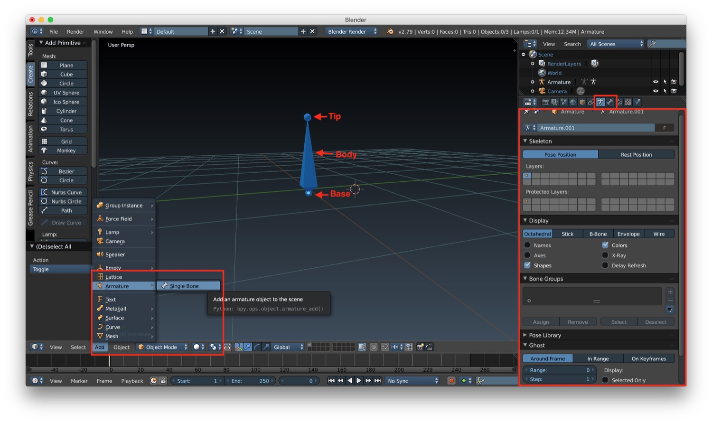
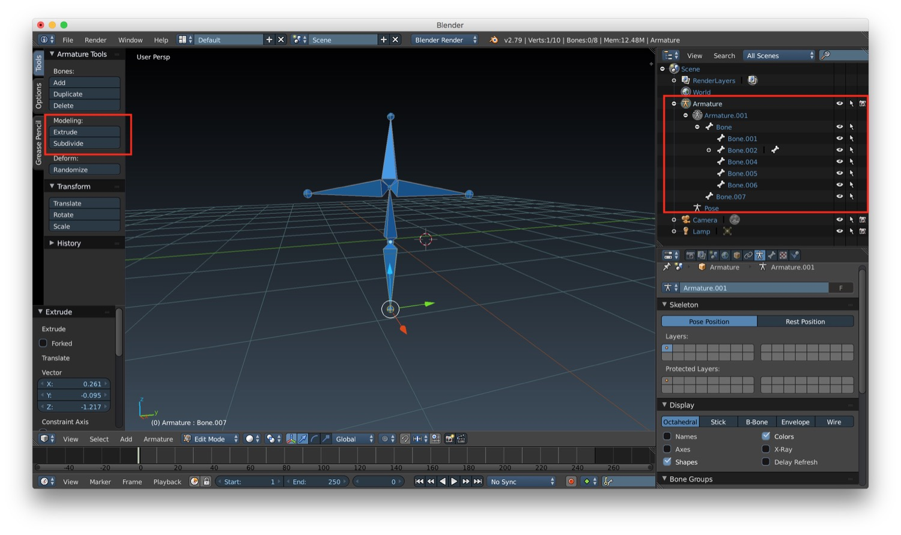
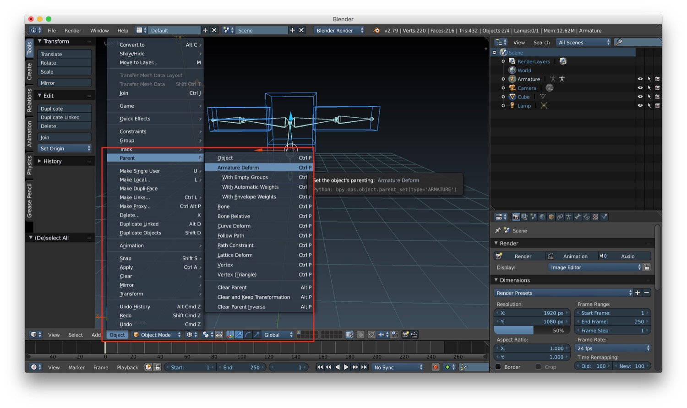
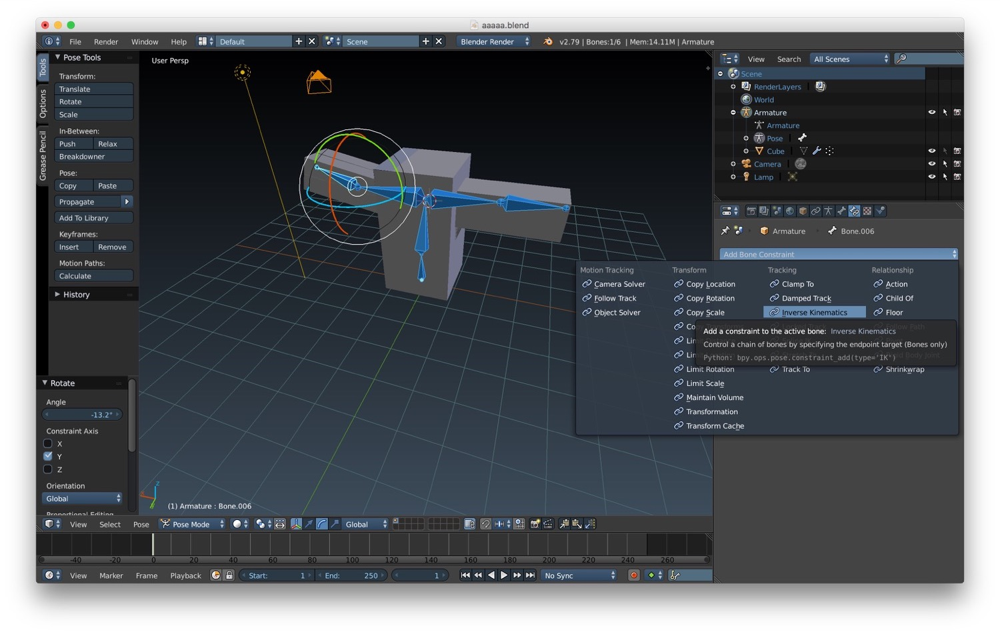

*In this new post of the series Blender tutorial I will talk about armatures and character rigging.*

---

In the [previous post of the series "Blender tutorial"](/2019/03/27/blender-tutorial-13-animation/) we talked about
animation. In this post we will talk about armatures and character rigging.  
Let's start from armatures. Armatures are composed of bones. We can create bones by selecting *Add -> Armature -> Single
Bone*. Every bone is compose of:

* a base
* a body
* a tip

By selecting the body we can move the entire bone into a new position. By selecting the base or the tip we can move just
one of the end of the bone. When a bone is selected two new tab becomes available in the properties panel:

* the armature tab
* the bone tab

Let's see the armature tab first. First we have a the display options, to manage how the bone is displayed. We can also
show the name, the color and more important we can activate the X-Ray mode that let us see the bone through the
character.

To create a complete armature we have some tools similar to the one we previously seen for modeling. After selecting
edit mode, in the left panel of the 3D window we have the options extrude and subdivide that let us create a complete
skeleton for a character. In the scene we will find our armature object with all the bones connected.

We can now start to add the armature to an object. To do that we just have to place/create the bones inside our object.
After that we select the object and the bones (in this specific order), and we choose from the menu at the bottom of the
3D window the option Object -> Parent -> Armature Deform. After this operation, we can go into pose mode (by choosing it
in the menu at the bottom of the 3D window). If we move one of our bones in this mode, the part of the object/mesh that
contains that bone will move accordingly.

`youtube: https://www.youtube.com/watch?v=GpkMgUqWZJo`

Sometimes we will also need to constraint a bone to the move of other bones. Instead of doing it manually, we can use
Inverse kinematics. To be more clear this is an extract of the blender doc:

> IK simplifies the animation process, and makes it possible to make more advanced animations with lesser effort. IK allows you to position the last bone in a bone chain and the other bones are positioned automatically

We can add an inverse kinematic constraint on a bone by choosing it from the menu under the Bone constraint tab in the
properties panel. This tab will appear only when we are in pose mode.

After setting bones, armature and inverse kinematics we are ready to animate our character. To do that, we just need to
be in Pose mode and set the keyframes as we did for standard animation.

`youtube: https://www.youtube.com/watch?v=Q5m1rnjT6Rw`

That's all for character rigging. In the next post we will talk about the rendering engine Cycles.
