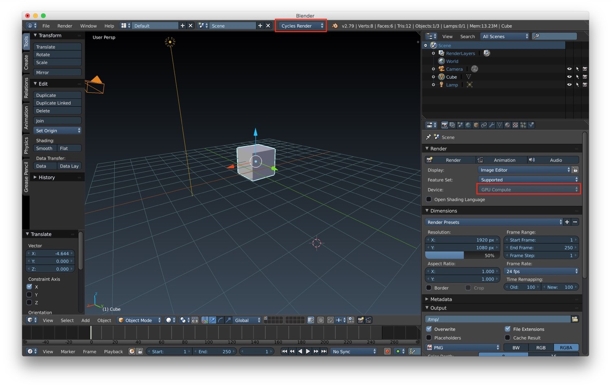
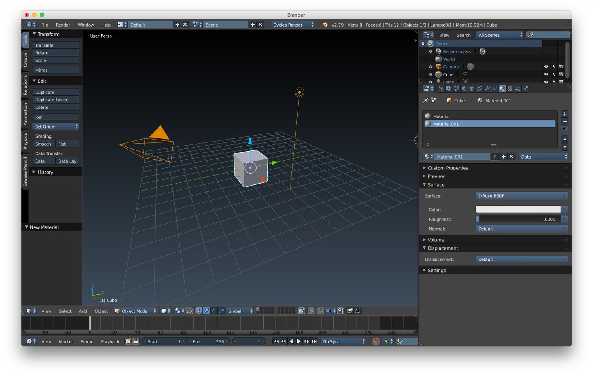

*In this new post of the series Blender tutorial I will talk about Cycles rendering engine.*

---

In the [previous post of the series "Blender tutorial"](/2019/03/28/blender-tutorial-14-armatures-character-rigging/)
we talked about character rigging. In this post we will talk about the Cycles rendering engine. What is exactly Cycles?
Let's see a quote taken from Blender doc:

> Cycles is Blender’s ray-tracing production render engine.

Cycles is a state of the art ray tracing engine built into Blender. We can try to achieve the same level of realism of
other computer graphics production tools (photorealistic level).  
Let's start by see how we can activate it. From the menu at the top of the 3D window choose *Cycle Render*. When we do
this operation, the render properties tab will change, as a consequence of the fact that Cycles as other option compared
to the standard *Blender Render*. One of the most important thing to note is that cycles uses the CPU and the GPU of our
computer to render our scenes in interactive mode. This basically means that we can see the final rendered scene and
navigate through it. Wonderful :heart_eyes:!!!

How do we create material for cycles? We can create a material from the same tab we previously saw. When the cycles
render is selected the option to customize the material change accordingly. In particular there's a *surface* option
where we can select from a list of BSDF the type of surface BSDF we want. The other option will change accordingly based
on this selection. We can also add texture like for standard material. To do that we simply have to go into the color
option and select the texture we want.

For what concern lights, Cycles support different type of lights. The type of lights and their setup are similar to the
one we can find in the standard Blender engine:

* **point**
* **sun**
* **spot**
* **hemi**
* **area**

We can also use ambient occlusion to improve the realism of light. We can activate it like we did before under the World
tab in the properties. That's all my friends for Blender. This was the last post for the "Blender tutorial" series. I
hope you enjoyed these series of tutorials about Blender.
