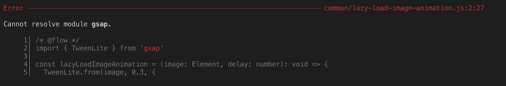

*Sick and tired of TypeScript? Give a chance to Flow, the JavaScript static type checker from Facebook.*

---

In my daily job at [lastminute.com group](https://lmgroup.lastminute.com/ "lastminute.com group") I usually work with
TypeScript. Instead, my personal website (the one where you are reading this article), has been developed using
JavaScript for the client side.  
As you may already know JavaScript is untyped, so it doesn't have static typing. This could lead to bugs and it become
more error prone proportionally to the increase of the source code base. As I already
explained [in another post](/2018/07/04/react-native-typescript-existing-app/),
TypeScript is a typed superset of JavaScript that compiles to plain JavaScript for any browser, any host and any OS.
TypeScript is basically “JavaScript on steroid”: it provides optional, static type checking at compile time. Since it is
a superset of JavaScript, all JavaScript code is valid TypeScript code.  
As a consequence of the fact that I already use Typescript during my daily job I started to think if there was another
way to have static type checking on my JavaScript code already in place for my website (the one where you're reading
this blog post :smirk:). You know, if you already know a tool or a programming language you want to try the other
technologies you could find on the market so you're prepared for the future in your career :relaxed:. This is the reason
why I decided to use [Flow](https://flow.org/) for my website JavaScript source code.  
What is [Flow](https://flow.org/)? Flow is a static type checker for javascript developed by Facebook. Let's see it's
main features taken from the homepage of the official site:

>* TYPE INFERENCE: using data flow analysis, Flow infers types and tracks data as it moves through your code. You don't need to fully annotate your code before Flow can start to find bugs.
>* REALTIME FEEDBACK: Flow gives you fast feedback while you code by incrementally rechecking your code as you make changes.
>* JAVASCRIPT, YOUR WAY: Flow is designed to understand idiomatic JavaScript. It understands common JavaScript patterns and many of the weird things we JavaScript developers love to do.
>* EASY INTEGRATION: Flow integrates well with many tools, making it easy to insert into your existing workflow and toolchain.

It seems really cool!!! :sunglasses:. In this post I will described my experience with Flow. I will show you how I
integrated it in my website JavaScript build process and how I used it to do static type checking for my JavaScript
source code. So let's start from the installation process.

#### Installation and setup

First of all, I added Flow to my dev dependencies. I decided to use Flow in combination
with [flow-remove-types](https://github.com/flowtype/flow-remove-types "flow remove types"), a small CLI tool for
stripping Flow type annotations from files.

```shell
npm install --save-dev flow-remove-types
npm install --save-dev flow-bin
```

Then I decided to create a new script phase `flow` that launches the script `flow.sh`. In this shell script I do all the
Flow operations:

* I move into my js folder with `cd _js`
* I run Flow to execute the static type checking on my code base with the command `../node_modules/.bin/flow`
* I run flow-remove-types to strip Flow type annotations from JavaScript files. The generated files are saved in the
  folder `../_jsbuild/` specified in the destination folder flag `-d`. I also specified the `--pretty` option in order
  to be able to remove the whitespaces that flow-remove-types leaves in the source when it removes the types annotation.

Below you can see the entire script I created (that you can
find [flow script also at this url](https://github.com/chicio/old.chicio.github.io/blob/v1.23.0/_scripts/flow.sh "flow 
script"))
.

```shell
#!/usr/bin/env sh

# Enter into js source folder
cd _js

# Run flow
../node_modules/.bin/flow

# Remove flow types
../node_modules/.bin/flow-remove-types ../_js/ -d ../_jsbuild/ -i flow-typed/ --pretty
```

As you may expect with a standard npm script phase, I can invoke it in a shell with the command `npm run flow`. The
final step of the setup was to install [flow-typed](https://github.com/flow-typed/flow-typed "flow typed"). Flow-type is
a repository of third-party library Flow interface definitions. In the next section I will explain to you why I need
it (and also you will need it :wink:). Flow-typed must be installed globally. This could be done with the following
command (I ran this command in the setup script I have for my website, that I launch when I have to prepare the
development environment on a new computer):

```shell
npm install --global flow-typed
```

#### Adding types

Let's start to add some types. To show you how to add types with Flow I will start with the piece of code you can find
below. This piece of code contains the animation used to show an image after it had been downloaded from the network.

```javascript
import { TweenLite } from 'gsap'

const lazyLoadImageAnimation = (image, delay) => {
  TweenLite.from(image, 0.3, {
    opacity: 0,
    delay
  })
}

export { lazyLoadImageAnimation }
```

The first thing I have to do is to tell to Flow that I want to check the types for this file. To do this I just have to
add the comment `/* @flow */` at the top of the file.  
Then I can start to add types. Flow supports the following primitive types

* boolean
* number
* string
* void (undefined)
* null
* any, a way to opt-out of using the type checker. A variable of type `any` will accept any type of value. Using any is
  completely unsafe, and should be avoided whenever possible.
* mixed, will accept any type of value as `any`. The difference is that when you try to use a value of a mixed type you
  must first figure out what the actual type is or you’ll end up with an error.

Obviously Flow support also objects, classes and interface. So I can try to add the types to the parameters of
the `lazyLoadImageAnimation` function. The first parameter is an DOM element that is then passed to the TweenLite `from`
function. So I can try to give the [Element class type](https://developer.mozilla.org/en-US/docs/Web/API/Element) to
the `image` parameter. The second parameter, `delay`, is a number used to tweak the TweenLite animation configuration.
So, as you may expect :bowtie:, I can try to give the type `number` to it. Below you can find the final implementation
with Flow types.

```javascript
/* @flow */
import { TweenLite } from 'gsap'

const lazyLoadImageAnimation = (image: Element, delay: number): void => {
  TweenLite.from(image, 0.3, {
    opacity: 0,
    delay
  })
}

export { lazyLoadImageAnimation }
```

If I try to run `npm run flow` I expect that everything goes well, but instead...I received the following error: "**
Cannot resolve module gsap.**". Below in the screenshot you can see the error reported.



What's happening here? The `TweenLite` class is imported from the third party
library [`gsap`](https://greensock.com/gsap) and Flow doesn't know the types definition for it. I have to provide this
definition in order to enable Flow to do the type checking also on the parts of code that refer to a third library. This
can be done in two ways:

* check to see if the [flow-typed](https://github.com/flow-typed/flow-typed "flow typed") repo contains the types
  definition for the library I'm using and eventually install it
* write your own Flow type definition for the library you are using if it is not present in the flow-typed directory

Unfortunately, in this case the flow-typed repository doesn't contain a type definition for the `gsap` library. So I
will need to write my own gsap library types definition. How can I do that? First of all let's create a folder inside
the project called `flow-typed` (what a coincidence!!!! :smirk:). This is the standard folder where Flow searches for
third party library types definition. If you want you can customize the search path with a custom folder in
the `.flowconfig` file. Then I create a new file `gsap.js` inside it. In this file I declare a new module definition
with the syntax `declare module "<module name>"`. In this case it will be `declare module "gsap"`. Then I can declare a
new class to be exported, `TweenLite`, that is the one I'm using in the piece of code above. To this class I will add
the definition for all the method I'm using and for which I need the Flow type definition. From the piece of code above
it's easy to see that the only method I'm using is `from(...)`, so I can add the types definition only for it. To do
this I just have to declare the signature of the method with the types I expect for each parameter. One thing to be
noted is that the first and the third parameter could accept different types as specified in the gsap documentation.
This is why I put `any` as type. Basically I'm saying that for the first and third parameter I don't want to do any type
check :laughing:. Below you can find the complete declaration implementation.

```javascript
declare module "gsap" {
  declare

  export class TweenLite extends Animation {
    static from(target: any, duration: number, vars: any): TweenLite;
  }
}
```

If I try to run again the command `npm run flow` everything will work as expected :relieved:.  
Let's see another example. The piece of code below is used to load a webfont with the help of the `webfontloader`
library.

```javascript
import WebFont from 'webfontloader'

const loadFont = (finish) => {
  WebFont.load({
    google: { families: ['Open Sans'] },
    active: finish ? finish() : undefined,
    inactive: finish ? finish() : undefined
  })
}

export { loadFont }
```

Let's start by adding the type for the `finish` parameter. The `finish` parameter is a function that could be null, so I
need to use a [maybe type](https://flow.org/en/docs/types/maybe/ "flow maybe type"), usually known as Optional types. So
I need to declare it as an optional function `?(() => void)`. Then again I have an import from an external
library `webfontloader`. In this case the webfontloader module declaration could be taken from
the [flow-typed](https://github.com/flow-typed/flow-typed "flow typed") repo. To do that, I can install the definition
contained in that repo in my source code with the following command:

```shell
flow-typed install webfontloader@v1.x.x
```

Now I'm ready to run the command `npm run flow` again. Everything works as expected and Flow says that my types are
correct. This is the final version of the source could with all the types.

```javascript
import WebFont from 'webfontloader'

const loadFont = (finish: ?(() => void)): void => {
  WebFont.load({
    google: { families: ['Open Sans'] },
    active: finish ? finish() : undefined,
    inactive: finish ? finish() : undefined
  })
}

export { loadFont }
```

#### Flow vs TypeScript

So how does Flow compare to TypeScript? The main reasons to choose Flow instead of TypeScript are:

* **It's an easy-to-use utility**. Flow is is not a complete language like TypeScript. It is an utility that you can add
  to your code. this could be as simple as just
  put [`/* @flow */` at the beginning of the file](https://medium.com/the-web-tub/comparing-flow-with-typescript-6a8ff7fd4cbb)
  . In fact with Flow you're still, writing JavaScript code.
* **very good React support**. Flow comes from Facebook as React, so you will find easier to integrate Flow with React
  and React Native.

The cons of Flow with respect to TypeScript are:

* **smaller community compared to the TypeScript one.** This basically means that for Flow you will find fewer
  tutorials, online resources and library definitions.
* **better IDE integrations**. TypeScript is much better supported in terms of automated refactoring tools

#### Conclusion

This is my experience with Flow. In the end I think it's a good alternative to TypeScript, especially for the "true pure
javascript lovers". Let me know in the comments if you like it :cupid: or if you prefer TypeScript :smiling_imp:.
