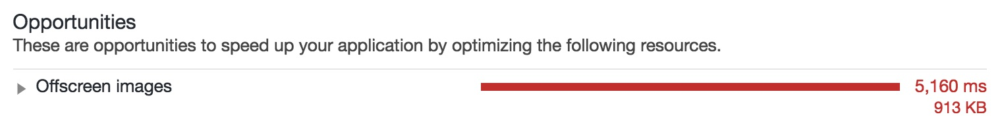

*Intersection Observer can improve your web applications performance by helping you to implement lazy loading of
images.*

---

In the last few months I worked hard to improved the page speed of my website (yeah, the one you're visiting right now :
heart_eyes:). I improved all my client side code in order to be able to reach a performance score above 90 points
on [Lighthouse](https://developers.google.com/web/tools/lighthouse/), the official Google Chrome tool to measure
performance,
accessibility, [progressive web apps](/2019/03/03/github-pages-progressive-web-app/ "progressive web app")
compliance and more on your web application. One of the last thing that was contained in the report was a warning about
offscreen images, like the one contained in the following screenshot:



So I followed the link contained in the report that points to a page where are contained
the [official Google Guidelines about offscreen images loading](https://developers.google.com/web/tools/lighthouse/audits/offscreen-images)
. The main topic of the page is
the [Intersection Observer API](https://developer.mozilla.org/en-US/docs/Web/API/Intersection_Observer_API) and how it
can help you to load specific content only when it becomes visible in the viewport. I found also another article on the
official Google developer website that explains in details how to leverage the power of Intersection Observer to lazy
load the images in your web applications. So as you may imagine I "accepted the challenge" (like
only [Barney Stinson](https://en.wikipedia.org/wiki/Barney_Stinson) in how I met your mother is used to do :
stuck_out_tongue_winking_eye:) and I started to implement the lazy load of images for my website.

#### Implementation

First of all let's start by creating a function called `lazyLoadImages`. This function takes two parameter:

* selector, that is a string that I will use to select all the
  document [`Element`](https://developer.mozilla.org/en-US/docs/Web/API/Element "document element") objects that I
  wanted to observe
* loadCompleted, a function that will be executed after the image has been downloaded

This function will create a new instance of the `IntersectionObserver` object from
the [Intersection Observer API](https://developer.mozilla.org/en-US/docs/Web/API/Intersection_Observer_API). This object
constructor takes two parameter:

* a callback, that is the function called when an object become visible given the current configuration
* a configuration options, that let the developer customize how the Intersection Observer calculate the intersection
  with the viewport

After the creation of the `IntersectionObserver` object I attached it to the DOM elements I want to observe by calling
its `observer(element)` method on the
document [`Element`](https://developer.mozilla.org/en-US/docs/Web/API/Element "document element") objects selected
using [querySelectorAll](https://developer.mozilla.org/en-US/docs/Web/API/Document/querySelectorAll "document querySelectorAll")
method with the `selector` received as parameter.

```javascript
const lazyLoadImages = (selector, loadCompleted) => {
  const intersectionObserver: IntersectionObserver = new IntersectionObserver(
    (entries, observer) => onIntersection(entries, observer, loadCompleted),
    { rootMargin: '50px 0px', threshold: 0.01 }
  )
  document.querySelectorAll(selector).forEach(image => intersectionObserver.observe(image))
}
```

As you can see in the snippet above, in the intersection callback I'm calling the `onIntersection` function. What does
it do? This function checks the `IntersectionObserverEntry` received from the Intersection Observer as parameter. If
a `target` `Element` is inside the viewport it would have the `intersectionRatio` > 0. When this happen I can remove the
observer and start the load of the image with the `loadImage` function.

```javascript
const onIntersection = (entries, observer, loadCompleted) => {
  entries.forEach(entry => {
    if (entry.intersectionRatio > 0) {
      observer.unobserve(entry.target)
      loadImage(entry.target, loadCompleted)
    }
  })
}
```

The `loadImage` function downloads the image by setting the image src field with the data contained in the `data-src`
field. At the end of the download I remove the `lazy` css class, that I used to hide the image until it has been
download. Then the `loadCompleted` function is called, where the caller can do anything it want with the image (for
example I'm doing a custom animation in order to avoid a flash out effect when the image is show).

```javascript
const loadImage = (image, loadCompleted) => {
  image.src = image.dataset.src
  image.onload = () => {
    removeCssClass(image, 'lazy')
    loadCompleted(image)
  }
}
```

This is the final script with the complete flow.

```javascript
import 'intersection-observer'
import { removeCssClass } from './css-class'

const lazyLoadImages = (selector, loadCompleted) => {
  const intersectionObserver: IntersectionObserver = new IntersectionObserver(
    (entries, observer) => onIntersection(entries, observer, loadCompleted),
    { rootMargin: '50px 0px', threshold: 0.01 }
  )
  document.querySelectorAll(selector).forEach(image => intersectionObserver.observe(image))
}

const onIntersection = (entries, observer, loadCompleted) => {
  entries.forEach(entry => {
    if (entry.intersectionRatio > 0) {
      observer.unobserve(entry.target)
      loadImage(entry.target, loadCompleted)
    }
  })
}

const loadImage = (image, loadCompleted) => {
  image.src = image.dataset.src
  image.onload = () => {
    removeCssClass(image, 'lazy')
    loadCompleted(image)
  }
}

export { lazyLoadImages }
```

There's still one thing that I didn't discuss yet. How can we support this type of lazy loading for the browser that
doesn't still have implemented the `IntersectionObserver` API? The answer is
the [Intersection Observer Polyfill](https://github.com/w3c/IntersectionObserver/tree/master/polyfill). I installed it
as a dependency of my project.

```shell
npm install --save intersection-observer
```

This [polyfill](https://en.wikipedia.org/wiki/Polyfill_(programming) "polyfill programming") exposes an ad hoc
implementation in vanilla javascript of the Intersection Observer, or it exposes the current browser implementation if
it is already in place for the browser that the user is using.

#### Conclusion

Intersection Observer is a powerful API. It lets you implement lazy loading for resources loading and reach performance
and architectural application pattern that I had a chance to see only in mobile native apps. The web is filling the gap
with native apps, and Intersection Observer are another demonstration that the 90% of the existing native mobile apps
could become powerful web apps. As a consequence of the fact that in my daily job I'm still a native mobile app
developer, I'm still following the iOS, Android and React Native scene and I'm still studying all the new tools and SDKs
improvement released by Apple, Google and Facebook. But, you know, technology goes fast I have to be prepared for the
future :relaxed:. Sooo, long live Intersection Observer!!! Web applications will be much more performant with your
help :green_heart:.
