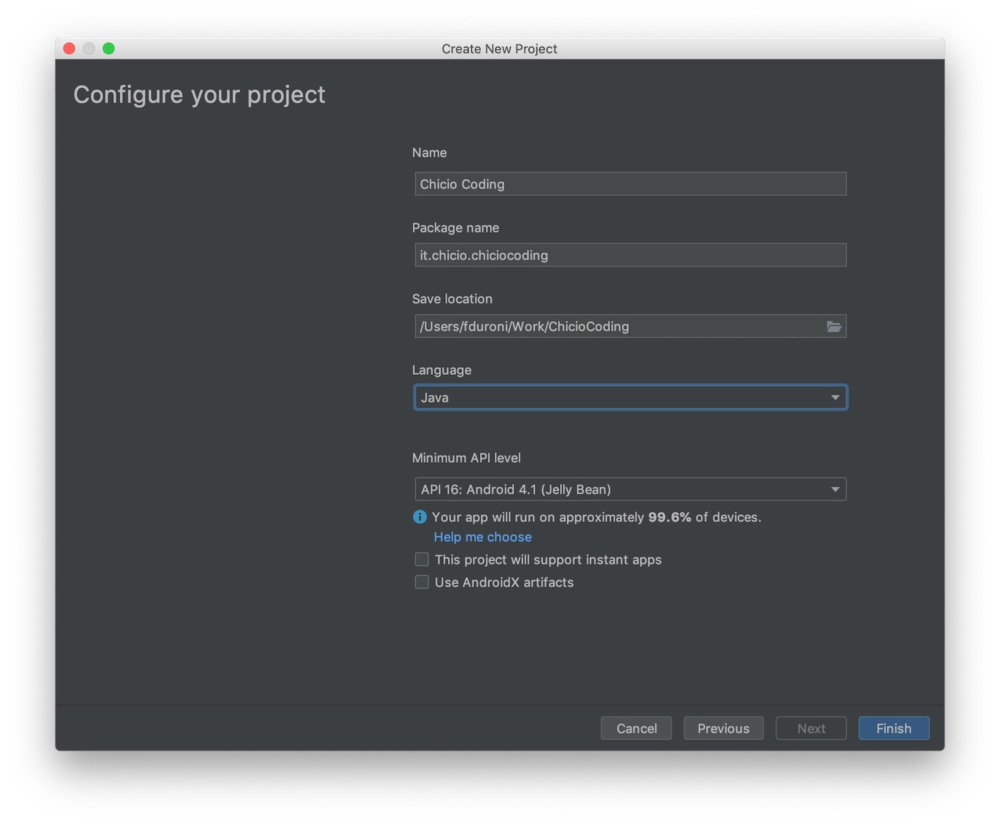
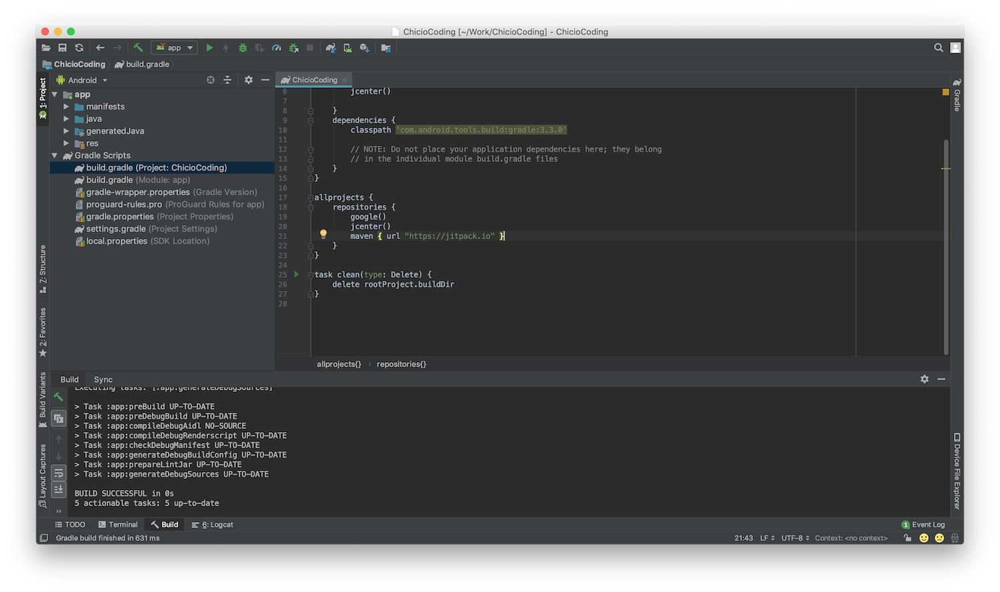
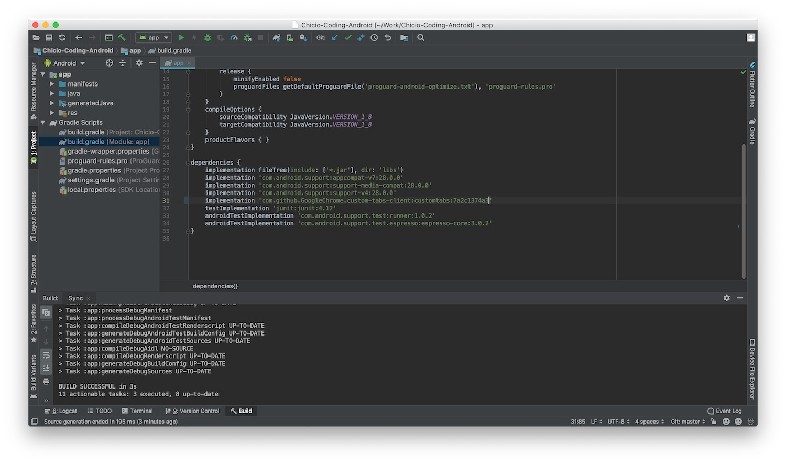
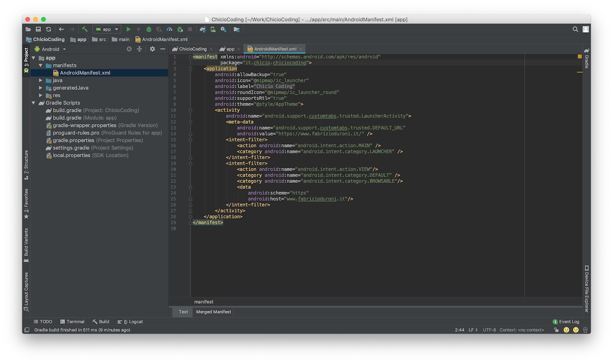
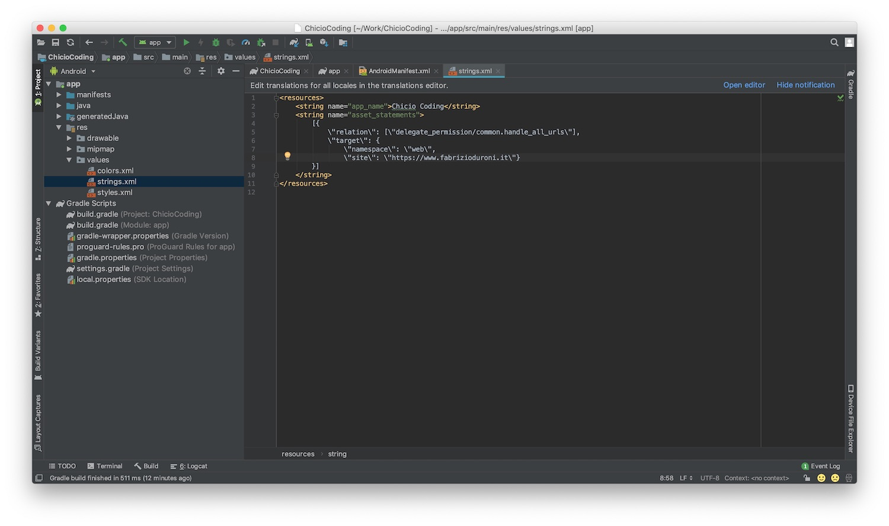
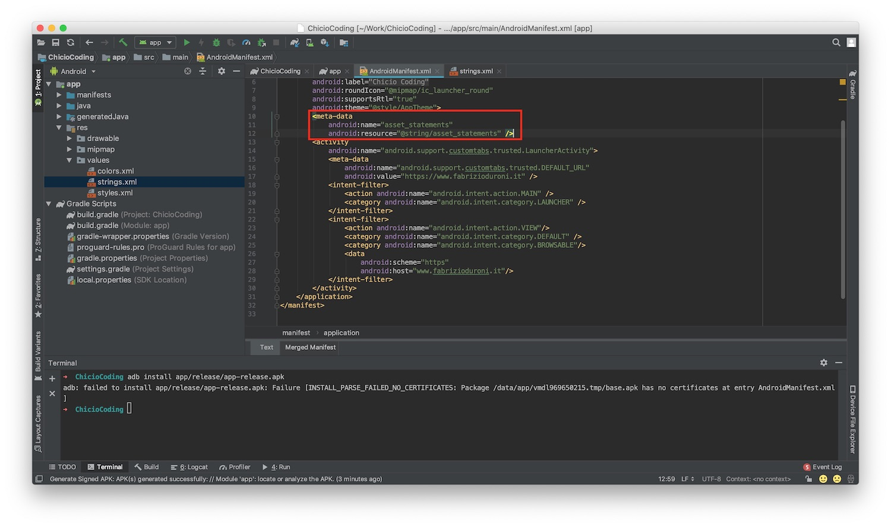
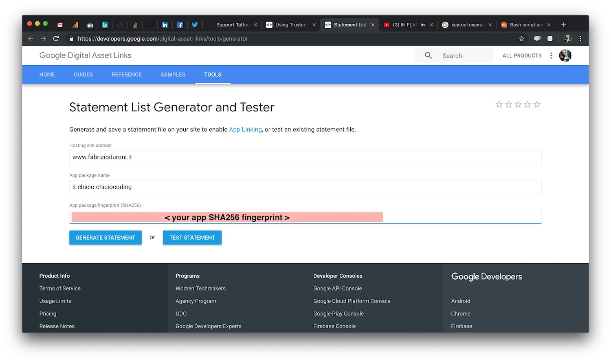

*You can now publish your progressive web apps to the Google Play Store using Trusted Web Activities without writing a
single line of Java/Kotlin code.*

---

A few months ago I [transformed my blog into a Progressive Web App](/2019/03/03/github-pages-progressive-web-app/).
As you may already know PWA let your websites behaves like a native mobile app but there's one thing that was still
missing: the possibility to publish on the App Stores. Because even if a PWA as the advantage to be searchable as a
standard website, this days user are used to search for apps on the App Stores for each platform. Well, starting from
February 2019 this problem has been solved on the Android platform with the release
of [Trusted Web Activities](https://developers.google.com/web/updates/2019/02/using-twa "trusted web activities").  
In this post I will show you how I released the PWA of my blog to the Google Play Store using Trusted Web Activities (
and also without writing a single line of Java/Kotlin code :smirk:).

#### What is a Trusted Web Activity

Let's start from the definition of Trusted Web Activity (TWA) taken
from [the official Google developer website](https://developers.google.com/web/updates/2019/02/using-twa "trusted web activities")
.

> There are a few things that make Trusted Web Activities (TWA) different from other ways to integrate web content with your app:
>
> * Content in a Trusted Web activity is trusted -- the app and the site it opens are expected to come from the same developer. (This is verified using Digital Asset Links.)
> * Trusted Web activities come from the web: they're rendered by the user's browser, in exactly the same way as a user would see it in their browser except they are run fullscreen. Web content should be accessible and useful in the browser first.
> * Browsers are also updated independent of Android and your app -- Chrome, for example, is available back to Android Jelly Bean. That saves on APK size and ensures you can use a modern web runtime. (Note that since Lollipop, WebView has also been updated independent of Android, but there are a significant number of pre-Lollipop Android users.)
> * The host app doesn't have direct access to web content in a Trusted Web activity or any other kind of web state, like cookies and localStorage. Nevertheless, you can coordinate with the web content by passing data to and from the page in URLs (e.g. through query parameters, custom HTTP headers, and intent URIs.)
> * Transitions between web and native content are between activities. Each activity (i.e. screen) of your app is either completely provided by the web, or by an Android activity

So as you can read above, a Trusted Web Activity let you integrate web content that you personally own into your app and
let you execute it into the most modern web runtime (e.g. Chrome) available on the device of the user. Really cool!!! :
heart_eyes:

#### Implementation

Let's start to see the real action: how I publish my blog PWA to the Google Play Store using TWA. First of all, I
created a nw android project. This was a standard Android project with minimum API level 16. This let me cover the 99.6%
of the Android user base. I chose to create an empty project without any activity/fragment in it.



Then I added the TWA support as a dependency of the app. The TWA implementation is contained inside the custom tabs
client library published on [Jitpack](https://jitpack.io/ "Jitpack") (because unfortunately at the moment of this
writing the custom tabs client library contained inside Jetpack doesn't have the TWA support). So I added Jitpack as
repository to the project level gradle file. Then I added the custom tabs client library as dependency inside the module
gradle file. This last dependency points to the custom tabs client library published on github and exposed through
Jitpack. I had to specify a specific commit hash in order to be sure that the library version downloaded contains the
TWA support. Precisely, I added the following line of code to the gradle file.

```gradle
implementation 'com.github.GoogleChrome.custom-tabs-client:customtabs:7a2c1374a3'
```





After the dependencies setup I added the TWA Activity. To do this I just had to modify the Android app manifest file by
declaring a new TWA activity inside it. For the readers that are not mobile developer, the Android app manifest is a
file contained in all the Android apps. Its main function is to present essential information about the application to
the Android system including:

* the Java package of the app
* the components of the app including activities, services, broadcast receivers, and content providers that the app is
  composed of
* which permissions the app must have in order to access protected parts of the API

The declaration of the TWA inside the Android app manifest must include some important information:

* a `meta-data` tag that must contain the url to be opened by the TWA
* an `intent-filter` that adds the TWA to the Android Launcher
* another `intent-filter` that allows the TWA to intercept Android Intents that open the url you want to open in the
  TWA. The `android:host` attribute inside the data tag must point to the domain being opened by the TWA and specified
  in the `meta-data` tag.



Now I had to establish the link between our PWA website and our PWA app. This is a two way operation because I had to:

* establish an association from app to the website
* establish an association from the website to the app

This associations removes automatically the url address bar from the TWA activity. In this way the Android app will be
full screen as a standard one (and as a PWA in standalone mode :smirk:).  
Let's start from the first association, from the app to the web site. To do this I created a new string resource inside
the `strings.xml` file. This new string resource contains the Digital AssetLink statement that you can see below.

```xml
<resources>
    <string name="app_name">Chicio Coding</string>
    <string name="asset_statements">
        [{
        \"relation\": [\"delegate_permission/common.handle_all_urls\"],
        \"target\": {
        \"namespace\": \"web\",
        \"site\": \"https://www.fabrizioduroni.it\"}
        }]
    </string>
</resources>
```



Then I linked this string resource statement inside the Android app manifest by adding a new `meta-data` tag as a child
of the `application` tag (NOT inside the TWA declaration).



It is possible to test that the association from app to the website has been completed. To do this I had to:

* open Chrome on the development device, navigate to `chrome://flags`, search for an item called Enable command line on
  non-rooted devices and change it to ENABLED and then restart the browser.
* on the terminal application of your OS, use the Android Debug Bridge (`adb`) to run the following command:

```shell
adb shell "echo '_ --disable-digital-asset-link-verification-for-url=\"https://www.fabrizioduroni.it\"' > /data/local/tmp/chrome-command-line"
```

After this debug setup the app is launched without the address bar :relieved:.  
Now I need to finish the development by establishing an association from the website to the app. To do that I needed 2
information about my app:

* the package name
* SHA-256 Fingerprint

The first one was easy to get. I just needed to open the Android manifest file and get it. The second piece of
information I needed is inside the keystore that contains the release signing key used to publish the app on the Google
Play store. So the first operation I did was to generate a new release signing key. You can find
the [standard procedure to get one in this page](https://developer.android.com/studio/publish/app-signing#generate-key).
The key created was contained inside a keystore file. So in order to be able to extract the SHA-256 fingerprint from the
keystore that contains my release signing key I
used [keytool](https://docs.oracle.com/javase/6/docs/technotes/tools/windows/keytool.html 'keytool'). You can find the
exact command I used below. The value for the SHA-256 fingerprint is printed under the Certificate fingerprints section.

```shell
keytool -list -v -keystore <your keystore jks file> -alias <your alias> -storepass <your store psw> -keypass <your key psw>
```

With both pieces of information at hand I was able to generate a web `assetlink.json` statement using
the [asset links generator](https://developers.google.com/digital-asset-links/tools/generator). The `assetlink.json`
generated must be served from the PWA domain from the URL `<your PWA domain>/.well-known/assetlinks.json`.



After publishing the `assetlink.json` to my PWA domain my app was ready to be published to the store. So I followed the
standard
procedure [to upload an app to the Google Play Store](https://developer.android.com/studio/publish/upload-bundle). If
the two ways association fails, it is possible to check for error messages using the the Android Debug Bridge, by
launching from the terminal the following command with the test device connected (or the emulator running).

```shell
adb logcat | grep -e OriginVerifier -e digital_asset_links
```

Now my blog PWA is published to Google Play store. Below you can find a video that shows you the installation from the
Google Play store and the first open of the app. In the video you can also see the debug messages related to the digital
asset links verification.

`youtube: https://www.youtube.com/watch?v=s0o0AheYw9M`

Go and download it immediately :cupid:!!!!
