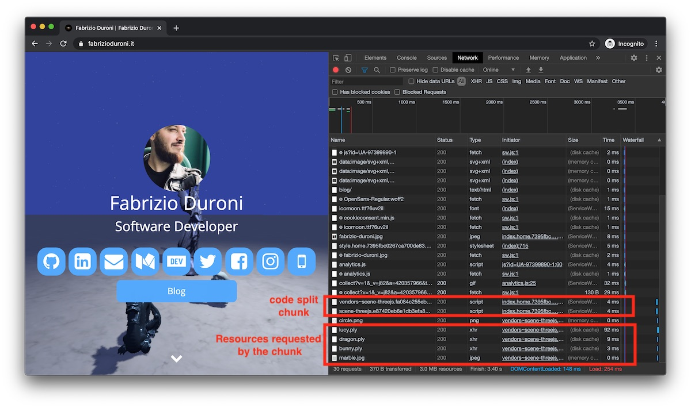
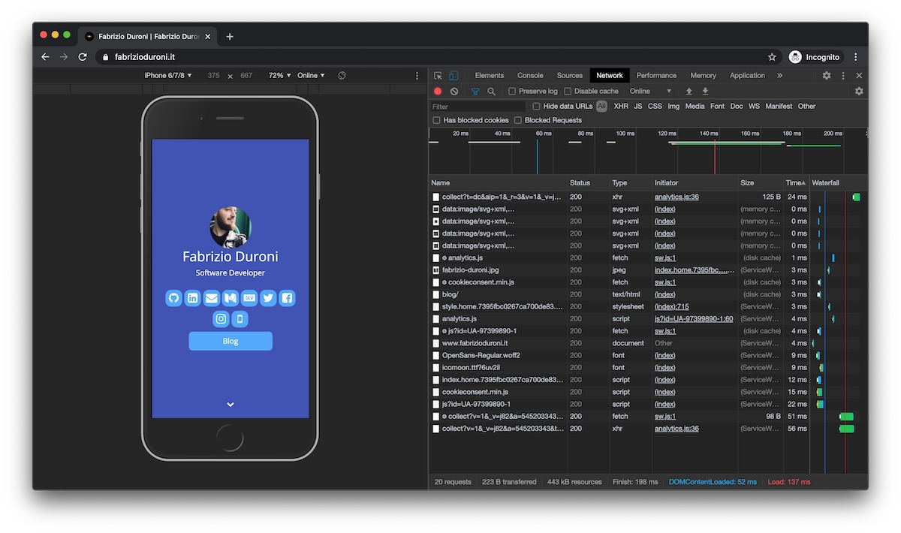

*Most of the time you have a big JavaScript codebase for your website but you need only a small fraction of it when a
page is requested. Is it possible to load chunks of JavaScript code only when they are really needed? Yes you can with
Webpack and its code splitting feature based on a syntax equal to the one of ES2020 dynamic imports.*

---

Recently I migrated my website (this one you're seeing right now) to TypeScript + Webpack as bundling system. One of the
main problem of my website was the dimension of the final JavaScript generated after the bundling for
the [homepage](/ "fabrizio duroni home"). As a consequence of the fact that this page contains a Threejs physically
based scene, the size of the `index.home.js` script was over 600 KB :scream:. This was too much, considering also that
all this JavaScript was loaded without been used on the mobile version of the website, where this feature was turned
off.  
During the last few months of my daily job at lastminute.com I worked on a project that is using Webpack for bundling
the JS code. In particular, during the development of a new part of the user personal area I encountered the code
splitting with lazy loading feature of Webpack and immediately I thought: "THIS IS WHAT I NEED FOR THE HOMEPAGE OF
fabrizioduroni.it". :heart_eyes:  
So let's start and see how I used it on my website so that you can start to optimize your site too!!

#### Implementation

First of all, there are two types of output file generated by Webpack:

- entry files, that are the one main entry points for your application. This are usually the files that you will add
  with a script tag in your HTML pages (or you can let Webpack add them automatically, but this is a story for another
  post :smirk:)
- chunk files, that are the one obtained after the code splitting

In a base Webpack configuration file it is usually contained the `entry` property that contains the list of entry files
to be bundled. To enable code splitting and chunk files generation we need to add a new entry in the configuration
called `chunkFilename`. With this configuration entry we can tell Webpack how to name the chunks file generated. In my
case I defined the name as a concatenation of some Webpack built-in environment variable:

- `[name]`, the chunk name
- `[chunkhash]`, the hash generated by Webpack from the content of the chunk. If its content is changed than
  the `chunkhash` will be updated consequently. It is similar to the `[hash]` variable used in the `entry`
  configuration (but this one is generated from the entire build result).

```diff
{
  mode: 'production',
  entry: {
    'index.home': 'ts/index.home.ts',
    'index.blog': 'ts/index.blog.ts',
  },
  output: {
    filename: '[name].[hash].min.js',
+    chunkFilename: '[name].[chunkhash].bundle.js',
    publicPath: `dist/`,
    path: path.resolve(__dirname, dist),
  },
  module: {
    /*...modules configurations...*/
  },
  /*...other configurations...*/
}
```

So now we have one thing left to do: decided what in our codebase will become a chunk in the final build. To do this,
Webpack leverage the [ES2020 dynamic import syntax](https://github.com/tc39/proposal-dynamic-import). In fact, all we
need to do is to import asynchronously the module we want to load later and execute it as soon as it loaded. In my
specific case I wanted to load the module `scene-threejs` only if some condition where respect:

- the browser of the user supports WebGL (because it gives the best performance when compared to canvas drawing)
- the device of the user is a computer/laptop (because I want to avoid too much mobile data usage and bad user
  experience on some older devices)

To do this I added an async import with the
declaration `import(/* webpackChunkName: "scene-threejs" */ './scene-threejs').then(module => module.sceneThreeJS())`.
In the `resolve` callback of the `then` method the loaded module is returned. In this case the `scene-threejs` contains
just one exported function `sceneThreeJS`, that I execute as soon as the module is available. One important thing to
note is the `webpackChunkName` comment with value `"scene-threejs"`: this string will be assigned to the `[name]`
Webpack environment variable and will be used as first part in the chunk file name (see the Webpack configuration
discussed above). Below you can find the entire code, written using TypeScript (don't be scared by the types :laughing:)
.

```typescript
/* ...other code... */

const isWebGLEnabled = (): boolean => {
  /*...implementation...*/
}

const scene3D = (): void => {
  if (isWebGLEnabled() && !isAMobileDevice()) {
    import(/* webpackChunkName: "scene-threejs" */ './scene-threejs').then(module => module.sceneThreeJS())
  }
}

export { scene3D }
```

This is all I need to code split my codebase and lazy load modules only when they are needed. Let's see the code above
in action. If I try to access the homepage of this website from a desktop/laptop computer I will see the threejs scene
and in the network inspector the `scene-threejs` chunk is loaded. On important thing to note is that Webpack has created
two chunk. One is our module (the one with the name `scene-threejs`). The second one that starts with the `vendor`
keyword contains all the third party dependencies. Yes, you understood right: Webpack extract automatically the third
party dependencies from you chunk module in separated files.



If I access the same page from a mobile device the 3D scene is not loaded and consequently the chunk is not loaded. :
tada:



#### Conclusion

Webpack is a wonderful tool. It gives you the ability to bundle your code, styles and resources with a lot of
customization thanks to its powerful ecosystem of loaders and plugins. This has been another step to make this site a
true professional blog platform with a strong development toolchain. :heart_eyes:
