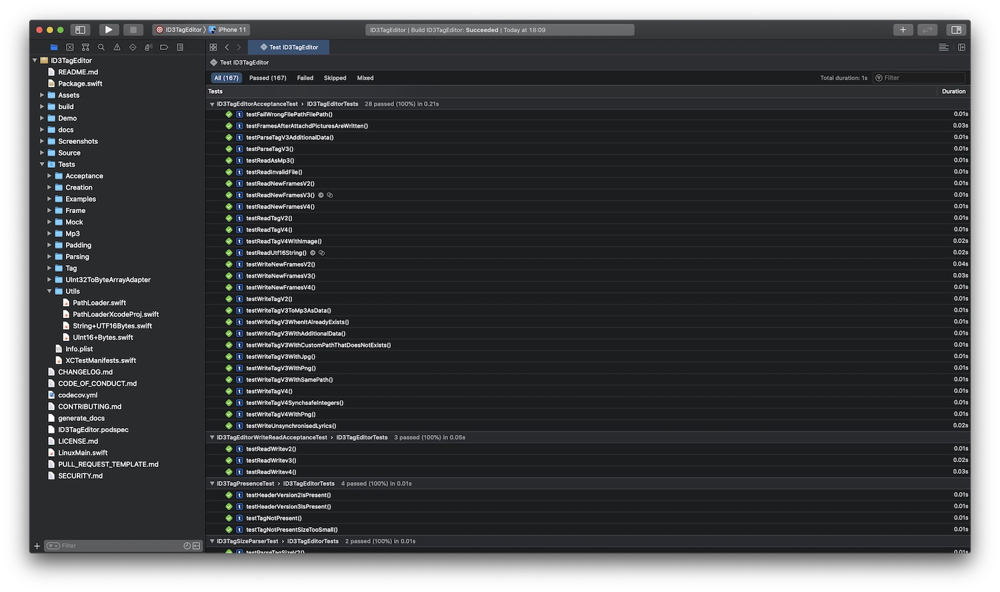
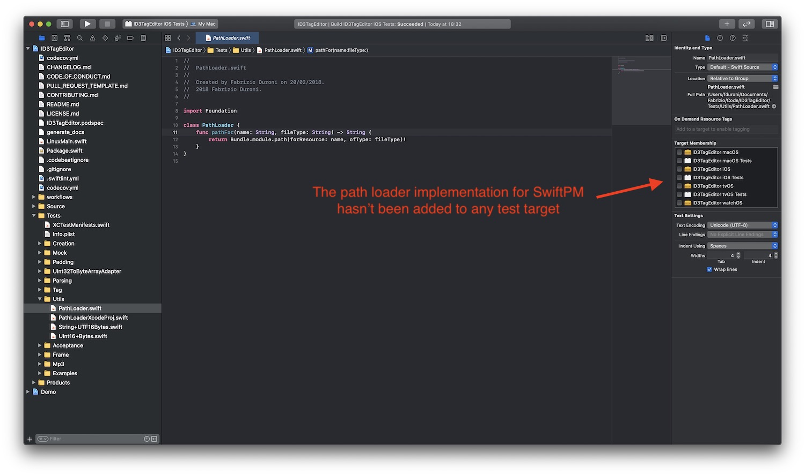
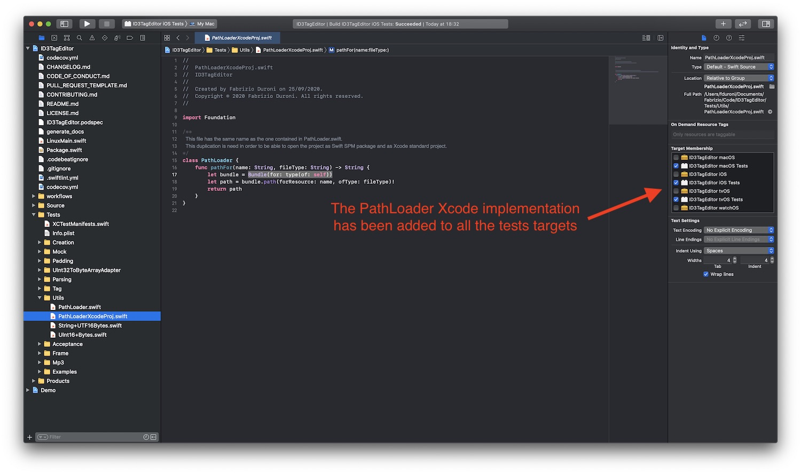

*Recently I upgraded my ID3TagEditor swift package to the latest Swift tools version (5.3). During the upgraded I
discovered that now you can bundle reources with your Swift package. In this post I will show you how you can do this,
and also a interesting trick in order to be able to build a project as a Swift Package and as a standard project from
Xcode.*

---

In the last weeks I started to work again on
my [ID3TagEditor](/2018/05/07/born-id3tageditor-mp3id3tagger/ "id3tag id3 id3tageditor") library. Before starting to
add new interesting features (do you wanna see the roadmap? check
the [kanban board](https://github.com/chicio/ID3TagEditor/projects/1 "ID3TagEditor projects") or
the [milestones](https://github.com/chicio/ID3TagEditor/milestones)) I did the usual upgrade to the latest build tools
released in the new Xcode 12. One new interesting feature included in this release ( Swift tools version 5.3) is the
ability to bundle resources with a Swift package. Before this release to bundle resources in a Swift package you had to
use weird tricks and hackings. So let's see how you can add the suppport for bundling resources by using my ID3TagEditor
library as example.  
Specifically, I will show you how I can execute all my test suite, including some acceptance tests that uses mp3 and
images resources to check the correctness of the ID3 tag added by ID3TagEditor.

#### Implementation

To support the bundling of resources, the first thing to do is to upgraded the swift tools used to build your package.
To do this, you just need to change the comment at the top of the `Package.swift`.

```swift
// swift-tools-version:5.3

//...other code
```

In my ID3TagEditor I have some acceptance tests that uses some mp3 files and some images that I use to check that
ID3TagEditor works as expected. Before the Swift tools 5.3 I was disabling these tests on the Linux platform (that
supports only the SwiftPM way to bundle libraries). Now there's a new Swift package `targets(...)`
and `testTargets(...)` function parameter called `resources` that you can use to load resources.  
The `resources` parameter takes as value a list of resource process rules as input. You can choose between two type of
rules:

* **process rule**. You can create this rule by using
  the `static func process(_ path: String, localization: Resource.Localization? = nil) -> Resource` function (you can
  find the offical
  documentation [here](https://developer.apple.com/documentation/swift_packages/resource/3554515-process)). This rule
  let you process the resource according to the platform you’re building the package for. This basically means that the
  build tools will optimize some files based on the type and the platform (e.g. images will be optimized if the target
  platform is iOS). You can also support different rules based on different locale/languages.

* **copy rules**. You can create this rule by using the `static func copy(_ path: String) -> Resource` function (you can
  find the offical documentation [here](https://developer.apple.com/documentation/swift_packages/resource/3516880-copy))
  . This rule let you bundle your resources as they are without any optimization.

Both rule functions above accept a `_ path: String` parameter. This could be:

* a path to a specific file
* a path to a specific folder

Given all this information I was ready to add the resources to my test target and enable the acceptance tests for the
SwiftPM build (so now they were available on Linux too :relaxed:). So I added the `resources` parameter to
the `testTarget` call of my ID3TagEditor. The input value is a an array with just 1 rule: a `process` rule that takes as
parameter the `Examples` folder, that is the place where I have all the resources (mp3 and images) used by the
ID3TagEditor acceptance tests. Below you can find the complete `Packages.swift` file.

``` swift
// swift-tools-version:5.3

import PackageDescription

let package = Package(
    name: "ID3TagEditor",
    products: [
        .library(
            name: "ID3TagEditor",
            targets: ["ID3TagEditor"]
        )
    ],
    dependencies: [],
    targets: [
        .target(
            name: "ID3TagEditor",
            dependencies: [],
            path: "./Source",
            exclude: ["Info.plist"]
        ),
        .testTarget(
            name: "ID3TagEditorTests",
            dependencies: ["ID3TagEditor"],
            path: "./Tests",
            exclude: ["Utils/PathLoaderXcodeProj.swift", "Info.plist"],
            resources: [.process("Examples")]
        )
    ],
    swiftLanguageVersions: [.v5]
)
```

Now the question is: how do you use/load the resources bundled with your target? When you build a Swift Package the
build tools will automatically generate a `resource_bundle_accessor` file. This file exposes a new `Bundle.module`
property that contains the bundle available for the package based on the environment you're building the source code:

* if you build the package when is linked to the app, `Bundle.module` will contain the `Bundle.main.resourceURL`
* if you build the package when is linked to a framework, `Bundle.module` will contain
  the `Bundle(for: BundleFinder.self).resourceURL`
* if you build the package from the command line, `Bundle.module` will contain the `Bundle.main.bundleURL`

```swift
import class Foundation.Bundle

private class BundleFinder {}

extension Foundation.Bundle {
    /// Returns the resource bundle associated with the current Swift module.
    static var module: Bundle = {
        let bundleName = "ID3TagEditor_ID3TagEditorTests"

        let candidates = [
            // Bundle should be present here when the package is linked into an App.
            Bundle.main.resourceURL,

            // Bundle should be present here when the package is linked into a framework.
            Bundle(for: BundleFinder.self).resourceURL,

            // For command-line tools.
            Bundle.main.bundleURL,
        ]

        for candidate in candidates {
            let bundlePath = candidate?.appendingPathComponent(bundleName + ".bundle")
            if let bundle = bundlePath.flatMap(Bundle.init(url:)) {
                return bundle
            }
        }
        fatalError("unable to find bundle named ID3TagEditor_ID3TagEditorTests")
    }()
}
```

So in the case of ID3TagEditor, when I **open and build it as a Swift Package from Xcode** or **build it from the
command line** the `Bundle.module` will contain the correct bundle. As a consequence I can
call `Bundle.module.path(forResource: <resource name>, ofType: <file type>)` to get the path to the resources bundled
with the ID3TagEditor test target and load/use them in my tests. In fact I created a `PathLoader` class that I use in my
acceptance tests to load my test resources.

```swift
import Foundation

class PathLoader {
    func pathFor(name: String, fileType: String) -> String {
        return Bundle.module.path(forResource: name, ofType: fileType)!
    }
}
```

Below you can find a screenshot that shows the successfull execution of the tests after opening the ID3TagEditor as a
Swift Package from Xcode.



There's still one problem with this setup. ID3TagEditor is configured also as a Xcode workspace, because there are some
related demo app that are contained in the repository and I need a way to manage them while developing the library. If I
try to build the ID3TagEditor from the workspace view it will not compile. Why? Because `resource_bundle_accessor`
file (the one I shown you above) is not automatically generated if you build the swift package as project of a workspace
and the `PathLoader` class I shown you above contains the error `Type 'Bundle' has no member 'module'`. What can I do? I
simply created a new version of the `PathLoader` class that gets the bundle correctly using
the `Bundle(for: type(of: self))` constructor where `self` is the test class that is calling the `PathLoader`. Then I
removed the from the tests target the file that contains the `PathLoader` implementation for the SwiftPM build tools and
I added to them only the new implementation, that I putted in a separated file called `PathLoaderXcodeProj.swift`. On
the contrary in the `Packagkage.swift` above you can see that I excluded from the test target the implementation used by
Xcode (see `exclude: ["Utils/PathLoaderXcodeProj.swift", "Info.plist"],`). In this way I'm able to run all my tests
without any error. Below you can find some screenshot with the setup I have just described to you.




#### Conclusion

You can find more details about SwiftPM and bundling resources with it in
the [official Apple documentation](https://developer.apple.com/documentation/swift_packages/bundling_resources_with_a_swift_package "resources swift swiftpm")
. As you can see Apple is investing a lot of resources in improving its build tools ecosystem and make the life of
developers easier. Even if I
still [hope that Apple will finally fully embrace PWA](/2019/03/03/github-pages-progressive-web-app/ "progressive web apps") (
so that a lot of useless shitty apps that can be web apps can disappear :smirk:), it's good to see that developers (of
true useful native apps :grin:) will enjoy in using these new tools to build their apps :heart_eyes:.
