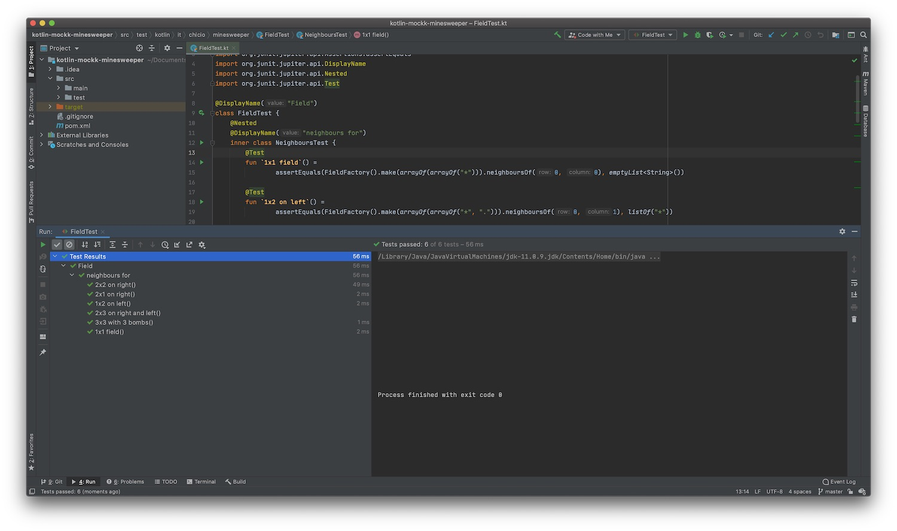

*I recently discovered MockK, a mocking library created for Kotlin. Let's see how it is possible to write modern unit
tests with MockK + JUnit 5.*

---

As I told you in my [last post](/2020/12/23/rest-template-webclient-spring-boot/), in the last months I wrote a lot
of Kotlin backend code during my daily job. Usually I develop new stuff using Test Driven Development (TDD) technique.
Specifically, most of the time I use
the [mockist approach](https://martinfowler.com/articles/mocksArentStubs.html#ClassicalAndMockistTesting). This
basically means that I need a mock library. For Java there are JMock and Mockito, and in fact I usually use Mockito. It
is possible to use this library with Kotlin but [it has some limitations](https://antonioleiva.com/mockito-2-kotlin/).
So I started to wonder if there was an alternative, and I found that
in [lastminute.com group](https://lmgroup.lastminute.com/ "lastminute.com group") we were already using MockK, a mocking
library "written in Kotlin for Kotlin" :smirk:. In this post I will show you how to use MockK and JUnit 5 to improve you
unit tests. To do this, I will migrate to Kotlin + MockK + JUnit 5 an old kata I did some time ago in Java + Mockito:
the Minesweeper. So let's start!!

#### Implementation

Let's start from the installation. For this kata I used [maven](https://maven.apache.org "maven") to manage my
dependencies. To install JUnit 5 I used the JUnit
5 [Bill of materials](https://www.baeldung.com/spring-maven-bom "maven bom"), usually abbreviated to BOM. If you don't
know what a BOM is, you can find the definition below (keep in mind that BOM is a general concept that you can find also
in other build systems e.g. Gradle).

> BOM is a special kind of POM that is used to control the versions of a project’s dependencies and provide a central 
> place to define and update those versions. BOM provides the flexibility to add a dependency to our module without 
> worrying about the version that we should depend on.

The installation of MockK was easy. The only thing I needed to do is just to add the dependecy to the pom file. Below
you can find the entire pom file.

```xml
<?xml version="1.0" encoding="UTF-8"?>
<project xmlns="http://maven.apache.org/POM/4.0.0"
         xmlns:xsi="http://www.w3.org/2001/XMLSchema-instance"
         xsi:schemaLocation="http://maven.apache.org/POM/4.0.0 http://maven.apache.org/xsd/maven-4.0.0.xsd">
    <modelVersion>4.0.0</modelVersion>

    <properties>
        <maven.compiler.source>11</maven.compiler.source>
        <maven.compiler.target>11</maven.compiler.target>
        <kotlin.version>1.4.21</kotlin.version>
    </properties>

    <groupId>it.chicio.minesweeper</groupId>
    <artifactId>minesweeper</artifactId>
    <version>1.0</version>
    <dependencyManagement>
        <dependencies>
            <dependency>
                <groupId>org.junit</groupId>
                <artifactId>junit-bom</artifactId>
                <version>5.7.0</version>
                <type>pom</type>
                <scope>import</scope>
            </dependency>
        </dependencies>
    </dependencyManagement>

    <dependencies>
        <dependency>
            <groupId>org.junit.jupiter</groupId>
            <artifactId>junit-jupiter</artifactId>
            <scope>test</scope>
        </dependency>
        <dependency>
            <groupId>io.mockk</groupId>
            <artifactId>mockk</artifactId>
            <version>1.10.4</version>
            <scope>test</scope>
        </dependency>
        <dependency>
            <groupId>org.jetbrains.kotlin</groupId>
            <artifactId>kotlin-stdlib-jdk8</artifactId>
            <version>${kotlin.version}</version>
        </dependency>
    </dependencies>

    <build>
        <plugins>
            <plugin>
                <groupId>org.jetbrains.kotlin</groupId>
                <artifactId>kotlin-maven-plugin</artifactId>
                <version>${kotlin.version}</version>
                <executions>
                    <execution>
                        <id>compile</id>
                        <phase>compile</phase>
                        <goals>
                            <goal>compile</goal>
                        </goals>
                    </execution>
                    <execution>
                        <id>test-compile</id>
                        <phase>test-compile</phase>
                        <goals>
                            <goal>test-compile</goal>
                        </goals>
                    </execution>
                </executions>
                <configuration>
                    <jvmTarget>1.8</jvmTarget>
                </configuration>
            </plugin>
            <plugin>
                <groupId>org.apache.maven.plugins</groupId>
                <artifactId>maven-compiler-plugin</artifactId>
                <executions>
                    <execution>
                        <id>compile</id>
                        <phase>compile</phase>
                        <goals>
                            <goal>compile</goal>
                        </goals>
                    </execution>
                    <execution>
                        <id>testCompile</id>
                        <phase>test-compile</phase>
                        <goals>
                            <goal>testCompile</goal>
                        </goals>
                    </execution>
                </executions>
            </plugin>
        </plugins>
    </build>

</project>
```

The migration to Kotlin of the project was easy with IntelliJ IDEA: I just launched the automatic conversion tool that
you can find in the menu `Code -> Convert Java File to Kotlin File` and than fix some problem on the code obtained. In
particular, given the fact that there
weren't [nullability annotations](https://www.jetbrains.com/help/idea/nullable-and-notnull-annotations.html "java nullability annotations")
, all the fields of all the classes were created as optional.  
After the conversion I started to rewrite all the tests. Let's start to see how I rewrote the `FieldTest`, a test
without mocks where I just needed to migrate from JUnit 5. In this test suite you can find some tests for
the `neighboursOf` method of the `Field` class. This method returns a list containing the cell statuses for the
neighbours of a cell received as parameter (identified by its row and column position). The Java version of this test
was just a list of methods with the `@Test` annotation. Anyway,
in [JUnit 5](https://junit.org/junit5/docs/current/user-guide/) there are some annotations that can help you to improve
test naming and to organize them:

* `@DisplayName("< New Name>")`, an annotation used to declare a custom display name for the annotated test class or
  test method. These names are typically used for test reporting in IDEs and build tools and may contain spaces, special
  characters, and even emoji.
* `@Nested`, an annotation used to signal that a class is a nested, non-static test class (i.e., an inner class) that
  can share setup and state with an instance of its enclosing class.

In addition to these annotations, I used some Kotlin features:

* backticks to define test method (again, you can use this feature only for tests, not in your production code).
* body expression, a feature that let you avoid writing curly brackets if you method body contains just one line of
  code.

Last but not least, I also switched from the `assertThat` method and its matchers to `assertEquals` method, that is more
developer friendly in terms of error messages when your tests fail. Below you can find the final result.

```kotlin
package it.chicio.minesweeper

import org.junit.jupiter.api.Assertions.assertEquals
import org.junit.jupiter.api.DisplayName
import org.junit.jupiter.api.Nested
import org.junit.jupiter.api.Test

@DisplayName("Field")
class FieldTest {
    @Nested
    @DisplayName("neighbours for")
    inner class NeighboursTest {
        @Test
        fun `1x1 field`() =
                assertEquals(FieldFactory().make(arrayOf(arrayOf("*"))).neighboursOf(0, 0), emptyList<String>())

        @Test
        fun `1x2 on left`() =
                assertEquals(FieldFactory().make(arrayOf(arrayOf("*", "."))).neighboursOf(0, 1), listOf("*"))

        @Test
        fun `2x1 on right`() =
                assertEquals(FieldFactory().make(arrayOf(arrayOf(".", "*"))).neighboursOf(0, 0),listOf("*"))

        @Test
        fun `2x2 on right`() =
                assertEquals(
                        FieldFactory()
                                .make(arrayOf(arrayOf(".", "*"), arrayOf("*", "*")))
                                .neighboursOf(0, 0),
                        listOf("*", "*", "*")
                )

        @Test
        fun `2x3 on right and left`() =
                assertEquals(
                        FieldFactory()
                                .make(arrayOf(arrayOf("*", ".", "*"), arrayOf("*", "*", "*")))
                                .neighboursOf(0, 1),
                        listOf("*", "*", "*", "*", "*")
                )

        @Test
        fun `3x3 with 3 bombs`() = assertEquals(
                FieldFactory()
                        .make(arrayOf(arrayOf("*", "*", "*"), arrayOf("*", ".", "*"), arrayOf("*", "*", "*")))
                        .neighboursOf(1, 1), listOf("*", "*", "*", "*", "*", "*", "*", "*")
        )
    }
}
```

Cool, isn't it :sunglasses:? If I run this test in IntelliJ IDEA I can see the feedback about my test results (It seems
almost a list of [BDD behavioural tests](https://en.wikipedia.org/wiki/Behavior-driven_development)). If you ever tried
to develop something with Jest on the frontend side of the web development world, you will feel at home.



Let's move to a new test to see MockK in action. `FieldsResolverByIteratingThroughThemTest` seems a good example where I
can show the basic building blocks MockK.  
The first thing I did was to create the mocks needed by the class under test. In contrast to the `Runner`, `TestRule`,
and `MethodRule` hooks in JUnit 4, the JUnit 5 extension model consists of a single concept: the `Extension` API.
Extensions are related to an event in the execution of a test, and they are called extension point. JUnit 5 engine will
trigger the registered extensions for each specific extension point. There are a lot of extension points available. You
can find the complete list in
the [Junit 5 doc](https://junit.org/junit5/docs/current/user-guide/#extensions "junit 5 extensions"). As you can image
MockK lets you initialize your mock with an Extension called `MockKExtension` (if you find more details, this is
a [TestInstancePostProcessor](https://junit.org/junit5/docs/current/user-guide/#extensions-test-instance-post-processing "TestInstancePostProcessor")
and [ParameterResolver](https://junit.org/junit5/docs/current/user-guide/#extensions-parameter-resolution) extension).
So the first thing I needed to do was to add the `@ExtendWith(MockKExtension::class)` annotation on
the `FieldsResolverByIteratingThroughThemTest` class. Then I can declared my mock with the annotation `@MockK`. Then I
changed also the setup method annotation with the new `@BeforeEach` annotation: in this way my class under test will be
initialized before each test.  
At this point I had everything setup in order to write the unit test with MockK. There are two main MockK construct:

* the `every` behavioural construct, a function where you define what a mock should return for a specific method
  invocation. There are various operator available to customize the argument matching and the return types.
* the `verify` verification construct and all its declination, where you verify/check which invocation should happen on
  your mocks.

In my case I rewrote the two unit test of the class using the constructs above. In the first one I used the
basic `verify` construct to verify the behaviour of my mocks. In the second one I used the `verifySequence` construct
declination, a construct that checks the order and that all the matched calls are the only calls happened to declared
mocks in the verify scope.  
Last but not least, I used again the `@Nested` and `@DisplayName` annotation to declare better names for my tests. I
also moved some test static data to the companion object of the test suite class. Below you can find the final code.

```kotlin
package it.chicio.minesweeper.field.resolver

import io.mockk.*
import io.mockk.impl.annotations.MockK
import io.mockk.junit5.MockKExtension
import it.chicio.minesweeper.FieldFactory
import org.junit.jupiter.api.Assertions.assertEquals
import org.junit.jupiter.api.BeforeEach
import org.junit.jupiter.api.DisplayName
import org.junit.jupiter.api.Nested
import org.junit.jupiter.api.Test
import org.junit.jupiter.api.extension.ExtendWith

@DisplayName("FieldsResolverByIteratingThroughThem")
@ExtendWith(MockKExtension::class)
class FieldsResolverByIteratingThroughThemTest {
    @MockK
    private lateinit var fieldResolver: FieldResolver

    private lateinit var fieldsResolverByIteratingThroughThem: FieldsResolverByIteratingThroughThem

    @BeforeEach
    internal fun setUp() {
        fieldsResolverByIteratingThroughThem = FieldsResolverByIteratingThroughThem(fieldResolver)
    }

    @Nested
    @DisplayName("resolve")
    inner class Resolve {
        @Test
        fun `single field list`() {
            every { fieldResolver.resolve(field) } just Runs

            val fields = fieldsResolverByIteratingThroughThem.resolve(listOf(field))

            assertEquals(fields, listOf(resolvedField))
            verify { fieldResolver.resolve(field) }
        }

        @Test
        fun `fields list`() {
            every { fieldResolver.resolve(field) } returns resolvedField
            every { fieldResolver.resolve(anotherField) } returns anotherResolvedField

            val fields = fieldsResolverByIteratingThroughThem.resolve(listOf(field, anotherField))

            assertEquals(fields, listOf(resolvedField, anotherResolvedField))
            verifySequence {
                fieldResolver.resolve(field)
                fieldResolver.resolve(anotherField)
            }
        }
    }

    companion object {
        private val field = FieldFactory().make(
                arrayOf(
                        arrayOf("*", "*", ".", ".", "."),
                        arrayOf(".", ".", ".", ".", "."),
                        arrayOf(".", "*", ".", ".", ".")
                )
        )
        private val resolvedField = FieldFactory().make(
                arrayOf(
                        arrayOf("*", "*", "1", "0", "0"),
                        arrayOf("3", "3", "2", "0", "0"),
                        arrayOf("1", "*", "1", "0", "0")
                )
        )
        private val anotherField = FieldFactory().make(
                arrayOf(
                        arrayOf("*", ".", ".", "."),
                        arrayOf(".", ".", ".", "."),
                        arrayOf(".", "*", ".", "."),
                        arrayOf(".", ".", ".", ".")
                )
        )
        private val anotherResolvedField = FieldFactory().make(
                arrayOf(
                        arrayOf("*", "*", "1", "0", "0"),
                        arrayOf("3", "3", "2", "0", "0"),
                        arrayOf("1", "*", "1", "0", "0")
                )
        )
    }
}
```

Let's move to another test: `FieldValidRowParserTest`. In this test I had a different problem to solve for the setup of
my mocks: I wanted to set my mocks return values based on the value of their parameters. So what I'm talking about is
argument matchers. MockK has a lot of argument matchers. You can find the complete
list [at this link](https://mockk.io/#matchers "mockk matchers"). One interesting note: contrary to what happens in
other frameworks (e.g. Mockito), it is not required to specify an argument matcher for each argument. Some arguments can
have a fixed value (they will be automatically wrapped in a `eq` matcher). In my case, the only thing I wanted to do for
my `FieldValidRowParserTest` was to setup the mocks so that they returned the same value for any possible parameter
value. This is why I decided to use the `any()` matcher.  
The second interesting thigng is related to the `verify` construct. In this test I needed to verify that the interaction
with the mock occured exactly 1 time. In MockK it is possible to customize the `verify` behaviour with some optional
parameter. You can find the complete
list [at this link](https://mockk.io/#verification-atleast-atmost-or-exactly-times "mockk verify configuration"). In my
case I specified the value `1` for the `exactly` parameter.  
Below you can find final code for this second unit test.

```kotlin
package it.chicio.minesweeper.field.parser

import io.mockk.every
import io.mockk.impl.annotations.MockK
import io.mockk.junit5.MockKExtension
import io.mockk.verify
import it.chicio.minesweeper.FieldFactory
import it.chicio.minesweeper.FieldsParsingStatusBuilder
import org.junit.jupiter.api.Assertions.assertEquals
import org.junit.jupiter.api.BeforeEach
import org.junit.jupiter.api.DisplayName
import org.junit.jupiter.api.Nested
import org.junit.jupiter.api.Test
import org.junit.jupiter.api.extension.ExtendWith

@DisplayName("FieldValidRowParser")
@ExtendWith(MockKExtension::class)
class FieldValidRowParserTest {
    @MockK
    private lateinit var fieldRowContentParser: FieldRowContentParser

    private lateinit var fieldValidRowParser: FieldValidRowParser

    @BeforeEach
    fun setUp() {
        fieldValidRowParser = FieldValidRowParser(fieldRowContentParser)
    }

    @Nested
    @DisplayName("parse")
    inner class Parse {
        @Test
        fun `a valid row`() {
            every { fieldRowContentParser.tryToParseRowAndUpdate(any()) } returns fieldsParsingStatus

            val newFieldsParsingStatus = fieldValidRowParser.parse(". *", FieldsParsingStatusBuilder().build())

            assertEquals(newFieldsParsingStatus.currentRowContent, ". *")
            assertEquals(newFieldsParsingStatus.currentField, FieldFactory().make(
                    arrayOf(
                            arrayOf("*", "."),
                            arrayOf(".", "*")
                    )
            ))
            verify(exactly = 1) { fieldRowContentParser.tryToParseRowAndUpdate(any()) }
        }

        @Test
        fun `an invalid row`() =
                assertEquals(
                        fieldValidRowParser.parse("", FieldsParsingStatusBuilder(currentRowContent = "* *").build()).currentRowContent,
                        "* *"
                )
    }

    companion object {
        private val fieldsParsingStatus = FieldsParsingStatusBuilder(
                currentRowContent = ". *",
                currentField = FieldFactory().make(
                        arrayOf(
                                arrayOf("*", "."),
                                arrayOf(".", "*")
                        )
                )
        ).build()
    }
}
```

#### Conclusion

You can find the entire source code of the Kata migrated to Kotlin + Junit 5 + MockK
in [this github repository](https://github.com/chicio/Katas/tree/master/minesweeper/kotlin-mockk-minesweeper "kotlin mockk junit5 minesweeper")
. As you can see from this post, my journey into
the [lastminute.com group](/2020/12/23/rest-template-webclient-spring-boot/) backend is going on. Let's see if I can
bring you some other backend gems on this blog :heartpulse: (and I'm sure I will :sunglasses:). 
