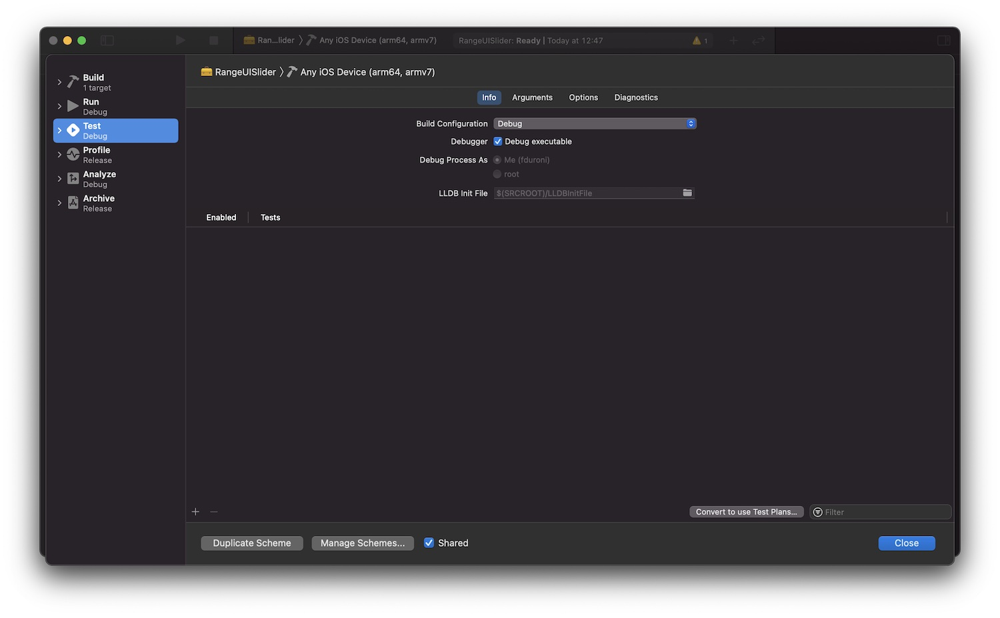
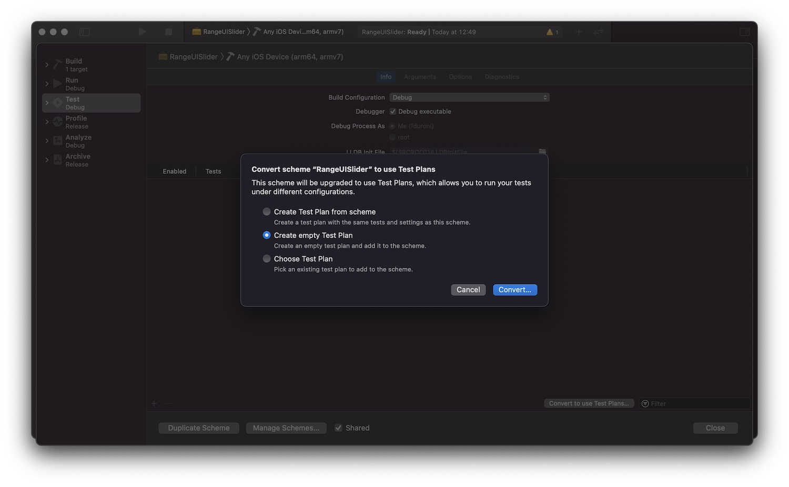
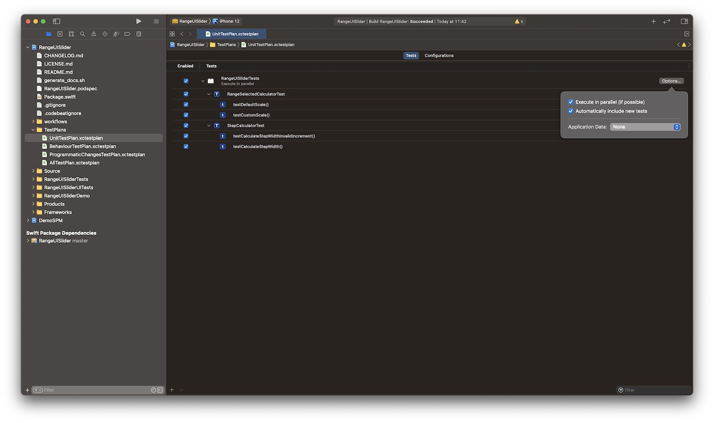
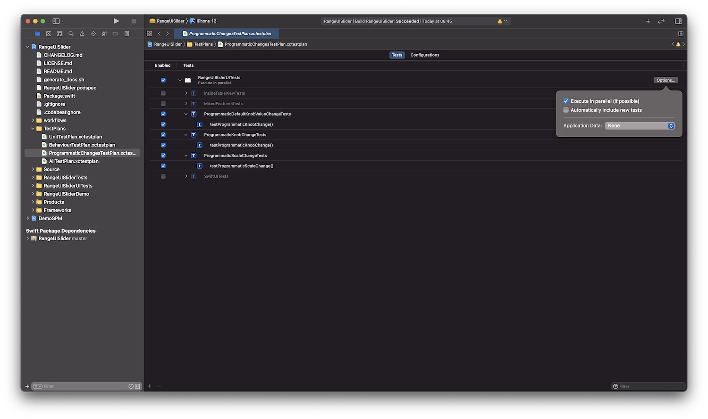
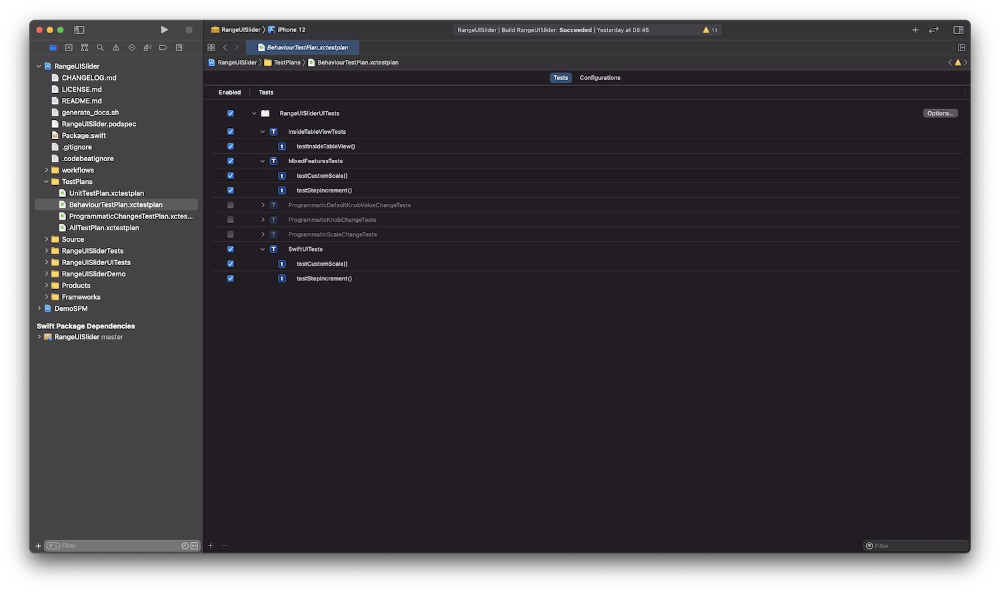
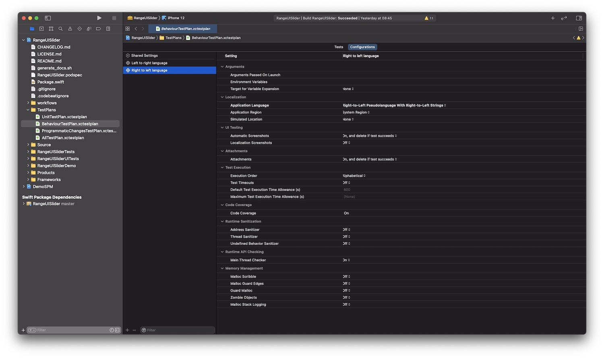
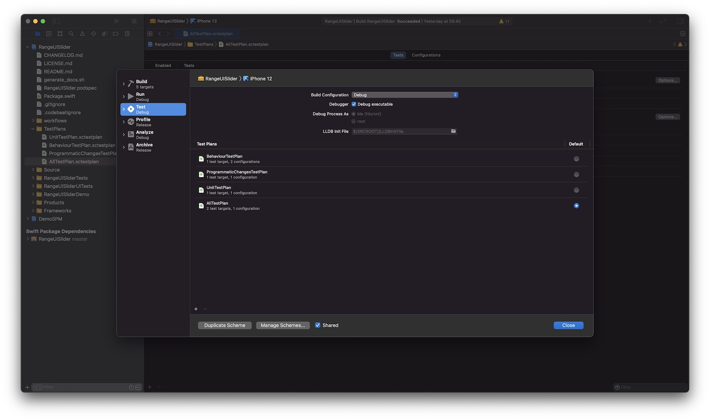

*Recently I added a lot of Unit and UI tests to RangeUISlider, one of my open source projects. Let's see how I grouped 
them and run them against multiple configurations with Xcode Test Plan.*

---

If you look at my [Github profile](https://github.com/chicio "fabrizio duroni github profile"), you can see that one of
my most starred open source project is [RangeUISlider](https://github.com/chicio/RangeUISlider "rangeslider ios"): an
iOS range selection slider compatible with UIKit and SwiftUI. I developed it using autolayout and it is highly
customizable (thanks to IBDesignabled and IBInspectable or programmatic property access.  
In the last month I did a big refactoring on its code base so that I can add features quickly and improved the code
quality. I also received some new feature request on github. In particular one
user [was asking for Right To Left Languages (RTL) support](https://en.wikipedia.org/wiki/Right-to-left "right to left language")
. There was one problem with these activities: there were basically no Unit or UI tests. This means that each one of
these activities was scaring and I had to manually test all the RAngeUISlider features. So I decided to add the tests
needed but two problems arise:

- the tests suite was slow. Just with the first few UI tests the execution of the entire tests suite was a pain in the
  ass :weary:. Given the fact that I wanted a quick feedback after each small steps of refactoring, this was not an
  ideal setup.
- one as I told you, one of the latest feature I added was the support for RTL languages. To test this feature I just
  wanted to run the UI test I already wrote but with a different device configuration: I wanted to run them on devices
  configured with a RTL languages.

So I started to wonder if there was a solution to these problems, and then I remembered a video I saw on my Apple TV in
the Apple Developer app the last year: Test Plans. What are they? Test plans are a new feature of Xcode that let you run
a subset of you tests (Unit or UI tests) against multiple configuration. They are defined using the `.xctestplan` file
format and they are already supported by `xcodebuild` command line execution and Xcode server/CI.  
As you can see from the definition this is exaclty what I needed for RangeUISlider. So in this post I will show you how
I setup the test plans for RangeUISlider and I had been able to refactor its entire code base in a safe way by running
the subset of tests needed to check my changes for the specific part of code I was working on and test it against
multiple configurations. Let's start!! :rocket:

#### Implementation

The first thing to do in order to be able to use Test Plans is enable for your scheme. Obviously, in my case I enabled
them for the `RangeUISlider` framework scheme. To do that you have to:

* go in the scheme selection panel and click on `Edit schemes` while your target is selected
* go to the test phase and click on the button in the bottom right corner `Convert to use Test Plans`

After that you will see a new window where you can choose how to create your first test plan. In my case I chose to
create an empty test plan and I clicked on continue.

When I converted the `RangeUISlider` tests to use test plan I had the following tests in place:

* a set of unit tests suites
* some UI test suites to test all the behavioural features (e.g. custom scale, step increment, SwiftUI integration etc.)
  You can find this test in the `MixedFeatureTest`, `InsideTableViewTests` and `SwiftUITests` test classes (see the
  repository link at the beginning of this post).
* some UI test suites to test the programmatic setup features (e.g. programmatic scale change, knob starting and current
  position). You can find this tests inside the `ProgrammaticDefaultKnobValueChangeTests`, `ProgrammaticKnobChangeTests`
  and `ProgrammaticScaleChangeTests` test classes.

As you can understand from the list above, these are three group of separated tests types that I want to execute
indipendently based on the code piece I'm working on. So I decided to create 3 test plans.  
The first one is `UnitTestPlan.xctestplan`. In this test plan I added all the unit tests I had at the time in order to
be able to execute them when I modify a piece of code that is related to all the collaborators that contains the logic
related to the range selected or the step increment calculations. This basically means that test target launched by the
test plan is `RangeUISliderTests`. These tests are executed with a single configuration. They can be executed in
parallel so I checked also the option `Execute in parallel (if possible)`. I also wanted that new tests added to this
suite should be added automatically to this test plan, so I checked the `Automatically include new tests` option.

The second test plan I created is `ProgrammaticChangesTestPlan.xctestplan`. As you can imagine in this test plan I added
all the test related to the RangeUISlider programmatic setup features. In particular at the moment of the creation of
the test plan I had 3 test suite that should be contained in this test plan: `ProgrammaticDefaultKnobValueChangeTests`
, `ProgrammaticKnobChangeTests` and `ProgrammaticScaleChangeTests`. These are all UI test, so in this case the test
target launched by the test plan is `RangeUISliderUITests`. For this plan I *unchecked*
the `Automatically include new tests` option, because I want add new test suites to this test plan only if they can be
classified as related to programmatic features.

The third test plan I created is `BehaviourTestPlan.xctestplan`. In this test plan I added all the behavioural UI test
suites I wrote for RangeUISlider: `MixedFeaturesTests`, `InsideTableViewTests` and `SwiftUITests`. These are again all
UI tests so the test target launched by the test plan is `RangeUISliderUITests`. This test plan contains the tests
related to all the core features of RangeUISlider: knobs movement, range selection, custom scale etc. This feature
should be tested against multiple configuration because, as I said before, RangeUISlider supports the RTL text. Test
plans let you define multiple configuration for the same test. This basically means that the tests included in a test
plan with multiple configuration will be execute multiple times, one for each configuration defined. So, for
the `BehaviourTestPlan.xctestplan` test plan I defined two configuration, one with a simulated left to right language
and the other one with the right to left language. In the screenshots below you can find the entire configuration.

Last but not least I created a last test plan called `AllTestPlan.xctestplan` where I added all tests from all the test
targets and I can use it to have a feedback when my change is spread across the logic, behaviour and UI.  
So how can I set which test plan I want to run? In the `Test` section of the `Edit Scheme` screen you can choose the
default test plan to be run with the `cmd + U` option. In this way you can change based on the piece of code you're
working on.

#### Conclusion

Test plan are the perfect tool that let you organize your tests in a better way. They will enable you to test only the
application/framework part you're working on in order to have a faster tests feedback loop. So in case you need a range
sllider component, go on `RangeUISlider` github repository and check it out!! :sunglasses:. You won't regret. 
