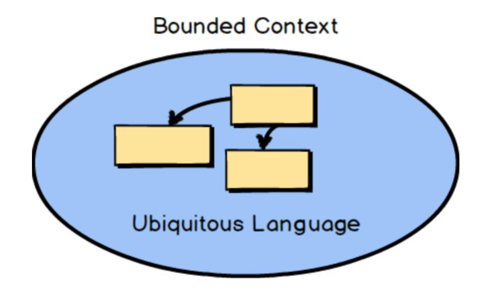
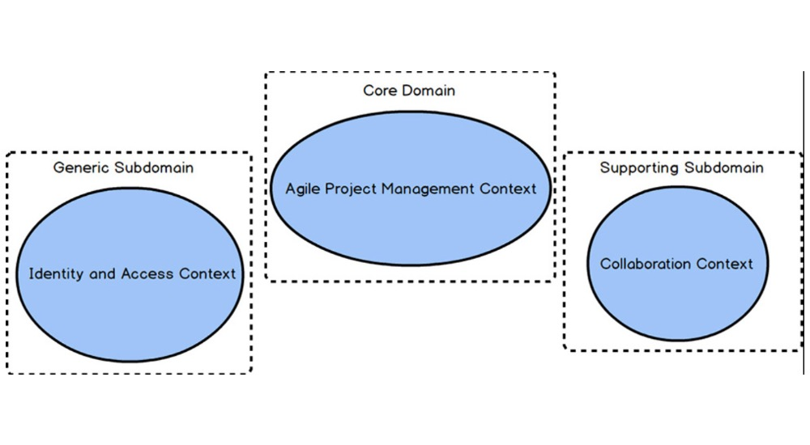
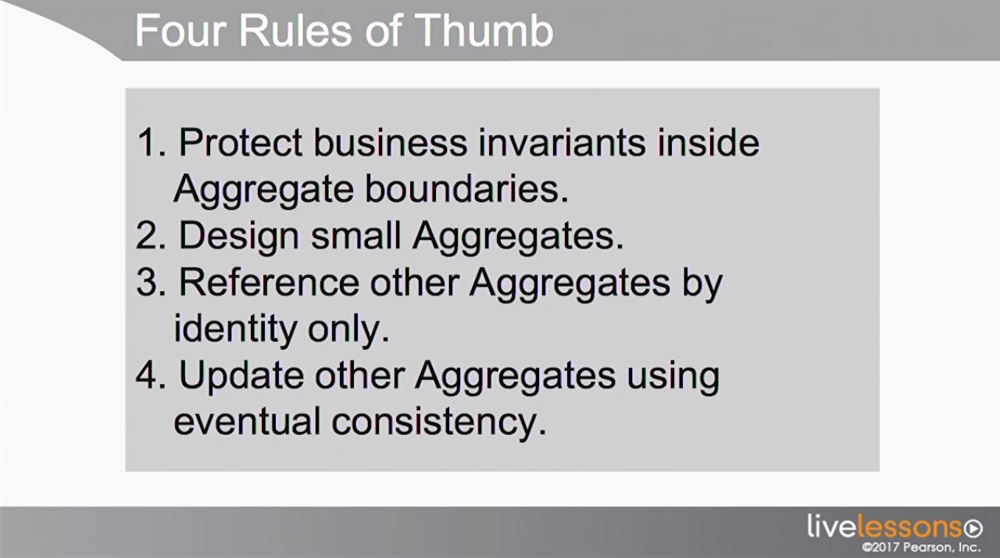
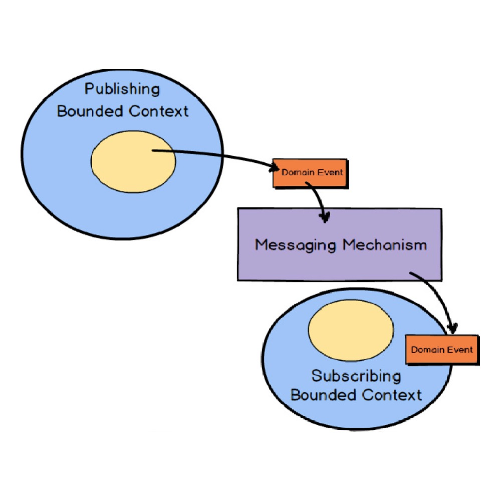

*In the last months, I started to hear a lot of stuff about Domain Driven Design. What is DDD? What does it try to
solve? This is a post for all the newbies (like me) that are searching for a definition of what DDD is, which are its
main parts and what is its main goal.*

---

In the last months the main focus of my daily job at [lastminute.com group](https://www.lastminute.com) was the existing refund process 
development in order to support our customer hit by the COVID-19 pandemic. While I’m still working (a lot :laughing:)
on it, I also had the opportunity to participate in the start up of a new project (anyway, still related to the 
refund stuff :sweat_smile:). In this new project we decided to take leverage of the power of DDD to approach the 
problem we need to solve. In my mind I said: ”Ok, let’s do it”, but then I started to think: ”What the f%*§ is this DDD? I do know nothing
about it” :sweat_smile:.  
This is why I recently attended the video course “Domain Driven Design Distilled”
by [Vaughn Vernon](https://twitter.com/vaughnvernon?lang=en), one of the top expert about DDD. In this post I will try
to share with you what I learnt about DDD and I will try to give you the best (opinionated) definition of DDD and of all
its parts.

#### DDD

So let’s start from the basis. What is DDD? DDD is a set of tools that help an organization to model software around its
business model. Generally speaking a company CAN’T be the best at everything. The DDD tools help organizations to better
understand their business and to choose at what they should excel. In this way through DDD an organization can implement
what is usually called Effective Design to develop its software. Its main features are:

* The final design meets the needs of the business to distinguish itself from the  other competitors.
* Force the organization where it should excel.

For the second point, I would like to quote a phrase from the Vernon DDD distilled course:

> ..An organization that works in the insurance industry, should try to be the best insurance company in that particular insurance area it operates. But it can’t be the best database company as well, or it can’t be the framework company, it can’t be the best accounting comparing as well an so on…

I think the statement above describes the needs of about 99% percent of the business I worked for in the last 13 years :flushed:.  
The DDD tools that will let you implement effective design are divided in two main phases:

* Strategic design
* Tactical design

Let’s see each one of them in details.

#### Strategic design

Strategic design is the first phase of DDD. With a set of specific tool strategic design will let you highlight what is
better important for your business. In this phase your domain models will be divided into smaller units, and they 
will be prioritized in terms of analysis/development efforts based on their importance. Strategic design is based primarily on
two tools:

* Bounded context
* Ubiquitous language

Let’s see them in details.

#### Bounded Context and Ubiquitous language

Let’s start from the definition of Bounded Context from the Vaughn Vernon course:

> …a Bounded Context is a semantic contextual boundary. This means that within the boundary each component of the software model has a specific meaning and does specific things. The components inside a Bounded Context are context specific and semantically motivated…

From the definition (and also from the name itself :laughing: ) a bounded context is a specific limit boundary within a
software model. Inside a bounded context everything is explicit about the model. The software model inside a bounded
context is created using terms from a language developed by the team working on the it. This language is called
Ubiquitous language and its main features are:

* It should be rigorous and non ambiguous
* It should be understood by all the team members

Usually the team that is working on a bounded context should work strictly with a business domain expert to better
define the ubiquitous language and to avoid mixing up concepts from different Bounded Context. Below you can find Vernon
definition of what an Ubiquitous languages is.

> …The software model inside the context boundary reflects a language that is developed by the team working in the Bounded Context and is spoken by every member of the team that creates the software model that functions within that Bounded Context. The language is called the Ubiquitous Language because it is both spoken among the team members and implemented in the software model…

How many bounded context will your project have? How do they map to your business domain parts. Let’s answer to these
question with Subdomain

#### Subdomains

Let’s start as always from the Vernon definition of what a subdomain is.

> …a Subdomain is a sub-part of your overall business domain. You can think of a Subdomain as representing a single, 
> logical domain model. Most business domains are usually too large and complex to reason about as a whole, so we 
> generally concern ourselves only with the Subdomains that we must use within a single project. Subdomains can be 
> used to logically break up your whole business domain so that you can understand your problem space on a large, 
> complex project.  
>
> Another way to think of a Subdomain is that it is a clear area of expertise, assuming that it is responsible for 
> providing a solution to a core area of your business. This implies that the particular Subdomain will have one or 
> more Domain Experts who understand very well the aspects of the business that a specific Subdomain facilitates. 
> The Subdomain also has greater or lesser strategic significance to your business...

In DDD, a subdomain maps to a single bounded context. The domain expert of a particular subdomain are an active part of
the team in charge of the related bounded context. There are 3 types of subdomains:

* Core domain: the most important subdomain of your organization. This is what differentiate your company from the
  competition in terms of business features. This is the domain where an organization will invest most of its energy and
  resources.
* Supporting subdomain: this is a subdomain where the organization should invest in terms of development effort because
  there isn’t an existing software solution that covers the business needs. Anyway this subdomain is not as important as
  the Core Domain from a strategical point of view. This is the reason why this kind of development are usually 
  outsourced to external companies in order to avoid putting too much effort and resources on it.
* Generic subdomain: this kind of subdomains includes needs where a software solution is already available to be
  purchased without the needs for any development efforts.

From the definition above it should be clear that every software project will have multiple subdomains and bounded
context. How do you integrate them together?

#### Context mapping

Context mapping lets you integrate different bounded contexts. It is the translation between them. It is important to
evaluate the “translation” trade off when a context mapping is required. This is usually related to the type of relation
between bounded context we would like to achieve. In particular its important to consider the real needs of a
relationship two bounded contexts. There are various types of context mapping:

* Partnership: two teams of two different bounded context have a partnership relation. The teams are synchronized on
  goals and schedules. Usually a Partnership context mapping is defined for a limited time period.
* Shared Kernel: the teams share a common model. It is not easy to be successful in this kind of context mapping. it
  requires an high commitment in terms of shared agreement between the teams.
* Customer-Supplier: as the name implies, the teams work in a “customer supplier” way. It’s important that the supplier
  understand the real needs of its customer in order to avoid an evolution of the model not needed by the customer.
* Conformist: - Conformist: a team will integrate with a very large and complex model that is already well established by another
  team.
* Anticorruption layer: a translation layer is created between the communication of teams from different bounded
  context. In this way the teams that receive the information could adapt them based on the their specific business
  needs. It should be used whenever possible.
* Open Host Service: similar to Anticorruption layer but without the translation layer. In this case a team A uses the
  APIs from a team B, and the business model inside it, without any translation.
* Published language: a well defined language is defined in order to enable the consumption of a model from a bounded
  context from the other bounded contexts. Usually you can use some well know format like XML, JSON, Avro, Protobuf etc.
  to defined the published language.
* Separate ways: last but not least, you can use decide to not integrate with another bounded context and create your
  own specialized solution (eg. a new solution in your own bounded context is much more simple to create than the
  integration with another bounded context).

#### Tactical design

In the previous paragraph we explored all the details of Strategic Design. At this point I think it’s clear that
Strategic Design is an high level design phase, because it lets you define the subdivision of your domain and of your
software model without entering into details. In particular, at this point with strategic design we defined all our
bounded contexts but not what live inside them. All the details of the bounded contexts are defined in the Tactical
Design phase.  
What are the details we want to define during the Tactical Design? We would like to define the concepts contained in a
bounded context. This are usually represented as Aggregates.

#### Aggregates

An aggregate is a set of domain objects, usually called Entities and Value Objects, that are considered as a single item
inside our bounded context. One of the entities that make up the Aggregate is called the Aggregate Root or Root Entity.
This entity owns all the others inside the aggregate. Value objects are used, as the name implies, to represent values.
We can have a look at Vernon definition that I think is enough clear.

> A Value Object, or simply a Value, models an immutable conceptual whole. Within the model the Value is just that, a value. Unlike an Entity, it does not have a unique identity, and equivalence is determined by comparing the attributes encapsulated by the Value type. Furthermore, a Value Object is not a thing but is often used to describe, quantify, or measure an Entity.

The most important feature of aggregates is that they represents transactional boundaries. Again let’s quote Vernon to
understand the meaning of this concept.

> …Aggregate forms a transactional consistency boundary. This means that within a single Aggregate, all composed parts must be consistent, according to business rules, when the controlling transaction is committed…

Simple and clear. All the parts of an aggregate must be consistent when saved. So they should be saved in a single
“transaction”. In this case the concept of transaction is much more broader than the one usually related to database. In
fact the type of transaction used to save your aggregate is an implementation details. It could be a database
transatction, or could be something implemented using Reactive programming events/messaging.  
There are 4 rules of thumb reported by Vernon to be considered when you’re creating aggregates:

Let’s try to analyze them. The first one refer to the fact that the business should determine Aggregate anatomy based
on what should be consistent when a transaction is committed.  
The second one is easy (and common in computer science :laughing:): keep your aggregates small in order to reduce memory
footprint and complexity. The third one also is simple and clear: aggregates should reference each other by identity
fields in order to (again) reduce memory footprint but also, and more important in this case, enforce the transactional
boundary that each aggregate represents.  
Last but not least the eventual consistency update rule. As we already said, aggregates are transactional boundaries.
How do we signal that another aggregate should be updated when another one finished its update transaction? We can use a
messaging mechanism in order to guarantee that after the transaction on one aggregates, others should be updated too.
For this scope Domain Events come to rescue us.

#### Domain Events

Let’ quote (again :laughing:) the Vernon definition of Domain Events.

> A Domain Event is a record of some business-significant occurrence in a Bounded Context.

So domain events are the fundamentals of communication between aggregates in order to keep them eventual consistent
between each other. When creating domain events we should put a lot of attention to decide its name: should be a
statement of a past occurrence, that is, a verb in the past tense, that describe what happened in the aggregate that
originated the event. The combination of the Domain Event’s name and its properties are the record of what happened in
the domain model. Domain events are usually stored with its aggregate. It’s important to save them together in the same
transaction. Should domain events contain additional data? Yes, but as Vernon says we must be careful to not fil them
with too much data

> …there are times when a Domain Event can be enriched with additional data. This can be especially helpful to consumers that don’t want to query back on your Bounded Context to obtain additional data that they need. Even so, you must be careful not to fill up a Domain Event with so much data that it loses its meaning…

As we said above domain events should be saved while updating aggregates. This is useful in order to have a clear
understand of what happened to an aggregates. We can also use them to implement event sourcing.

#### Event sourcing

Event sourcing is a technique where an aggregate current state is reconstructed by applying in temporal order all the
domain events related to an aggregate. Let’s take a look at the explanation from Vernon:

> Event Sourcing can be described as persisting all Domain Events that have occurred for an Aggregate instance as a record of what changed about that Aggregate instance. Rather than persisting the Aggregate state as a whole, you store all the individual Domain Events that have happened to it. Let’s step through how this is supported.    
> All of the Domain Events that have occurred for one Aggregate instance, ordered as they originally occurred, make up its event stream. The event stream begins with the first Domain Event that ever occurred for the Aggregate instance and continues until the last Domain Event that occurred. As new Domain Events occur for a given Aggregate instance, they are appended to the end of its event stream. Reapplying the event stream to the Aggregate allows its state to be reconstituted from persistence back into memory. In other words, when using Event Sourcing, an Aggregate that was removed from memory for any reason is reconstituted entirely from its event stream.

Event sourcing has a lot of advantages, from a business point of view and from the developer point of view. One of the
greatest advantages of using it from the business point of view is that you have historical data that you can use for
many reasons, ones that you can imagine today, such as compliance and analytics, and ones that you won’t realize until
later. For developers it can enable them to use event streams to examine usage trends and to debug their source code.

#### Conclusion

If you came until here I hope you enjoyed the read, but more important that you found the answers you were searching
for. If this post didn’t clarify your doubts, let me know in the comments, so that I can try to add what is missing and
improve it. :kissing_heart:
