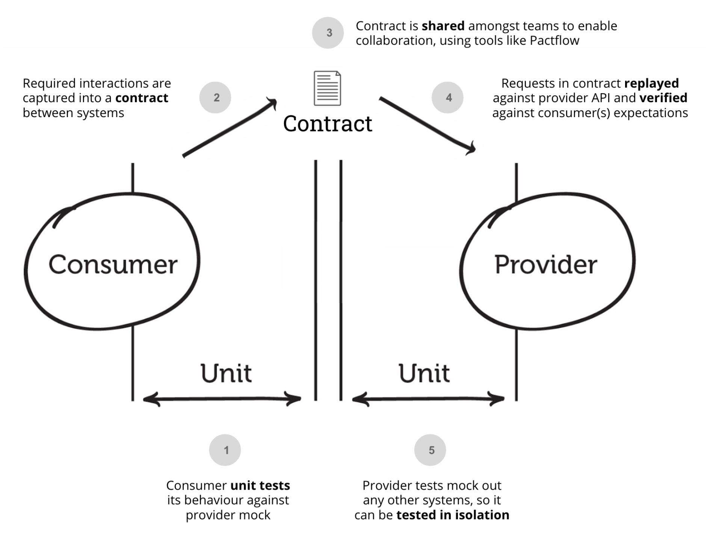

----
title: "Contract testing asynchronous messaging with Pact"
description: "Let’s see how we used pact to test a message-based interaction between two microservices with Pact"
date: 2021-11-20 image: ../images/posts/ddd-bounded-context-ubiquitous-language.jpg
tags: [test driven development, contract test, pact,]
comments: true 
math: false 
authors: [fabrizio_duroni]
----

In the last weeks I worked with my colleague XXX on a new feature for our company refund process (as may already know
from some of [my previous posts]() in the last 2 years I worked mainly on backend applications). In this new feature we
have a messaging-based communication between micro services. The messaging system used is [RabbitMQ](). In the company
we are already using [Pact](https://docs.pact.io "pact doc") to implement contract testing for the classic RESTful 
interaction between microservices (introduced by XXX). What is contract testing? let’s have a look at the definition from the Pact website.

> Contract tests assert that inter-application messages conform to a shared understanding that is documented in a contract. Without contract testing, the only way to ensure that applications will work correctly together is by using expensive and brittle integration tests.  
> Do you  [set your house on fire to test your smoke alarm?](https://dius.com.au/2014/05/19/simplifying-micro-service-testing-with-pacts/)  No, you test the contract it holds with your ears by using the testing button. Pact provides that testing button for your code, allowing you to safely confirm that your applications will work together without having to deploy the world first.

So contract testing is a way to ensure that two application communicate correctly by adhering to a contract that
describe the API or the message exchanged between them. Cool, isn’t it? 😏

In this post I will show you how we tested a messaging interaction between two microservices using Pact. Let’s go!!! 🚀

#### Setup

Our example application is composed by two microservices:

* `RefundService`, a spring boot web application that manages everything related to the refund of an order of a 
  customer. In our example this application will be the *producer* of a *refund ready message*.
* `AccountService`, a spring boot web application that manages everything related to the customer account. In our 
  example this application will be the *consumer* of a *refund ready message* that came from the `RefundService` application. 

Let's see the dependencies need by these applications. Both of them will depend on these libraries/languages:

* spring boot, kotlin, [arrow](https://arrow-kt.io "arrow kotlin") (kotlin functional programming library) 
  production code 
* spring boot starter test, [kotest]() and [mockk]() for the testing part

For writing our Pact test:

* `RefundService` will have a (of course) the dependencies to the pact provider dependency `au.com.dius.pact.
  provider.junit5` 

Before starting let's see what we need to setup in order to proceed. As you may already notice from the image above, 
the contract defined 

... pact broker with docker, maven dependencies

#### Implementation

….

#### Conclusion

….
