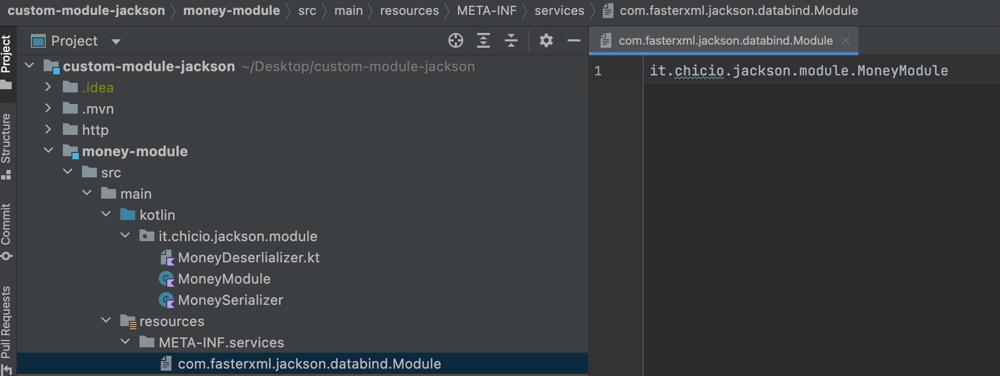

*Sometimes you have custom Jackson object mapper imported from external modules/libraries. How can you
customize their serialization/deserialization? Let's go to discover the power of Java Service Provider Interface.*

--- 

In the last weeks I started to work in a new team on a new project at [lm group](https://lmgroup.lastminute.com 
"lastminute"). One of the goals we have is to renew the foundations of the company software overall architecture by introducing in the development workflow new technologies. In particular, we are using [Axon](https://www.axoniq.io), a framework to help developer to create [Domain Driven Design](https://www.fabrizioduroni.it/2021/06/06/ddd-dictionary/) applications that leverage specific architectural pattern like [CQRS](https://martinfowler.com/bliki/CQRS.html) and [Event Sourcing](https://martinfowler.com/eaaDev/EventSourcing.html).  
During the definition of a new microservice we had to customize the object mapper used by Axon, 
defined in one maven module (that will probably be integrated in our [app-framework framework](https://technology.lastminute.com/frontend-backend-languages-frameworks/) 
if we decide to stick with it) from one of our new app specific module *without creating any kind of 
coupling/dependencies*. This is how me and [Alex Stabile](https://www.linkedin.com/in/alex-stabile-a9316b94/) 
discovered the power of [Java Service Provider interface](https://www.baeldung.com/java-spi), used by [Jackson 
Object Mapper](https://www.baeldung.com/jackson-object-mapper-tutorial) to register external custom [Modules](https://fasterxml.github.io/jackson-databind/javadoc/2.7/com/fasterxml/jackson/databind/Module.html) in order 
to apply application specific serialization/deserialization procedures.  
Before starting with the implementation details, let me introduce Alex :rocket::clap:. He is a Senior Software 
Engineer with 9 years of experience. He is able to develop software application as a real Full stack developer, from 
the backend using a lot of different languages, to the frontend (web and mobile).
So everything is setup and ready, let's go!! :rocket: 

#### Implementation

Let's start by defining a simple `webapp` application defined in one maven module. This app exposes a couple of 
endpoints in the `ProductRestController`, a standard spring boot `RestController`. These endpoints let the client add 
and retrieve `Product` information by using the `ProductRepository`. Below you can find the controller code.

```kotlin
@RestController
class ProductRestController(
    private val productRepository: ProductRepository
) {

    @GetMapping("/product/{idProduct}")
    fun getProductFor(@PathVariable idProduct: Long): ResponseEntity<*> =
        productRepository
            .get(idProduct)
            .fold(
                { ResponseEntity.notFound().build() },
                { ResponseEntity.ok(it) }
            )

    @PostMapping("/product/add")
    fun add(@RequestBody product: Product): ResponseEntity<*> =
        productRepository
            .add(product)
            .fold(
                { ResponseEntity.internalServerError().build() },
                { ResponseEntity.ok(it) }
            )
}
```

The `Product` and `ProductRepository` classes are really simple. `ProductRepository` is an ["in memory 
repository"](https://martinfowler.com/bliki/InMemoryTestDatabase.html) that exposes a couple of methods to get and 
add products. This repository has been created using [Arrow](https://arrow-kt.io) (see the result type of type 
`Option`).

```kotlin
class ProductRepository {
    private val products = mutableListOf(
        Product(
            1,
            "A product",
            Money.of(BigDecimal("100.00"), "EUR")
        ),
        Product(
            2,
            "Another product",
            Money.of(BigDecimal("150.00"), "EUR")
        ),
        Product(
            3,
            "Yet another product",
            Money.of(BigDecimal("120.50"), "EUR")
        )
    )

    fun get(idProduct: Long): Option<Product> =
        products.find { it.idProduct == idProduct }.toOption()

    fun add(product: Product): Option<Unit> =
        products
            .find { it.idProduct == product.idProduct }
            .toOption()
            .fold(
                {
                    products.add(product)
                    Unit.some()
                },
                { None }
            )
}
```

`Product` contains the information about our products. Here comes the interesting part: the `amount` property has 
been defined using the `Money` type from the [JavaMoney library](http://javamoney.github.io). 

```kotlin
import org.javamoney.moneta.Money

data class Product(
    val idProduct: Long,
    val description: String,
    val amount: Money
)
```

The fact that we are using the `Money` type in the amount means that in the response and request of te endpoints we 
showed above, the object to be passed as JSON should be with all the fields of this type. For example the 
`/product/{idProduct}` endpoint will return us the following response.

```json
{
  "idProduct": 3,
  "description": "Yet another product",
  "amount": {
    "currency": {
      "context": {
        "providerName": "java.util.Currency",
        "empty": false
      },
      "currencyCode": "EUR",
      "numericCode": 978,
      "defaultFractionDigits": 2
    },
    "number": 120.5,
    "context": {
      "precision": 256,
      "fixedScale": false,
      "maxScale": -1,
      "amountType": "org.javamoney.moneta.Money",
      "providerName": null,
      "empty": false
    },
    "numberStripped": 120.5,
    "zero": false,
    "positive": true,
    "positiveOrZero": true,
    "negative": false,
    "negativeOrZero": false,
    "factory": {
      "defaultMonetaryContext": {
        "precision": 0,
        "fixedScale": false,
        "maxScale": 63,
        "amountType": "org.javamoney.moneta.Money",
        "providerName": null,
        "empty": false
      },
      "maxNumber": null,
      "minNumber": null,
      "amountType": "org.javamoney.moneta.Money",
      "maximalMonetaryContext": {
        "precision": 0,
        "fixedScale": false,
        "maxScale": -1,
        "amountType": "org.javamoney.moneta.Money",
        "providerName": null,
        "empty": false
      }
    }
  }
}
```

This is not what we want!!! :fearful:  What we would like to have as response is something like the following json. 

```json
{
  "idProduct": 3,
  "description": "Yet another product",
  "amount": {
    "amount": "120.5",
    "currency": "EUR"
  }
}
```

We also have the same problem in the `/product/add` endpoint, where we are forced to send a request with the payload 
above, the one with all the `Money` fields, in order to add a product. How can we customize the way the Jackson 
`ObjectMapper` serialize/deserialize `Money` instances? We can write a custom `Module` for it. By 
defining a custom module we can add ad-hoc serializers and deserializers. We will define our object mapper module in 
a *new maven module* called `money-module`.  
Let's start by defining the`MoneyDeserializer`. It will give us the ability to define a `Money` instance from the data 
contained in a JSON that we are deserializing.

```kotlin
open class MoneyDeserializer : StdDeserializer<Money>(Money::class.java) {
    override fun deserialize(jsonParser: JsonParser, obj: DeserializationContext): Money {
        val node: JsonNode = jsonParser.codec.readTree(jsonParser)
        val amount = BigDecimal(node.get("value").asText())
        val currency: String = node.get("currency").asText()

        return Money.of(amount, currency)
    }
}
```

The `MoneySerializer` let us defined which fields of a `Money` instance we want to write to a json. We can also the 
define the specific type we want to use in the json for each one of them.

```kotlin
open class MoneySerializer : StdSerializer<Money>(Money::class.java) {
    @Throws(IOException::class)
    override fun serialize(money: Money, jsonGenerator: JsonGenerator, serializerProvider: SerializerProvider) {
        jsonGenerator.writeStartObject()
        jsonGenerator.writeStringField("amount", money.numberStripped.toPlainString())
        jsonGenerator.writeStringField("currency", money.currency.toString())
        jsonGenerator.writeEndObject()
    }
}
```

Now we can add our custom serializer/deserializer to our `MoneyModule` definition. 

```kotlin
class MoneyModule: SimpleModule() {
    override fun getModuleName(): String = this.javaClass.simpleName

    override fun setupModule(context: SetupContext) {
        val serializers = SimpleSerializers()
        serializers.addSerializer(Money::class.java, MoneySerializer())
        context.addSerializers(serializers)

        val deserializers = SimpleDeserializers()
        deserializers.addDeserializer(Money::class.java, MoneyDeserializer())
        context.addDeserializers(deserializers)
    }
}
```

We are now at the core of our development: how do we load our custom module into our object mapper? Well we have 
different options based on our use case. If you're using the *DEFAULT Spring Boot object mapper* you can just *define 
a new `@Bean` for the `MoneyModule`* that will be used by Spring Boot to load it(with its custom internal flow).  
But this is not our case: in our `ProductConfiguration` we have defined a custom `objectMapper` bean.

```kotlin
@Configuration
class ProductConfiguration {
    @Bean
    fun productRepository(): ProductRepository = ProductRepository()

    @Bean
    @Primary
    fun objectMapper(): ObjectMapper =
        ObjectMapper()
            .findAndRegisterModules()
            .configure(SerializationFeature.WRITE_DATES_AS_TIMESTAMPS, false)
}
```

If you look closely to our `ObjectMapper` definition you can see something interesting: before returning the 
instance creation there is a call to the `findAndRegisterModules`. What does this method do? It contains 
the core feature of Jackson `Module`s load :heart_eyes:. This method is in charge of loading external third party 
modules using the [Java Service Provider interfaces](https://www.baeldung.com/java-spi).  
This is a feature of Java 6 that let (library) developer write code to load and discovery third party plugins for their 
library implementations that matches a specific interface. In our case Jackson uses it to load every third party 
implementation that matches the `Module` interface. How does it work? The `ServiceProvider` will scan the classpath 
searching for service definition adhering to the base interface defined for the external/third party implementation.  
This is done by searching for a specific file in the folders `META-INF/services` of the (maven) modules in the classpath, named with 
the fully qualified name of the interface loaded by the `ServiceProvider` and that contains the fully qualified name 
of our implementation. So in our case, to load our `MoneyModule` contained in the maven module `money-module`, we 
just have to add a file named `com.fasterxml.jackson.databind.Module` in  the `META-INF/services` folder of the 
`money-module` and inside it write the fully qualified name of our `MoneyModule` implementation.



That's it!!! :rocket: With the implementation above we have a custom Jackson `Module` that will be loaded by its 
`ObjectMapper` automatically without creating any dependencies. In this way you will be able to publish your 
custom serializer/deserializer as custom maven artifacts and use them in all your projects (without copy/paste them)
:heart:.

#### Conclusion

You can find the complete source code of the example show above in this [Github repository](https://github.com/chicio/Custom-Jackson-Module). Stay tuned for new 
article on one of the technologies/Pattern above (Axon, CQRS, Event Sourcing, we have a lot of stuff to talk about 
:heart: ). 
