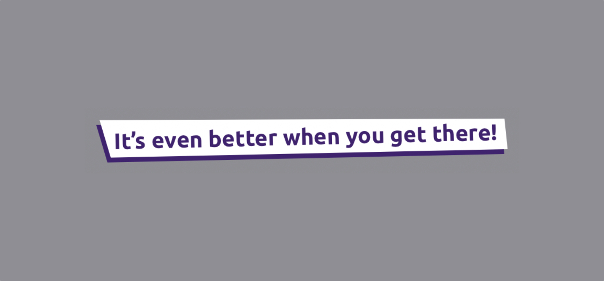

*Let's have some fun with SwiftUI by drawing an inspiration title component leveraging Path and Shape.*

---

As you may already know, at [lastminute.com group](https://lmgroup.lastminute.com/ "lastminute.com group") we have 
[Friyay instead of Friday](https://technology.lastminute.com/tech-learning-and-development-friyay/ "lastminute.com 
learning"). In the Friyay everyone can learn and improve his/her skill on any subject. In particular, as you seen 
from one of my [previous post](/2022/06/06/microfrontend-module-federation-dynamic-configuration/ "module 
federation"), I spent some Friyay putting in place the first microfrontend architecture for the customer 
area of lastminute.com websites (while also trying to study in deep some other topics).  
In the last weeks I started a new Friyay "secret" project with my colleague 
[Marco De Lucchi](https://www.linkedin.com/in/marcodelucchi/). As you may already remember [I already worked with 
Marco](/2020/01/18/react-native-activate-hermes/ "react native hermes") in the past when I was part of the mobile app 
team.
For this new secret project, we are developing something new for our mobile app 
using [SwiftUI](https://developer.apple.com/xcode/swiftui/ "swiftui"). We had various challenges to overcome. 
One of this has been to be able to display a cool inspirational title like the following one.



The easiest way to go could be to simply include in the target bundle the localized version of an assets that 
represent the title above. This is easily achievable using 
[Xcode localized assets](https://developer.apple.com/documentation/xcode/localizing-assets-in-a-catalog "xcode 
localized assets"). But given that we were already having fun with SwiftUI (remember, it is a Friyay project 
:laughing: ) and that we want to save bytes on the bundle size (that is always important), we decided to be bold and 
try to implement the title in the screenshot above using only code (no assets).  
So in this post we will show you our own personal journey into the world of SwiftUI `Path` and `Shape` and how we 
have been able to create the inspirational title in the screenshot above using only code. Let's go!! :rocket:

#### Implementation

Let's start from the most challenging part: the background. As you can see from the image above it is 
basically the same shape drawn twice, one above each other, with different color and a slightly different position 
in space. In the original Figma we received from UX we were able to extract the svg path coordinates for these shapes.  
So how can we draw them in SwiftUI? We can use [Path](https://developer.apple.com/documentation/swiftui/path 
"swiftui path") and [Shape](https://developer.apple.com/documentation/swiftui/shape "swiftui shape"). The first one 
is a `struct` that represents the outline of a 2D shape in terms of a set of point and their connection. The second 
one is a protocol that contains one specific method required `func path(in: CGRect) -> Path`: by implementing it we 
must return a `Path` that describe the outline of the `Shape` itself in the current reference `Rect`, that can change 
based on the usage context of the `Shape` itself.  
So given the svg coordinate that I mentioned before, we can create a component named `TitleBackgroundShape` that 
implement the `Shape` protocol that draws the path described by the svg. To quickly convert the svg path into code 
we used [https://swiftvg.mike-engel.com](https://swiftvg.mike-engel.com "swift svg path"). This tool transformed our 
two svg path as the following `UIBezierPath`. 

```swift
// ...other code...

private var whitePath: UIBezierPath {
    let shape = UIBezierPath()
    shape.move(to: CGPoint(x: 247, y: 15.79))
    shape.addLine(to: CGPoint(x: 8.72, y: 21))
    shape.addLine(to: CGPoint(x: 2, y: -2.08))
    shape.addLine(to: CGPoint(x: 245.12, y: -3))
    shape.close()
    return shape
}
private var purplePath: UIBezierPath {
    let shape = UIBezierPath()
    shape.move(to: CGPoint(x: 245, y: 18.79))
    shape.addLine(to: CGPoint(x: 6.72, y: 24))
    shape.addLine(to: CGPoint(x: 0, y: 0.92))
    shape.addLine(to: CGPoint(x: 243.12, y: 0))
    shape.close()
    return shape
}
    
// ...other code...    
```

Given the paths above a first naive implementation of the `TitleBackgroundShape` component could be the following.

```swift
private struct TitleBackgroundShape: Shape {
    private let path: UIBezierPath
    
    init(path: UIBezierPath) {
        self.path = path
    }
    
    func path(in rect: CGRect) -> Path {
        return Path(path.cgPath)
    }
}
```

Seems easy, but of course there is a problem: if you look carefully at the svg path above, you will notice that it 
is defined for some specific dimension. Generally speaking, even if we export the svg with coordinate system define 
between 0 and 1 on each axis, we still need to find a way to scale the path correctly with respect to the current 
frame we are drawing into, represented by the `rect` parameter of the `func path(in rect: CGRect) -> Path` function. 
How can we do this? There are 
[affine transforms](https://people.cs.clemson.edu/~dhouse/courses/401/notes/affines-matrices.pdf "affine transform") to 
the rescue!! 
:rocket: They are very useful (and also used a lot in computer graphics :laughing: ) geometric linear transform that 
preserve co-linearity and parallelism. The affine transform matrix for 
2D scaling expressed as [homogenous coordinates](https://people.cs.clemson.edu/~dhouse/courses/401/notes/affines-matrices.pdf "affine transform") is the following one.

$$
\begin{bmatrix}
S_{x} & 0 & 0 \\
0 & S_{y} & 0 \\
0 & 0 & 1 \\
\end{bmatrix}
\begin{bmatrix}
x \\
y \\
1 \\
\end{bmatrix}
=
\begin{bmatrix}
x \cdot S_{x}\\
y \cdot S_{y} \\
1 \\
\end{bmatrix}
$$

Guess what? Inside the `Core Graphics` framework we already have the `CGAffineTransform` struct with various init 
methods, one for each type of transform (rotate, scale and translation, but shear seems missing for unknown reasons 
:laughing: ).
In our case we will use `CGAffineTransform(scaleX: <value>, y: <value>)`. Which are the value to be used as scale factor? 
For our goal we need to calculate the ratio between the `rect` parameter of the `func path(in rect: CGRect) -> Path` 
function (that as we said before it is the `CGRect` in which we are drawing our shape) and the bounding rect of the 
path itself. Luckily, SwiftUI exposes a beautiful `boundingRect` property on the `Path` that is exactly what we need.
So in the end the final implementation of our `TitleBackgroundShape` is the following one.

```swift
private struct TitleBackgroundShape: Shape {
    private let path: UIBezierPath
    
    init(path: UIBezierPath) {
        self.path = path
    }
    
    func path(in rect: CGRect) -> Path {
        let path = Path(path.cgPath)
        return path.applying(
            CGAffineTransform(
                scaleX: rect.width / path.boundingRect.width,
                y: rect.height / path.boundingRect.height
            )
        )
    }
}
```

Now that we have our shape, we need to draw it twice with the two svg paths we saw above. We can draw them in a 
`ZStack` in order to have the white one as overlay of the purple one. This is the final implementation of our shape 
components that we will call `TitleBackground`.

```swift
struct TitleBackground: View {
    private var whitePath: UIBezierPath {
        let shape = UIBezierPath()
        shape.move(to: CGPoint(x: 247, y: 15.79))
        shape.addLine(to: CGPoint(x: 8.72, y: 21))
        shape.addLine(to: CGPoint(x: 2, y: -2.08))
        shape.addLine(to: CGPoint(x: 245.12, y: -3))
        shape.close()
        return shape
    }
    private var purplePath: UIBezierPath {
        let shape = UIBezierPath()
        shape.move(to: CGPoint(x: 245, y: 18.79))
        shape.addLine(to: CGPoint(x: 6.72, y: 24))
        shape.addLine(to: CGPoint(x: 0, y: 0.92))
        shape.addLine(to: CGPoint(x: 243.12, y: 0))
        shape.close()
        return shape
    }
    
    var body: some View {
        ZStack(alignment: Alignment.topLeading) {
            TitleBackgroundShape(path: purplePath)
                .fill(Color("SecondaryColor"))
            TitleBackgroundShape(path: whitePath)
                .fill(Color("TextColor"))
        }
    }
}
```

Last but not least, for the message text we can use a standard `Text` component. As you can see from the image above it 
is a white bold text (represented in the example as `SecondaryText`). If you look  at it carefully, you will notice that 
it is slightly rotate. In fact checking the Figma design we received from UX, we discovered that it has a 1.
38-degree rotation. This is why we used the `.rotationEffect(Angle(degrees: -1.38))` modifier. We also want our text 
always on 1 line (forcing it to be truncated in some exceptional cases) and centered with the `.lineLimit(1)` and `.
multilineTextAlignment(.center)` modifiers.  
As you can see again from the initial image, we want also a specific padding around our text, in order to have some 
space with respect to the background. This is why we added the three `.padding` modifiers in order to have specific 
spacing for each side.  
We are finally ready to add the custom background  component `TitleBackground` we created before. We need to put it 
behind the text, but we want also to see it grows proportionally to the text dimension. This is why we included the 
`Text` component in a `ZStack`, and we added with the `.background` modifier the `TitleBackground`. Below you can find 
the implementation.

```swift
struct InspirationaTitle: View {
    var body: some View {
        ZStack {
            Text(LocalizedStringKey("It's event better when you get there!"))
                .foregroundColor(Color("SecondaryColor"))
                .fontWeight(.bold)
                .minimumScaleFactor(0.4)
                .rotationEffect(Angle(degrees: -1.38))
                .lineLimit(1)
                .multilineTextAlignment(.center)
                .padding(.leading, 12)
                .padding(.trailing, 4)
                .padding(.bottom, 8)
        }
        .background(TitleBackground())
    }
}
```

#### Conclusion

In this [github repository](https://github.com/chicio/Path-Example "swiftui path example") you can find the 
implementation fo the example described above. I'm really excited to share with you in the next weeks the entire 
project where we used the implementation above. Stay tuned! :ear: :rocket:
