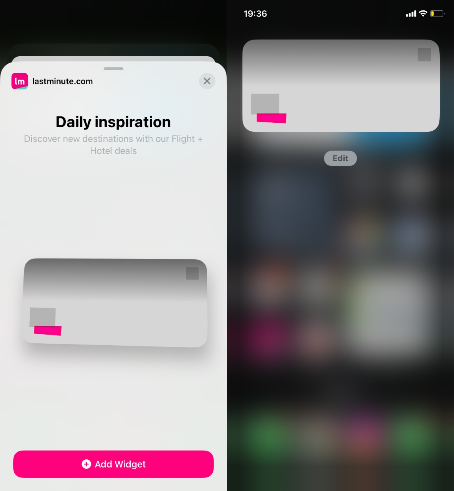
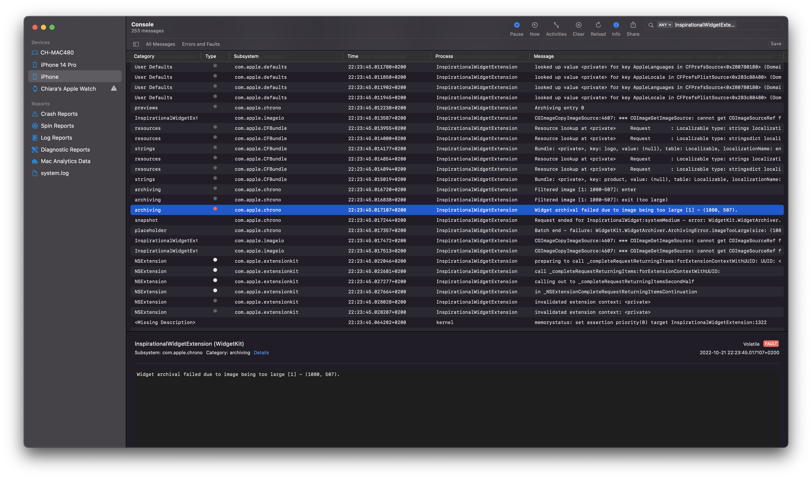

*Discover how we had a long day debugging WidgetKit problems with images.*

---

In a [recent post](https://technology.lastminute.com/widget-ios-swiftui-configuration-intent/) on the 
lastminute.com official blog, we presented our FriYaY project: an inspirational iOS widget.
We were so excited to have our first widget in production that we ~~forced~~ asked all our colleagues to give it a try.  
Unfortunately, for some people, the widget was loading in a broken state: as you can see from the image below,
the assets were not loading.



We were heartbroken. We tested the widget carefully before going to production,
on multiple iPhones and iPads with different iOS and iPadOS versions, even with the iOS 16 Developer Beta build,
and we never had this behaviour.  
Soon we found ourselves deep into the code, trying to catch the bug. There was not a
single line in the Xcode log that was pointing us to the right solution.

We tried to:

- debug the REST services, to understand if there was a bug in the API
- debug the Network Client code, to understand if there were some errors in the deserialization of the JSON or in the image download
- debug the UI, to understand if we were making mistakes with the Image display code.

During the investigation we noticed that both the images bundled inside the extension
(e.g. the one shown in the widget picker before installing it) and the ones downloaded from the API were not working.
We were able to replicate the issue only on iPhone 11 (A13 Bionic Chip) and older.

We finally checked the general system log using the Console.app, to better understand what was happening at system level.
To avoid having noise in the logs, we created and empty app project with attached our widget extension.
While running the test app on an iPhone 11, we finally found the problem.



As you can see from the screenshot, the widget was failing to archive because the image used as background (what we
called inspiration image in the previous posts) was too big. This was causing a memory leak
(see `CGImageCopyResourceImageSource` logs) that prevented the code from opening the images causing
the "broken widget" state reported above.  
After some searches we found [this thread](https://developer.apple.com/forums/thread/710745) on the Apple Developer Forum,
where they were suggesting to reduce images' size using some UIImage extension code.

_So how did we solve the problem?_ We simply sized our images in the right way :laughing:.  
Using the [WidgetKit Human Interface Guidelines](https://developer.apple.com/design/human-interface-guidelines/components/system-experiences/widgets/#specifications)
from Apple, we gave to the images the size based on the width of the widgets on the various iPhones.
If you can't approach the problem in this way, you can still use the extension code for UIImage mentioned
in the Apple Developer Forum above.

```swift
extension UIImage {
  func resized(toWidth width: CGFloat, isOpaque: Bool = true) -> UIImage? {
    let canvas = CGSize(width: width, height: CGFloat(ceil(width/size.width * size.height)))
    let format = imageRendererFormat
    format.opaque = isOpaque
    return UIGraphicsImageRenderer(size: canvas, format: format).image {
      _ in draw(in: CGRect(origin: .zero, size: canvas))
    }
  }
}
```

#### Conclusion

The journey into WidgetKit during our FriYaY is not finished yet, and we are planning to introduce more new features 
in the near future, sooo stay tuned!!! :heart:  
