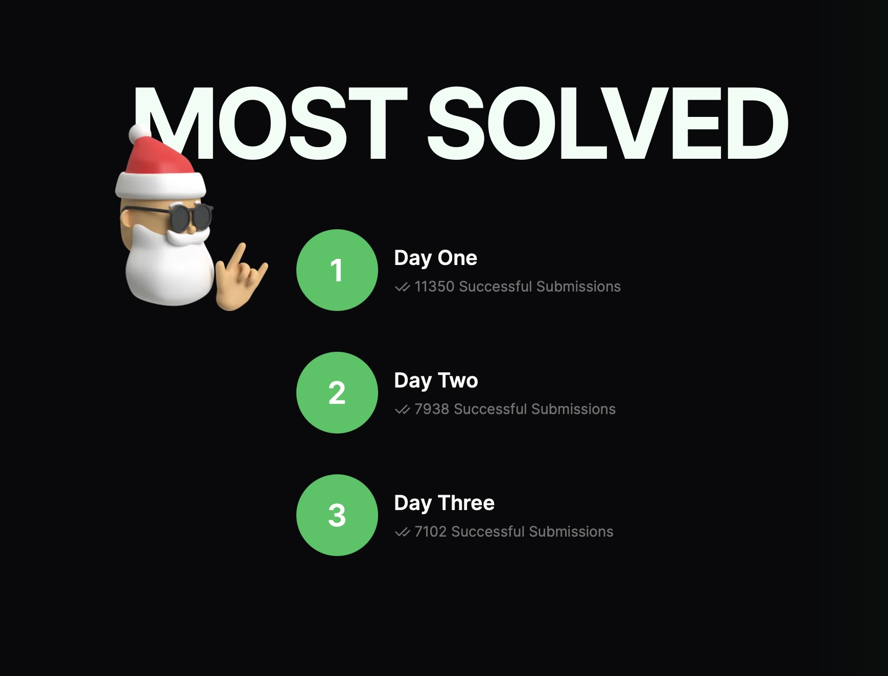

*This year I participated in the first edition of Advent of TypeScript created by TypeHero. In this
new series of article I will show my solutions to the challenges I liked the most.*

---

It's been a long time since I published my last post blog. In these last few months, a lot has happened in my personal 
and professional life. This shifted away my attention from my personal blog. Now I finally have some free time, and 
here I am sick (flu is hitting hard in this period) with a new series of stories about something I accomplished 
during this December 2023.  
I decided to participate in the first edition of the "Advent of TypeScript" created by TypeHero. For those who don't 
know them, [TypeHero](https://github.com/typehero/typehero) is a community of TypeScript developers with the aim to share and improve the knowledge about 
the powerful TypeScript type system (and the language itself).  
  
I suppose most of you reading this article knows what an advent calendar is :innocent:. For the others, an advent 
calendar is a piece of card incorporating numbered flaps, one for each day from December 1 until December 25. 
Each of these flaps is opened on each day of advent to reveal (usually) a candy of a chocolate as a reward.  
["Advent of TypeScript"](https://typehero.dev/aot-2023) follows the same rules: 25 flaps, each one to be opened on 
an advent day, but instead of chocolate every day you find a new TypeScript challenge :smirk:. And that's not all: 
the interesting fact about these challenges was that they had to be solved using only TypeScript type system :cold_sweat:.  
I said "ok, let's see how far I can go with this", and here I am one month later with all the challenges completed 
the day they were published :relaxed:.  
  
I will be honest: it has been hard has hell. The knowledge I have of TypeScript type system "saved me" from being 
screwed for the first 5 days :sweat_smile:. After these initial days,
the challenges started to explore advanced type system concept that I didn't know about. This means that to solve 
every challenge after the first ones, I had to study A LOT (really, a lot). I didn't count the hours I spent in 
total for solving all of them, but I'm quite sure that if I sum up all the hours I spent on it will surpass an 
entire week :cold_sweat: (just to remember, time I spent studying/programming after my daily job). It was quite 
some time since I spent so many extra work hours on a side project (for the reasons I mentioned at the beginning).  
Let's see some statistics in terms of participation to this "Advent of TypeScript", that you can find also [here](https://typehero.dev/aot-2023/wrapped "advent of typescript stats").  
As always, the initial participation was very high more than 11000 people solved the first exercise. But as you can 
see from the photo below, there is already a big drop since the second day :sweat_smile:.  

Then we arrived to the latest days challenges, and I was surprised to know that **I was one among only 200 
developers in the world to complete all the 25 challenges :loudspeaker:**.

All this to say: I would like to share with you the solutions for the 4 challenges that I liked the most. In this 
 way, I hope I will share with you some knowledge I acquired while solving them, and you will have the same "eureka 
moments" I had about TypeScript type system.  
Before you jump into the articles, I suggest that you have a look at these topics from the TypeScript official docs. 
In this way, reading the articles will be easier:

* [keyof operator](https://www.typescriptlang.org/docs/handbook/2/keyof-types.html)
* [Conditional types](https://www.typescriptlang.org/docs/handbook/2/conditional-types.html)
* [Mapped types](https://www.typescriptlang.org/docs/handbook/2/mapped-types.html)
* [Template literal types](https://www.typescriptlang.org/docs/handbook/2/template-literal-types.html)

So which are the 4 challenges I like the most? Here they are:

* [Rock, Paper, Scissors](/2023/12/30/advent-of-typescript-2023-rock-paper-scissors/ "rock paper scissors")
* [Tic Tac Toe](/2024/01/04/advent-of-typescript-2023-tic-tac-toe/ "tic tac toe")
* [Connect 4](/2024/01/20/advent-of-typescript-2023-connect-4/ "Connect 4")
* [Santa is stuck!](/2024/01/31/advent-of-typescript-2023-santa-is-stuck/ "Santa is stuck")

