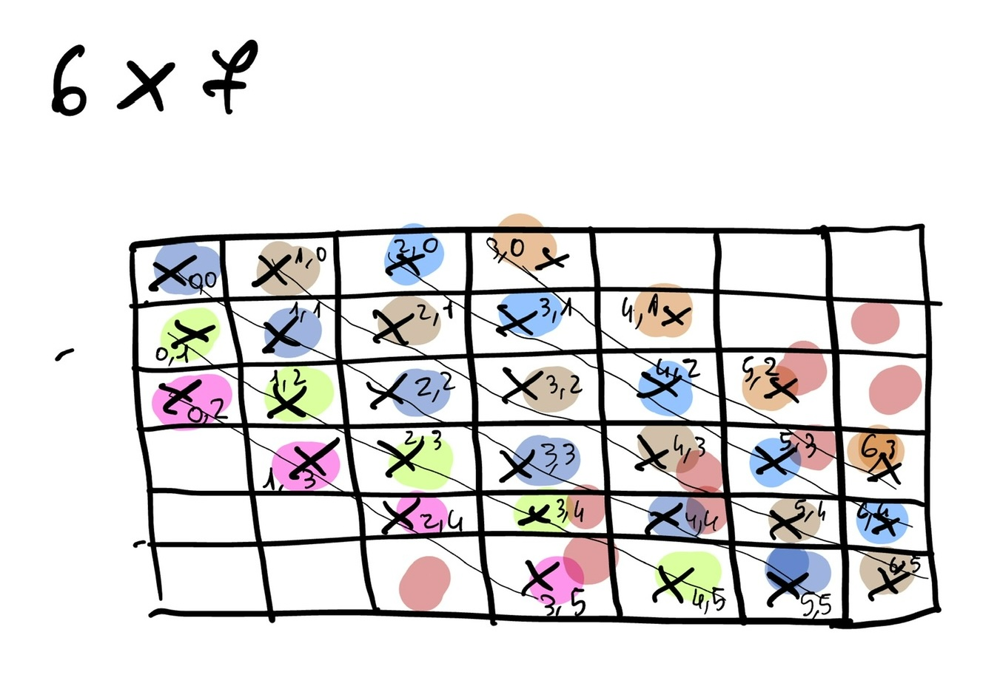

*Connect 4, a classical family Christmas game. Let's see how to tackle it with the TypeScript type system.*

---

This is the third of the four challenges I liked the most from "Advent Of TypeScript 2023" by [TypeHero](https://typehero.dev). 
Check out the other challenges I liked [here](/2023/12/29/advent-of-typescript-2023-favourite-challenges/ "advent of typescript 2023 challenges").

#### The problem

Connect 4, a classical family Christmas game. Let's see how to tackle it with the typescript type system.
Let's check the rule briefly explained by the guy from TypeHero:

>In case you haven't played it before: Connect 4 is a game in which the players choose a color and then take turns dropping colored tokens into a six-row, seven-column vertically suspended grid. The pieces fall straight down, occupying the lowest available space within the column. The objective of the game is to be the first to form a horizontal, vertical, or diagonal line of four of one's own tokens.

The goal of the exercise was to implement the `Connect4` type.

#### Implementation

The exercise gave me some data structure to use as the basis of my development (as it was in the previous exercises).
Again, they were the domain data structures of the Connect 4 game.
There was the definition of the chips, of an empty cell and all the possible states of the game.
There was also the definition in terms of data structure of the game board and the game itself.
The last one was composed by the current board and the current state of the game. 

```typescript
type Connect4Chips = '🔴' | '🟡';
type Connect4EmptyCell = '  ';
type Connect4Cell = Connect4Chips | Connect4EmptyCell;
type Connect4State = '🔴' | '🟡' | '🔴 Won' | '🟡 Won' | 'Draw';

type Connect4Board = Connect4Cell[][];

type Connect4Game = {
  board: Connect4Board;
  state: Connect4State;
};

type EmptyBoard = [
  ["  ", "  ", "  ", "  ", "  ", "  ", "  "],
  ["  ", "  ", "  ", "  ", "  ", "  ", "  "],
  ["  ", "  ", "  ", "  ", "  ", "  ", "  "],
  ["  ", "  ", "  ", "  ", "  ", "  ", "  "],
  ["  ", "  ", "  ", "  ", "  ", "  ", "  "],
  ["  ", "  ", "  ", "  ", "  ", "  ", "  "],
];

type NewGame = {
  board: EmptyBoard;
  state: "🟡";
};
```

As it was for the previous exercises, a list of test cases was available for verifying that the implementation was 
correct.
The input of each game move to the `Connect4` type, the one asked to be implemented by the exercise, are:
* the current game
* the column on which the chip should be placed
The current player is contained in the game itself (as we saw before).
  `Connect4` should return a new game, with the next player or who wan in the game state, and the updated board.

```typescript
type test_move1_actual = Connect4<NewGame, 0>;
/*
type test_move1_expected = {
  board: [
    ["  ", "  ", "  ", "  ", "  ", "  ", "  "],
    ["  ", "  ", "  ", "  ", "  ", "  ", "  "],
    ["  ", "  ", "  ", "  ", "  ", "  ", "  "],
    ["  ", "  ", "  ", "  ", "  ", "  ", "  "],
    ["  ", "  ", "  ", "  ", "  ", "  ", "  "],
    ["🟡", "  ", "  ", "  ", "  ", "  ", "  "],
  ];
  state: "🔴";
};
*/

type test_move2_actual = Connect4<test_move1_actual, 0>;
/*
type test_move2_expected = {
  board: [
    ["  ", "  ", "  ", "  ", "  ", "  ", "  "],
    ["  ", "  ", "  ", "  ", "  ", "  ", "  "],
    ["  ", "  ", "  ", "  ", "  ", "  ", "  "],
    ["  ", "  ", "  ", "  ", "  ", "  ", "  "],
    ["🔴", "  ", "  ", "  ", "  ", "  ", "  "],
    ["🟡", "  ", "  ", "  ", "  ", "  ", "  "],
  ];
  state: "🟡";
};
 */

type test_move3_actual = Connect4<test_move2_actual, 0>;
/*
type test_move3_expected = {
  board: [
    ["  ", "  ", "  ", "  ", "  ", "  ", "  "],
    ["  ", "  ", "  ", "  ", "  ", "  ", "  "],
    ["  ", "  ", "  ", "  ", "  ", "  ", "  "],
    ["🟡", "  ", "  ", "  ", "  ", "  ", "  "],
    ["🔴", "  ", "  ", "  ", "  ", "  ", "  "],
    ["🟡", "  ", "  ", "  ", "  ", "  ", "  "],
  ];
  state: "🔴";
};
*/

type test_move4_actual = Connect4<test_move3_actual, 1>;
/*
type test_move4_expected = {
  board: [
    ["  ", "  ", "  ", "  ", "  ", "  ", "  "],
    ["  ", "  ", "  ", "  ", "  ", "  ", "  "],
    ["  ", "  ", "  ", "  ", "  ", "  ", "  "],
    ["🟡", "  ", "  ", "  ", "  ", "  ", "  "],
    ["🔴", "  ", "  ", "  ", "  ", "  ", "  "],
    ["🟡", "🔴", "  ", "  ", "  ", "  ", "  "],
  ];
  state: "🟡";
};
*/

type test_move5_actual = Connect4<test_move4_actual, 2>;
/*
type test_move5_expected = {
  board: [
    ["  ", "  ", "  ", "  ", "  ", "  ", "  "],
    ["  ", "  ", "  ", "  ", "  ", "  ", "  "],
    ["  ", "  ", "  ", "  ", "  ", "  ", "  "],
    ["🟡", "  ", "  ", "  ", "  ", "  ", "  "],
    ["🔴", "  ", "  ", "  ", "  ", "  ", "  "],
    ["🟡", "🔴", "🟡", "  ", "  ", "  ", "  "],
  ];
  state: "🔴";
};
*/

type test_move6_actual = Connect4<test_move5_actual, 1>;
/*
type test_move6_expected = {
  board: [
    ["  ", "  ", "  ", "  ", "  ", "  ", "  "],
    ["  ", "  ", "  ", "  ", "  ", "  ", "  "],
    ["  ", "  ", "  ", "  ", "  ", "  ", "  "],
    ["🟡", "  ", "  ", "  ", "  ", "  ", "  "],
    ["🔴", "🔴", "  ", "  ", "  ", "  ", "  "],
    ["🟡", "🔴", "🟡", "  ", "  ", "  ", "  "],
  ];
  state: "🟡";
};
*/

type test_red_win_actual = Connect4<
  {
    board: [
      ['  ', '  ', '  ', '  ', '  ', '  ', '  '],
      ['  ', '  ', '  ', '  ', '  ', '  ', '  '],
      ['🟡', '  ', '  ', '  ', '  ', '  ', '  '],
      ['🟡', '  ', '  ', '  ', '  ', '  ', '  '],
      ['🔴', '🔴', '🔴', '  ', '  ', '  ', '  '],
      ['🟡', '🔴', '🟡', '🟡', '  ', '  ', '  ']
    ];
    state: '🔴';
  },
  3
>;
/*
type test_red_win_expected = {
  board: [
    ['  ', '  ', '  ', '  ', '  ', '  ', '  '],
    ['  ', '  ', '  ', '  ', '  ', '  ', '  '],
    ['🟡', '  ', '  ', '  ', '  ', '  ', '  '],
    ['🟡', '  ', '  ', '  ', '  ', '  ', '  '],
    ['🔴', '🔴', '🔴', '🔴', '  ', '  ', '  '],
    ['🟡', '🔴', '🟡', '🟡', '  ', '  ', '  ']
  ];
  state: '🔴 Won';
};
*/

type test_yellow_win_actual = Connect4<
  {
    board: [
      ['  ', '  ', '  ', '  ', '  ', '  ', '  '],
      ['  ', '  ', '  ', '  ', '  ', '  ', '  '],
      ['🔴', '  ', '  ', '  ', '  ', '  ', '  '],
      ['🟡', '  ', '  ', '  ', '  ', '  ', '  '],
      ['🔴', '  ', '🔴', '🔴', '  ', '  ', '  '],
      ['🟡', '  ', '🟡', '🟡', '  ', '  ', '  ']
    ];
    state: '🟡';
  },
  1
>;
/*
type test_yellow_win_expected = {
  board: [
    ['  ', '  ', '  ', '  ', '  ', '  ', '  '],
    ['  ', '  ', '  ', '  ', '  ', '  ', '  '],
    ['🔴', '  ', '  ', '  ', '  ', '  ', '  '],
    ['🟡', '  ', '  ', '  ', '  ', '  ', '  '],
    ['🔴', '  ', '🔴', '🔴', '  ', '  ', '  '],
    ['🟡', '🟡', '🟡', '🟡', '  ', '  ', '  ']
  ];
  state: '🟡 Won';
};
*/

type test_diagonal_yellow_win_actual = Connect4<
  {
    board: [
      ['  ', '  ', '  ', '  ', '  ', '  ', '  '],
      ['  ', '  ', '  ', '  ', '  ', '  ', '  '],
      ['  ', '  ', '  ', '  ', '  ', '  ', '  '],
      ['  ', '  ', '🟡', '🔴', '  ', '  ', '  '],
      ['🔴', '🟡', '🔴', '🔴', '  ', '  ', '  '],
      ['🟡', '🔴', '🟡', '🟡', '  ', '  ', '  ']
    ];
    state: '🟡';
  },
  3
>;
/*
type test_diagonal_yellow_win_expected = {
  board: [
    ['  ', '  ', '  ', '  ', '  ', '  ', '  '],
    ['  ', '  ', '  ', '  ', '  ', '  ', '  '],
    ['  ', '  ', '  ', '🟡', '  ', '  ', '  '],
    ['  ', '  ', '🟡', '🔴', '  ', '  ', '  '],
    ['🔴', '🟡', '🔴', '🔴', '  ', '  ', '  '],
    ['🟡', '🔴', '🟡', '🟡', '  ', '  ', '  ']
  ];
  state: '🟡 Won';
};
*/

type test_draw_actual = Connect4<
  {
    board: [
      ['🟡', '🔴', '🔴', '🟡', '🟡', '🔴', '  '],
      ['🔴', '🟡', '🟡', '🔴', '🔴', '🟡', '🔴'],
      ['🟡', '🔴', '🔴', '🟡', '🟡', '🔴', '🟡'],
      ['🔴', '🟡', '🟡', '🔴', '🔴', '🟡', '🔴'],
      ['🟡', '🔴', '🔴', '🟡', '🟡', '🔴', '🟡'],
      ['🔴', '🟡', '🟡', '🔴', '🔴', '🟡', '🔴']
    ];
    state: '🟡';
  },
  6
>;
/*
type test_draw_expected = {
  board: [
    ['🟡', '🔴', '🔴', '🟡', '🟡', '🔴', '🟡'],
    ['🔴', '🟡', '🟡', '🔴', '🔴', '🟡', '🔴'],
    ['🟡', '🔴', '🔴', '🟡', '🟡', '🔴', '🟡'],
    ['🔴', '🟡', '🟡', '🔴', '🔴', '🟡', '🔴'],
    ['🟡', '🔴', '🔴', '🟡', '🟡', '🔴', '🟡'],
    ['🔴', '🟡', '🟡', '🔴', '🔴', '🟡', '🔴']
  ];
  state: 'Draw';
};
*/
```

The first thing I did was implementing a type to find the position in the board where the chip should have been placed, 
given the column as parameter.
`PositionOnBoard` is a type tha given the current board, and the column where the player wants to place is chip,  
returns the board position as a tuple of numbers (so it is like a coordinate point on a matrix).
How did I calculate the coordinates?
For the column it is really easy: is the one received as parameter :laughing:.
For the row, I needed to find the first cell not occupied before one with a chip (or the last one if not chips are 
present on that column).
To do this, I created a `RowStatusFor` type that, given a column position and the curren board, loops through all the 
rows and checks if for the current row the `Column` position is occupied:

* if not, it returns the row position
* if yes, it returns the content of the cell

This means that `RowStatusFor` returns an array with a mix of numbers and chip element.
The highest number in the array is the farest not occupied position for `Column`.
To extract this information, I created a `FindLastRowNotOccupied` type, that scans the array created from 
`RowStatusFor` type (`ColumnStatus`), and returns `LastFreeCell`.
`LastFreeCell` is a parameter of `FindLastRowNotOccupied`, and is updated on each recursion iteration through the
`RowStatusFor` array with the current not occupied cell.   

```typescript
type ToInt<StringToBeConverted> = StringToBeConverted extends `${infer StringContent extends number}` 
  ? StringContent 
  : never;

type RowStatusFor<Column extends number, CurrentBoard extends Connect4Board> = {
  [Row in keyof CurrentBoard]
    : CurrentBoard[Row][Column] extends Connect4EmptyCell 
      ? ToInt<Row> 
      : CurrentBoard[Row][Column]
};

type FindLastRowNotOccupied<
  ColumStatus extends (number | Connect4Cell)[],
  LastFreeCell extends number = never
> =
        ColumStatus extends [
          infer CurrentCellStatus extends number, 
          ...infer OtherCellsStatuses extends (number | Connect4Chips)[]
        ]
          ? FindLastRowNotOccupied<OtherCellsStatuses, CurrentCellStatus>
          : LastFreeCell;

type FindRowPosition<
  CurrentBoard extends Connect4Board, 
  Column extends number
> = FindLastRowNotOccupied<RowStatusFor<Column, CurrentBoard>>;

type PositionOnBoard<
  CurrentBoard extends Connect4Board, 
  Column extends number
> = [FindRowPosition<CurrentBoard, Column>, Column]
```

Now that I was able to calculate the position of the board for the current move, I was ready to create `UpdateBoard` 
type. 
In this type I passed the current position on the board to be updated, `NextMovePosition`, and looped over the board,
 to find the correspondent cell and update it. 
I created also a support type called `UpdateColumn` in order to separate the loop through the row and the column 
positions.

```typescript
type UpdateColumn<
  Row extends Connect4Cell[],
  NextChip extends Connect4Chips, ColumnPosition extends number
> = [...{
  [Index in keyof Row]:
    Index extends `${ColumnPosition}`
          ? Row[Index] extends Connect4Cell
                  ? NextChip
                  : Row[Index]
          : Row[Index]
}];

type UpdateBoard<
  CurrentBoard extends Connect4Board, 
  NextMovePosition extends [number, number], 
  NextChip extends Connect4Chips
> =
        NextMovePosition extends[number, number]
                ? [...{
                  [Index in keyof CurrentBoard]:
                  Index extends `${NextMovePosition[0]}`
                          ? UpdateColumn<CurrentBoard[Index], NextChip, NextMovePosition[1]>
                          : CurrentBoard[Index]
                }]
                : CurrentBoard;
```

The only part missing at this point was the update of the state. This was quite challenging. Especially the part 
where I needed to verify that someone won the game.
If you remember from the [previous challenge, tic tac toe](/2024/01/04/advent-of-typescript-2023-tic-tac-toe/), what 
I did was to hardcode the diagonal checks.
Here I used the same approach.
The pain point was that the diagonals to be hardcoded are quite a few, especially considering the size of the board (6
x 7), and the fact that the diagonal can be in two directions: from left to right and from right to left :sweat_smile:.
Below, you can find a schema I created from highlighting visually the diagonals from left to right.



The base type I created is the `SequentialElementsWinningFor`.
It receives an array of board cells, it scans them to see if there is a sequence of four cells with the same chip, 
meaning that one of the two players won.
If this condition is not found, `never` is returned (do you remember the discussion about it from one of my  
[previous articles](/2023/12/30/advent-of-typescript-2023-rock-paper-scissors/)?)
So I composed multiple calls to `SequentialElementsWinningFor` with different lists of cells (including the diagonal 
and the columns with the wrapper type `ColumnWinningFor`) in a new type called `IsWinning`, that can be invoked two 
times (one time for each chip).
This is what I did in the `IsSomeoneWinning` type: a union type that describes the states of the two chips with 
respect to the fact that one of them won the game.
In the end this is not a real union type, because the chips (both or just one) that are not in a winning state will 
return `never`, and so the union type will discard them.

```typescript
type NextChip<CurrentState extends Connect4Chips> =
        CurrentState extends '🔴'
                ? '🟡'
                : '🔴'

type SequentialElementsWinningFor<
  Chip extends Connect4Chips, Row extends Connect4Cell[], 
  CurrentCountOfChip extends Chip[] = []
> =
        CurrentCountOfChip['length'] extends 4
                ? `${Chip} Won`
                : Row extends [infer CurrentChip extends Connect4Cell, ...infer OtherChips extends Connect4Cell[]]
                        ? CurrentChip extends Chip
                                ? SequentialElementsWinningFor<Chip, OtherChips, [...CurrentCountOfChip, CurrentChip]>
                                : SequentialElementsWinningFor<Chip, OtherChips, []>
                        : never;

type ExtractColumn<ColumnIndex extends number, CurrentBoard extends Connect4Board> = {
  [Index in keyof CurrentBoard]: CurrentBoard[Index][ColumnIndex]
};

type ColumnWinningFor<
  Chip extends Connect4Chips, 
  ColumnIndex extends number, 
  CurrentBoard extends Connect4Board
> = SequentialElementsWinningFor<Chip, ExtractColumn<ColumnIndex, CurrentBoard>>

type IsWinning<Chip extends Connect4Chips, CurrentBoard extends Connect4Board> =
        SequentialElementsWinningFor<Chip, CurrentBoard[0]> |
        SequentialElementsWinningFor<Chip, CurrentBoard[1]> |
        SequentialElementsWinningFor<Chip, CurrentBoard[2]> |
        SequentialElementsWinningFor<Chip, CurrentBoard[3]> |
        SequentialElementsWinningFor<Chip, CurrentBoard[4]> |
        SequentialElementsWinningFor<Chip, CurrentBoard[5]> |
        ColumnWinningFor<Chip, 0, CurrentBoard> |
        ColumnWinningFor<Chip, 1, CurrentBoard> |
        ColumnWinningFor<Chip, 2, CurrentBoard> |
        ColumnWinningFor<Chip, 3, CurrentBoard> |
        ColumnWinningFor<Chip, 4, CurrentBoard> |
        ColumnWinningFor<Chip, 5, CurrentBoard> |
        ColumnWinningFor<Chip, 6, CurrentBoard> |
        SequentialElementsWinningFor<Chip, [CurrentBoard[0][3], CurrentBoard[1][2], CurrentBoard[2][1], CurrentBoard[3][0]]> |
        SequentialElementsWinningFor<Chip, [CurrentBoard[0][4], CurrentBoard[1][3], CurrentBoard[2][2], CurrentBoard[3][1], CurrentBoard[4][0]]> |
        SequentialElementsWinningFor<Chip, [CurrentBoard[0][5], CurrentBoard[1][4], CurrentBoard[2][3], CurrentBoard[3][2], CurrentBoard[4][1], CurrentBoard[5][0]]> |
        SequentialElementsWinningFor<Chip, [CurrentBoard[1][5], CurrentBoard[2][4], CurrentBoard[3][3], CurrentBoard[4][2], CurrentBoard[3][1], CurrentBoard[6][0]]> |
        SequentialElementsWinningFor<Chip, [CurrentBoard[2][5], CurrentBoard[3][4], CurrentBoard[4][3], CurrentBoard[5][2], CurrentBoard[6][1]]> |
        SequentialElementsWinningFor<Chip, [CurrentBoard[3][5], CurrentBoard[4][4], CurrentBoard[5][3], CurrentBoard[6][2]]> |
        SequentialElementsWinningFor<Chip, [CurrentBoard[0][2], CurrentBoard[1][3], CurrentBoard[2][4], CurrentBoard[3][5]]> |
        SequentialElementsWinningFor<Chip, [CurrentBoard[0][1], CurrentBoard[1][2], CurrentBoard[2][3], CurrentBoard[3][4], CurrentBoard[4][5]]> |
        SequentialElementsWinningFor<Chip, [CurrentBoard[0][0], CurrentBoard[1][1], CurrentBoard[2][2], CurrentBoard[3][3], CurrentBoard[4][4], CurrentBoard[5][5]]> |
        SequentialElementsWinningFor<Chip, [CurrentBoard[1][0], CurrentBoard[2][1], CurrentBoard[3][2], CurrentBoard[4][3], CurrentBoard[5][4], CurrentBoard[6][5]]> |
        SequentialElementsWinningFor<Chip, [CurrentBoard[2][0], CurrentBoard[3][1], CurrentBoard[4][2], CurrentBoard[5][3], CurrentBoard[6][4]]> |
        SequentialElementsWinningFor<Chip, [CurrentBoard[3][0], CurrentBoard[4][1], CurrentBoard[5][2], CurrentBoard[6][3]]>;

type IsSomeoneWinning<
  CurrentBoard extends Connect4Board
> = IsWinning<'🟡',CurrentBoard> | IsWinning<'🔴',CurrentBoard>;
```

So I was ready to implement a type to update the state of the game. 
`UpdateState` rely on the previous types I defined to get the state of the game.
If someone has won the game, it returns the "winning" state. 
If there are empty cells (check done by the type `AreThereEmptyCells`), the game continues and the next chip is 
returned by the type `NextChip`.
In all the other cases, the game is in a state where no more empty cells are available and nobody won: the game is 
in a `draw` state.  

```typescript
type AreThereEmptyCellsOnRow<Row extends Connect4Cell[]> =
        Row extends [infer Current, ...infer Others extends Connect4Cell[]]
                ? Current extends Connect4EmptyCell
                        ? true
                        : AreThereEmptyCellsOnRow<Others>
                : false

type AreThereEmptyCells<CurrentBoard extends Connect4Board> =
        AreThereEmptyCellsOnRow<CurrentBoard[0]> &
        AreThereEmptyCellsOnRow<CurrentBoard[1]> &
        AreThereEmptyCellsOnRow<CurrentBoard[2]> &
        AreThereEmptyCellsOnRow<CurrentBoard[3]> &
        AreThereEmptyCellsOnRow<CurrentBoard[4]> &
        AreThereEmptyCellsOnRow<CurrentBoard[5]>;

type UpdateState<UpdatedBoard extends Connect4Board, CurrentChip extends Connect4Chips> =
        IsSomeoneWinning<UpdatedBoard> extends never
                ? AreThereEmptyCells<UpdatedBoard> extends true
                        ? NextChip<CurrentChip>
                        : 'Draw'
                : IsSomeoneWinning<UpdatedBoard>;
```

Below, you can find the full solution and the test cases we saw before to verify its correctness.

```typescript
type Connect4Chips = '🔴' | '🟡';
type Connect4EmptyCell = '  ';
type Connect4Cell = Connect4Chips | Connect4EmptyCell;
type Connect4State = '🔴' | '🟡' | '🔴 Won' | '🟡 Won' | 'Draw';

type Connect4Board = Connect4Cell[][];

type Connect4Game = {
  board: Connect4Board;
  state: Connect4State;
};

type EmptyBoard = [
  ["  ", "  ", "  ", "  ", "  ", "  ", "  "],
  ["  ", "  ", "  ", "  ", "  ", "  ", "  "],
  ["  ", "  ", "  ", "  ", "  ", "  ", "  "],
  ["  ", "  ", "  ", "  ", "  ", "  ", "  "],
  ["  ", "  ", "  ", "  ", "  ", "  ", "  "],
  ["  ", "  ", "  ", "  ", "  ", "  ", "  "],
];

type NewGame = {
  board: EmptyBoard;
  state: "🟡";
};

// board 

type ToInt<StringToBeConverted> = StringToBeConverted extends `${infer StringContent extends number}` 
  ? StringContent 
  : never;

type RowStatusFor<Column extends number, CurrentBoard extends Connect4Board> = {
  [Row in keyof CurrentBoard]
    : CurrentBoard[Row][Column] extends Connect4EmptyCell 
      ? ToInt<Row> 
      : CurrentBoard[Row][Column]
};

type FindLastRowNotOccupied<
  ColumStatus extends (number | Connect4Cell)[],
  LastFreeCell extends number = never
> =
        ColumStatus extends [
          infer CurrentCellStatus extends number, 
          ...infer OtherCellsStatuses extends (number | Connect4Chips)[]
        ]
          ? FindLastRowNotOccupied<OtherCellsStatuses, CurrentCellStatus>
          : LastFreeCell;

type FindRowPosition<
  CurrentBoard extends Connect4Board, 
  Column extends number
> = FindLastRowNotOccupied<RowStatusFor<Column, CurrentBoard>>;

type PositionOnBoard<
  CurrentBoard extends Connect4Board, 
  Column extends number
> = [FindRowPosition<CurrentBoard, Column>, Column]

type UpdateColumn<
  Row extends Connect4Cell[],
  NextChip extends Connect4Chips, ColumnPosition extends number
> = [...{
  [Index in keyof Row]:
    Index extends `${ColumnPosition}`
          ? Row[Index] extends Connect4Cell
                  ? NextChip
                  : Row[Index]
          : Row[Index]
}];

type UpdateBoard<
  CurrentBoard extends Connect4Board, 
  NextMovePosition extends [number, number], NextChip extends Connect4Chips
> =
        NextMovePosition extends[number, number]
                ? [...{
                  [Index in keyof CurrentBoard]:
                  Index extends `${NextMovePosition[0]}`
                          ? UpdateColumn<CurrentBoard[Index], NextChip, NextMovePosition[1]>
                          : CurrentBoard[Index]
                }]
                : CurrentBoard;

// state

type NextChip<CurrentState extends Connect4Chips> =
        CurrentState extends '🔴'
                ? '🟡'
                : '🔴'

type SequentialElementsWinningFor<
  Chip extends Connect4Chips, Row extends Connect4Cell[], 
  CurrentCountOfChip extends Chip[] = []
> =
        CurrentCountOfChip['length'] extends 4
                ? `${Chip} Won`
                : Row extends [infer CurrentChip extends Connect4Cell, ...infer OtherChips extends Connect4Cell[]]
                        ? CurrentChip extends Chip
                                ? SequentialElementsWinningFor<Chip, OtherChips, [...CurrentCountOfChip, CurrentChip]>
                                : SequentialElementsWinningFor<Chip, OtherChips, []>
                        : never;

type ExtractColumn<ColumnIndex extends number, CurrentBoard extends Connect4Board> = {
  [Index in keyof CurrentBoard]: CurrentBoard[Index][ColumnIndex]
};

type ColumnWinningFor<
  Chip extends Connect4Chips, 
  ColumnIndex extends number, 
  CurrentBoard extends Connect4Board
> = SequentialElementsWinningFor<Chip, ExtractColumn<ColumnIndex, CurrentBoard>>

type IsWinning<Chip extends Connect4Chips, CurrentBoard extends Connect4Board> =
        SequentialElementsWinningFor<Chip, CurrentBoard[0]> |
        SequentialElementsWinningFor<Chip, CurrentBoard[1]> |
        SequentialElementsWinningFor<Chip, CurrentBoard[2]> |
        SequentialElementsWinningFor<Chip, CurrentBoard[3]> |
        SequentialElementsWinningFor<Chip, CurrentBoard[4]> |
        SequentialElementsWinningFor<Chip, CurrentBoard[5]> |
        ColumnWinningFor<Chip, 0, CurrentBoard> |
        ColumnWinningFor<Chip, 1, CurrentBoard> |
        ColumnWinningFor<Chip, 2, CurrentBoard> |
        ColumnWinningFor<Chip, 3, CurrentBoard> |
        ColumnWinningFor<Chip, 4, CurrentBoard> |
        ColumnWinningFor<Chip, 5, CurrentBoard> |
        ColumnWinningFor<Chip, 6, CurrentBoard> |
        SequentialElementsWinningFor<Chip, [CurrentBoard[0][3], CurrentBoard[1][2], CurrentBoard[2][1], CurrentBoard[3][0]]> |
        SequentialElementsWinningFor<Chip, [CurrentBoard[0][4], CurrentBoard[1][3], CurrentBoard[2][2], CurrentBoard[3][1], CurrentBoard[4][0]]> |
        SequentialElementsWinningFor<Chip, [CurrentBoard[0][5], CurrentBoard[1][4], CurrentBoard[2][3], CurrentBoard[3][2], CurrentBoard[4][1], CurrentBoard[5][0]]> |
        SequentialElementsWinningFor<Chip, [CurrentBoard[1][5], CurrentBoard[2][4], CurrentBoard[3][3], CurrentBoard[4][2], CurrentBoard[3][1], CurrentBoard[6][0]]> |
        SequentialElementsWinningFor<Chip, [CurrentBoard[2][5], CurrentBoard[3][4], CurrentBoard[4][3], CurrentBoard[5][2], CurrentBoard[6][1]]> |
        SequentialElementsWinningFor<Chip, [CurrentBoard[3][5], CurrentBoard[4][4], CurrentBoard[5][3], CurrentBoard[6][2]]> |
        SequentialElementsWinningFor<Chip, [CurrentBoard[0][2], CurrentBoard[1][3], CurrentBoard[2][4], CurrentBoard[3][5]]> |
        SequentialElementsWinningFor<Chip, [CurrentBoard[0][1], CurrentBoard[1][2], CurrentBoard[2][3], CurrentBoard[3][4], CurrentBoard[4][5]]> |
        SequentialElementsWinningFor<Chip, [CurrentBoard[0][0], CurrentBoard[1][1], CurrentBoard[2][2], CurrentBoard[3][3], CurrentBoard[4][4], CurrentBoard[5][5]]> |
        SequentialElementsWinningFor<Chip, [CurrentBoard[1][0], CurrentBoard[2][1], CurrentBoard[3][2], CurrentBoard[4][3], CurrentBoard[5][4], CurrentBoard[6][5]]> |
        SequentialElementsWinningFor<Chip, [CurrentBoard[2][0], CurrentBoard[3][1], CurrentBoard[4][2], CurrentBoard[5][3], CurrentBoard[6][4]]> |
        SequentialElementsWinningFor<Chip, [CurrentBoard[3][0], CurrentBoard[4][1], CurrentBoard[5][2], CurrentBoard[6][3]]>;

type IsSomeoneWinning<
  CurrentBoard extends Connect4Board
> = IsWinning<'🟡',CurrentBoard> | IsWinning<'🔴',CurrentBoard>;

type AreThereEmptyCellsOnRow<Row extends Connect4Cell[]> =
        Row extends [infer Current, ...infer Others extends Connect4Cell[]]
                ? Current extends Connect4EmptyCell
                        ? true
                        : AreThereEmptyCellsOnRow<Others>
                : false

type AreThereEmptyCells<CurrentBoard extends Connect4Board> =
        AreThereEmptyCellsOnRow<CurrentBoard[0]> &
        AreThereEmptyCellsOnRow<CurrentBoard[1]> &
        AreThereEmptyCellsOnRow<CurrentBoard[2]> &
        AreThereEmptyCellsOnRow<CurrentBoard[3]> &
        AreThereEmptyCellsOnRow<CurrentBoard[4]> &
        AreThereEmptyCellsOnRow<CurrentBoard[5]>;

type UpdateState<UpdatedBoard extends Connect4Board, CurrentChip extends Connect4Chips> =
        IsSomeoneWinning<UpdatedBoard> extends never
                ? AreThereEmptyCells<UpdatedBoard> extends true
                        ? NextChip<CurrentChip>
                        : 'Draw'
                : IsSomeoneWinning<UpdatedBoard>;

// game

type Connect4<CurrentGame extends Connect4Game, NextMove extends number> =
        CurrentGame['state'] extends Connect4Chips
                ? {
                  board: UpdateBoard<
                    CurrentGame['board'], 
                    PositionOnBoard<CurrentGame['board'], NextMove>, 
                    CurrentGame['state']
                  >,
                  state: UpdateState<
                    UpdateBoard<CurrentGame['board'], 
                      PositionOnBoard<CurrentGame['board'], NextMove>,
                      CurrentGame['state']
                    >, 
                    CurrentGame['state']
                  >
                }
                : CurrentGame;

// ---- TEST CASES -----

type test_move1_actual = Connect4<NewGame, 0>;
/*
type test_move1_expected = {
  board: [
    ["  ", "  ", "  ", "  ", "  ", "  ", "  "],
    ["  ", "  ", "  ", "  ", "  ", "  ", "  "],
    ["  ", "  ", "  ", "  ", "  ", "  ", "  "],
    ["  ", "  ", "  ", "  ", "  ", "  ", "  "],
    ["  ", "  ", "  ", "  ", "  ", "  ", "  "],
    ["🟡", "  ", "  ", "  ", "  ", "  ", "  "],
  ];
  state: "🔴";
};
*/

type test_move2_actual = Connect4<test_move1_actual, 0>;
/*
type test_move2_expected = {
  board: [
    ["  ", "  ", "  ", "  ", "  ", "  ", "  "],
    ["  ", "  ", "  ", "  ", "  ", "  ", "  "],
    ["  ", "  ", "  ", "  ", "  ", "  ", "  "],
    ["  ", "  ", "  ", "  ", "  ", "  ", "  "],
    ["🔴", "  ", "  ", "  ", "  ", "  ", "  "],
    ["🟡", "  ", "  ", "  ", "  ", "  ", "  "],
  ];
  state: "🟡";
};
 */

type test_move3_actual = Connect4<test_move2_actual, 0>;
/*
type test_move3_expected = {
  board: [
    ["  ", "  ", "  ", "  ", "  ", "  ", "  "],
    ["  ", "  ", "  ", "  ", "  ", "  ", "  "],
    ["  ", "  ", "  ", "  ", "  ", "  ", "  "],
    ["🟡", "  ", "  ", "  ", "  ", "  ", "  "],
    ["🔴", "  ", "  ", "  ", "  ", "  ", "  "],
    ["🟡", "  ", "  ", "  ", "  ", "  ", "  "],
  ];
  state: "🔴";
};
*/

type test_move4_actual = Connect4<test_move3_actual, 1>;
/*
type test_move4_expected = {
  board: [
    ["  ", "  ", "  ", "  ", "  ", "  ", "  "],
    ["  ", "  ", "  ", "  ", "  ", "  ", "  "],
    ["  ", "  ", "  ", "  ", "  ", "  ", "  "],
    ["🟡", "  ", "  ", "  ", "  ", "  ", "  "],
    ["🔴", "  ", "  ", "  ", "  ", "  ", "  "],
    ["🟡", "🔴", "  ", "  ", "  ", "  ", "  "],
  ];
  state: "🟡";
};
*/

type test_move5_actual = Connect4<test_move4_actual, 2>;
/*
type test_move5_expected = {
  board: [
    ["  ", "  ", "  ", "  ", "  ", "  ", "  "],
    ["  ", "  ", "  ", "  ", "  ", "  ", "  "],
    ["  ", "  ", "  ", "  ", "  ", "  ", "  "],
    ["🟡", "  ", "  ", "  ", "  ", "  ", "  "],
    ["🔴", "  ", "  ", "  ", "  ", "  ", "  "],
    ["🟡", "🔴", "🟡", "  ", "  ", "  ", "  "],
  ];
  state: "🔴";
};
*/

type test_move6_actual = Connect4<test_move5_actual, 1>;
/*
type test_move6_expected = {
  board: [
    ["  ", "  ", "  ", "  ", "  ", "  ", "  "],
    ["  ", "  ", "  ", "  ", "  ", "  ", "  "],
    ["  ", "  ", "  ", "  ", "  ", "  ", "  "],
    ["🟡", "  ", "  ", "  ", "  ", "  ", "  "],
    ["🔴", "🔴", "  ", "  ", "  ", "  ", "  "],
    ["🟡", "🔴", "🟡", "  ", "  ", "  ", "  "],
  ];
  state: "🟡";
};
*/

type test_red_win_actual = Connect4<
  {
    board: [
      ['  ', '  ', '  ', '  ', '  ', '  ', '  '],
      ['  ', '  ', '  ', '  ', '  ', '  ', '  '],
      ['🟡', '  ', '  ', '  ', '  ', '  ', '  '],
      ['🟡', '  ', '  ', '  ', '  ', '  ', '  '],
      ['🔴', '🔴', '🔴', '  ', '  ', '  ', '  '],
      ['🟡', '🔴', '🟡', '🟡', '  ', '  ', '  ']
    ];
    state: '🔴';
  },
  3
>;
/*
type test_red_win_expected = {
  board: [
    ['  ', '  ', '  ', '  ', '  ', '  ', '  '],
    ['  ', '  ', '  ', '  ', '  ', '  ', '  '],
    ['🟡', '  ', '  ', '  ', '  ', '  ', '  '],
    ['🟡', '  ', '  ', '  ', '  ', '  ', '  '],
    ['🔴', '🔴', '🔴', '🔴', '  ', '  ', '  '],
    ['🟡', '🔴', '🟡', '🟡', '  ', '  ', '  ']
  ];
  state: '🔴 Won';
};
*/

type test_yellow_win_actual = Connect4<
  {
    board: [
      ['  ', '  ', '  ', '  ', '  ', '  ', '  '],
      ['  ', '  ', '  ', '  ', '  ', '  ', '  '],
      ['🔴', '  ', '  ', '  ', '  ', '  ', '  '],
      ['🟡', '  ', '  ', '  ', '  ', '  ', '  '],
      ['🔴', '  ', '🔴', '🔴', '  ', '  ', '  '],
      ['🟡', '  ', '🟡', '🟡', '  ', '  ', '  ']
    ];
    state: '🟡';
  },
  1
>;
/*
type test_yellow_win_expected = {
  board: [
    ['  ', '  ', '  ', '  ', '  ', '  ', '  '],
    ['  ', '  ', '  ', '  ', '  ', '  ', '  '],
    ['🔴', '  ', '  ', '  ', '  ', '  ', '  '],
    ['🟡', '  ', '  ', '  ', '  ', '  ', '  '],
    ['🔴', '  ', '🔴', '🔴', '  ', '  ', '  '],
    ['🟡', '🟡', '🟡', '🟡', '  ', '  ', '  ']
  ];
  state: '🟡 Won';
};
*/

type test_diagonal_yellow_win_actual = Connect4<
  {
    board: [
      ['  ', '  ', '  ', '  ', '  ', '  ', '  '],
      ['  ', '  ', '  ', '  ', '  ', '  ', '  '],
      ['  ', '  ', '  ', '  ', '  ', '  ', '  '],
      ['  ', '  ', '🟡', '🔴', '  ', '  ', '  '],
      ['🔴', '🟡', '🔴', '🔴', '  ', '  ', '  '],
      ['🟡', '🔴', '🟡', '🟡', '  ', '  ', '  ']
    ];
    state: '🟡';
  },
  3
>;
/*
type test_diagonal_yellow_win_expected = {
  board: [
    ['  ', '  ', '  ', '  ', '  ', '  ', '  '],
    ['  ', '  ', '  ', '  ', '  ', '  ', '  '],
    ['  ', '  ', '  ', '🟡', '  ', '  ', '  '],
    ['  ', '  ', '🟡', '🔴', '  ', '  ', '  '],
    ['🔴', '🟡', '🔴', '🔴', '  ', '  ', '  '],
    ['🟡', '🔴', '🟡', '🟡', '  ', '  ', '  ']
  ];
  state: '🟡 Won';
};
*/

type test_draw_actual = Connect4<
  {
    board: [
      ['🟡', '🔴', '🔴', '🟡', '🟡', '🔴', '  '],
      ['🔴', '🟡', '🟡', '🔴', '🔴', '🟡', '🔴'],
      ['🟡', '🔴', '🔴', '🟡', '🟡', '🔴', '🟡'],
      ['🔴', '🟡', '🟡', '🔴', '🔴', '🟡', '🔴'],
      ['🟡', '🔴', '🔴', '🟡', '🟡', '🔴', '🟡'],
      ['🔴', '🟡', '🟡', '🔴', '🔴', '🟡', '🔴']
    ];
    state: '🟡';
  },
  6
>;
/*
type test_draw_expected = {
  board: [
    ['🟡', '🔴', '🔴', '🟡', '🟡', '🔴', '🟡'],
    ['🔴', '🟡', '🟡', '🔴', '🔴', '🟡', '🔴'],
    ['🟡', '🔴', '🔴', '🟡', '🟡', '🔴', '🟡'],
    ['🔴', '🟡', '🟡', '🔴', '🔴', '🟡', '🔴'],
    ['🟡', '🔴', '🔴', '🟡', '🟡', '🔴', '🟡'],
    ['🔴', '🟡', '🟡', '🔴', '🔴', '🟡', '🔴']
  ];
  state: 'Draw';
};
*/
```

#### Conclusion

As I mentioned at the beginning, this is the third of the four challenges I liked the most from "Advent Of TypeScript 
2023" by [TypeHero](https://typehero.dev). Check out the other challenges I liked [here](/2023/12/29/advent-of-typescript-2023-favourite-challenges/ "advent of typescript 2023 challenges").
