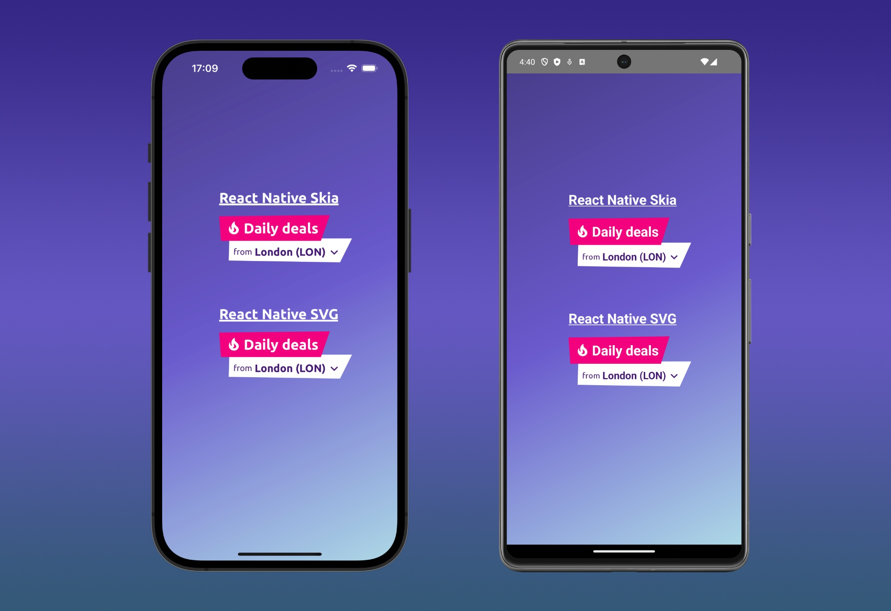

*A lot of mobile developers often complain that React Native is not Native, because it is missing some
features. This is absolutely not true! In this blog post I will show you how I create a component with a custom
background shape, similar to the one I did for a native component ome time ago*

---

From time to time, while working on your daily job as a mobile developer, the typical discussion about "React Native 
vs. Native" (or, generally speaking, "<Hybrid framework> vs. Native") resurfaces,
igniting passions and sparking endless debates about which one is better."  
Most of the time, native developers hold the belief that certain more advanced views and effects cannot be created 
using React Native.
However, lately, on the web, you can find some great developers (e.g. [William Candillon](https://www.youtube.com/@wcandillon)) on a mission to demonstrate that this belief is absolutely not true.  
Recently, I had the opportunity to work on a component that could spark this kind of discussion. Essentially, I had 
to create a text component with a custom-shaped background and coordinated animations within it, similar to the one 
I created [here](/2022/10/03/swiftui-path-svg-scale/) in swift.
Although I may not be as skilled as the developers I mentioned earlier, in this blog post I will demonstrate two 
possible ways to achieve the same result of a pure native component for this type of development.
To do this, I will use two different frameworks:

* [React Native Skia](https://shopify.github.io/react-native-skia/), high Performance 2D Graphics framework
* [React Native SVG](https://github.com/software-mansion/react-native-svg), framework for svg drawing 

The component that I will create is shown in the following screenshot, and it is composed by:

* a title section that contains "daily offers", with a pink background shape and an animation on the left icon (fire 
  icon)
* a subtitle section that contains a name of a city, with a white background shape and a pressable component 
  around it 

They will animate in sequence from the top to the bottom in terms of opacity. I will implement it using both the 
frameworks above, to evaluate their usage complexity. 



`youtube: https://www.youtube.com/watch?v=96wofMjkyKc`

#### Implementation

The implementation of the components in the image and video above is composed of two parts:

* a common component called `DailyDealsHeader`, that is a component that contains the `DailyDealsTitle` component 
  (the title) and the `DailyDealsOrigin` component (the subtitle).
* Two components that will draw that background using React Native Skia and React Native SVG called .
  These two components will be sent as props `titleShape` and `originShape` props of `DailyDealsHeader`, and passed 
  with props drilling to the bottom components where I need to draw it.

##### The common parts

The `DailyDealsHeader` component is the main components.
It acts as a container for all the others.
It receives from as props `titleShape` and `originShape`, that are the two function used to render the Skia or SVG 
backgrounds.
It receives also the `originCity` and the `onPress` props, needed by the child to act as expected (show a city name 
in the subtitle and react as they are pressed). 

```tsx
type Props = {
  originCity: string;
  onPress: () => void;
  titleShape: (polygonFeatures: PolygonFeatures) => ReactElement;
  originShape: (polygonFeatures: PolygonFeatures) => ReactElement;
};

export const DailyDealsHeader: FC<Props> = ({
   titleShape,
   originShape,
   originCity,
   onPress,
}) => (
   <View style={styles.header}>
     <DailyDealsTitle renderShape={titleShape} />
     <DailyDealsOrigin
             originCity={originCity}
             onPress={onPress}
             renderShape={originShape}
     />
   </View>
);

const styles = StyleSheet.create({
  header: {
    display: 'flex',
    justifyContent: 'center',
    alignItems: 'center',
    flexDirection: 'column',
  },
});
```

The `DailyDealsTitle`, as you can imagine, renders the title.
The title is composed by an `Image`, that has a scale animation created using`react-native-reanimated`, and the 
`Daily Deals` text.
This component uses also `DailyDealsBackgroundShape` the component in charge of rendering the background 
received as `renderShape` prop.
The features of the background are described by the `getPolygonFeatures` function.
This function **calculate the background shape proportionally to the width and height of the component itself** (we 
will see later how). 
This function will be passed to the `DailyDealsBackgroundShape` that will compose the `renderShape` prop with the 
`PolygonFeatures` to draw the background.


```tsx
import React, {FC, ReactElement, useEffect} from 'react';
import {
  DailyDealsBackgroundShape,
  PolygonFeatures,
} from './DailyDealsBackgroundShape.tsx';
import Animated, {
  useAnimatedStyle,
  useSharedValue,
  withDelay,
  withRepeat,
  withSequence,
  withTiming,
} from 'react-native-reanimated';
import {StyleSheet, Text, View} from 'react-native';

const FIRE_SIZE = 25;
const FIRE = require('../images/fire.png');

const RIGHT_INCLINATION = 15;

const getPolygonFeatures = (width: number, height: number): PolygonFeatures => {
  const widthWithInclination = width + RIGHT_INCLINATION;

  return {
    vertices: {
      topLeft: {x: 0, y: 2},
      topRight: {x: widthWithInclination, y: 0},
      bottomRight: {x: width, y: height},
      bottomLeft: {x: 3, y: height},
    },
    size: {
      width: widthWithInclination,
      height: height,
    },
  };
};

type Props = {
  renderShape: (polygonFeatures: PolygonFeatures) => ReactElement;
};

export const DailyDealsTitle: FC<Props> = ({renderShape}) => {
  const scale = useSharedValue(1);
  const animatedStyle = useAnimatedStyle(() => {
    return {
      transform: [{scale: scale.value}],
    };
  });

  useEffect(() => {
    scale.value = withDelay(
      1800,
      withSequence(withRepeat(withTiming(1.2, {duration: 175}), 8, true)),
    );
  }, [scale]);

  return (
    <DailyDealsBackgroundShape
      renderShape={renderShape}
      opacityDelay={500}
      additionalStyle={styles.shapeStyle}
      getPolygonFeatures={getPolygonFeatures}>
      <View style={styles.dailyDealsTitleContent}>
        <Animated.Image source={FIRE} style={[styles.fire, animatedStyle]} />
        <Text style={styles.titleLabel}>Daily deals</Text>
      </View>
    </DailyDealsBackgroundShape>
  );
};

const textColor = 'white';

const styles = StyleSheet.create({
  shapeStyle: {
    zIndex: 10,
    elevation: 10,
  },
  dailyDealsTitleContent: {
    display: 'flex',
    flexDirection: 'row',
    justifyContent: 'center',
    alignItems: 'center',
    paddingLeft: 8,
    paddingRight: 4,
    paddingTop: 8,
    paddingBottom: 8,
    gap: 4,
  },
  titleLabel: {
    color: textColor,
    fontSize: 24,
    fontWeight: 'bold',
    fontFamily: 'Ubuntu-Bold',
  },
  fire: {
    width: FIRE_SIZE,
    height: FIRE_SIZE,
    marginLeft: 4,
  },
});
```

The `DailyDealsOrigin` component is similar to the previous one, event if it is composed by slightly different 
pieces because:

* it should react when pressed (will trigger the `onPress` received from the top)
* it should draw a different background, described again by the `getPolygonFeatures` function

As I have shown above, also in this case I used the `DailyDealsBackgroundShape` to compose the `renderShape` prop with 
the `getPolygonFeatures` function.


```tsx
import React, {FC, ReactElement} from 'react';
import {
  DailyDealsBackgroundShape,
  PolygonFeatures,
} from './DailyDealsBackgroundShape.tsx';
import {StyleSheet, Text, View} from 'react-native';
import {PressableWithFeedback} from './PressableWithFeedback.tsx';
import Animated from 'react-native-reanimated';

const ARROW_DOWN = require('../images/arrow-icon-bold.png');
const ARROW_SIDE_SIZE = 20;

const BOTTOM_INCLINATION = 3;
const RIGHT_INCLINATION = 20;

const getPolygonFeatures = (width: number, height: number): PolygonFeatures => {
  const widthWithInclination = width + RIGHT_INCLINATION;
  const heightWithInclination = height - BOTTOM_INCLINATION;

  return {
    vertices: {
      topLeft: {x: 1, y: 0},
      topRight: {x: widthWithInclination, y: 0},
      bottomRight: {x: width, y: height},
      bottomLeft: {x: 0, y: heightWithInclination},
    },
    size: {
      width: widthWithInclination,
      height: height,
    },
  };
};

type Props = {
  originCity: string;
  onPress: () => void;
  renderShape: (polygonFeatures: PolygonFeatures) => ReactElement;
};

export const DailyDealsOrigin: FC<Props> = ({originCity, onPress, renderShape}) => (
  <DailyDealsBackgroundShape
    renderShape={renderShape}
    getPolygonFeatures={getPolygonFeatures}
    opacityDelay={800}
    additionalStyle={styles.shapeStyle}>
    <PressableWithFeedback onPress={onPress}>
      <View style={styles.dailyDealsOriginContent}>
        <Text style={styles.fromLabel}>from</Text>
        <View style={styles.originAndArrowIconContainer}>
          <Text style={styles.origin}>{originCity}</Text>
          <Animated.Image source={ARROW_DOWN} style={styles.arrow} />
        </View>
      </View>
    </PressableWithFeedback>
  </DailyDealsBackgroundShape>
);

const textColor = '#441973';

const styles = StyleSheet.create({
  shapeStyle: {
    marginLeft: 16,
    marginTop: -4,
  },
  dailyDealsOriginContent: {
    display: 'flex',
    flexDirection: 'row',
    justifyContent: 'center',
    alignItems: 'center',
    paddingLeft: 8,
    paddingTop: 12,
    paddingBottom: 8,
  },
  fromLabel: {
    color: textColor,
    fontSize: 14,
    fontFamily: 'Ubuntu-Regular',
  },
  originAndArrowIconContainer: {
    flexDirection: 'row',
    alignItems: 'center',
    paddingLeft: 4,
  },
  origin: {
    color: textColor,
    fontSize: 18,
    fontWeight: 'bold',
    fontFamily: 'Ubuntu-Bold',
  },
  arrow: {
    width: ARROW_SIDE_SIZE,
    height: ARROW_SIDE_SIZE,
    marginLeft: 4,
  },
});
```

Now it's time to see how `DailyDealsBackgroundShape` is implemented. This component renders its children, wrapped in 
an `Animated.View` on the `opacity` property.
The most important part of this component is the `{renderShape(polygonFeatures)}` line of code.
Here I'm composing the rendering function (skia or svg) with the polygon features.
The pattern I used in this application to decouple the type of the shape from this component is called 
["render prop"](https://react.dev/reference/react/cloneElement#passing-data-with-a-render-prop).
Do you remember when I said before that `getPolygonFeatures` is calculating the polygon used as shape 
proportionally to the container?
This magic can happen thanks to the implementation of the `onContentLayout` below.
I get the measures of the `DailyDealsBackgroundShape`, and I pass them `getPolygonFeatures`.
This means that `getPolygonFeatures` will always return a polygon shape coherent with its container 
(`DailyDealsBackgroundShape`).
The `PolygonFeatures` are composed by:

* the position of the four vertices (it is always a quadrilateral shape, but as a challenge you can try to abstract 
  this part, if you want to have some fun :smirk:) 
* the background size

```tsx
import React, {FC, ReactElement, useEffect, useState} from 'react';
import Animated, {
  useSharedValue,
  withDelay,
  withTiming,
} from 'react-native-reanimated';
import {
  LayoutChangeEvent,
  StyleProp,
  StyleSheet,
  View,
  ViewStyle,
} from 'react-native';

type Size = {
  readonly width: number;
  readonly height: number;
};

export type Point = {
  readonly x: number;
  readonly y: number;
};

export type PolygonFeatures = {
  vertices: {
    topLeft: Point;
    topRight: Point;
    bottomRight: Point;
    bottomLeft: Point;
  };
  size: Size;
};

type Props = {
  renderShape: (polygonFeatures: PolygonFeatures) => ReactElement;
  opacityDelay: number;
  getPolygonFeatures: (width: number, height: number) => PolygonFeatures;
  additionalStyle?: StyleProp<ViewStyle>;
  children: React.ReactNode;
};

export const DailyDealsBackgroundShape: FC<Props> = ({
  renderShape,
  opacityDelay,
  getPolygonFeatures,
  additionalStyle,
  children,
}) => {
  const shapeOpacity = useSharedValue(0);
  const contentOpacity = useSharedValue(0);
  const [polygonFeatures, setPolygonFeatures] =
    useState<PolygonFeatures | null>(null);

  const onContentLayout = (event: LayoutChangeEvent) => {
    const {width, height} = event.nativeEvent.layout;
    const roundedWidth = Math.round(width);
    const roundedHeight = Math.round(height);

    setPolygonFeatures(getPolygonFeatures(roundedWidth, roundedHeight));
  };

  useEffect(() => {
    shapeOpacity.value = withDelay(
      opacityDelay,
      withTiming(1, {
        duration: 400,
      }),
    );
    contentOpacity.value = withDelay(
      opacityDelay + 350,
      withTiming(1, {
        duration: 400,
      }),
    );
  }, [contentOpacity, polygonFeatures, shapeOpacity, opacityDelay]);

  return (
    <Animated.View
      onLayout={onContentLayout}
      style={[
        {
          ...styles.container,
          opacity: shapeOpacity,
        },
        additionalStyle,
      ]}>
      {polygonFeatures && (
        <View style={styles.polygon}>{renderShape(polygonFeatures)}</View>
      )}
      <Animated.View style={{opacity: contentOpacity}}>
        {children}
      </Animated.View>
    </Animated.View>
  );
};

const styles = StyleSheet.create({
  container: {
    overflow: 'visible',
    alignSelf: 'flex-start',
  },
  polygon: {
    position: 'absolute',
  },
});
```

##### Svg and Skia components

Let's see how I "draw" the background shapes. Both implementations are quite straightforward.  
The React Native SVG one composes a string of vertices from the `PolygonFeatures` received.
These are passed to a `Polygon` component to make it draw the shape.
Its container is a `Svg` component that set the canvas size using the one received in the `PolygonFeatures`.

```tsx
const svgVertex = (point: Point) => `${point.x},${point.y}`;

type Props = {
  polygonFeatures: PolygonFeatures;
  shapeColor: string;
};

export const DailyDealsShapeSvg: FC<Props> = ({
  polygonFeatures,
  shapeColor,
}) => {
  const {
    vertices: {topLeft, topRight, bottomLeft, bottomRight},
    size,
  } = polygonFeatures;

  const topVertices = `${svgVertex(topLeft)} ${svgVertex(topRight)}`;
  const bottomVertices = `${svgVertex(bottomRight)} ${svgVertex(bottomLeft)}`;
  const vertices = `${topVertices} ${bottomVertices}`;

  return (
    polygonFeatures && (
      <Svg height={size.height} width={size.width}>
        <Polygon points={vertices} fill={shapeColor} />
      </Svg>
    )
  );
};
```

For the Skia implementation, I used the `Skia.Path.Make` builder.
With this one I created a path from the `PolygonFeatures`, and I passed it to a `Path` component.
As for the svg implementation, the container, in this case `Canvas`, set the drawing size received.

```tsx
type Props = {
  polygonFeatures: PolygonFeatures;
  shapeColor: Color;
};

export const DailyDealsShapeSkia: FC<Props> = ({
  polygonFeatures,
  shapeColor,
}) => {
  const {
    vertices: {topLeft, topRight, bottomLeft, bottomRight},
    size,
  } = polygonFeatures;

  const path = Skia.Path.Make();
  path.moveTo(topLeft.x, topLeft.y);
  path.lineTo(topRight.x, topRight.y);
  path.lineTo(bottomRight.x, bottomRight.y);
  path.lineTo(bottomLeft.x, bottomLeft.y);
  path.close();

  return (
    polygonFeatures && (
      <Canvas style={{
                width: size.width,
                height: size.height,
              }}>
        <Path path={path} color={shapeColor} />
      </Canvas>
    )
  );
};
```

As you can see from the implementation above, the more complicated part is outside Skia/SVG. They are simple 
components focused on the drawing part.

#### Conclusion

You can find the full implementation of what I described above in this [github repo](https://github.com/chicio/React-Native-Background-Shape-Skia-Svg). 
I had so much fun learning how to use the libraries above.
Let's see if in the future I will draw something else with them :rocket:.
