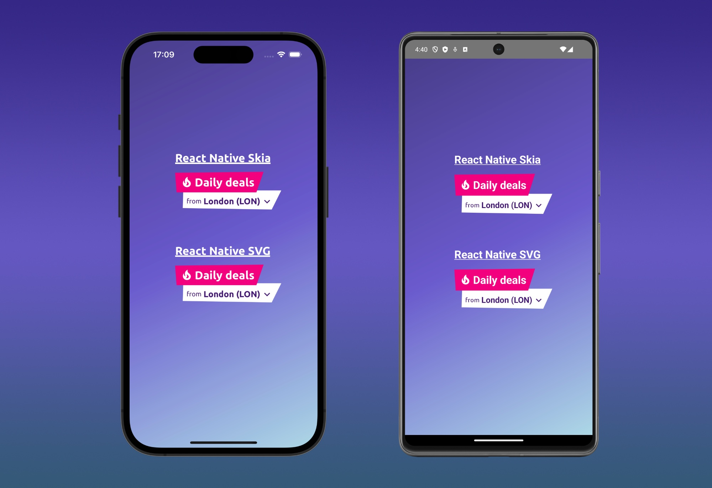

*A lot of mobile developers often complain that React Native is not Native, because it is missing some
feature. This is absolutely not true! In this blog post I will show you how I create a component with a custom
background shape, similar to the one I did for a native component ome time ago*

---

From time to time, while working on your daily job as a mobile developer, the typical discussion about "React Native 
vs. Native" (or, generally speaking, "<Hybrid framework> vs. Native") resurfaces,
igniting passions and sparking endless debates about which one is better."  
Most of the time, native developers hold the belief that certain more advanced views and effects cannot be created 
using React Native.
However, lately, on the web, you can find some great developers (e.g. [William Candillon](https://www.youtube. com/@wcandillon)) on a mission to demonstrate that this belief is absolutely not true.  
Recently, I had the opportunity to work on a component that could spark this kind of discussion. Essentially, I had 
to create a text component with a custom-shaped background and coordinated animations within it.
Although I may not be as skilled as the developers I mentioned earlier, in this blog post I will demonstrate two 
possible ways to achieve the same result of a pure native component for this type of development.
To do this, I will use two different frameworks:

* [React Native Skia](https://shopify.github.io/react-native-skia/), high Performance 2D Graphics framework
* [React Native SVG](https://github.com/software-mansion/react-native-svg), framework for svg drawing 

The component that I will create is shown in the following screenshot, and it is composed by:

* a title section that contains "daily offers", with a pink background shape and an animation on the left icon (fire 
  icon)
* a subtitle section that contains the name of a city, with a white background shape and a pressable component 
  around it 

They will animate in sequence from the top to the bottom in terms of opacity. I will implement it using both the 
framework above, to evaluate their usage complexity and their performance. 

#### Implementation

...

#### Conclusion

...
