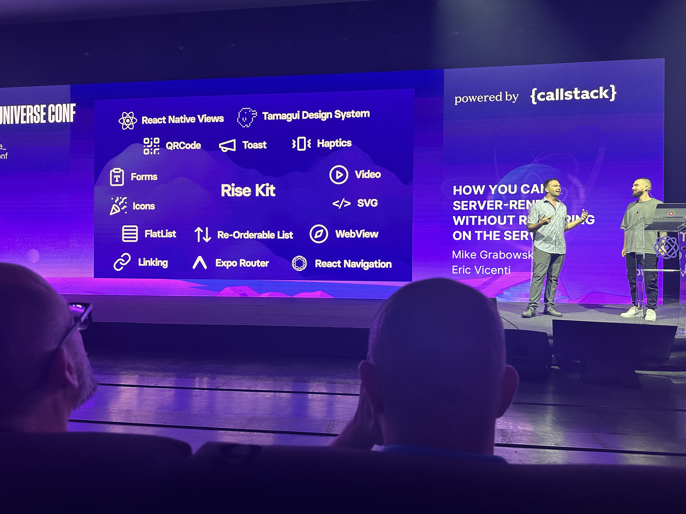

*Let's dive into the talks from React Universe 2024 that stood out to us the most and share the key
insights we gained. From innovative debugging tools to cross-platform development strategies, we’ll walk you through 
what we found valuable and how it’s shaping our approach to React and React Native development.*

---

Recently, my colleague [Sam Campisi](https://www.linkedin.com/in/samantha-campisi-9a70b5a1/) and I had the privilege of
attending the 2024 edition of the React Universe Conference.
This event, organized by [Callstack](https://www.callstack.com/), was previously known as React Native EU.
However, this year Callstack decided to take a different approach: the conference now aims to become the leading point of
reference for the React community in Europe,
covering both web and mobile development in what they defined the "React Universe":
a tech stack with a set of tools to build applications across platforms.
Let’s dive into the key insights we gathered during the conference and explore what the future holds for React and React Native.

#### Some numbers

Before diving into the details of the speakers and topics presented, let’s take a look at some key data about the conference:

**Location:** Wrocław Congress Center  
**Dates:** 4-6 September 2024  
**Attendees:** 650  
**Speakers:** 30  
**Talks:** 22

The venue was absolutely stunning.
The Wrocław Congress Center provided the perfect setting for the event,
with a large auditorium spacious enough to comfortably accommodate all attendees.
Callstack spared no expense in making sure everything was top-notch:
from the stage design to the food, every detail was carefully curated.

As for the speakers, they were exceptional, with many being key contributors to the React ecosystem.
Now, let’s dive into some of the mind-blowing innovations that were unveiled during the conference.

#### Day 1: Key Talks

The first day was full of talks focused on the improvements they will soon land in React Native.
There were also some talks
about how to scale your React Native app and tools to bring you applications on multiple platforms.

##### Opening Speech

The conference was kicked off by **Michał Pierzchała**,
who provided a thorough overview of the React community's current status.
He emphasized how React and React Native are increasingly converging,
aiming to offer a seamless development experience across web and mobile platforms.
This unified direction highlights the importance
of creating consistent user experiences regardless of the underlying technology.

##### 🎉 What a Year for React Native!

In this session,
**Nicola Corti** and **Riccardo Cipolleschi** from Meta reflected on the significant progress
made in the React Native ecosystem over the past year.
They discussed the growing importance of using frameworks like **Expo**.
This is something already shared by the React Native core team in a post on their official [blog](https://reactnative.dev/blog/2024/06/25/use-a-framework-to-build-react-native-apps).
To remark the shift to the "use a framework" approach, they also announced the deprecation of the **react-native cli**.
The cli will be published in an ad hoc React Native community package,
and when you launch an init command, a deprecation message will be shown.

Another news shared is related to the next release 0.76 and the fact
that the new architecture will be enabled by default.
This will enhance app performance and development capabilities.
The session concluded with a look at emerging tools,
such as [react-strict-dom](https://github.com/facebook/react-strict-dom),
which is the Meta answer for having a library of shareable components between web and mobile.

##### 🛠 The New React Native Debugger

**Alex Hunt** from Meta introduced the new **React Native Debugger**, which replaces the older **Flipper** tool.
The new debugger, called **React Native Dev Tools**,
is automatically enabled in version 0.76, and offers a debugging experience that mirrors **React DevTools** through a CDP session.
Alex highlighted how this update makes debugging smoother and more intuitive
(with respect to what was happening in the past).
He promised that the new debugger will "just work" — though
he jokingly admitted the community would have to see for themselves.
This tool represents a significant improvement in terms "ease of use" and functionality for developers
working with React Native.

##### 👓 React Native ❤ Apple Vision Pro

In an exciting presentation,
**Oskar Kwaśniewski** from Callstack revealed the future of **React Native** on **Apple’s Vision Pro**.
This groundbreaking work focuses on "progressive enhancement,"
allowing developers to gradually improve app experiences without sacrificing compatibility with different platforms.
Oskar explained how Callstack is maintaining a fork of React Native specifically developed for Vision Pro,
with live demos already showcased at the conference.

While the project is still in its early stages, the potential
to develop immersive apps for Vision Pro using React Native has sparked a lot of enthusiasm within the community.
Developers can follow the progress of this initiative on GitHub:
[react-native-visionos](https://github.com/callstack/react-native-visionos).

##### 📈 Hard-learned Lessons in App Scaling

**Mike Duminy** from Klarna shared invaluable insights on the challenges of scaling large applications, based on Klarna’s experience.
His talk emphasized the importance of continuously measuring what truly matters by reviewing KPIs
(Key Performance Indicators), and also define them to let you work on both product and technical features.
He stressed the need for **incremental migration**,
recommending that developers enforce new rules for updated parts of their apps,
while also embracing the complex challenges that arise from scaling.
This talk served as a reminder
that success in scaling requires a combination of strategic planning and community collaboration,
by contributing back to the open source community (eg. contributing to React Native, Hermes etc.)

##### 🪄 How you can Server-Render without Rendering on the Server 

Mike Grabowski and Eric Vicenti presented an intriguing talk focused on a cutting-edge approach called React Server-Defined Components (RSDC),
which enables developers to offload much of the rendering logic to the client while still maintaining control from the server.
This method allows developers to modify user interfaces on the fly without requiring traditional server-side rendering or pushing updates via over-the-air
(OTA) methods.
They introduced a new set of tools, called **RISE Tools**,
which allows for real-time UI updates and dynamic content changes directly from the server,
without needing new client-side deployments.

This method significantly simplifies managing large-scale apps,
offering instant flexibility for rearranging elements or adding new features,
even after an app has gone live.

#### Day 2: Key Talks

The second day of the conference was centered again around tools for bringing your application to multiple platforms.
There were also some talks related to React Native internals.

##### ❓ React 'use client' Explained

**Delba de Oliveira** from Vercel provided a deep dive into React’s **'use client'** directive, which allows developers
to convert server-rendered components into client-rendered ones.
This powerful tool eliminates the need for complex network synchronization,
offering a smoother and more responsive user experience.
Delba illustrated how **use client** pre-renders interactive UIs on the server,
but then switches to client-side rendering for dynamic interactions.
This approach creates a clear boundary between static content and interactive elements,
simplifying the development of fast, dynamic web applications.

##### 🕸 Web Once, Native Everywhere

In one of the more forward-thinking talks, **Evan Bacon** from Expo unveiled **Expo DOM Components**,
an experimental package
that allows developers to write web components that are compatible across native and web platforms.
This innovation offers fast compile-time injection of **WebView** and **React DOM components**,
making it particularly useful for projects that require incremental migration from web to mobile environments.

##### 🩵 Web Without Walls

Dan Abramov’s talk “Web Without Walls”
at React Universe Conf 2024 focused on the potential of creating more open, decentralized web platforms,
drawing from his work with BlueSky.
Dan explored how modern web applications often lock users into restrictive ecosystems,
leading to limited control over personal data and interactions.
In contrast, he emphasized the importance of giving users more autonomy through decentralized protocols and customizable user experiences,
aiming to break down the “walls” of the internet.
His insights pointed to a future where social platforms and web applications become more interoperable, user-centric,
and open to innovation.

##### 🏃🏻‍♂️ Hermes: better performance with runtime bytecode translation (Tzvetan Mikov, Meta)

This presentation focused on how Hermes, Meta’s JavaScript engine designed for React Native, leverages runtime bytecode translation
to significantly enhance performance and the current status of **static Hermes**.
The key innovation discussed was how Hermes optimizes JavaScript execution by converting code into an efficient intermediate bytecode at runtime,
which allows for faster execution and lower memory consumption, particularly on resource-constrained devices.

Mikov delved into the technical specifics of how Hermes helps to reduce startup times
and improve the overall performance of React Native apps by processing JavaScript ahead of time,
while also allowing for real-time translation during execution.
He did show additionally some improvements
recently added to Hermes
to speed up the bytecode execution by generating slow and fast execution paths based on the typing.  
These techniques help achieve a balance between speed and flexibility, catering to both static and dynamic use cases.
By incorporating these optimizations, Hermes continues to be a game-changer for mobile app performance,
especially in environments with limited hardware capabilities.

#### Conclusion and Key Takeaways

As the conference wrapped up, the key messages resonated throughout the community:

* **“Native is similar to web.”** The lines between native and web development continue to blur, with frameworks like Expo bridging the gap.
* **“Web is just another platform.”** reflects the community growing vision of treating the web as one of many platforms rather than the default.
* **Cross-platform solutions are the future.** With the rise of tools like **Expo Universal Apps** and **Rise Tools** and improvements in **React Native Windows** and **visionOS**, the community is actively working on tools that will make cross-platform development more seamless than ever.

React Universe 2024 was an exciting glimpse into the future of React and React Native.
The talks showcased how the community is pushing the boundaries of what’s possible in cross-platform development.
It’s clear that the next few years will bring even more innovations and tools to make development faster,
more efficient, and more enjoyable for everyone.

#### References

- [React Native Web](https://necolas.github.io/react-native-web/)
- [Hermes Bytecode](https://github.com/facebook/hermes/blob/main/doc/Design.md)
- [Expo DOM Components](https://docs.expo.dev/guides/dom-components/)
- [React Native for Apple Vision Pro](https://github.com/callstack/react-native-visionos)
- [React Strict DOM](https://github.com/facebook/react-strict-dom)
